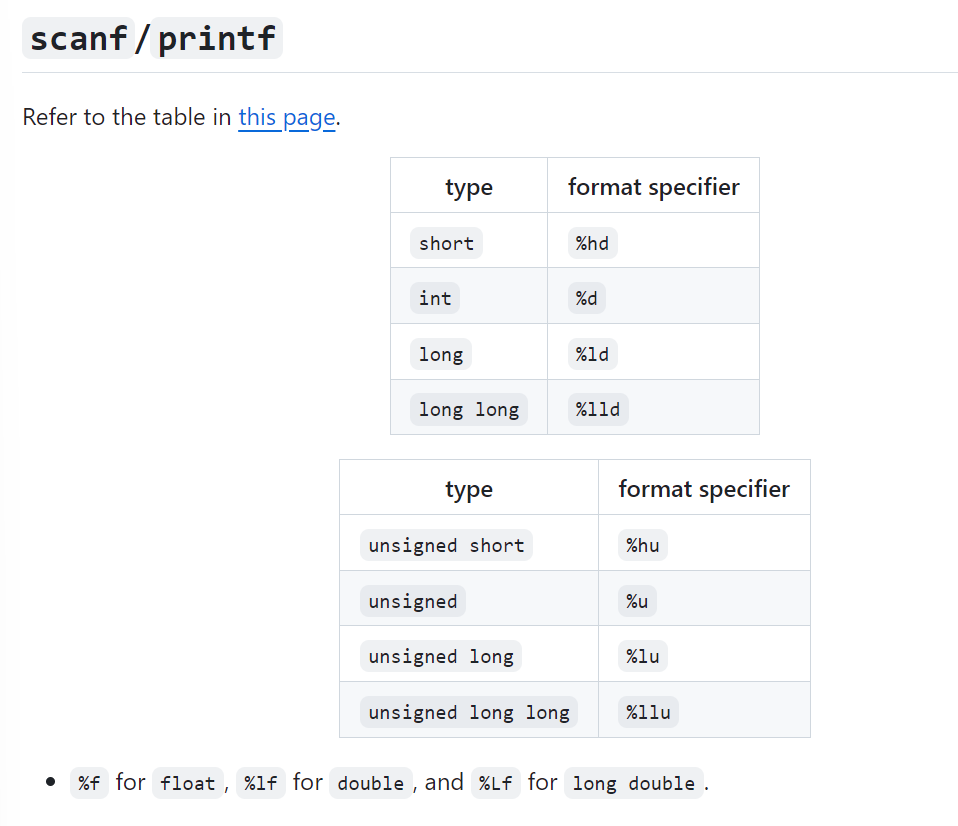
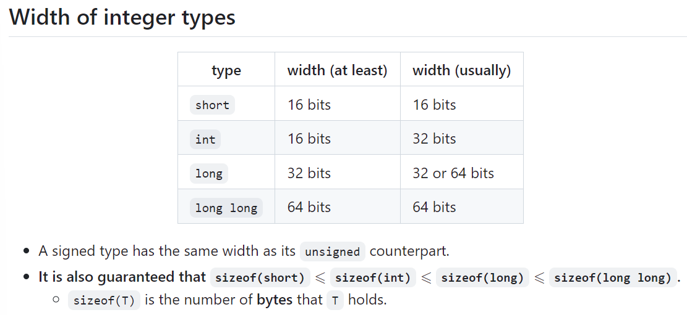
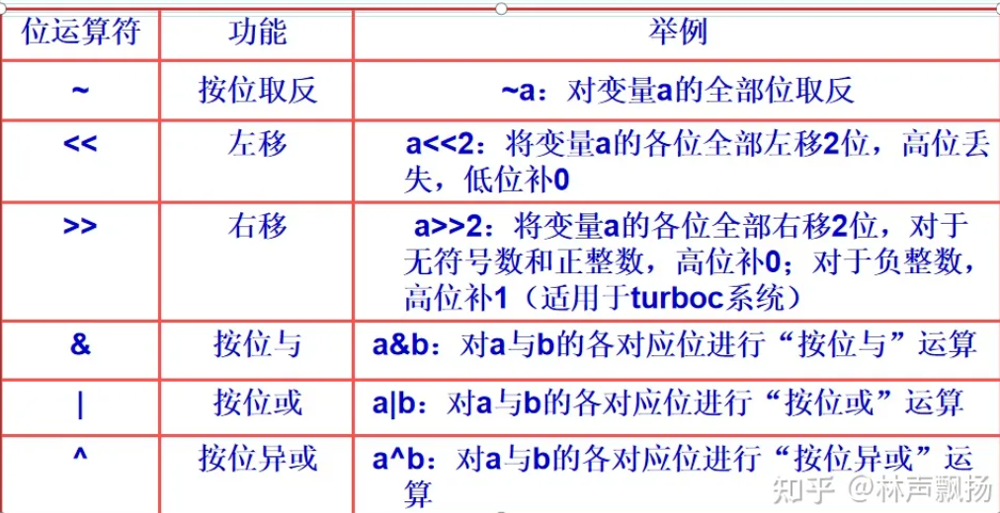
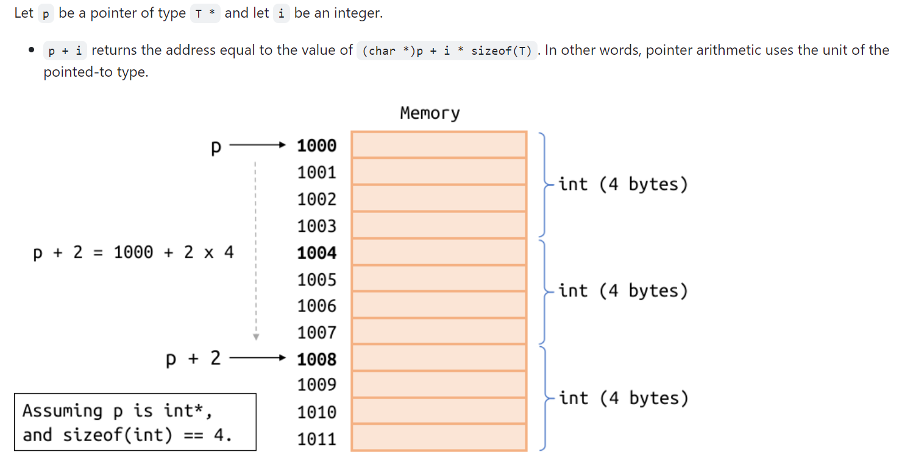
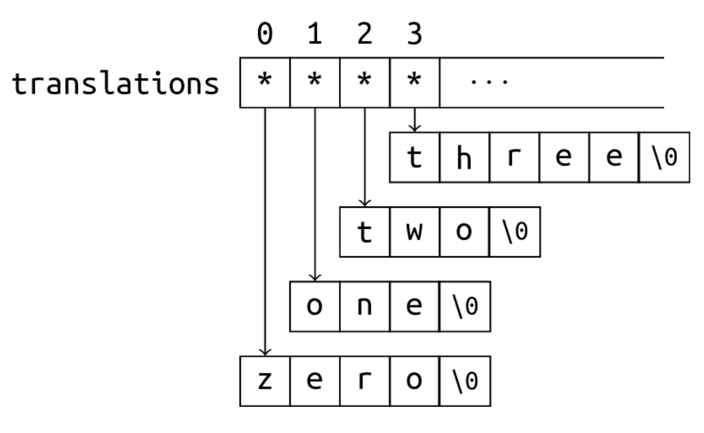
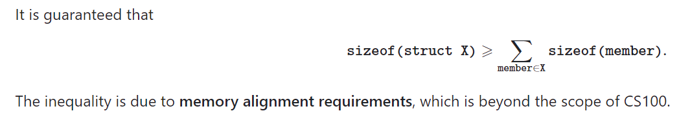
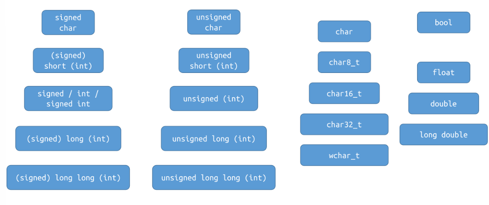

# 拾遗

本笔记旨在拾遗自学过程中没有涉及到的上课的内容

## 程序框架

- Why is ``#include <stdio.h>``needed?

  - `scanf` and `printf` are declared in the standard library header file `stdio.h`.

- What does ``int main(void)``mean?

  - The `main` function is where the program starts. `int` is the return type and `void` indicates that this function accepts no arguments.

- What is the meaning of ``return 0``; ? Can it be omitted?

  - A program returns `0` if it exits successfully. The `main` function of C will execute `return 0` ***automatically at the end if we don't write it explicitly***. 

  也就是说，return 0可以省略，我们不写的话，程序跑完也会自动返回0

- How do we represent a newline?
  - `'\n'`.
- What does %d mean?
  - Indicates that the type of the data being read or printed is `int`.
- How are whitespaces handled when reading integers with scanf?
  - When reading `int` with `%d` in `scanf`, leading whitespaces are ignored.

## scanf

``scanf("%d%d", &a, &b);``  中的占位符%d：

`%d` will skip **any leading whitespaces**.

- "whitespace" refers to the character that looks "blank": space `' '`, newline `'\n`, tab `'\t'`, etc.

会跳过space 换行符 制表符



## variable declaration

Every variable in C has a type.

- The type is **fully deterministic** and **cannot be changed**.
- The type is known even when the program is not run
  - ⇔ The type is known at **compile-time**.  编译阶段就知道type了！
  - ⇔ C is **statically-typed** 1. ⇔ C has a **static type system**.
  - In contrast, Python is **dynamically-typed**.

“编译阶段就知道”这个东西其实是十分重要的！之后还会体提及

而变量声明在function内能声明局部变量，在任何函数体之外声明，能够声明全局变量

## Arithmetic type

八位（bit）是一个字节（byte）

### Boolean

原先一直在``<stdbool.h>``里面，而自从C23就不用加这个头文件了

在C99之前，没有true false，直接用int的1和0

### integer

那么关于整数的表示范围，假设一个整数数据类型有n bits，那么分为有符号signed 和无符号 unsigned

- If the type is **signed** 3, the range of values that can be represented is [−2^n-1,2^n-1  −1].
- If the type is **unsigned**, the range of values that can be represented is [0,2^n  −1].

因为表示符号需要最前面的数字表示正负

那么数据类型对应的字节是多少呢？ 首先我们来看命名

- The keyword `int` is optional in types other than `int`:
  - e.g. `short int` and `short` name the same type.
  - e.g. `unsigned int` and `unsigned` name the same type.
- "Unsigned-ness" needs to be written explicitly: `unsigned int`, `unsigned long`, ...
- Types without the keyword `unsigned` are signed by default:
  - e.g. `signed int` and `int` name the same type.
  - e.g. `signed long int`, `signed long`, `long int` and `long` name the same type.

unsigned不会省略，signed会； short, long, long long 其实原来都是用来修饰int的

那么占用多少字节呢？ 



可以发现，只有long int 类型是implementation-defined， 可能是32位也可能是64位

In addition: Implementation-defined behaviors

The standard states that the exact width of the integer types is **implementation-defined**.

- **Implementation**: The compiler and the standard library.
- An implementation-defined behavior depends on the compiler and the standard library, and is often also related to the hosted environment (e.g. the operating system).

### floating type

float : 4字节    double : 8字节   long double: 精度和范围至少比double好

float的指数范围为-127 ~ 128，而double的指数范围为-1023 ~ 1024（double更精确些）

**float和double的精度是由尾数的位数来决定的**

float：2^23 = **8388608**，一共七位，这意味着最多能有7位有效数字，但绝对能保证的为6位，也即**float的精度为6~7位有效数字**；

double：2^52 = **4503599627370496**，一共16位，同理，**double的精度为15~16位**。

无论是单精度还是双精度在存储中都分为三个部分：
**符号位(Sign) : 0代表正，1代表为负
指数位（Exponent）:用于存储科学计数法中的指数数据，并且采用移位存储
尾数部分（Mantissa）：尾数部分**

Use `double` for real floating-point arithmetic by default. Don't worry about efficiency! `double` arithmetic is not necessarily slower than `float`.

注意：不要用floating-point type于integer arithmetic, 否则返回的就是浮点数（隐式转换）

### character type

The C standard provides three **different** character types: `signed char`, `unsigned char` and `char`.

但是无论是哪一种，一定都是一个字节，四位表示范围：

signed char : -128 - 127        unsigned char : 0 - 255 (都是闭区间)

字符对应的就是ASCII码

但是值得注意的是： ***Whether `char` is signed or unsigned is implementation-defined.***

If `char` is signed (unsigned), it represents the same set of values as the type `signed char` (`unsigned char`), but **they are not the same type**. （相反，如果是short int long longlong, 那么前面加signed其实没区别）

### 隐式转换

在进行加减乘除之类的计算之前，其实都会发生一次隐形的类型转换，使得最终它们都是同一个类型

常见的有： 

If any one operand is of floating-point type and the other is an integer, **the integer will be implicitly converted to that floating-point type**. 有一个是浮点数，那么其他整数都会转化为浮点数

Similarly, if the operands are of types `int` and `long long`, the `int` value will be implicitly converted to `long long`, and the result type is `long long`.  即使都是整数，假如说一个是int 一个是long long， 那么int也会转化为long long, 最终返回值的类型也是long long  

可见，转换都会往更为严苛的方向转换

而除法就更为特殊： 

Assume `a` and `b` are of the same type `T` (after conversions as mentioned above).

- Then, the result type is also `T`.

Two cases:

- If `T` is a floating-point type, this is a floating-point division.
- If `T` is an integer type, this is an integer division. 而且结果总是向下取整！

remainder： a % b, 两个必须是相同的**整数类型**

### overflow

If a **signed integer type** holds a value that is not in the valid range, **overflow** is caused.

Suppose `int` is 32-bit and `long long` is 64-bit.

````c
int ival = 100000; long long llval = ival;
int result1 = ival * ival;               // (1) overflow , int 
long long result2 = ival * ival;         // (2) overflow , 右边算式是int, ”一瞬间“overflow
long long result3 = llval * ival;        // (3) not overflow, 右边是long long int 
long long result4 = llval * ival * ival; // (4) not overflow
````

注意，是否溢出跟右边算式有关系。看似很多都是相同的乘法，但是事实上隐式转换非常重要！

`*` is **left-associative**, so the expression `a * b * c` is interpreted as `(a * b) * c`.

但是同时一一个非常有趣的点: unsigned integers never overflow  永远会用上确界取模

## Bit Operation

十进制的数字在内存中是以二进制储存的，而二进制在C里面可以直接进行位运算



**取反运算“~”是一个单目运算符**, **运算规则为： ~1=0 ~0=1**

````C
# include <stdio.h>
int main()
{ 
   unsigned char  a=18,b;
   b=~a;
   printf(“~a=%u”,b); 
   return 0; 
} // 237
````

首先是%u和%d的区别，前者允许是负数，而%d会取模变成正数，而且取的模还是跟数据类型内存相关；然后就是char and unsigned char的区别了，如果是无符号的那么就是正常的转换然后输出，必定是整数；但是如果是signed, 那么转化的时候，**排头的数字不变，然后剩余的部分先减一然后再全部取反，然后再以第一个为符号位，输出数字**（signed根本）

**10010011，即十进制的-19（signed）**   

**左移运算“<<”是一个双目运算符**，左移运算的功能是将一个数据所有位向左移若干位，左边（高位）移出的部分舍去，右边（低位）自动补零。

**右移运算“>>”是一个双目运算符**，右移运算的功能是将一个数据所有位向右移若干位，右边（低位）移出的部分舍去，左边（高位）移入的二进制数分两种情况：对于无符号数和正整数，高位补0；对于负整数，高位补1

**按位“与”运算符**要求有两个运算量，其功能是将两个运算量的各个相应位分别进行“与”运算。

**按位“或”运算符**要求有两个运算量，其功能是将两个运算量的各个相应位分别进行“或”运算。

**运算规则为: 1|1=1 0|1=1 1|0=1 0&0=0**

**按位“异或”运算符**要求有两个运算量，其功能是将两个运算量的各个相应位分别进行“异或”运算

## Undefined behavior

The C language standard precisely specifies the [observable behavior](https://en.cppreference.com/w/c/language/as_if) of C language programs, except for the ones in the following categories:

- *undefined behavior* - there are no restrictions on the behavior of the program. Examples of undefined behavior are **memory accesses outside of array bounds, signed integer overflow, null pointer dereference, modification of the same scalar [more than once](https://en.cppreference.com/w/c/language/eval_order) in an expression without sequence points, access to an object through a pointer of a different type, etc.** Compilers are not required to diagnose undefined behavior (although many simple situations are diagnosed), and the compiled program is not required to do anything meaningful.    ***超数组、超数据类型内存上限、空指针解引用、不同类型指针去指向一个变量、使用一个没有初始化的变量***

- *unspecified behavior* - two or more behaviors are permitted and the implementation is not required to document the effects of each behavior. For example, [order of evaluation](https://en.cppreference.com/w/c/language/eval_order), whether identical [string literals](https://en.cppreference.com/w/c/language/string_literal) are distinct, etc. Each unspecified behavior results in one of a set of valid results and may produce a different result when repeated in the same program.

- *implementation-defined behavior* - unspecified behavior where each implementation documents how the choice is made. For example, number of bits in a byte, or whether signed integer right shift is arithmetic or logical.

- *locale-specific behavior* - implementation-defined behavior that depends on the [currently chosen locale](https://en.cppreference.com/w/c/locale/setlocale). For example, whether [islower](https://en.cppreference.com/w/c/string/byte/islower) returns true for any character other than the 26 lowercase Latin letters.

(Note: [Strictly conforming](https://en.cppreference.com/w/c/language/conformance) programs do not depend on any unspecified, undefined, or implementation-defined behavior)

The compilers are required to issue diagnostic messages (either errors or warnings) for any programs that violates any C syntax rule or semantic constraint, even if its behavior is specified as undefined or implementation-defined or if the compiler provides a language extension that allows it to accept such program. Diagnostics for undefined behavior are not otherwise required.

一个好的C程序应该没有任何undefined behavior； 而undefined behavior means **"everything is possible"**

````c
i = ++i + i++; // undefined behavior
i = i++ + 1;   // undefined behavior
printf("%d, %d\n", i, i++); // undefined behavior
````

## Operator

Unless otherwise stated, the order in which the operands are evaluated is **unspecified**.

- We will see that `&&`, `||` and `?:` (and also `,`, in recitations) have specified evaluation order of their operands.

Examples: In the following expressions, it is **unspecified** whether `f` is called before `g`.

- `f() + g()`
- `f() == g()`

有上面这个结论，有： Let `A` and `B` be two expressions. **The behavior is undefined if**

- the order in which `A` and `B` are evaluated is unspecified, and  
- both `A` and `B` modify an object, or one modifies an object and the other uses its value.

``i = ++i + i++; // undefined behavior`` 因为前面后后面的表达式无法确定**谁先谁后**（不是从左到右，因为这里其实是两个函数）而这两个表达式都是尝试修改i的； 当然如果一个是改i，另一个是用i，那么也是undefined

Comparison operators are binary operators that test a condition and return `1` if that condition is logically **true** and `0` if it is logically **false**.

Note: Comparison operators in C **cannot be chained**.

Example: `a < b < c` is interpreted as `(a < b) < c` (due to left-associativity), which means to

- compare `(a < b)` first, whose result is either `0` or `1`, and then
- compare `0 < c` or `1 < c`.

## 指针与数组

小技巧：如何避免解引用空指针：

``if (ptr != NULL && *ptr == 42) { /* ... */ }`` 如果是空指针，那么右边的解引用不会进行，因为左边一判断完就知道不必再看左边了

A pointer that does not point to an existing object may be

- uninitialized (wild), or
- a null pointer, or
- dangling (We will discuss this in later lectures.), or
- holding some other meaningless address: `int *p = 123;`

Dereferencing such a pointer is **undefined behavior**, and usually causes severe **runtime errors.**

If an array is declared without explicit initialization:

- Global or local `static`: Empty-initialization ⇒ Every element is empty-initialized.
- Local non-`static`: Every element is initialized to indeterminate values (uninitialized).

````c
int main(void) {
  int a[10] = {1, 2, 3}; // a[3], a[4], ... are all initialized to zero.
  int b[100] = {0};      // All elements of b are initialized to zero.
  int c[100] = {1};      // c[0] is initialized to 1,
                         // and the rest are initialized to zero.
}
````

Nested Arrays:  (初始化有很多方法)

````c
int a[4][3] = { // array of 4 arrays of 3 ints each (4x3 matrix)
    { 1 },      // row 0 initialized to {1, 0, 0}
    { 0, 1 },   // row 1 initialized to {0, 1, 0}
    { [2]=1 },  // row 2 initialized to {0, 0, 1}
};              // row 3 initialized to {0, 0, 0}
int b[4][3] = {    // array of 4 arrays of 3 ints each (4x3 matrix)
  1, 3, 5, 2, 4, 6, 3, 5, 7 // row 0 initialized to {1, 3, 5}
};                          // row 1 initialized to {2, 4, 6}
                            // row 2 initialized to {3, 5, 7}
                            // row 3 initialized to {0, 0, 0}
int y[4][3] = {[0][0]=1, [1][1]=1, [2][0]=1};  // row 0 initialized to {1, 0, 0}
                                               // row 1 initialized to {0, 1, 0}
                                               // row 2 initialized to {1, 0, 0}
                                               // row 3 initialized to {0, 0, 0}
````

Pointer arithmetic:



这里p+1中的1代表的是1个字节，四位

Let `p` be a pointer of type `T *` and let `i` be an integer.

- `p + i` returns the address equal to the value of `(char *)p + i * sizeof(T)`. In other words, pointer arithmetic uses the unit of the pointed-to type.
- If we let ``p = &a[0]``(where a is an array of type T [N]), then
  - `p + i` is equivalent to `&a[i]`, and
  - `*(p + i)` is equivalent to `a[i]`.

If we let `p = &a[0]` (where `a` is an array of type `T [N]`), then

- `p + i` is equivalent to `&a[i]`, and
- `*(p + i)` is equivalent to `a[i]`.

Pointer arithmetic can only happen within the range of an array and its "past-the-end" position (indexed [0,N-1]). For other cases, **the behavior is undefined**.

Examples of undefined behaviors:

- `p1 - p2`, where `p1` and `p2` point to the positions of two different arrays.
- `p + 2 * N`, where `p` points to some element in an array of length `N`.
- `p - 1`, where `p` points to the first element `a[0]` of some array `a`.

Note that the evaluation of the innocent-looking expression `p - 1`, without dereferencing it, is still undefined behavior and may fail on some platforms.


Considering the close relationship between arrays and pointers, an array can be **implicitly converted** to a pointer to the first element: **`a` → `&a[0]`, `T [N]` → `T \*`**.

- `p = &a[0]` can be written as `p = a` directly.
- `*a` is equivalent to `a[0]`.  

上面就涉及到了数组指针的退化，也就涉及到了： how to pass an array to a function:

````c
void fun(int *a);
void fun(int a[]);
void fun(int a[10]);
void fun(int a[2]);
````

Return an array? Sorry, there is no way to return a n array from a function. 返回地址倒是可以，但是一定要注意：

````c
int *foo(void) {
  int a[10] = {0};
  return a;
}
````

类似于这样的事情不能发生！虽然说返回的其实是指针，但是这个数组开辟在栈区，函数调用结束，数组就释放了，那么返回的指针也就变成了野指针！解引用就undifined behavior

Pointer to array:

A pointer to an array of `N` `int`s:

```
int (*parr)[N];
```

An array of `N` pointers (pointing to `int`):

```
int *arrp[N];
```

- ``int (*parr)[N]``has a pair of parentheses around * and parr, so
  - `parr` is a pointer (`*`), and
  - points to something of type `int[N]`.
- Then the other one is different:
  - `arrp` is an array, and
  - stores `N` pointers, with pointee type `int`.

Passing a nested array to a function:

````c
void fun(int (*a)[N]); // recommanded, for its convenient format 
void fun(int a[][N]);
void fun(int a[2][N]);
void fun(int a[10][N]);
````

The parameter is of type `int (*)[N]`, which is a pointer to `int[N]`.

We can pass an array of type `int[K][N]` to `fun`, where `K` is arbitrary.

- The size for the second dimension must be N.
  - `T[10]` and `T[20]` are different types, so the pointer types `T(*)[10]` and `T(*)[20]` are not compatible.

In each of the following declarations, what is the type of `a`? Does it accept an argument of type `int[N][M]`?

1. `void fun(int a[N][M])`: A pointer to `int[M]`. Yes.
2. `void fun(int (*a)[M])`: Same as 1.
3. `void fun(int (*a)[N])`: A pointer to `int[N]`. **Yes iff `N == M`.**
4. `void fun(int **a)`: A pointer to `int *`. **No.**
5. `void fun(int *a[])`: Same as 4.
6. `void fun(int *a[N])`: Same as 4.
7. `void fun(int a[100][M])`: Same as 1.
8. `void fun(int a[N][100])`: A pointer to `int[100]`. Yes iff `M == 100`

void * 指针： A special pointer type:

- Any pointer can be implicitly converted to that type.
- A pointer of type void * can be implicitly converted to any pointer type.
  - This must happen explicitly in C++.

Use `printf("%p", ptr);` to print the value of a pointer `ptr` of type `void *`.

- If `ptr` is a pointer of some other type, a conversion is needed
- ``printf("%p", (void *)ptr);``

`void *` is often used to represent "pointer to anything", "location of some memory", or even "any object".

## Dynamic memory

Create an "array" whose size is determined at runtime? 编译阶段就需要知道数组的详细信息，包括数组元素数量和数据类型

- **We need a block of memory, the size of which can be determined at runtime.**
- If we run out of memory, **we need to know**.
- We may require a pretty large chunk of memory.

### Using malloc and free and calloc

Declared in `<stdlib.h>`.

```
void *malloc(size_t size);
```

Allocates `size` bytes of uninitialized storage on heap.

If allocation succeeds, returns the starting address of the allocated memory block.

If allocation fails, a null pointer is returned.

- size_t:  A type that can hold the size (number of bytes) of any object. It is
  - declared in `<stddef.h>`, and
  - is an **unsigned** integer type,
  - whose size is implementation-defined. For example, it may be 64-bit on a 64-bit machine, and 32-bit on a 32-bit machine.

````c 
T *ptr = malloc(sizeof(T) * n); // sizeof(T) * n bytes
for (int i = 0; i != n; ++i)
  ptr[i] = /* ... */
// Now you can use `ptr` as if it points to an array of `n` objects of type `T`
// ...
free(ptr); // to avoid memory leak 
````

In addition: There is no need to do a null check before calling `free`!（如果是空指针，free函数不会做任何事情）

读取只需要：``scanf("%s", str)``, 因为str已经是指针了

重点！重复释放是一种Undefined behavior

Create a "2-d array" on heap?

````c
int **p = malloc(sizeof(int *) * n);
for (int i = 0; i < n; ++i)
  p[i] = malloc(sizeof(int) * m); // p已经能当数组用了；p中每一个元素是一个地址；这句话使得地址指向的也是一个“数组”
for (int i = 0; i < n; ++i)
  for (int j = 0; j < m; ++j)
    p[i][j] = /* ... */   // 已经能当二维数组使用指针了
// ...
for (int i = 0; i < n; ++i)
  free(p[i]);
free(p); // 释放也是逐级释放
````

但是也需要注意：要释放就整体完全释放，不能只释放一部分

C 库函数 **void \*calloc(size_t nitems, size_t size)** 分配所需的内存空间，并返回一个指向它的指针。**malloc** 和 **calloc** 之间的不同点是，malloc 不会设置内存为零，而 calloc 会设置分配的内存为零。

``void *calloc(size_t nitems, size_t size)``, 参数第一个是分配的元素个数，第二个是元素的大小；该函数返回一个指针，指向已分配的内存。如果请求失败，则返回 NULL。

## String

C does not have a special construct for "string".

A string is a sequence of characters stored contiguously. We often use an array or a pointer to the first character to represent a string.

- It can be stored in an array, or in dynamically allocated memory.
- **It must be null-terminated: There should be a null character `'\0'` at the end.**

````c
char s[10] = "abcde";  // s = {'a', 'b', 'c', 'd', 'e', '\0'}
printf("%s\n", s);     // prints abcde
printf("%s\n", s + 1); // prints bcde , +1代表全体前移一位后的结果，a扔掉了
s[2] = ';';            // s = "ab;de"
printf("%s\n", s);     // prints ab;de
s[2] = '\0';
printf("%s\n", s);     // prints ab
````

第三行其实是一个小技巧，解体中可能会使用

The position of the first `'\0'` is the end of the string. **Anything after that is discarded.**

Every standard library function that handles strings will search for `'\0'` in that string.

- If there is no `'\0'`, they will search nonstop, and eventually go out of range (undefined behavior).

````c
char s[5] = "abcde"; // OK, but no place for '\0'.
printf("%s\n", s);   // undefined behavior (missing '\0')
````

[`scanf`](https://en.cppreference.com/w/c/io/fscanf)/[`printf`](https://en.cppreference.com/w/c/io/fprintf): `"%s"`

- %s in scanf matches a sequence of non-whitespace characters.

- Leading whitespaces are discarded. // 开头的''空格''（whitespace）都省略掉
- Reading starts from the first non-whitespace character, and stops right before the next whitespace character. // 在下一个whitespace停止读取
- `'\0'` will be placed at the end. // 而且最后会将一个/0**紧接着读取内容被读取进去**（见下例）

Suppose the input is `   123  456`:

````c
char str[100] = "abcdef";
scanf("%s", str); // Reads "123". `str` becomes {'1', '2', '3', '\0', 'e', 'f'}
printf("%s\n", str); // Prints "123".
                     // 'e' and 'f' are not considered as part of the string.
````

上面这种读法明显太麻烦而且害怕超上限

`gets` reads a string without bounds checking. **It has been removed since C11.**

- An alternative for `gets` that does bounds checking is `gets_s`, but not supported by every compiler.

**The best alternative: [`fgets`](https://en.cppreference.com/w/c/io/fgets).** It is more portable, more generic, and **safer (with bounds checking).**

```c
char str[100];
fgets(str, 100, stdin);
```

`**puts(str)**`: Prints the string `str`, followed by a newline.


***String manipulation / examination***

Some common standard library functions: declared in `<string.h>`.

- `strlen(str)`: Returns the length of the string `str`.
- `strcpy(dest, src)`: Copies the string `src` to `dest`.
- `strcat(dest, src)`: Appends a copy of `src` to the end of `dest`.
- `strcmp(s1, s2)`: Compares two strings in lexicographical order.
- `strchr(str, ch)`: Finds the first occurrence of `ch` in `str`.

**This page is only a brief introduction which cannot be relied on.** The detailed documentations can be found [here](https://en.cppreference.com/w/c/string/byte).

更多函数细节见下：


Implement your own `strlen`, which accepts a pointer to the first character of a string and returns its length.

````c
size_t my_strlen(const char *str) { // const加入是为了保证不对输入的string进行改变
  size_t ans = 0; // 当作指针对待
  while (*str != '\0') { // 解引用后发现不是'\0'
    ++ans;
    ++str; // 这里自动加的就是数据类型的字节数
  }
  return ans;
}
````

````c
size_t my_strlen(const char *str) {
  const char *end = str; // 当作数组对待，用一个指针指向它
  while (*end != '\0')
    ++end;
  return end - str; // 解引用后发现是'\0'的地址减去首地址，又由于char内存是1字节
}
````

````c
size_t my_strlen(const char *str) {
  size_t ans = 0;
  while (*str++ != '\0') // Understand and learn to use this.
    ++ans; // 注意是先str后++，指的是先判断，然后再地址+1
  return ans;
}
````

如果想要一个指针指向string, 那么最好用const char *, 因为string的字符串类型其实是const char

Using a pointer to non-`const` to point to a string literal is **allowed in C** (not allowed in C++), but **very dangerous**:

````c
char *p = "abcde"; // OK
p[3] = 'a'; // No compile-error, but undefined behavior,
            // and possibly severe runtime-error.
````

Correct ways: Use low-level `const`ness to protect it:

````c
const char *str = "abcde";
str[3] = 'a'; // compile-error
````

Or : Copy the content into an array instead of using a pointer pointing to it 

````c
char arr[] = "abcde";
arr[3] = 'a'; // OK.
// `arr` contains a copy of "abcde".
````


***Array of strings*** 

````c
const char *translations[] = {
  "zero", "one", "two", "three", "four",
  "five", "six", "seven", "eight", "nine"
};
````

- `translations` is an array of pointers, where each pointer points to a string literal.
- `translations` **is not a 2-d array!**




Summary:

A C-style string is a sequence of characters stored contiguously, with `'\0'` at the end.

- Never forget the null character `'\0'`.
- String literals are not modifiable, even though their types are not const
  - It's better to use a pointer to `const` to point to a string literal.
- I/O: `scanf`/`printf`, `fgets`, `puts`
- String manipulation / examination functions like `strlen`, `strcmp`, `strcpy`, ...
- Conversions to and from numeric formats: `strtol`, `strtoll`, ...


***Read a string of unknown length***

Suppose we want to read a sequence of non-whitespace characters, the length of which is unknown.

- Use `malloc` / `free` to allocate and deallocate memory dynamically.
- When the current buffer is not large enough, we allocate a larger one and copies the stored elements to it!

````c
char *read_string(void) {
  // 先获取非空白的字符们：
  char c = getchar();
  while (isspace(c))
    c = getchar();
  // 如果跳出了循环，说明c不是whitespace了
  char *buffer = malloc(INITIAL_SIZE);
  int capacity = INITIAL_SIZE;
  int cur_pos = 0; // The index at which we store the input character.
  while (!isspace(c)) { // 只要不遇到下一个whitespace：
    if (cur_pos == capacity - 1) { // `-1` is for '\0'.恰好放不下'\0'的时候：
      char *new_buffer = malloc(capacity * 2);
      memcpy(new_buffer, buffer, cur_pos); // copy everything we have stored
                                           // to the new buffer
      free(buffer);  // !!!!!!!!!!!
      capacity *= 2;
      buffer = new_buffer;
      // 为什么不用free new_buffer? 其实两个是指针，buffer指针对应的内存释放了
      // 而new_buffer对应的空间是更新后的，所以让buffer指针指向new_buffer指向的内存
      // 而new_buffer这个指针会随着while不断更新，但最后函数调用结束的时候，new_buffer       // 会被释放掉（这个地址存放在栈区），buffer也是如此，只不过是释放前return出去了
      // 而buffer对应的内存在堆区不会在函数结束的时候被释放
    }
    buffer[cur_pos++] = c;
    c = getchar();
  }

  // Now, `c` is a whitespace. This is not part of the contents we need.
  ungetc(c, stdin); // Put that whitespace back to the input.

  buffer[cur_pos] = '\0'; // Remember this!!!

  return buffer;
}
int main(void) {
  char *content = read_string();
  puts(content); // 用puts函数打印，更方便
  free(content); // 释放content，防止memory leak
}
````

## 阶段性查漏补缺

1. 用malloc开辟内存的时候最好是**无条件**预留好'\0'的位置： 

``char* str = malloc(sizeof(char) * (len + 1))``

2. 开辟好内存之后，如何读取

``scanf("%s", str)``就可以了

3. ASCII码中不是所有的都是字符！有很多命令或转义的！只有**33-126**是！
4. 产生随机数字：

````c
# include <time.h>
int main (void){
    time_t t;
    srand((unsigned) time(&t)); // 初始化
    a = rand() % ?; // ?代表你想取模多少从而达到生成数字的范围
}
````

5.  一些代码欣赏：

````c
// 计算字符串的长度
size_t hw3_strlen(const char *str) {
    // 找到不能够解引用的地址，两个地址之间就是长度
    // 因为char的大小就是1个字节
    const char *st = str;
    while (*st != '\0'){ // 查到NULL（空）就停止循环
        st++;
    }
    return st - str;
}

// 在字符串中查找字符
char *hw3_strchr(const char *str, int ch) {
    // Pointer to the found character in str, or null pointer if no such character is found.
    while (*str && *str != ch){
        str++; // 解引用后不是NULL，而且发现不是ch
    }
    return (*str == ch) ? (char *)str : NULL;// 如果解引用指向了ch,返回它； 不是的话，返回空指针
    // 使用了三目运算符进行简化。。。
}

// 复制字符串
char *hw3_strcpy(char *dest, const char *src) {
    char *ptr = dest; // 这个ptr会移动，而dest不动，就是为了方便返回dest
    // 这理应是常见手法
    while (*src !='\0') {// 可以解引用，就复制
        *ptr = *src;
        ptr++;
        src++;
    }
    *ptr = '\0'; // 添加字符串结束符
    return dest;
}

// 连接字符串
char *hw3_strcat(char *dest, const char *src) {
    char *ptr = dest;
    while (*ptr != '\0'){
        ptr++; // 现在ptr知道了尾部
    }
    while (*src != '\0') {// 可以解引用，就复制
        *ptr = *src;
        ptr++;
        src++;
    }
    *ptr = '\0'; // 在目标字符串末尾添加字符串结束符
    return dest;
}

// 比较两个字符串
int hw3_strcmp(const char *lhs, const char *rhs) {
    while (*lhs && *rhs && *lhs == *rhs) {
        lhs++;
        rhs++;
    } // 相同情况：都能解引用且两个都相同
    // 如果跳出了循环，说明要么有一个是NULL, 要么字符不相同
    if (*lhs == '\0' && *rhs == '\0'){
        return 0;
    }
    if (*lhs == '\0' || *rhs == '\0'){
        if (*lhs == '\0'){
            return -1;
        }
        else{
            return 1;
        }
    }
    return *lhs - *rhs;
}
````

6.  作业3prob4中的精华：

````c
void explain_std(char* xxx) {
    // 要注意判断的顺序。。。
    if (strncmp(xxx, "c++", 3) == 0) {
        printf("-std=%s: Set the language standard to %s%s.\n", xxx, "ISO C++", xxx + 3);
    } 
    else if (strncmp(xxx, "c", 1) == 0) {
        printf("-std=%s: Set the language standard to %s%s.\n", xxx, "ISO C", xxx + 1);
    } 
    else if (strncmp(xxx, "gnu++", 5) == 0) {
        printf("-std=%s: Set the language standard to %s%s.\n", xxx, "GNU dialect of C++", xxx + 5);
    } 
    else if (strncmp(xxx, "gnu", 3) == 0) {
        printf("-std=%s: Set the language standard to %s%s.\n", xxx, "GNU dialect of C", xxx + 3);
    }
}

// other
void explain_file(char* file) {
    char* type;
    const char *last_dot = strrchr(file, '.');  // 找到最后一个.的位置
    // 搜了一下寻找是否存在目标子字符串的函数：是strstr
    // strstr 函数的返回值是一个指向字符的指针
    // 该字符指向在第一个字符串中第一次出现第二个字符串的位置。如果第二个字符串不存在于第一个字符串中，则返回 NULL。

    // 注意判断顺序。。。e.g. 如果先是看h， 那么hpp hxx的判断根本不会轮到他们
    if (strncmp(last_dot, ".cpp", 4) == 0 || strncmp(last_dot, ".C", 2) == 0 ||
               strncmp(last_dot, ".cc", 3) == 0 || strncmp(last_dot, ".cxx", 4) == 0) {
        type = "C++ source code";
    } 
    else if (strncmp(last_dot, ".hpp", 4) == 0 || strncmp(last_dot, ".hxx",4) == 0) {
        type = "C++ header file";
    } 
    else if (strncmp(last_dot, ".c", 2) == 0) {
        type = "C source code";
    } 
    else if (strncmp(last_dot, ".h", 2) == 0) {
        type = "C/C++ header file";
    } 
    printf("%s: %s as input file.\n", file, type);
}

int main(int argc, char* argv[]) {
    for (int i = 1; i < argc; i++) {
        if (strcmp(argv[i], "-Wall") == 0) {
            explain_Wall();
        } 
        else if (strcmp(argv[i], "-Wpedantic") == 0) {
            explain_Wpedantic();
        } 
        else if (strcmp(argv[i], "-Wextra") == 0) {
            explain_Wextra();
        } 
        else if (strcmp(argv[i], "-Werror") == 0) {
            explain_Werror();
        } 
        else if (strcmp(argv[i], "-o") == 0 ) {
            explain_output(argv[i + 1]);
            i++;  // 要看下下个argv[]了
        } 
        else if (strcmp(argv[i], "-I") == 0 ) {
            explain_include(argv[i + 1]);
            i++;  
        } 
        else if (strncmp(argv[i], "-std=", 5) == 0) { // 发现前五个字符是-std=
            explain_std(argv[i] + 5);  // 指针+5， 跳过 "-std="
        } 
        else {
            explain_file(argv[i]);
        }
    }
    return 0;
}
````

7. 谜一样的调用顺序：

``printf("%d, %d\n", f(), g())``， 对于这句话来说，我不知道是f函数先调用还是g，但是能确定的是，两个都调用完毕之后，才会打印

8. 打印字符串是否换行？ 

````c
const char *s = "hello";
printf("%s\n", s); // %s打印不会自动换行
puts(s); // puts函数会自动换行
puts("hello");
````

````c
char str[5] = "hello";
printf("%s\n", str);
// 这段代码有问题，应该str[6]从而留下'\0' ； 或者直接str[]，编译器会自己确定大小，并且确保留下了'\0'
// str将会代表数组的首地址，所以可以用在%s输出里面
````

9. 读取string

````c
char str[10];
fgets(str, 10, stdin);
````

- If the input is `aaabbbcccd` with a newline at the end, what is the content of the string `str`?

"aaabbbccc"

- If the input is `aaabbbccc` with a newline at the end, what is the content of the string `str`?

''aaabbbccc''

- If the input is `aaabbbcc` with a newline at the end, what is the content of the string `str`?

''aaabbbcc\n''

上面这三个问题中可以看出：一定会预留'\0', 而且它不算content of the string

但是一旦，就像第三问，读进了换行符，那么这些都算作是content of the string, i.e. '\0'不配是

- If we change `fgets(str, 10, stdin);` to `scanf("%s", str);` and the input is `aaabbbcccd` with a newline at the end, what is the content of the string `str`?

The program has undefined behavior!  fgets能够确保预留，但是scanf不能！一旦没留位置就是undefined behavior

10. 无论如何，只有``free(T *ptr)``可以正确释放内存
11. ``void *malloc(size_t size);`` 这个函数返回的是void*, 并不代表返回的是void, 而是`void*` 类型是一种通用指针类型，可以指向任何类型的数据。这种设计使得 `malloc` 函数可以在不知道具体数据类型的情况下分配内存，并返回一个指向该内存的指针。 而如果分配失败，并不是程序崩溃，而是返回NULL


## struct

A `struct` is a **type** consisting of a sequence of **members** whose storage is allocated in an ordered sequence.

Simply put, place several things together to form a new type.

Unlike C++, the keyword `struct` here is necessary.

Use `obj.mem`, the **member-access operator `.`** to access a member.

````c
struct Student stu;
stu.name = "Alice";
stu.id = "2024533000";
stu.entrance_year = 2024;
stu.dorm = 8;
printf("%d\n", student.dorm);
++student.entrance_year;
puts(student.name);
````

在定义完之后，也可以malloc一块地方存放一个struct的实例，返回一个struct ? *类型的指针

``struct Student *pStu = malloc(sizeof(struct Student));``

Member access through a pointer: `ptr->mem`, or `(*ptr).mem`     **(not `*ptr.mem`!).**

As usual, don't forget to `free` after use.

What is the value of `sizeof(struct Student)`?  其实这并不是简单的：每个成员的数据类型的内存相加就完事儿了




What happens if an object of `struct` type is not explicitly initialized?

````c
struct Student gStu;

int main(void) {
  struct Student stu;
}
````

- Global or local `static`: "empty-initialization", which performs **member-wise** empty-initialization. // 每个成员逐个空初始化
- Local non-`static`: every member is initialized to indeterminate values (in other words, uninitialized).

Explicit initialization

````c
struct Student stu = {.name = "Alice", .id = "2024533000",
                      .entrance_year = 2024, .dorm = 8}; // designator, recommended!
struct Student *student_list = malloc(sizeof(struct Student) * n);
for (int i = 0; i != n; ++i) {
  student_list[i].name = A(i); // A, B, C and D are some functions
  student_list[i].id = B(i);
  student_list[i].entrance_year = C(i);
  student_list[i].dorm = D(i);
}
// 这里的指针拓展为了“数组”，每一个地址都是一个指针，指向了一个实例
void print_student(struct Student s) {
  printf("Name: %s, ID: %s, dorm: %d\n", s.name, s.id, s.dorm);
}

print_student(student_list[i]);

struct Student s = student_list[i]; // 实例创造实例，copy关系
````

特殊的地方： Although an array cannot be copied, **an array member can be copied**.

The copy of an array is **element-wise copy**.

````c
int a[10];
int b[10] = a; // Error!
struct A a;
struct A b = a; // OK
````

A `struct` is a type consisting of a sequence of members.

- Member access: `obj.mem`, `ptr->mem` (equivalent to `(*ptr).mem`, but better)
- `sizeof(struct A)`, **no less than** the sum of size of every member.
  - **But not necessarily equal**, due to memory alignment requirements.
- **Implicit initialization: recursively performed on every member.**
- Initializer-lists, designators, compound literals.
- Copy of a `struct`: **member-wise copy**.
- Argument passing and returning: copy.

## Recurssion——递归

引子 ： 计算n!

````c
int factorial(int n) {
  int result = 1;
  for (int i = 1; i <= n; ++i)
    result *= i;
  return result;
}
````

但是其实可以一行代码解决，破局点就是 n! = (n-1)! * n

````c
int factorial(int n) {
  return n == 0 ? 1 : n * factorial(n - 1);
}
````

注意这里为什么要三目运算符！为的就是到最后要停止递归

第二个例子： 打印一个正整数 只有putchar()函数

````c
void print(unsigned x) {
  if (x >= 10)
    print(x / 10);
  putchar(x % 10 + '0');
}
````

注意逻辑关系！不是先putchar！这一个点其实就是python算法里面提到的递归的问题，这里不再复述（尤其是那张图）

第三个例子——selection sort

````c
void sort_impl(int *a, int k, int n) {
  if (k == n - 1)
    return; // 终止条件： 范围仅仅是列表中的最后一个数字，一个数字自然是范围里面最小的
  
  int m = k;
  for (int i = k + 1; i < n; ++i)
    if (a[i] < a[m])
      m = i;
  
  swap(&a[m], &a[k]); // the "swap" function we defined in previous lectures
  
  sort_impl(a, k + 1, n); // sort the rest part recursively
}

void sort(int *a, int n) {
  sort_impl(a, 0, n);
}
//其中，k代表“范围”，范围内找到最小的并且置顶于范围顶部； m是用来找到最小的数字的
````

# 回顾C

## type

C is a **statically-typed** language! 数据类型要在编译阶段就能全部明白



- `1 == sizeof(char) <= sizeof(short) <= sizeof(int) <= sizeof(long) <= sizeof(long long)`
- `sizeof(signed T) == sizeof(unsigned T)` for every `T`

- `short` and `int` are at least 16 bits. `long` is at least 32 bits. `long long` is at least 64 bits.
- *Whether `char` is signed or not is **implementation-defined**.*
- *Signed integer overflow is **undefined behavior**.*
- *Unsigned arithmetic **never overflows***: It is performed modulo 2^N, where N is the number of bits of that type.

Pointer Type:

- For `T` ≠ `U`, `T *` and `U *` are **different types**.
- The value of a pointer of type `T *` is **the address of** an object of type `T`.
- Null pointer: The pointer holding the null pointer value, which is a special value indicating that the pointer is "pointing nowhere".
  - A null pointer can be obtained from `NULL`.
  - 创建一个指针但是不用的时候，*最好先初始化为空指针*
- `&var` returns the address of `var`. The return type is pointer to the type of `var`.
- Only when a pointer is actually pointing to an object is it **dereferenceable**.
- *`*ptr`, where `ptr` is not dereferenceable, is **undefined behavior**.*

Array types

```
ElemType [N]
```

- `T [N]`, `U [N]` and `T [M]` are **different types** for `T` ≠ `U` and `N` ≠ `M`.
- ***`N` should be compile-time constant***. Otherwise it is a VLA.
- Valid index range: [0,N). Subscript out of range is ***undefined behavior**.*
- Decay: `a` → `&a[0]`, `T [N]` → `T *`. // 退化现象：（自动代表首元素地址）

Pointer to array: `T (*)[N]`. Array of pointers: `T *[N]`.

初始化：

- Brace-enclosed list initializer for arrays and `struct`s: `= { ... }`.
- Designators for arrays: `= {[3] = 5, [7] = 4}`
- Designators for `struct`s: `= {.mem1 = x, .mem2 = y}`.

If a variable is declared without explicit initializer:

- For *global or local static* variables, they are ***empty-initialized***:
  - `0` for integer types,
  - `+0.0` for floating-point types,
  - null pointer value for pointer types.
- For *local non-`static`* variables, they are **uninitialized**, holding *indeterminate values*.

These rules apply recursively to the elements of arrays and the members of `struct`s.

Any use of the value of an uninitialized variable is **undefined behavior**.

## expression and arithmetics

- If the evaluation order of `A` and `B` is unspecified, and if

  - both `A` and `B` contain a write to an object, or
  - one of them contains a write to an object, and the other one contains a read to that object

  then **the behavior is undefined**.

Bitwise operators: `~`, `&`, `|`, `^`, `<<`, `>>`

- Pointer arithmetic uses the units of the pointed-to type.
  - `p + i == (char *)p + i * sizeof(*p)`
- Pointer arithmetic must be performed within an array (including its past-the-end position), otherwise **the behavior is undefined**.

Member access through pointer: `ptr->member`, which is equivalent to `(*ptr).member`.

- `.` has higher precedence than `*`, so the parentheses around `*ptr` are necessary.

## Function

- Argument passing:

  - Use the argument to initialize the parameter.
  - The semantic is **copy**.
  - **Decay** always happens: One can never declare an array parameter.

  // 想传入数组，只能传入首地址

The main function:

- `int main(void) { ... }`
- `int main(int argc, char **argv) { ... }`, for passing command-line arguments.
- `/* another implementation-defined signature */`

Return value: `0` to indicate that the program exits successfully.

argc代表的是命令行右边参数数量+1， 因为argv[]列表的第一个是没有用的！因此：遍历列表应该范围是：``for(i = 1; i < argc ; i++)``

## 例子：手搓vector

vector 应该是一个struct, 因为一个vector有一个列表和一个维度

````c
struct Vector {
  double *entries;
  size_t dimension;
};
struct Vector create_vector(size_t n) {
  return (struct Vector){.entries = calloc(n, sizeof(double)),
                         .dimension = n};//designator
}
void destroy_vector(struct Vector *vec) {
  free(vec->entries);
  // Do we need to free(vec)? 其实不必，.dimension会程序运行结束的时候自动释放
}
// deep copy of vector
struct Vector v = something();
struct Vector u = v;
destroy_vector(&u);
destroy_vector(&v); // undefined behavior: double free!
// u = v将内存全部复制过去了！相当于两个指针指向了同一个内存
void vector_assign(struct Vector *to, const struct Vector *from) {
    // 加const好习惯
  if (to == from)
  	return; // 自己复制给自己，什么说法？ 应该判断输入的两个指针（地址）是不是相同的！
  free(to->entries); // Don't forget this!!
  to->entries = malloc(from->dimension * sizeof(double));
  memcpy(to->entries, from->entries, from->dimension * sizeof(double));
  // void *memcpy(void *str1, const void *str2, size_t n)
  to->dimension = from->dimension;
}
bool vector_equal(const struct Vector *lhs, const struct Vector *rhs) {
  if (lhs->dimension != rhs->dimension)
    return false;
  for (size_t i = 0; i != lhs->dimension; ++i)
    if (lhs->entries[i] != rhs->entries[i])
      return false;
  return true;
} // <stdbool.h>
// For vector_add, our design is to claim that "the behavior is undefined if the vectors have different dimensions".
struct Vector vector_add(const struct Vector *lhs, const struct Vector *rhs) {
  assert(lhs->dimension == rhs->dimension);
  // ASSERT ()是一个调试程序时经常使用的宏，在程序运行时它计算括号内的表达式，如果表达式为FALSE (0), 程序将报告错误，并终止执行。如果表达式不为0，则继续执行后面的语句
  struct Vector result = create_vector(lhs->dimension);
  for (size_t i = 0; i != lhs->dimension; ++i)
    result.entries[i] = lhs->entries[i] + rhs->entries[i];
  return result;
}

struct Vector vector_scale(const struct Vector *lhs, double scale) {
  struct Vector result = create_vector(lhs->dimension);
  for (size_t i = 0; i != lhs->dimension; ++i)
    result.entries[i] = lhs->entries[i] * scale;
  return result;
}

double vector_dot_product(const struct Vector *lhs, const struct Vector *rhs) {
  assert(lhs->dimension == rhs->dimension);
  double result = 0;
  for (size_t i = 0; i != lhs->dimension; ++i)
    result += lhs->entries[i] * rhs->entries[i];
  return result;
}
double vector_norm(const struct Vector *vec) {
  return sqrt(vector_dot_product(vec, vec));
}
double vector_distance(const struct Vector *lhs, const struct Vector *rhs) {
  struct Vector diff = vector_minus(lhs, rhs); // Define this on your own.
  return vector_norm(&diff);
}
void print_vector(const struct Vector *vec) {
  putchar('(');
  if (vec->dimension > 0) {
    printf("%lf", vec->entries[0]);
    for (size_t i = 1; i != vec->dimension; ++i)
      printf(", %lf", vec->entries[i]);
  }
  putchar(')');
}
````

就此，即将进入C++的世界...


