# 基本结构与算法分析

数组，链表，栈，队列，哈希表，树，堆，平衡二叉树，并查集

## 数据结构算法复杂度介绍 

### Brief Intro

数据结构: 相互之间存在一种或者多种特定关系的数据元素的集合. 在逻辑上可以分为线性结构, 散列结构, 树形结构, 图形结构等等

算法: 求解具体问题的步骤描述, 代码上表现出来是解决特定问题的一组有限的指令序列

算法复杂度: 时间和空间复杂度, 衡量算法效率, 算法在执行过程中, 随着数据规模n的增长, 算法执行所花费的时间和空间的增长速度. 

常见的时间复杂度关系: 

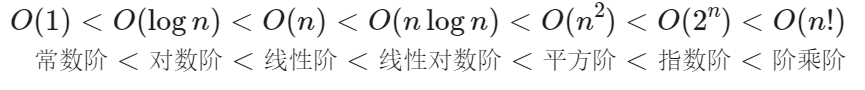

值得注意的是：$O(n!)$是最大的，而$O(nlogn) < O(n^i)$如果$i>1$，这一结论可以通过函数作商求极限说明（洛必达法则）。

常见的时间复杂度: 

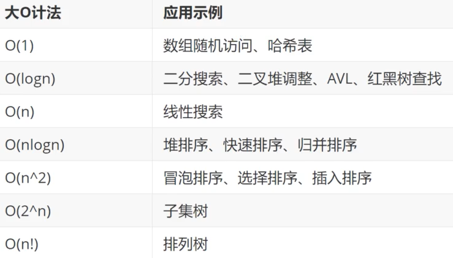

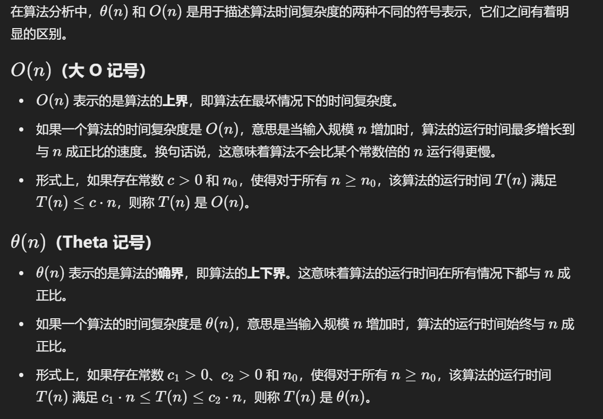

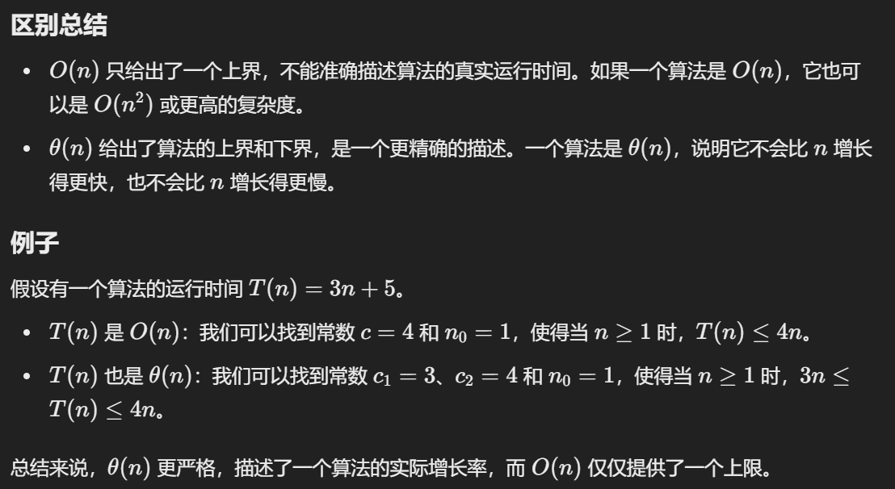

### Algorithm Analysis

Landau Symbols规定：

- $\Theta$ notation: A function $f(n) = \Theta(g(n))$ if there exist positive $k, c_1, c_2$ such that: $c_1 g(n) < f(n) < c_2 g(n)$ whenever $n>k$
- Big O notation: $f(n) = O(g(n))$ if there exists k and c such that $f(n) < cg(n)$ whenever $n>k$

我们从极限的角度来看$\Theta$，如果f(n) g(n)都是最高指数相同的多项式，且系数相同，如果说：

$\lim_{n \to \infty} \frac{f(n)}{g(n)} = c \quad \text{where} \quad 0 < c < \infty$，那么我任取$c > \varepsilon > 0$，那么总会存在正数k，使得：

$\left| \frac{f(n)}{g(n)} - c \right| < \varepsilon \ \text{whenever} \ n > k$，那么就会有：
$$
c - \varepsilon < \frac{f(n)}{g(n)} < c + \varepsilon \\
g(n)(c - \varepsilon) < f(n) < g(n)(c + \varepsilon) \\
c_1 g(n) < f(n) < c_2 g(n)
$$
于是类似地，可以通过这种极限形式重新定义上面两个符号，顺便再如下图定义：$o, \omega, \Omega$

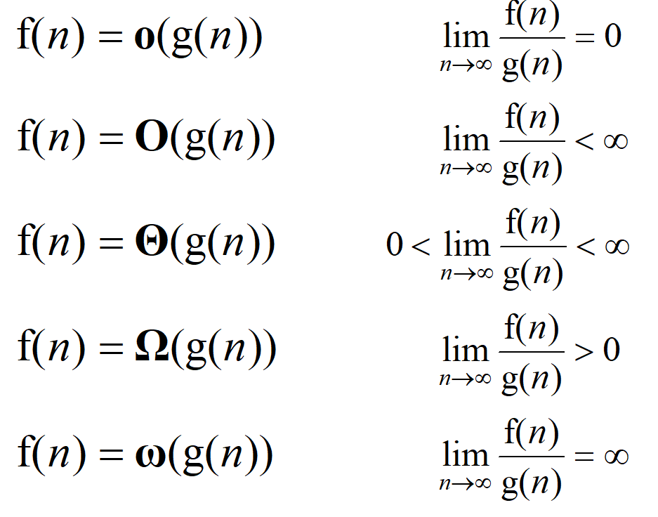

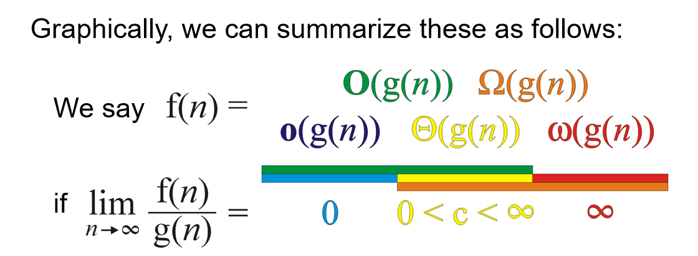

> Tip：算法有没有可能best case时间复杂度是$\Omega(n)$而worst case时间复杂度是$O(n)$呢？当然有可能！比如说算法的时间复杂度**总是**（*没错，“总是”也能拥有最好和最坏情况*）$\Theta(n)$。

## 引言

考虑一种问题：***compute the summation for a polynomial at a fixed value x.***对于一个多项式：$f(x)=a_0+a_1x+a_2x^2+⋯+a_{n−1}x^{n−1}+a_nx^n$来说，代入x之后如何计算？当然，我们可以利用一个数组去储存系数，用引索代表幂，即：a[i] = $a_i$

````c++
double fpoly1 ( int n, double a[ ], double x )
{ int i;
  double p = a[0];
  for (i = 1; i <=n; i++)
       p += (a[i] * pow( x, i) );
  return p;
}
````

或者，另一种表达方式的多项式：$f(x)=a_0+x(a_1+x(a_2+⋯x(a_n−1+x(a_n))⋯))$:

````c++
double fpoly2 ( int n, double a[ ], double x )
{ int i;
  double p = a[n];
  for (i = n; i > 0; i-- )
       p = a[i-1]  + x* p;
  return p;
}
````

但是，当$f(x)=4+3x^{2024}$呢？难道需要开一个2025个元素的数组吗？很明显不现实。因此我们可以在数组里面存储一个structure：$(a_i, i)$。这样就很完美的节省了空间。但是这种表示情况下，如何计算多项式的相加的？我们按指数递减的顺序存储两个数组，然后两个指针开始逐个比较：指数如果不一样，较大的优先进入数组，且指针指向下一个；如果相同，系数相加，储存进新的数组，两个指针都指向下一个。这样也能很好地表示多项式的相加。

从上面这个例子能看出：

- Different data types can be used for the same type of problem.
- There exists a common problem: the organization and management of ordered linear data.

因此引出了第一个关键的概念：List ADT(Abstract Data Type)。An Abstract List (or List ADT) is linearly ordered data (with same data type)。

- The number of elements in the List denotes the length of the List.
- When there is no element, it is an empty List.
- The beginning of a List is called the List head; the end of a List is called the List tail.
- The same value may occur more than once.

对于这种数据结构,一般要能够支持一些基本的操作: ***Access; Erasing; Insertion; Replacement***. 而对于两个ADT，我们也可能希望去操作：***Concatenation; Determine if sublist***. 因此一般程序中有如下结构：

- For L∈List, i denotes the indices, X∈ElementType, the basic operations includes but not limited to:
- ListEmpty(): initialize an empty list.
- ElementType FindKtℎ(int K, List L): find the K_tℎ element and return it.
- int Find(ElementType X, int I, List L): find the location for X.
- void Insert(ElementType X, int i, List L): insert a new element before the i_tℎ element.
- void Delete(int i, List L): delete the i_tℎ element.
- int Lengtℎ(List L): return the length of a list.

具体有哪些线性表的数据结构呢？见下面的内容。

## 数组

### 基本信息

数组的特点: ***内存是连续的***(这也是为什么数组称为***线性表***). 那么数组有什么优缺点呢？

优点: 

- 下标访问(随机访问)的时间复杂度是O(1)
- 末尾位置增加删除元素时间复杂度是O(1)
- 访问元素前后相邻位置的元素非常方便 

缺点:

- 非末尾位置增加删除元素需要进行大量的数据移动
- 搜索的时间复杂度: 如果是无序数组, 那么线性搜索O(n); 如果是有序数组, 那么就是二分搜索O(logn)
- 数组扩容消耗比较大(如何扩容? 之后会有具体的细节实现)

注意! 

1. 随机访问 ≠ 查找 or 搜索
2. 线性搜索指的是下标从0开始一直到n-1来一个一个进行随机访问
3. "数组插入或删除元素十分不方便"其实要分情况, 是末尾位置加入元素还是中间位置? 

````c++
int arr[10];
// c/c++中, 不能用变量来初始化数组, 必须要用常量
// 如果访问arr[10], 那么就是越界访问
````

### Expand

在插入元素的时候，需要判断数组内存满了没有；如果满了，需要开辟新的更大的内存，并且把原来的数据拷贝过去。那么是乘以2好，还是加上一个常数呢？我们先定义amortized time均摊时间：If n operations requires $\Theta(f(n))$, we will say that an individual operation has an amortized run time of $\Theta(f(n)/n)$. 那么分析double的情况：假设在一次扩容中，Inserting n objects would require 1, 2, 4, 8, ..., all the way up to the largest $2^k < n$ or $k=\lfloor lg(n) \rfloor$
$$
\sum_{k=0}^{\lfloor \lg(n) \rfloor} 2^k = 2^{\lfloor \lg(n) \rfloor + 1} - 1 \leq 2^{\lg(n)+1} - 1 = 2^{\lg(n)} 2^1 - 1 = 2n - 1 = \Theta(n)
$$
那么double的均摊时间就是$\Theta(1)$, 而如果是一次内存加m呢？
$$
\sum_{k=1}^{n/m} m k = m \sum_{k=1}^{n/m} k = \frac{\frac{n}{m}\left(\frac{n}{m}+1\right)}{2} = \frac{n^2}{2m} + \frac{n}{2} = \Theta\left(n^2\right)
$$
那么均摊时间就是$\Theta(n)$了，因此最好的策略是double内存。

### 增删改查——基本接口

首先回顾: 内存分区. 

- 数据段(data): 存放全局变量的地方, 系统分配系统释放, 生命周期是整个程序的生命周期
- 堆(heap): 自己开辟自己释放(new delete)
- 栈(stack): 函数进来, 自动分配; 函数出右括号, 系统释放

所以希望自己控制扩容等, 必须要将内存放在堆区: 

````c++
// array.cpp
#include <iostream>
#include <stdlib.h>
#include <time.h>
using namespace std; // 建议之后放弃这一行, 命名空间都带上std
class Array
{
public:
    // 如果没有传, 默认capacity是10
    Array(int size = 10): mCur(0), mCap(size) // 初始化列表的顺序一定要是成员定义的顺序
    {
        mpArr = new int[mCap]();
    }
    ~Array()
    {
    	delete []mpArr; // 仅仅是堆上面的数据释放了
        // 没必要判断mpArr原来是不是空指针, 因为不知道是野指针还是指向的内存被释放
        // 即使原本就是空指针, 那么delete就相当于是空操作
        mpArr = nullptr; // 防止野指针的出现
    }
    
	// 末尾增加元素
    void push_back(int val){
        // 如果数组满了, 需要扩容
        if (mCur == mCap){
            expand(2 * mCap);
        }
        mpArr[mCur] = val;
        mCur++;
    }
    // 末尾删除元素
    void pop_back(){
        if (mCur == 0){
            return;
        }
        mCur--;
    }
    // 按位置增加元素
    void insert(int pos, int val){
        // 好习惯: 判断传入参数的有效性
        if (pos < 0 || pos > mCur){
            return; // invalid position
        }
        // 如果数组满了, 需要扩容
        if (mCur == mCap){
            expand(2 * mCap);
        }
        for (int i = mCur - 1; i >= pos; i--){
            mpArr[i+1] = mpArr[i];
        }
        mpArr[pos] = val;
    }
    // 按位置删除
    void erase(int pos){
        if (pos < 0 || pos >= mCur){
            return; // invalid operation
        }
        for (int i = pos + 1; i < mCur; i++){
            mpArr[i-1] = mpArr[i];
        }
        mCur--; // 代表数组少了一个元素
    }
    // 元素查询
    int find(int val){
        for (int i = 0; i < mCur; i++){
            if (mpArr[i] == val){
                return i;
            }
        }
        return -1;
    }
    void show() const{
        for (int i = 0; i < mCur; i++){
            cout << mpArr[i] << " ";
        }
        cout << endl;
    }
private: // 一定要先理清哪些是私有成员那些事公开成员
    int *mpArr; // 指向可扩容的数组内存
    int mCur; // 数组有效元素的个数, 这里有妙用
    int mCap; // 数组的容量
    // 内部数组扩容接口
    void expand(int size){
        // 开辟更长内存, 复制数据, 然后释放原来的数据
        int *p = new int[size];
        memcpy(p, mpArr, sizeof(int) * mCap);
        delete[]mpArr; 
        mpArr = p;
        mCap = size;
    }
};

int main(){
    Array arr;
    srand(time(0));
    for (int i = 0; i < 10; i++){
        arr.push_back(rand() % 100);
    }
    arr.show();
    arr.pop_back();
    arr.show();
    arr.insert(0, 100);
    arr.show();
    arr.insert(10, 200);
    arr.show();
    int pos = arr.find(100);
    if (pos != -1){
        arr.erase(pos);
        arr.show();
    }
    return 0;
}
````

### 常见题目

#### 元素逆序问题

问题：逆序字符串——引入十分重要的***双指针思想***! 

````c++
// reverse.cpp
#include <iostream>
#include <string.h>
using namespace std;
void Reverse(char arr[], int size){ // 传入size是因为数组传入之后会退化为指针, 所以需要知道个数
    char *p = arr;
    char *q = arr + size - 1;
    while (p < q){
        char ch = *p;
        *p = *q;
        *q = ch;
        p++;
        q--;
    }
}
int main(){
    char arr[] = "hello world";
    cout << arr << endl;
    Reverse(arr, strlen(arr)); // strlen()需要用<string.h>
    cout << arr << endl;
    return 0;
}
````

双指针是一类非常重要的问题, 双指针思想要熟练!

#### 双指针实战——奇偶数调整问题

问题描述: 整型数组, 把偶数调整到数组的左边, 把奇数调整到数组的右边

思路: 尝试利用双指针! 让p指针从左开始寻找到第一个奇数, 然后q指针从右边开始寻找到第一个偶数, 然后p q两个指针的数字进行交换, 交换完成之后, `p++ q--`; 同时, more specifically, 如果p找到了第一个奇数, 那么就停止, 不再`p++`, 否则指针会一步一步向右边移动; q同理. 直到p q两个指针都动不了的时候, 交换, 然后都走动, 判断条件是`while(p < q)`

````c++
// odd_even.cpp
#include <iostream>
#include <time.h>
using namespace std;

void AdjustArray(int arr[], int size){
    int * p = arr;
    int * q = arr + size - 1;
    while (p < q){
        if (*p % 2 == 0){ // p指针对应的是偶数, 那么就右边移动
            p++; // 否则, 那就不会移动
        }
        if (*q % 2 == 1){ // q指针对应的是奇数, 那么就左移动
            q--; // 否则, 那就不会移动
        }
        // 先处理完移动的程序, 然后判断时候交换p q指针的数字
        if ((*p % 2 == 1) && (*q % 2 == 0)){ // 如果p对应奇数而q对应偶数, 交换!
            int temp = *p;
            *p = *q;
            *q = temp;
        }
    }
}
int main(){
    int arr[10] = {0};
    srand(time(0));
    for (int i = 0; i < 10; i++){
        arr[i] = rand()%100;
    }
    // trick : 基于范围的for循环
    for (int v : arr){
        cout << v << " ";
    }
    cout << endl;
    AdjustArray(arr, 10);
    for (int v : arr){
        cout << v << " ";
    }
    return 0;
}
````

我觉得, 双指针的灵魂就在于: p指针左边一定是处理完成的, 而q指针右边一定是处理完成的!  同时, 在判断p(q)指针的数字是不是偶数(奇数)的时候, 有下面这个位运算的trick, 速度上会更快: 

````c++ 
if (*p & 0x1 == 0){}; // 如果p指针对应的是偶数
if (*q & 0x1 == 1){}; // 如果q指针对应的是奇数
````

关于这种方法的解释, `ChatGPT`如下解释: 

这是通过位运算来判断一个指针对应的值是否为偶数。代码中的表达式 `(*p & 0x1 == 0)` 使用了按位与操作符 (`&`) 来检查数值的最低有效位（least significant bit, LSB). 具体地说：

- `*p` 表示通过指针 `p` 访问的值。

- `0x1` 是一个十六进制数，等同于二进制的 `0001`，只关注数值的最低有效位。

- `*p & 0x1`是按位与操作，用来检测 `*p`

   的最低有效位是否为 1。

  - 如果 `*p & 0x1` 结果是 0，这意味着最低有效位是 0，那么 `*p` 就是一个偶数。
  - 如果 `*p & 0x1` 结果是 1，这意味着最低有效位是 1，那么 `*p` 就是一个奇数。

当然上面这种解法很straight forward, 能不能优化呢? 在每一次的循环中, 假如说p指针不动了, 而q一直在动, 那么相当于q的循环移动过程中, p白白多判断了很多次. 那么一种很好的逻辑是: 我一次让p q指针一次性动到位: 

````c++
while (p < q){
    while (p < q){
        if ((*p & 0x1) == 0){
			break;
        }
        p++
    }
    while (p < q){
        if ((*q & 0x1) == 1){
            break;
        }
        q--;
    }
    // 注意: 能跳出上面两个循环的情况除了p对应奇数, q对应偶数, 还能是什么corner case? 
    // 那就是arr中全是偶数(for example), 那么p == q, 意味着: 没有必要交换
    if (p < q){ // 如果是p == q, 那么就没有必要交换了
        int tmp = *p;
        *p = *q;
        *q = tmp;
        p++;
        q--;
    } 
}
````

这个程序的时间复杂度是 O(n)

#### 双指针实战——移除元素问题

题目描述: 

给你一个数组 `nums` 和一个值 `val`，你需要 **[原地](https://baike.baidu.com/item/原地算法)** 移除所有数值等于 `val` 的元素。元素的顺序可能发生改变。然后返回 `nums` 中与 `val` 不同的元素的数量。

假设 `nums` 中不等于 `val` 的元素数量为 `k`，要通过此题，您需要执行以下操作：

- 更改 `nums` 数组，使 `nums` 的前 `k` 个元素包含不等于 `val` 的元素。`nums` 的其余元素和 `nums` 的大小并不重要。
- 返回 `k`。

**用户评测：**

评测机将使用以下代码测试您的解决方案：

```
int[] nums = [...]; // 输入数组
int val = ...; // 要移除的值
int[] expectedNums = [...]; // 长度正确的预期答案。
                            // 它以不等于 val 的值排序。

int k = removeElement(nums, val); // 调用你的实现

assert k == expectedNums.length;
sort(nums, 0, k); // 排序 nums 的前 k 个元素
for (int i = 0; i < actualLength; i++) {
    assert nums[i] == expectedNums[i];
}
```

**示例 1：**

```
输入：nums = [3,2,2,3], val = 3
输出：2, nums = [2,2,_,_]
解释：你的函数函数应该返回 k = 2, 并且 nums 中的前两个元素均为 2。
你在返回的 k 个元素之外留下了什么并不重要（因此它们并不计入评测）。
```

那么在这个问题中, 双指针又被赋予了新的含义: 因为双指针可以不再是一头一尾的设计意义了. 我希望用`i`从头开始遍历, 用`j`记录放下数字的引索(不等于val的下一个引索), 这是两套的"记号": 如果这个`nums[i]`是`val`, 那么`j`不动, 等待之后不是`val`的`nums[i]`, 把这个值放过来; 如果`nums[i]`不是`val`, 那么`j++`, 代表刚刚那个地方就放原来那个地方的元素. 为什么能这样设计? 就是因为题目只要求保证前k个元素不是val, 后面的根本不用管, 所以说, 我只需要用`j`这个设计来更新数组里面的元素, 让后面的非`val`元素放到前面来: 

````c++
// [27] 移除元素
// @lc code=start
class Solution {
public:
    int removeElement(vector<int>& nums, int val) {
        int j = 0; // 指向不等于val的下一个位置
        for (int i = 0; i < nums.size(); i++){
            if (nums[i] != val){
                nums[j] = nums[i];
                j++;
            }
        }
        return j;
    }
};
// @lc code=end
````

## 链表

### 基本知识 

特点： 每一个节点都是在堆内存上独立new出来的, ***节点内存不连续***.

优点: 

- 内存利用率高, 不需要大块连续内存
- 插入和删除节点不需要移动其他节点, 时间复杂度为`O(1)`
- 不需要专门进行扩容操作

缺点: 

- 内存占用量大, 因为每一个节点多出存放地址的空间
- 节点内存不连续, **无法进行内存随机访问** 
- 链表搜索效率不高, **只能从头节点开始逐节点遍历**

那么就有疑问了: 每一个节点之间都是独立的, 那么在一个节点如何知道上下节点在哪里? 之前数组里面, 用`p++ p--`就能移动指针, 找到上面下面的数据, 因为数组储存是连续的. 所以说, 链表的节点一定不是简单储存数据的, ***还要存放下一个节点的地址***. 

因此, 一个node里面, 分为数据域data 和 地址域next, 其中地址域储存的是下一个节点的地址. 通过这样的设计以实现: 1. 链表的每一个节点都是独立分配出来的  2. 从当前节点能够找到下一个节点. 值得注意的是, 最后一个节点的地址域存放的是`nullptr`.

*附：在接下来的代码中，代码定义的不储存数字、用来方便遍历的节点称为了头结点head_。但是不是所有的notational convention都是使用“头结点”称呼它！有的时候，head就是代表第一个有地址域和数据域的有效节点，而有的时候那个所谓的“头结点”有另外的名称，例如dummy 哑结点。*

### 代码实现——单链表

单链表, 顾名思义, 每一个节点只能找到下一个节点, 但是找不到上一个节点. 在具体实现中, 我们设计头节点, 其中头节点的地址域为空指针, 为了防止链表里面没有有效节点而不好操作的情况. 用head指针指向头节点, 初始化的时候, 头节点的地址域为空, 然后在加入有效节点的时候, new一块新内存, 然后把地址写进头节点的地址域中. 当然值得注意的是, 对于任何一个有效节点的加入, 我们都设计成: 初始化的时候地址存放的是空, 然后下一个节点加入的时候, 把它的地址放在上一个节点的地址域中.

需要实现的功能: 尾部插入, 头部插入, 节点删除, 删除多个节点, 搜索, 打印, 构造析构

````c++
// clink.cpp
#include <iostream>
#include <stdlib.h>
#include <time.h>
using namespace std;

struct Node{
    Node(int data = 0): data_(data), next_(nullptr){}
    int data_;
    Node* next_;
};
/*
如果希望Node分装性更强，可以使用下面的class定义：
class Node(){
private:
	int element;
	Node *next_node;
public:
	Node(int data = 0):
		element(data),
		next_node(nullptr){}
	int retrieve() const{
		return element;
	}
	Node *next() const{
		return next_node;
	}
    friend class Clink;
    这里友元是为了方便在Clink中直接修改访问节点的数据域和指针域
    因为原先是结构体，默认是public；但是现在是private，而且提供的接口是const
    如果考虑设置一个函数去修改元素，那么这个元素必须是public，那么全局都可以调用了
};
*/
class Clink{
public:
    Clink(){
        // 初始化的时候, 指向头节点; new Node()在开辟的时候, 同时也会调用构造函数进行初始化
        head_ = new Node();
    }
    ~Clink(){ // 一定不是简简单单的释放头指针就完了! 理解为什么需要p head_两个指针完成操作!
        Node *p = head_;
        while (p != nullptr){
            head_ = head_->next_;
            delete p;
            p = head_;
        }
        head_ = nullptr;
    }

    void InsertTail(int val){ // 链表尾插法
        // 先找到当前链表的末尾节点, 然后生成新节点; 如何找到尾节点呢? 判断地址域是不是空指针!
        Node *p = head_;
        while (p->next_ != nullptr){
            p = p->next_;
        }
        Node *node = new Node(val);
        p->next_ = node;        
    }

    void InsertHead(int val){ // 链表头插法; 注意修改的顺序!!
        Node *node = new Node(val);
        node->next_ = head_->next_;
        head_->next_ = node;
    }

    void Remove(int val){ // 删除节点; 理解为什么p q要两个结构体指针来操作!
        Node *p = head_->next_;
        Node *q = head_;
        while (p != nullptr){
            if (p->data_ == val){
                q->next_ = p->next_;
                delete p; // 释放p对应的node
                return;
            }
            else{
                q = p;
                p = p->next_;
            }
        }
    }

    bool Find(int val){
        Node *p = head_->next_;
        while (p != nullptr){
            if (p->data_ == val){
                return true;
            }
            else{
                p = p->next_;
            }
        }
        return false;
    }

    void RemoveAll(int val){
        Node *p = head_->next_;
        Node *q = head_;
        while (p != nullptr){
            if (p->data_ == val){
                q->next_ = p->next_;
                delete p;
                p = q->next_;
            }
            else{
                q = p;
                p = p->next_;
            }
        }
    }

    void Show(){
        // 注意这里指针的设计! 这样可以防止尾节点的数据忘记被打印! 
        Node *p = head_->next_;
        while (p != nullptr){
            cout << p->data_ << " ";
            p = p->next_;
        }
        cout << endl;
    }
private:
    Node *head_;
    // 调用函数内的函数时合一访问private成员，但是如果外部希望获取到的话，可以写一个接口
};

int main(){
    Clink link;
    srand(time(0));
    for (int i = 0; i < 10; i++){
        int val = rand()%100;
        link.InsertTail(val);
        cout << val << " ";
    }
    cout << endl;
    link.InsertTail(200);
    link.Show();
    link.Remove(200);
    link.Show();
    link.InsertHead(233);
    link.InsertHead(233);
    link.InsertTail(233);
    link.Show();
    link.RemoveAll(233);
    link.Show();
}
````

### 常见题目 

#### 单链表逆序

Eg: head -> 25 -> 67 -> 32 -> 18   经过逆序之后: head -> 18 -> 32 -> 67 -> 25

思路: 头节点的地址域变成空, 然后按照顺序进行头插. 头插的时候, 需要用两个指针, 一个用来记录顺序下的下一个节点的地址(q), 一个用来实现头插(p). 

````c++
struct Node{
    Node(int data = 0): data_(data), next_(nullptr){}
    int data_;
    Node* next_;
};
class Clink{
    //...
private:
    Node *head_;
    // 方便函数访问它的私有成员
    friend void ReverseLink(Clink &link);
}
void ReverseLink(Clink &link){、
    // 引用传递；而且可以轻松访问head_元素
    Node *p = link.head_->next_;
    if (p == nullptr){return;}
    link.head_->next_ = nullptr;
    while (p != nullptr){
        Node *q = p->next_;
        p->next_ = link.head_->next_;
        link.head_->next_ = p;
        p = q;
    }
}
````

#### 单链表求倒数第k个节点 

问题描述: 在实战中, 节点数量是很多的. 如果我需要知道单链表倒数第k个节点的数字是多少呢? 

一种暴力的方法是: 先遍历一遍, 直到尾节点, 直到全部的节点数量; 然后再遍历一边. 这当然是可以的, 但是时间复杂的是`O(n)`; 所以说这种方法是不可取的, 而且一旦节点数量非常大, 那么就会瞬间爆炸. 

更好的方法是: 设计双指针p & q, 然后两者都从头节点出发, 但是先让p走k步, 然后之后p q一起走. 直到p指针变成了空指针, 那么q自动指向的就是倒数第k个节点了. 

````c++
struct Node{
    Node(int data = 0): data_(data), next_(nullptr){}
    int data_;
    Node* next_;
};
class Clink{
    //...
private:
    Node *head_;
    // 方便函数访问它的私有成员
    friend bool GetLastKNode(Clink &link, int k, int &val);
}
bool GetLastKNode(Clink &link, int k, int &val){
    // 注意是引用传递, 这样就可以将值赋给val
    Node* head = link.head_;
    Node* q = head;
    Node* p = head;
    // 好习惯: 判断参数有效性!! 为什么小心k=0? 因为p最后开始走0步, 然后和q一起到空指针
    // 悲剧就是: 访问了空指针. 
    if (k < 1){return false;} 
    for (int i = 0; i < k; i++){
        p = p->next_;
        if (p == nullptr){
            return false;
        }
    }
    while (p != nullptr){
        q = q->next_;
        p = p->next_;
    }
    val = q->data_;
    return true;
}
````

#### 合并两个有序单列表

已经有一个链表1和2, 两个从小到大已经排好序了, 然后希望2连接到1上. 并且**最后依然是从小到大排序**.

我们需要在1 2两个链表上面各自有一个指针, p q来判断两个数字谁打谁小; 同时, 不难想到, 我们希望用一个last指针来储存上一次操作完之后所停留在的节点信息. 处理完之后, 假如说p对应数字更大, 那么就: 

````c++
last->next_ = p;
p = p->next_;
last = last->next_;
````

当然, 肯定有一个指针会先走到nullptr的, 那么假如说p变成了空指针, 说明p所在的1链表没有节点要串起来了, 直接将q指向的节点及其后面的一系列节点归并到last上面: 

````c++
struct Node{
    Node(int data = 0): data_(data), next_(nullptr){}
    int data_;
    Node* next_;
};
class Clink{
    //...
private:
    Node *head_;
    // 方便函数访问它的私有成员
    friend bool MergeLink(Clink& link1, Clink& link2);
}
bool MergeLink(Clink& link1, Clink& link2){
    Node* p = link1.head_->next_;
    Node* q = link2.head_->next_;
    Node* last = link1.head_;
    link2.head_->next_ = nullptr;
    while (p != nullptr && q != nullptr){
        if (p->data_ < q->data_){
            last->next_ = p;
            p = p->next_;
            last = last->next_;
        }
        else{
            last->next_ = q;
            q = q->next_;
            last = last->next_;
        }
    }
    if (p != nullptr){
        last->next_ = p;
    }
    else{
        last->next_ = q;
    }
}
````

#### 判断单链表是否存在环以及入口节点

如果存在环的话, 那么假如说开始遍历的话, 根本遍历不完! 什么时候存在环? 打个比方, 地址上来看有: A -> B -> C -> D -> A, 那么就是一个环, 而且遍历是十分危险的. 

不假思索地: 可以遍历的时候, 把每一个节点的地址单独储存起来, 每遍历一步之后, 看这个地址在不在之前储存的地址库里面. 但是, 依然是希望能够原地解决问题. 

环的特点有什么? 除了我总是能回到我之前跑过的地方, 还有一个特点: 两个速度不一样的人跑圈, 总是能快的从后面追上慢的! 因此, 这个问题涉及到了双指针的应用——***快慢指针***. 

这样一来, 判断出是否存在环就比较简单了. 就比如, slow指针跑的慢, 一次走一个节点; fast指针走得快, 一次走两个节点; fast == slow, 那么就成环, 而如果fast变成了空指针, 那么就说明没有环. 那么这时候就有一个灵性的问题了: 会不会fast指针跨越过slow指针? 其实这是伪命题. 唯一能发生这样的情况就是fast == slow! 

但是如何寻找节点呢? 如下图 : 

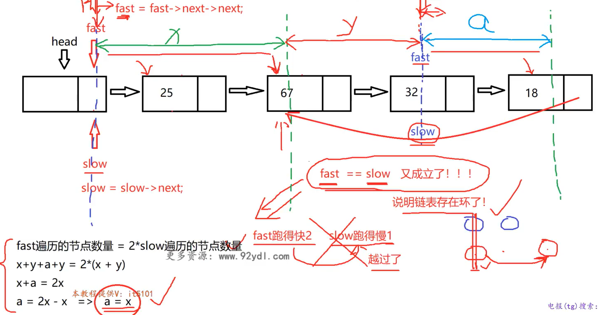

如果在这个时候, fast slow不再代表快慢, 而是仅仅是记号, 那么把fast指针放回到head, 每次走一步. 那么fast和slow同时开始走, 最后再次相遇的地方正好就是入口的地方!

````c++
bool IsLinkHasCircle(Node* head, int& val){
    Node* fast = head;
    Node* slow = head;
    while (fast != nullptr && fast->next_ != nullptr){ // fast走两步, 所以判断两个是不是nullptr, 防止访问空指针
        slow = slow->next_;
        fast = fast->next_->next_;
        if (fast == slow){
            fast = head;
            while (fast != slow){
                slow = slow->next_;
                fast = fast->next_;
            }
            val = slow->data_;
            return true;
        }
    }
    return false;
}
````

附: 这个函数传入的是结构体(Node)指针, 是因为这样方便测试. 测试代码, 详见: `clink.cpp`

#### 判断两个链表是否相交以及相交入口

一种很直接的思路: 先各自遍历两个链表, 得到a b两个长度, 然后假设链表1的长度a更大, 那么就1链表指针先走(a-b)步, 然后1 2链表的两个指针一起走, 最后相遇的地方就是入口; 如果最后两个都各自变成了`nullptr`, 那么就说明不相交. 

````c++
bool IsLinkHasMerge(Node* head1, Node* head2, int& val){
    int cnt1 = 0, cnt2 = 0;
    Node* p = head1->next_;
    Node* q = head2->next_;
    while (p != nullptr){
        cnt1++;
        p = p->next_;
    }
    while (q != nullptr){
        cnt1++;
        q = q->next_;
    }
    p = head1->next_;
    q = head2->next_;
    if (cnt1 > cnt2){
        int offset = cnt1 - cnt2;
        while (offset-- > 0){
            p = p->next_;
        }
        while (p != nullptr && q != nullptr){
            if (p == q){
                val = p->data_;
                return true;
            }
            p = p->next_;
            q = q->next_;
        }
        return false;
    }
    else {
        int offset = cnt2 - cnt1;
        while (offset-- > 0){
            q = q->next_;
        }
        while (p != nullptr && q != nullptr){
            if (p == q){
                val = p->data_;
                return true;
            }
            p = p->next_;
            q = q->next_;
        }
        return false;
    }
}
````

### 单向循环链表 

#### 基础知识

单项循环链表的循环具体来说是:如果有头节点, 尾节点存储着头节点的地址; 如果没有头节点, 尾节点存储着第一个节点的地址. 我们可以专门使用tail指针, 来记录尾节点的地址, 那么`tail->next_`就是头节点的地址. 注意, **全程tail的信息应该得到正确的更新**! 

#### 代码实现 

````c++
// circlelink.cpp
#include <iostream>
#include <stdlib.h>
#include <time.h>
using namespace std;

struct Node{
    Node(int data = 0) : data_(data), next_(nullptr){}
    int data_;
    Node* next_;
};
class CircleLink{
public:
    CircleLink(){
        head_ = new Node();
        // tail指针的信息将在尾插的过程中得到更新!
        tail_ = head_;
        head_->next_ = head_;
    }
    ~CircleLink(){
        Node* p = head_->next_;
        while (p != head_){
            head_->next_ = p->next_;
            delete p;
            p = head_->next_;
        }
        delete head_;
    }

public:
    void InsertTail(int val){
        Node* node = new Node(val);
        node->next_=tail_->next_;
        tail_->next_ = node;
        // 在这里, tail指针的信息得到更新! 
        tail_ = node;
    }

    void InsertHead(int val){
        Node* node = new Node(val);
        node->next_=head_->next_;
        head_->next_ = node;
        // 如果只有头节点, tail和head一样, 那么头插之后, tail指针需要移动
        // 但是对于不止头节点情况, tail指针不需要移动. 所以这里需要分类讨论对tail指针的处理!
        if (node->next_ == head_){
            tail_ = node;
        }
    }

    void Remove(int val){
        Node* q = head_;
        Node* p = head_->next_;
        while (p != head_){ // 注意什么时候退出循环! 除非需要可以寻找尾节点, 循环中尽可能少用->next_判断
            if (p->data_ == val){
                q->next_ = p->next_;
                delete p;
                // 如果删除的是为节点, 那么tail指针需要得到更新! 
                if (q->next_ == head_){
                    tail_ = q;
                }
                return;
            }
            else {
                q = p;
                p = p->next_;
            }
        }
        return;
    }

    bool Find(int val) const{
        Node* p = head_->next_;
        while (p != head_){
            if (p->data_ == val){
                return true;
            }
        }
        return false;
    }

    void Show() const{
        Node* p = head_->next_;
        while (p != head_){
            cout << p->data_ << " ";
            p = p->next_;
        }
        cout << endl;
    }

private:
    Node* head_;
    Node* tail_;
 };

void TestBasic(CircleLink clink){
    srand(time(NULL));
    for (int i = 0; i < 10; i++){
        clink.InsertTail(rand()%100);
    }
    clink.Show();
    clink.InsertHead(200);
    clink.InsertTail(200);
    clink.Show();
    clink.Remove(200);
    clink.Show();
}

int main(){
    CircleLink clink;
    TestBasic(clink);
    return 0;
}
````

#### 约瑟夫环问题

已知n个人围坐在一张圆桌周围, 从编号为k的人开始报数, 数到m的那个人出列, 它的下一个人又开始从1报数, 数到m的那个人又出列, 以此重复下去, 直到圆桌周围的人全部出列, 输出人的出列顺序.

由于环的设计, 这个问题非常适合用单循环链表来解决. 因为涉及到了删除节点, **所以自然想到需要用p q两个指针**(q在p后面, 用来方便删除节点). 那么最后结束的情况是什么呢? 最后, *p q指针会重合*. 

````c++
// circlelink.cpp
void Joseph(Node* head, int k, int m){
    Node* p = head;
    Node* q = head;
    // q指向最后一个节点! 因为在我们测试的时候, 没有头节点.
    while (q->next_ != head){
        q = q->next_;
    }
    // 到第k个人
    for (int i = 1; i < k; i++){
        q = p;
        p = p->next_;
    }
    for (;;){ // 一直循环, 直到p == q
        for (int i = 1; i < m; i++){
            q = p;
            p = p->next_;
        }
        cout << p->data_ << " ";
        if (p == q){
            delete p;
            break;
        }
        q->next_ = p->next_;
        delete p;
        p = q->next_;
    }
    cout << endl;
}
````

### 双向链表

- 每一个节点除了数据域，还有next指针域指向下一个节点，pre指针域指向前一个节点
- 头结点的pre是NULL，末尾节点的next是NULL

***注意！当然是可以在class里面加入tail节点的设计的，类似于头部的哑结点（CS101）；而下面的实现中并没有设计tail节点。***

注：做题时要判断，题目给出的结构体定义究竟是单向还是双向（因为双向确实是方便）

````c++
// doublelink.cpp
#include <iostream>
using namespace std;

struct Node{
    Node(int data = 0) 
        : data_(data)
        , next_(nullptr)
        , pre_(nullptr) 
        {} // 规范化的初始化构造列表,一行一个
    int data_;
    Node *next_;
    Node *pre_;
};

class DoubleLink{
public:
    DoubleLink(){
        head_ = new Node();
    }
    ~DoubleLink(){
        Node* p = head_;
        while (p != nullptr){
            head_ = head_->next_;
            delete p;
            p = head_;
        }
    }

private:
    Node* head_;

public:
    void InsertHead(int val){
        Node* node = new Node(val);
        node->next_ = head_->next_;
        node->pre_ = head_;
        if (head_->next_ != nullptr){
            head_->next_->pre_ = node;
        }
        head_->next_ = node;
    }

    void InsertTail(int val){
        Node* p = head_;
        while (p->next_ != nullptr){
            p = p->next_;
        }
        Node* node = new Node(val);
        node->pre_ = p;
        p->next_ = node;
    }

    bool Find(int val){
        Node* p = head_->next_;
        while (p != nullptr){
            if (p->data_ == val){
                return true;
            }
            else{
                p = p->next_;
            }
        }
    }

    void Remove(int val){
        Node* p = head_->next_;
        while (p != nullptr){
            if (p->data_ == val){
                p->pre_->next_ = p->next_;
                if (p->next_ != nullptr){
                    p->next_->pre_ = p->pre_;
                }
                Node* next = p->next_;
                delete p;
                p = next; // 有了这一行,说明是删除全部值为val的节点
            }
            else{
                p = p->next_;
            }
        }
    }

    void Show(){
        Node* p = head_->next_;
        while (p != nullptr){
            cout << p->data_ << " ";
            p = p->next_;
        }
        cout << endl;
     }
};

void TestBasic(DoubleLink& dlink){
    cout << "Testing Basics!" << endl;
    dlink.InsertHead(11);
    dlink.InsertHead(45);
    dlink.InsertHead(14);
    dlink.Show();
    dlink.InsertTail(19);
    dlink.InsertTail(19);
    dlink.InsertTail(810);
    dlink.Show();
}

void TestRemoval(DoubleLink& dlink){
    dlink.Remove(19);
    dlink.Show();
}

int main(){
    DoubleLink dlink;
    TestBasic(dlink);
    TestRemoval(dlink);
}
````

### 时间复杂度分析

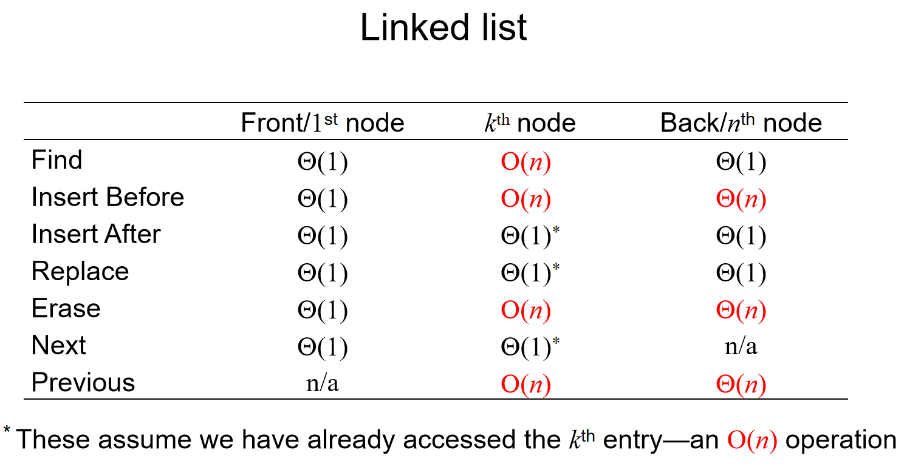

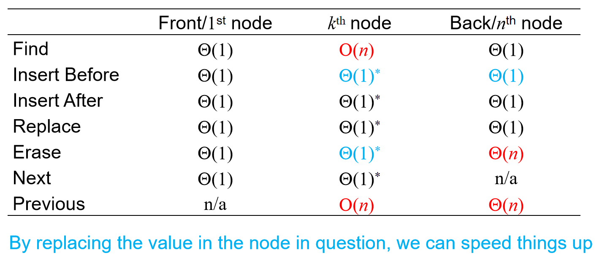

为什么说允许修改节点（而不是定死了一个节点的数据域和指针域都不可以修改）能够加快三个时间复杂度呢？因为在前面插入不再是必须要另设指针不断遍历，直到找到前一个节点了；而是我可以修改这个节点的值，创建一个新节点，值换成它的，然后指针域指向下一个节点，而它自己的地址被指针指向的节点的指针域指向。

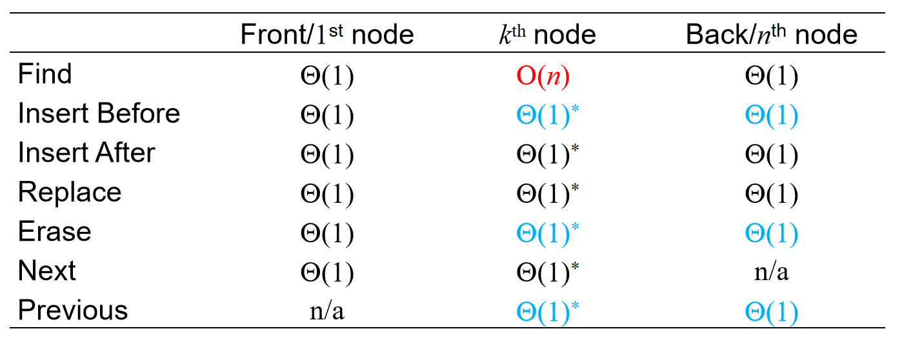


## 栈

栈十分重要！特点：***先进后出，后进先出***。栈并不是一个全新的数据结构，而是建立在数组和链表之上实现的。换而言之，在数组和链表中，可以在末尾和头部插入元素，但是在栈中有硬性规定：只能在一个位置加入元素，只能在一个位置删除元素。栈有以下类型：顺序栈和链式栈。

### 顺序栈

**顺序栈（Sequential Stack）**：建立在数组之上。顺序栈中，栈底层数组的起始地址称为**栈底**，而只能在**栈顶（top）**进行元素的进出。一开始，`top = 0 // top代表元素的数组下标`，代表栈的初始化，栈是空的。之后元素进行**入栈**，而只能从栈顶进入，因此是：`arr[top] = val; top++;`那么访问栈顶元素就是`arr[top-1]`了。那么如何实现**出栈**呢？其实`top--;`就可以了。所以只要控制好top的位置，从而使得栈外的数据访问不到，就能实现出入栈。类似地，想要**空栈**就直接`top = 0;`。而当**栈满**的时候`top == sizeof(arr)/sizeof(arr[0])`，就不能再在原地插入元素了，不然就数组越界访问了，所以就要考虑自动扩容（和数组很像）。

````c++
// sequential_stack.cpp
#include <iostream>
using namespace std;

// 顺序栈 C++容器适配器 stack
class SeqStack{
public:
    SeqStack(int size = 10)
        : mtop(0)
        , mcap(size)
        {
            mpStack = new int[mcap];
        }
    ~SeqStack(){
        delete[] mpStack;
        mpStack = nullptr; // 防止野指针
    }

public:
    // 入栈
    void push(int val){
        if (mtop == mcap){
            // 扩容
            expand(2*mcap);
        }
        mpStack[mtop++] = val; // 赋值后,top++
    }

    void pop(){
        if (mtop == 0){
            // 抛异常也是一种return
            throw "Stack is empty";
        }
        mtop--;
    }

    int top() const{ // 加const是因为,这个方法是只读的
        if (mtop == 0){
            throw "Stack is empty";
        }
        return mpStack[mtop-1];
    }

    bool empty(){
        return mtop == 0;
    }

    int size() const{
        return mtop;
    }

private:
    int* mpStack;
    int mtop; // 栈顶位置
    int mcap; // 栈空间大小

private:
    void expand(int size){
        int* p = new int[size];
        memcpy(p, mpStack, mtop*sizeof(int));
        delete[] mpStack;
        mpStack = p;
        mcap = size;
    }
};

int main(){
    int arr[] = {12, 4, 56, 7, 89, 31, 53, 75};
    SeqStack s;
    for (int v : arr){
        s.push(v);
    }
    while (!s.empty()){
        cout << s.top() << " ";
        s.pop();
    }
    cout << endl;
}
````

### 链表栈

在顺序栈中，数据的扩容十分低效，因此考虑利用链表的优势来弥补这一不足。

````c++
#include <iostream>
using namespace std;

class LinkStack{
public:
    LinkStack() : size_(0){
        head_ = new Node;
    }
    ~LinkStack(){
        Node* p = head_;
        while (p != nullptr){
            head_ = head_->next_;
            delete p;
            p = head_;
        }
    }

public:
    // 入栈 头结点的后面第一个有效节点的位置作为栈顶
    void push(int val){
        Node* node = new Node(val);
        node->next_ = head_->next_;
        head_->next_ = node;
        size_++;
    }
    // 出栈
    void pop(){
        if (head_->next_ == nullptr)
            throw "Stack is empty!";
        Node* p = head_->next_;
        head_->next_ = p->next_;
        delete p;
        size_--;
    }

    int top() const{
        if (head_->next_ == nullptr)
            throw "Stack is empty!";
        return head_->next_->data_;
    } 

    bool empty(){
        return head_->next_ == nullptr;
    }

    int size() const{
        // 返回栈元素个数，如果遍历，那么就是O(n)
        // 为了O(1),可以在成员里面加入记录这一参数的设计
        return size_;
    }
private:
    struct Node{
        Node(int data = 0) : data_(data), next_(nullptr){}
        int data_;
        Node* next_;
    };
    Node* head_;
    int size_;
};

int main(){
    int arr[] = {12, 4, 56, 7, 89, 31, 53, 75};
    LinkStack s;
    for (int v : arr){
        s.push(v);
    }
    cout << "The size of the stack is: " << s.size() << endl;
    while (!s.empty()){
        cout << s.top() << " ";
        s.pop();
    }
    cout << endl;
    return 0;
}
````

### 常见问题

#### 括号匹配问题

思路： 1. 遍历s字符串，遇到左括号直接入栈  2. 如果遇到了右括号，从栈顶取出一个左括号，如果匹配，继续；如果不匹配，直接结束，返回false. 

但是依然有一些细节: 1. 如果是`(`呢？ 左括号都放进了栈里面，因此会跳出循环，因此需要注意循环外要判断栈是否为空    2. 如果是`)`呢？遇到了右括号，但是栈里面什么都没有，因此没有此遇到右括号，需要判断栈是否为空。

````c++
class Solution {
public:
    bool isValid(string s) {
        stack<char> cs;
        for (char ch : s){
            if (ch == '(' || ch == '[' || ch == '{'){
                cs.push(ch);
            }
            else{
                if (cs.empty())
                    return false;
                char cmp = cs.top();
                cs.pop();
                if (ch == ')' && cmp != '('
                || ch == ']' && cmp != '['
                || ch == '}' && cmp != '{'){
                    return false;
                }
            }
        }
        // 还需要判断栈里面是否处理完毕
        return cs.empty();
    }
};
````

#### 逆波兰表达式

逆波兰表达式是一种**后缀表达式**，所谓后缀就是指算符写在后面。

- 平常使用的算式则是一种中缀表达式，如 `( 1 + 2 ) * ( 3 + 4 )` 。
- 该算式的逆波兰表达式写法为 `( ( 1 2 + ) ( 3 4 + ) * )` 。

逆波兰表达式主要有以下两个优点：

- 去掉括号后表达式无歧义，上式即便写成 `1 2 + 3 4 + * `也可以依据次序计算出正确结果。
- **适合用栈操作运算：遇到数字则入栈；遇到算符则取出栈顶两个数字进行计算，并将结果压入栈中**

````c++ 
输入：tokens = ["10","6","9","3","+","-11","*","/","*","17","+","5","+"]
输出：22
解释：该算式转化为常见的中缀算术表达式为：
  ((10 * (6 / ((9 + 3) * -11))) + 17) + 5
= ((10 * (6 / (12 * -11))) + 17) + 5
= ((10 * (6 / -132)) + 17) + 5
= ((10 * 0) + 17) + 5
= (0 + 17) + 5
= 17 + 5
= 22
````

思路已经清晰地表达在题目里面了。

````c++
class Solution {
public:
    int calculate(int left, int right, char sign){
        switch(sign){
            case '+' : return left + right; 
            case '-' : return left - right; 
            case '*' : return left * right; 
            case '/' : return left / right; 
        }
        throw "";
        // throw的原因是为了通过通过编译，并且防止case中出现非加减乘除的char
    }
    int evalRPN(vector<string>& tokens) {
        stack<int> is;
        for (string& str : tokens){
            if (str.size() == 1 &&
            (str[0] == '+' || str[0] == '-'
            || str[0] == '*' || str[0] == '/'))
            {
                int right = is.top();
                is.pop();
                int left = is.top();
                is.pop();
                is.push(calculate(left, right, str[0]));
            }
            else{
                // string的数字转化为正整数，c++接口
                is.push(stoi(str));
            }
        }
        return is.top();
    }
};
````

#### 中缀转后表达式

那么如何将中缀表达式转化为逆波兰表达式呢？如果能实现这个，那么就能很好地实现中缀表达式的计算。

那么例如`(1+2)*(3+4)`这样的式子如何变成 `1 2 + 3 4 + *`呢？

我们要单独设计符号栈。遇到数字，直接输出，而遇到符号：

- 栈为空，那么符号直接入栈
- 如果是(，直接入栈
- 用当前符号和栈顶符号比较优先级*

优先级*：

- 当前符号>栈顶符号，当前符号入栈，结束
- 当前符号<=栈顶符号，栈顶符号出栈并输出，继续比较

直到：1. 栈里面符号出完   2. 遇到)，要一直出栈，直到遇见(为止

````c++
// MiddleToEndExpr.cpp
#include <iostream>
#include <string>
#include <stack>
using namespace std;

bool Priority(char ch, char topch){
    if ((ch == '*' || ch == '/') && 
    (topch == '+' || topch == '-')){
        return true;
    }
    if (ch == ')'){return false;}
    if (topch == '(' && ch != ')'){return true;}
    return false;
}


string MiddleToEndExpr(string expr){
    string result;
    stack<char> s;

    for (char ch : expr){
        if (ch >= '0' && ch <= '9'){
            result.push_back(ch);
        }
        else{
            if (s.empty() || ch == '('){
                s.push(ch);
            }
            else{
                while (!s.empty()){
                    char topch = s.top();
                    if (Priority(ch, topch)){
                        s.push(ch);
                        break;
                    }
                    else{
                        s.pop();
                        if (topch == '(')
                            break;
                        result.push_back(topch);
                    }
                }
            }
        }
    }
    // 如果符号栈仍然存留符号
    while (!s.empty()){
        result.push_back(s.top());
        s.pop();
    }
    return result;
}

int main(){
    cout << MiddleToEndExpr("(1+2)*(3+4)") << endl;
    return 0;
}
````

### STL实现

queue头文件中的STL所支持的函数：push(), pop()(没有返回值), top()(专门返回栈顶值)。注意，没有专门提供栈底元素的函数，因为队列是LIFO（last-in, first-out），没有访问栈底元素的接口。

````c++
#include <iostream>
#include <stack>
using namespace std;
int main() {
    stack<int> istack;

    istack.push( 13 );
    istack.push( 42 );
    cout << "Top: " << istack.top() << endl;
    istack.pop();                             // no return value
    cout << "Top: " << istack.top() << endl;
    cout << "Size: " << istack.size() << endl;

    return 0;
}

````

## 队列

### 基础与代码实现

特点：先进先出，后进后出

初始化的时候，需要两套**引索**，first记录头，rear记录尾。入队的过程中，`arr[rear] = val; rear++;`，那么和栈类似地，出队的时候直接`first++；`就可以了。当然，rear有越界访问的危险（如果是用数组实现），因为rear可能等于`arr.length`。而且前面出队的元素根本用不上，就会闲置在那里，浪费空间。所以说在尝试用数组实现队列的时候，逻辑要进行转化：

逻辑上，当rear准备越界的时候，直接`rear = (rear + 1) % arr.length`，那么每一次入队都会把之前出队的位置的元素覆盖掉，从而重新利用内存。那么rear可能会追上first的呀！那么怎么判断是空还是满呢？因此，我们不能让数组存满，因此当： `(rear+1)%length == first`的时候，我们认为环形队列满了（但事实上**rear指针所在的地方并没有存数据**，或者说存的是已经出队的数据；换而言之，**first引索所在的位置有数据，而rear引索所在的位置没有数据，而是rear的前面一个地方有数据！**），而`first == rear`的时候环形队列就是空的。

队列的实现可以依靠数组：

````c++
// queue.cpp
#include <iostream>
using namespace std;

class Queue{
public:
    Queue(int size = 10)
    : cap_(size)
    , front_(0)
    , rear_(0)
    , size_(0){
        pQue_ = new int[cap_];
    }
    ~Queue(){
        delete[] pQue_;
        pQue_ = nullptr;
    }

public:
    void push(int val){
        if ((rear_ + 1) % cap_ == front_){
            expand(2 * cap_);
        }
        pQue_[rear_] = val;
        rear_ = (rear_ + 1) % cap_;
        size_++;
    }

    void pop(){
        if (front_ == rear_){
            throw "The Queue is empty!";
        }
        front_ = (front_ + 1) % cap_;
        size_--;
    }

    int front() const{
        if (front_ == rear_){
            throw "The Queue is empty!";
        }
        return pQue_[front_];
    }

    int back() const{
        if (front_ == rear_){
            throw "The Queue is empty!";
        }
        return pQue_[(rear_ - 1 + cap_) % cap_];
        // 上面这个式子的设计是为了包括rear为0的情况
    }

    bool empty() const{
        return front_ == rear_;
    }

    int size() const{
        return size_;
    }
private:
    void expand(int size){
        int* p = new int[size];
        int i = 0;
        int j = front_;
        for (;j != rear_; i++,j = (j+1) % cap_){
            p[i] = pQue_[j];
        }
        delete[] pQue_;
        pQue_ = p;
        cap_ = size_;
        front_ = 0;
        rear_ = i;
    }
private:
    int* pQue_;
    int cap_; // 空间容量
    int front_; // 队头
    int rear_; //队尾
    int size_;
};

int main(){
    int arr[] = {11, 45, 14, 19, 19, 8, 1, 0};
    Queue que;
    for (int v : arr){
        que.push(v);
    }
    cout << que.front() << endl;
    cout << que.back() << endl;
    que.push(100);
    que.push(200);
    que.push(300);
    cout << que.front() << endl;
    cout << que.back() << endl;
    while (!que.empty()){
        cout << que.front() << " " << que.back() << endl;
        que.pop();
    }
}
````

当然，也可以依靠链表。这样环形的复杂结构就可以利用双向循环链表表示了：

````c++
// linkqueue.cpp
#include <iostream>
using namespace std;

class LinkQueue{
public:
    LinkQueue(){
        head_ = new Node();
        head_->next_ = head_;
        head_->pre_ = head_;
    }

    ~LinkQueue(){
        Node* p = head_->next_;
        while (p != head_){
            head_->next_ = p->next_;
            p->next_->pre_ = head_;
            delete p;
            p = head_->next_;
        }
        delete head_;
        head_ = nullptr;
    }

public:
    void push(int val){
        Node* p = head_->pre_;
        Node* node = new Node(val);
        node->next_ = head_;
        node->pre_ = p;
        head_->pre_->next_ = node;
        head_->pre_ = node;
    }

    void pop(){
        if (head_->next_ == head_){
            throw "queue is empty!";
        }
        Node* p = head_->next_;
        head_->next_ = p->next_;
        p->next_->pre_ = head_;
        delete p;
    }

    int front() const{
        if (head_->next_ == head_){
            throw "queue is empty!";
        }
        return head_->next_->data_;
    }

    int back() const{
        if (head_->next_ == head_){
            throw "queue is empty!";
        }
        return head_->pre_->data_;
    }
    
    bool empty() const{
        return head_->next_ == head_;
    }
private:
    struct  Node{
        Node(int data = 0) 
        : data_(data)
        , next_(nullptr)
        , pre_(nullptr)
        {}
        int data_;
        Node* next_;
        Node* pre_;
    };
    Node* head_;
};

int main(){
    int arr[] = {11, 45, 14, 19, 19, 8, 1, 0};
    LinkQueue que;
    for (int v : arr){
        que.push(v);
    }
    cout << que.front() << endl;
    cout << que.back() << endl;
    que.push(100);
    que.push(200);
    que.push(300);
    cout << que.front() << endl;
    cout << que.back() << endl;
    while (!que.empty()){
        cout << que.front() << " " << que.back() << endl;
        que.pop();
    }
}
````

### STL实现

queue头文件中的STL所支持的函数：push(), pop()(没有返回值), front()(专门返回队首值)。注意，没有专门提供队尾元素的函数，因为队列是FIFO（first-in, first-out），没有访问队尾元素的接口。

````c++ 
#include <iostream>
#include <queue>
using namespace std;
int main()
{
    queue<int> iqueue;

    iqueue.push(13);
    iqueue.push(42);
    cout << "Head: " << iqueue.front() << endl;
    iqueue.pop(); // no return value
    cout << "Head: " << iqueue.front() << endl;
    cout << "Size: " << iqueue.size() << endl;

    return 0;
}
````

## 哈希表

### Overview

哈希表又称散列表，一种以「key-value」形式存储数据的数据结构。所谓以「key-value」形式存储数据，是指任意的键值 key 都唯一对应到内存中的某个位置。只需要输入查找的键值，就可以快速地找到其对应的 value。可以把哈希表理解为一种高级的数组，这种数组的下标可以是很大的整数，浮点数，字符串甚至结构体。

> reference: https://oi.wiki/ds/hash/

我们很希望：Store data so that all operations are $\Theta$(1) time, and the memory requirement should be $\Theta$(n). 举一个现实生活中的例子。假设一个班100个人，那么如何存储100个人的成绩呢？假设每一个学生都有一个8位学号，如果希望实现“引索——学生”一一对应，难道我需要创建一个$10^8$的数组吗？ 其实不必。后来发现，绝大部分的人最后三位不一样，于是可以考虑：$f(number) = number[:-3]$，那么创建的数组只需要$10^3$个位置了。那么问题在于：万一有两个学生最后三位相同呢？其实当然有可能，但是概率很低。

在上面这个例子中：The process of mapping an object or a number onto an integer in a given range is called ***hashing***，对应的就是“通过学生的学号得到一个三位数字”，这个函数也称为哈希函数；同时，有一个问题：multiple objects may hash to the same value，这对应的就是两个学生最后的三位数相同，这种现象就是***哈希冲突（collision）***。后面也会介绍到：	Hash tables use a hash function together with a mechanism for dealing with collisions.

对于一个hash process来说，主要流程如下图（假设我们的哈希函数讲object转化为了32位的二进制数字）：

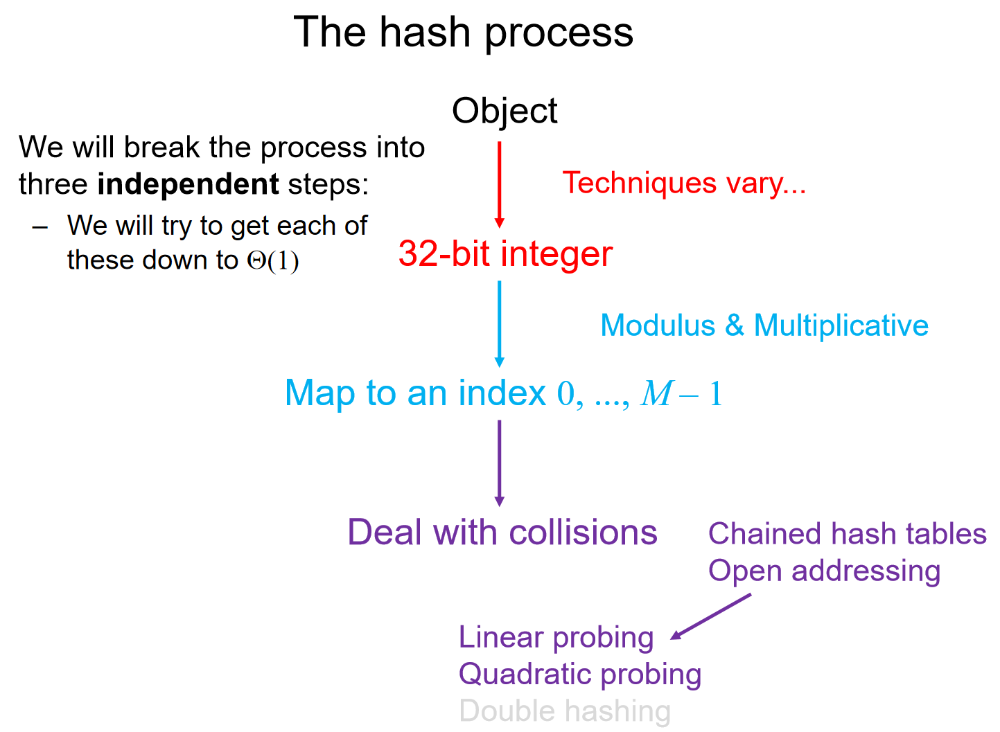

### Hash function

哈希的定义：（From Merriam-Webster）a restatement of something that is already known.  我们希望哈希函数有以下的性质：

- The hash value must be deterministic（It must always return the same 32-bit integer each time）
- Equal objects hash to equal values
- Should be fast, like $\Theta(1)$
- If two objects are randomly chosen, there should be only a one-in-$2^{32}$ chance that they have the same hash value

We will look at two classes of hash hunctions:

- Predetermined hash functions (explicit)
- Arithmetic hash functions (implicit)

Predetermined hash functions：最简单的解决方案就是给每一个对象一个独特的号码，但是当录入了两个相同的object之后，输入这个object，返回的是两个号码。因此：These hash values must depend on the member variables, usually this uses ***arithmetic functions***.

An arithmetic hash value is a deterministic function that is calculated from the relevant member variables of an object. We will look at arithmetic hash functions for ***strings***. A string is simply an array of bytes, each byte stores a value from 0 to 255. 因此，哈希函数必须是这些字节的函数。打个比方：哈希函数返回的是字符串所有的char的字节里面储存的数字。但是这种哈希函数不是很好，首先是：它的时间复杂度是$\Theta(n)$，而且非常有可能会发生哈希冲突，比如说"from" "form"两个单词。

换一种哈希函数：Let the individual characters represent the coefficients of a polynomial in x. Use Horner’s rule to evaluate this polynomial at a prime number, e.g., x=12347:

````c++
unsigned int hash( string const &str ) {
	unsigned int hash_value = 0;
	for ( int k = 0; k < str.length(); ++k ) {
		hash_value = 12347*hash_value + str[k];
	}
	return hash_value;
}
````

In general, any member variables that are used to uniquely define an object may be used as coefficients in such a polynomial.

### Mapping to [0, M-1]

为什么需要把32bit映射到这个区间中？因为哈希表实际上是数组，而这个数组的大小是固定为M的，因此才需要mapping这一步，不然的话，内存要求非常的高。可能会认为：把32bit的整数映射到这个区间，直接模M不就好了吗？但是实则不然，计算余数非常的expensive；但是好消息是，如果$M=2^m$的话，我们可以用位运算简化计算。

bitwise operators有：& << >>。如何理解位运算如何节省计算开支？假如说我想计算7985325 % 100，那么在这个十进制的情况下，因为$100=10^2$，所以说取最后两位就可以了，就能直观看出来最后余数应该是25.

因此在二进制中，假如说计算：$100011100101_2 \% 10000_2$，那么由于我们知道：二进制中的10000是2的四次方，因此直接取最后四位就是结果：0101。反过来，如果说是乘以这个数字，那么结果就是原来这个数字后面填上四位。无论是取出最后的四位还是后面填充四位，其实都能通过位运算进行简便的计算：

````c++
unsigned int hash_M( unsigned int n, unsigned int m ) {
	return n & ((1 << m) – 1);
}
````

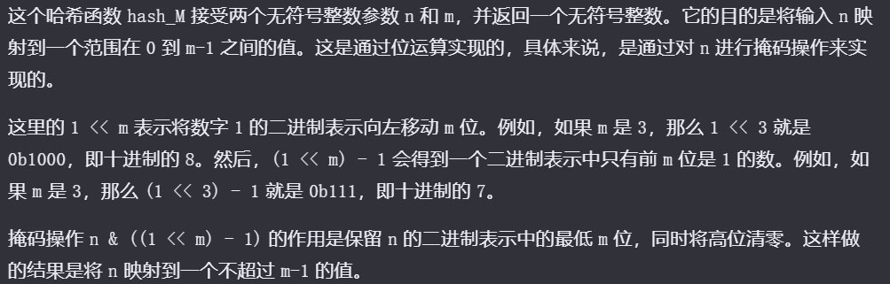

上面关于代码的解释来自[Kimi](https://kimi.moonshot.cn/)。但是这种哈希函数也有弊端：假如说哈希函数输出的总是偶数，而偶数模2的多少次幂也会是偶数，因此它限制了映射的多样性，导致哈希碰撞的概率增加。

因此人们发明了multiplicative method：We need to obfuscate the bits. 而最简单的obsfucate就是相乘；如果在自己乘自己的相乘中，中间的一位数字所能造成的影响会放大。因此乘以一个整数常数是一个合理的选择:

````c++
// Take the middle m bits of Cn:
unsigned int const C = 581869333;  // some number
shift = 11; // some number
unsigned int hash_M( unsigned int n, unsigned int m ) {
	unsigned int shift = (32 – m)/2;
	return ((C*n) >> shift) & ((1 << m) – 1);
}
````

在shift = 11, m = 10, n = 42的情况下，示意图如下：

$(C*n) >> shift$过程：

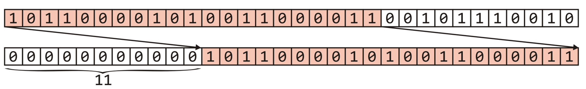

$(1 << m) – 1$过程：

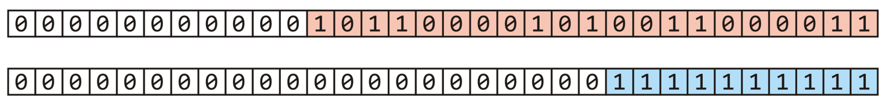

$(C*n) >> shift) \& ((1 << m) – 1$过程：

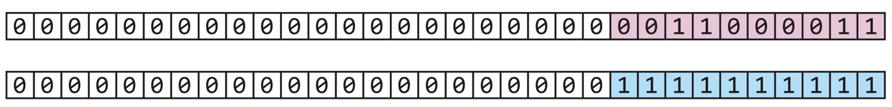

结果示意图：

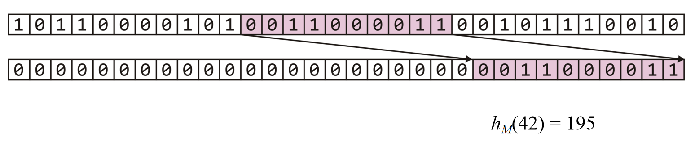

### Dealing with collisions

这里介绍两种处理哈希冲突的方法：Chained hash tables and Open addressing.

#### Chained hash tables

也被称为拉链法，open hashing。拉链法是在每个存放数据的地方开一个链表，如果有多个键值索引到同一个地方，只用把他们都放到那个位置的链表里就行了。查询的时候需要把对应位置的链表整个扫一遍，对其中的每个数据比较其键值与查询的键值是否一致。如果索引的范围是 ，哈希表的大小为 ，那么一次插入/查询需要进行期望$O(\frac{N}{M})$次比较。

> Reference: oi.wiki

**其中，$\lambda = \frac{N}{M}$定义为*load factor***。Load Factor is to describe the length of the linked lists and this is the average number of objects per bin。如果load factor很大，那么access times的时间复杂度将会增大到$O(\lambda)$。如果希望降低时间复杂度，可以使用平衡二叉树来储存linked list（assuming that we can order the objects），但是：The memory requirements are increased by $\Theta(n)$, as each node will require two pointers.

#### Open addressing

##### Linear

Chained hash tables 需要特殊的内存分配，能不能创建一个没有显著内存分配的哈希表呢？We can deal with collisions by storing collisions elsewhere by defining an implicit rule which tells us where to look next.

假如说，一个物体最后对应的数字是5，如果5地方没有object，那么这个object就会储存在5里面。如果又一个物体对应的是5呢？如果没有链表的话，它就不能储存在5里面了，那么这个时候：We need a rule to tells us where to look next, for example, look in the next bin to see if it is occupied.

但是这个规则必须非常快，而且很容易去follow，同时should be general enough to deal with the fact that the next cell could also be occupied, e.g., continue searching until the first empty bin is found. 当然，在搜索和删除的时候，也必须要遵守这一套规则。

There are numerous strategies for defining the order in which the bins should be searched，例如Linear probing线性探测，Quadratic probing二次探测，Double hashing双重散列，“Last come, first served”，Cuckoo hashing. 这里介绍其中的两种：线形探测和二次探测。

Linear probing: 假如说inserting an object into bin k, if k is empty, we occupy it, otherwise we check k+1, k+2, and so on, until an empty bin is found(If reaching the end of the array, we start at the front of the array). 插入insertion的过程很好理解，那么搜索的时候呢？首先查看appropriate bin，然后不断向前搜bin直到：要么item被找到，要么发现了空bin，要么遍历完了全部的数组。其中，第二种情况代表要查找的物体不在数组里面，第三种情况代表物体不在数组里面且数组是满的。

散列函数为：$h(k,i)=(h_1(k)+i)modm$

搜索不是一件麻烦的事情，但是删除erasing是。如果仅仅是找到了item然后删掉而不做任何事情的话，后果会很严重，因为rule规定，当初存物体的时候是遇到empty bin才能防止物体，而搜索的时候遇到hole代表这个物体不在数组里面。因此可见，删除绝对不仅仅是“删”那么简单。

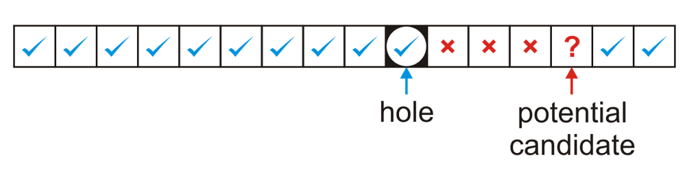

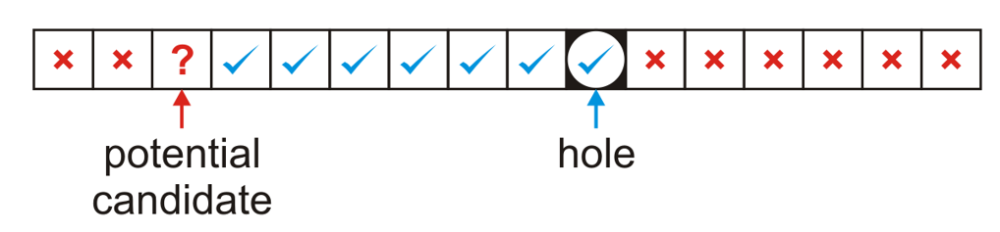

上面一共有两种情况，其中hole代表删除元素之后留下的空位，potential candidate这个位置大有讲究：hole和candidate中间的bin里面都有元素，***而且这些元素都could not have been copied into the hole***（i.e.，这些位置中的元素的哈希值所引索出来的位置就是这个位置）。因此有两种情况如上图：第一种是candidate是hole的后面，如果这个***candidate index对应的元素的哈希值***在蓝勾的位置中，那么就说明这个元素之所以储存在candidate这个位置，是因为在插入的时候，linear probing的过程中经过了hole和hole后面的一些不可能移动的元素。因此：we move the object at index only if its hash value is either equal to or less than the hole or greater than the index of the potential candidate。

反之就是第二种情况，如果candidate元素的哈希值是在蓝勾的位置，说明这个元素之所以位于candidate bin是因为linear probing且经过了hole，因此：In this case, we move the object at index only if its hash value is both greater than the index of the potential candidate and less than or equal to the hole. 

在这两种情况下，如果成功移动的话，candidate又会形成一个新的hole，***因此这个判断会递归进行***。

上面这种删除的方法貌似很好，但是实话来说还是很复杂，能不能用一种懒的方法？假如说删掉了一个地方的元素，然后标记它为ERASED，***在搜索的时候视它为occupied，插入的时候视它为unoccupied。***也就是说，可以在erased地方插入新元素。这种方法称为Lazy Erasing。

Run-time analysis：It is possible to estimate the average number of probes for a ***successful search***, where $\lambda$ is the load factor:
$$
\frac{1}{2}(1+\frac{1}{1-\lambda})
$$
The number of probes for an unsuccessful search or for an insertion is higher:
$$
\frac{1}{2}(1+\frac{1}{(1-\lambda)^2})
$$
我们的目标是希望所有的操作都是$\Theta(1)$，但是可惜的是随着lambda的增高，运行时间会上升。同时，线性探测有Primary clustering的现象，即储存的元素连成段，导致每一次插入都需要probe很多元素。因此：可以尝试Choose a different strategy than linear probing. 

##### Quadratic

二次探测Quadratic probing：这里的“二次，quadratic”的意思其实是二次方，代表着Probing的步长不是1，而是k×k。但是通常来说，采取的解决方案如下：

````c++
int initial = hash_M( x.hash(), M );
for ( int k = 0; k < M; ++k ) {
	bin = (initial + c1*k + c2*k*k) % M;
}
````

散列函数为：$h(k,i)=(h_1(k)+c_1i+c_2i^2)modm$。更具体地：

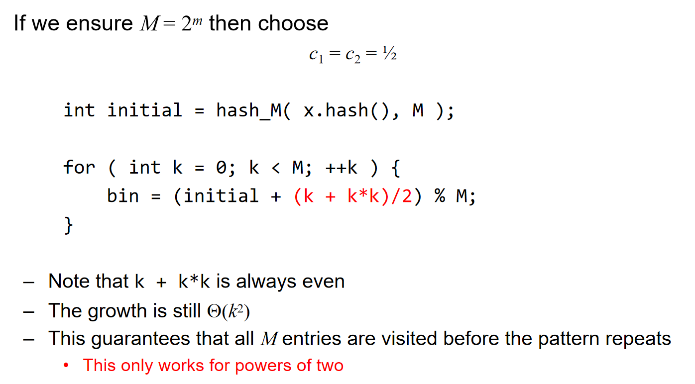

:warning:上面图片中最后一句话的结论，**只有*在M为2的多少次幂的时候，才能够成立***；否则，是**有可*能一个哈希函数无法遍历所有的元素！***

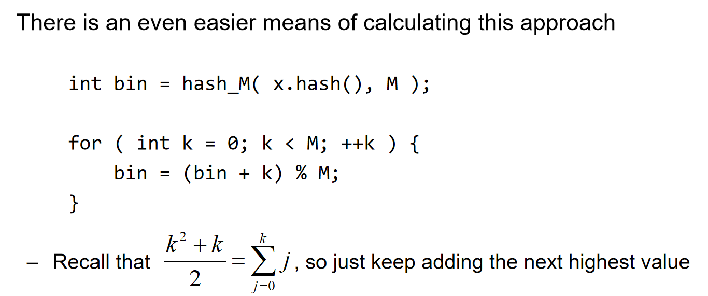

关于“This guarantees that all M entries are visited before the pattern repeats”的结论，证明如下（核心思想：证明任意两次的probing的hash value值都不一样，利用数论知识和$M=2^m$条件予以证明）：

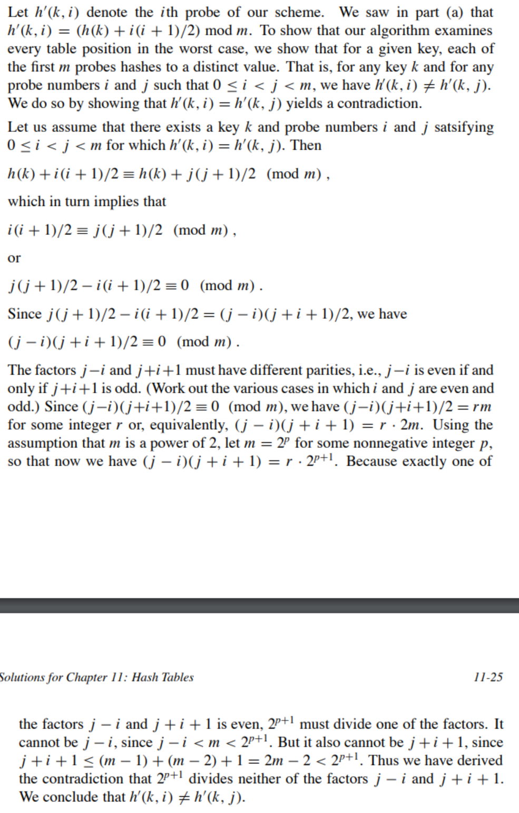

在这种probing策略下，runtime的评估如下：
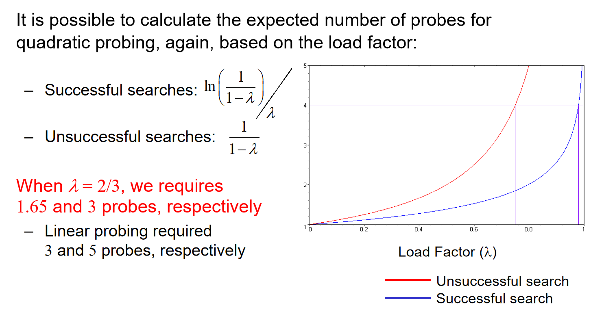

Linear和Quadratic两者的对比如下。可见在相同的load factor情况下，无论是successful还是unsuccessful search，二次探测所检查的bin数量比线性探测的少，说明是一个更优的策略。

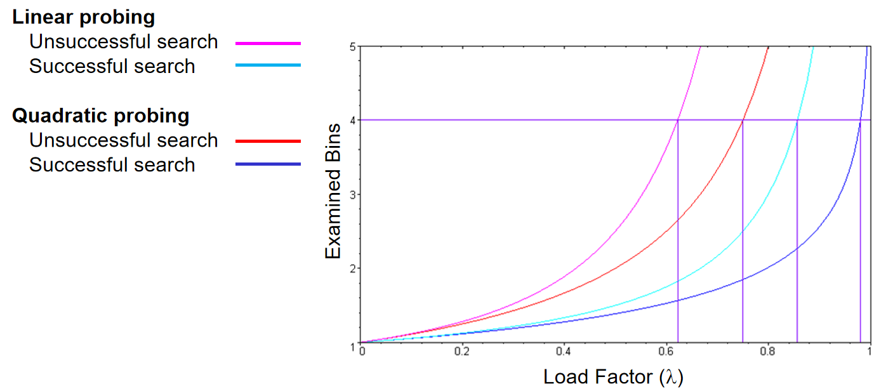

在这种情况下，clustering依然可能发生（Objects placed in the same bin will follow the same sequence）。但是已经是一个较好的策略了。

##### Double Hashing

Double hashing 是一种解决哈希冲突的开放地址法（open addressing method），通过使用两个哈希函数来减少冲突发生的概率。它的基本思想是在第一次哈希函数找到的位置发生冲突时，通过第二个哈希函数计算步长（增量），不断尝试新的位置，直到找到一个空闲的位置。

双重哈希的过程包括以下步骤：

1. **第一哈希函数** $h_1(x)$：用于将元素映射到哈希表中的一个初始位置。
2. **第二哈希函数**(secondary hashing function) $h_2(x)$：用于计算步长，即在发生冲突时从该位置跳转多少个位置。

散列函数为：$h(k,i)=(h_1(k)+ih_2(k))modm$。所以说：线性探测可以认为是第二哈希函数为1的double hashing，二次探测可以认为是第二哈希函数为$(c_1+c_2i)$的double hashing。

### Linear Probe下的哈希实现

使用``STATE_UNUSE; STATE_USING; STATE_DEL``三个参数来代表bin(bucket)的状态。

增加：通过哈希函数计算数据存放的地方：如果该位置空闲，那么直接储存元素，完成；而如果该位置被占用，从当前位置向后找空闲的位置，存放该元素。

查询：通过哈希函数计算数据存储的地方，从该位置取值，如果是元素值那么就查到了，如果不是，说明放在这个位置之前里面已经有元素了，发生了哈希冲突，因此需要往后面寻找元素。

删除：通过哈希函数计算数据存放的地方，从该位置取值，判断状态STATE_USING。如果是要删除的值，那么就当前位置修改为STATE_DEL；如果不是，那么说明之前发生了哈希冲突，从当前位置向后遍历，找到元素修改状态；如果遇到了STATE_UNUSE，结束！

````c++
// linear_probe_hash.cpp
#include <iostream>
using namespace std;

enum State{
    STATE_UNUSE, // 从未使用过的桶
    STATE_USING, // 正在使用的桶
    STATE_DEL, // 元素被删除了的桶
};

struct Bucket{
    Bucket(int key = 0, State state = STATE_UNUSE)
        : key_(key)
        , state_(state)
    {}
    int key_; // 存储的数据
    State state_; // 桶当前的状态
};

class HashTable{
public:
    HashTable(int size = primes_[0], double loadFactor = 0.75)
        : useBucketNum_(0)
        , loadFactor_(loadFactor)
        , primeIdx_(0)
    {
        // 用户传入的size调整到最近的比较大的素数上
        if (size != primes_[0]){
            for (; primeIdx_ < PRIME_SIZE; primeIdx_++){
                if (primes_[primeIdx_] > size){
                    break;
                }
            }
            // 用户传入的size值过大,已经超过最后一个素数,则调整到最后一个素数
            if (primeIdx_ == PRIME_SIZE){
                primeIdx_--;
            }
        }
        tableSize_ = primes_[primeIdx_];
        table_ = new Bucket[tableSize_];
    }

    ~HashTable(){
        delete[] table_;
        table_ = nullptr;
    }
public:
    // 插入元素
    bool insert(int key){
        // 考虑扩容
        double factor = useBucketNum_*1.0 / tableSize_; 
        // 两个int相除得到int, 但是其中一个可以通过*1.0变成浮点数
        cout << "factor: " << factor << endl;
        if (factor > loadFactor_){
            // 哈希表扩容
            expand();
        }
        // 此处的哈希函数
        int idx = key % tableSize_;
        if (table_[idx].state_ != STATE_USING){
            table_[idx].state_ = STATE_USING;
            table_[idx].key_ = key;
            useBucketNum_++;
            return true;
        }
        // Linear Probe
        for (int i = (idx+1) % tableSize_; i != idx; i = (i+1) % tableSize_){
            if (table_[i].state_ != STATE_USING){
                table_[i].state_ = STATE_USING;
                table_[i].key_ = key;
                useBucketNum_++;
                return true;
            }
        }
        return false;
    }

    // 删除元素
    bool erase(int key){
        int idx = key % tableSize_;
        int i = idx;
        do{
            if (table_[i].state_ == STATE_USING && table_[i].key_ == key){
                table_[i].state_ = STATE_DEL;
                useBucketNum_--;
            }
            i = (i + 1) % tableSize_;
        } while(table_[i].state_ != STATE_DEL && i != idx);
        return true;
    }

    // 查询 
    bool find(int key){
        int idx = key % tableSize_;
        int i = idx;
        do{
            if (table_[i].state_ == STATE_USING && table_[i].key_ == key){
                return true;
            }
            i = (i + 1) % tableSize_;
        } while(table_[i].state_ != STATE_UNUSE && i != idx);
        return false;
    }
private:
    void expand(){
        ++primeIdx_;
        if (primeIdx_ == PRIME_SIZE){
            throw "HashTable is too large! Can not expand anymore";
        }
        Bucket *newTable = new Bucket[primes_[primeIdx_]];
        for (int i = 0; i < tableSize_; i++){
            if (table_[i].state_ == STATE_USING){
                // 旧表有效的数据,重新哈希放在扩容后的新表
                int idx = table_[i].key_ % primes_[primeIdx_];
                int k = idx;
                // 放进新表的时候, 依然要考虑哈希冲突的问题!
                do{
                    if (newTable[k].state_ != STATE_USING){
                        newTable[k].state_ = STATE_USING;
                        newTable[k].key_ = table_[i].key_;
                        break;
                    }
                    k++;
                } while(k != idx);
            }
        }
        delete[] table_;
        table_ = newTable;
        tableSize_ = primes_[primeIdx_];
    }
private:
    Bucket *table_; // 指向动态开辟的哈希表
    int tableSize_; // 哈希表当前的长度
    int useBucketNum_; // 已经使用的桶的个数
    double loadFactor_; // 哈希表的装载因子
    static const int PRIME_SIZE = 10; // 素数表的大小
    static int primes_[PRIME_SIZE]; // 素数表
    int primeIdx_; // 当前使用的素数的下标
};

int HashTable::primes_[HashTable::PRIME_SIZE] = {3, 7, 23, 47, 97, 251, 443, 911, 1471, 42773};


int main(){
    HashTable htable;
    htable.insert(14);
    cout << htable.find(14) << endl;
    htable.insert(32);
    htable.insert(21);
    htable.insert(15);
    htable.insert(560);
    cout << htable.find(14) << endl;
    htable.erase(14);
    cout << htable.find(14) << endl;
}
````

### Linked list 下的哈希实现

这里元素插入链表采用的是头插法；注意如果在class内部调用algorithm的find方法的时候，前面要加上::，代表是在全局的find方法，而不是class内部自己的find方法；且这个类没必要写析构函数，因为里面的内存管理都是c++ STL设计好的链表和数组，它们会自动释放内存的。

````c++
// hash_linked_list.cpp
#include <iostream>
#include <vector>
#include <list>
#include <algorithm>
using namespace std;

class HashTable{
public:
    HashTable(int size = primes_[0], double loadFactor=0.75)
        : useBucketNum_(0)
        , loadFactor_(loadFactor)
        , primeIdx_(0)
    {
        if (size != primes_[0]){
            for (; primeIdx_ < PRIME_SIZE; primeIdx_++){
                if (primes_[primeIdx_] > size){
                    break;
                }
            }
            // 用户传入的size值过大,已经超过最后一个素数,则调整到最后一个素数
            if (primeIdx_ == PRIME_SIZE){
                primeIdx_--;
            }
        }
        table_.resize(primes_[primeIdx_]);
    }
public:
    // 增加元素 且不能重复插入
    void insert(int key){
        // 判断是否扩容
        double factor = useBucketNum_ * 1.0 / table_.size();
        cout << "factor:" << factor << endl;
        if (factor > loadFactor_){
            expand();
        }
        // 通过哈希函数得到idx
        int idx = key % table_.size();
        if (table_[idx].empty()){
            useBucketNum_++;
            table_[idx].emplace_front(key);
        }
        else{
            // 使用全局的::find泛型算法,而不是调用自己的成员方法find
            auto it = ::find(table_[idx].begin(), table_[idx].end(), key);
            if (it == table_[idx].end()){
                // 说明没找到,可以插入
                table_[idx].emplace_front(key);
            } else{
                cout << "This key has been inserted in the hash table!" << endl;
            }
        }
    }
    void erase(int key){
        int idx = key % table_.size();
        auto it = ::find(table_[idx].begin(), table_[idx].end(), key);
        if (it != table_[idx].end()){
            table_[idx].erase(it);
            if (table_[idx].empty()){
                useBucketNum_--;
            }
        }
    }
    bool find(int key){
        int idx = key % table_.size();
        auto it = ::find(table_[idx].begin(), table_[idx].end(), key);
        return it != table_[idx].end();
    }
private:
    void expand(){
        if (primeIdx_ + 1 == PRIME_SIZE){
            throw "HashTable is too large! Can not expand anymore";
        }
        primeIdx_++;
        vector<list<int>> oldTable;
        // swap仅仅是叫交换了两个容器的成员变量,因此这里swap其实是很高效的
        table_.swap(oldTable);
        table_.resize(primes_[primeIdx_]);
        for (auto list : oldTable){
            for (auto key : list){
                int idx = key % table_.size();
                if (table_[idx].empty()){
                    useBucketNum_++;
                }
                table_[idx].emplace_front(key);
            }
        }
    }
private:
    vector<list<int>> table_; //哈希表的数据结构
    int useBucketNum_; // 记录桶的个数
    double loadFactor_; // 哈希表装载因子
    static const int PRIME_SIZE = 10; // 素数表的大小
    static int primes_[PRIME_SIZE]; // 素数表
    int primeIdx_; // 当前使用的素数的下标
};

int HashTable::primes_[HashTable::PRIME_SIZE] = {3, 7, 23, 47, 97, 251, 443, 911, 1471, 42773};

int main(){
    HashTable htable;
    htable.insert(14);
    cout << htable.find(14) << endl;
    htable.insert(32);
    htable.insert(21);
    htable.insert(15);
    htable.insert(560);
    cout << htable.find(14) << endl;
    htable.erase(14);
    cout << htable.find(14) << endl;
}
````

### STL实现

> Reference: https://chatgpt.com

在 C++ 中，哈希表的 STL 实现是通过 **`unordered_map`**这个容器类来实现的。在 C++ 中，`unordered_map` 是常用的无序关联容器，属于 C++ 标准库中的哈希表容器。它于存储键值对（`unordered_map`）。两者都基于哈希表实现，因此具有 **常数时间复杂度** 的查找、插入和删除操作。下面详细介绍它们的初始化和常用方法。

#### unordered_map

`unordered_map` 是一个键值对的哈希表容器，其中每个元素由一个 **键** 和一个 **值** 组成。键是唯一的，值可以重复。

````c++
#include <iostream>
#include <unordered_map>
// about initialization
void demo_initialize() {
    // 初始化的时候在template里面声明类型
    // 1. 默认初始化
    std::unordered_map<int, std::string> map1;
    // 2. 列表初始化
    std::unordered_map<int, std::string> map2 = {
        {1, "apple"},
        {2, "banana"},
        {3, "cherry"}
    };
    // 3. 拷贝初始化
    std::unordered_map<int, std::string> map3(map2);
    // 4. 使用指定的哈希函数和比较函数（自定义函数较少用到）
    std::unordered_map<int, std::string> map4(10 /* bucket_count */, std::hash<int>(), std::equal_to<int>());
}

int main() {
    std::unordered_map<int, std::string> map = {
        {1, "apple"},
        {2, "banana"},
        {3, "cherry"}
    };

    // 插入键值对
    map.insert({4, "date"});
    map[5] = "elderberry";  // 另一种插入方式，如果键5已存在，更新值

    // 查找元素，其中下面的条件判断是经典！
    if (map.find(2) != map.end()) {
        std::cout << "Key 2 found, value: " << map[2] << std::endl;
    } else {
        std::cout << "Key 2 not found" << std::endl;
    }

    // 访问元素
    std::cout << "Key 1's value: " << map.at(1) << std::endl;  // map.at() 访问元素
    std::cout << "Key 3's value: " << map[3] << std::endl;     // [] 运算符访问

    // 删除元素
    map.erase(2);  // 根据键删除元素
    std::cout << "After erasing key 2, map size: " << map.size() << std::endl;

    // 遍历 map
    for (const auto& pair : map) {
        std::cout << pair.first << ": " << pair.second << std::endl;
    }

    return 0;
}
````

**`insert()`**：插入一个键值对，插入时不会覆盖已有键的值。

**`[]`（下标运算符）**：既可用于访问值，也可用于插入新键值对。如果键不存在，会默认插入一个值初始化的元素。

**`find()`**：返回一个迭代器指向某个键，如果不存在则返回 `end()` 迭代器。

**`at()`**：访问某个键对应的值，如果键不存在会抛出异常。

**`erase()`**：删除键对应的元素。

**`size()`**：返回哈希表中的元素个数。

**`empty()`**：判断容器是否为空。

#### 例：最长子串的长度

给定一个字符串 s ，请你找出其中不含有重复字符的最长子串的长度。

````bash
输入: s = "abcabcbb"
输出: 3 
解释: 因为无重复字符的最长子串是 "abc"，所以其长度为 3。
````

````c++
#include <iostream>
#include <unordered_map>
#include <string>
using namespace std;

int lengthOfLongestSubstring(string s) {
    unordered_map<char, int> charIndexMap;  // 哈希表，记录字符和它们的下标
    int maxLength = 0;  // 记录最长子串长度
    int left = 0;  // 滑动窗口的左边界
    
    // 遍历字符串，right 是滑动窗口的右边界
    for (int right = 0; right < s.size(); ++right) {
        char currentChar = s[right];
        
        // 如果当前字符在哈希表中，并且它的下标大于等于left，更新left指针
        if (charIndexMap.find(currentChar) != charIndexMap.end() && charIndexMap[currentChar] >= left) {
            left = charIndexMap[currentChar] + 1;  // 左边界右移，跳过重复字符
        }

        // 更新当前字符的下标
        charIndexMap[currentChar] = right;

        // 计算窗口长度并更新最大长度
        maxLength = max(maxLength, right - left + 1);
    }

    return maxLength;
}
````

原本在滑动窗口引入一个新的元素之后，可能需要遍历当前子串以判断新来的元素是否在先前出现过。但是现在能够储存<char, int>即<字符，下标>的信息，那么在新元素进来的时候，可以以它为键查看这个元素是否出现过并且如果出现过能够返回上一个该字符的下标，方便滑动窗口left边界的调整。

## 树

### Tree Structure & Terminology

A rooted tree data structure stores information in nodes. 最顶上的第一个节点，被称为root（根）；而每一个节点都有几个successors（继承者）；*而每一个节点，除了根节点，都会被至少一个节点指向*！在树的结构中，有很多术语Terminology，绝大部分在离散数学中有所覆盖，这里再次回顾：

1. 子节点：All nodes will have zero or more child nodes or children.
2. 父节点：For all nodes other than the root node, there is one parent node
3. deg/度：一个节点的度（degree）是它子节点的数量
4. siblings/兄弟节点：对于两个节点来说，如果它们有共同的父节点，那么称为兄弟节点（siblings）
5. leaf nodes/叶子节点：度为0的节点称为叶子结点（leaf node）
6. Internal/内部节点：除了叶子结点的所有节点都是内部节点（internal node）
7. ordered tree/有序树：有序树是一种树形结构，其中每个节点的子节点都按照特定的顺序排列。这种顺序通常对树的操作和算法有影响
8. unordered tree/无序树：无序树是一种树形结构，其中节点的子节点没有特定的顺序。这意味着子节点可以以任何顺序添加或排列，不像有序树那样有明确的顺序要求
9. path/路径：A path is a sequence of edges between nodes. The length of this path is number of edges in the path. ***For each node in a tree, there exists a unique path from the root node to that node***
10. depth/深度：The length of this path is the depth of the node
11. height/高度：The height of a tree is defined as the maximum depth of any node within the tree. ***The height of a tree with one node is 0***. For convenience, we define the height of the empty tree to be  –1
12. ancestor/祖先节点：any node y on the (unique) path from root r to node n is an ancestor of node n. 
13. descendent/后代节点：any node y for which n is an ancestor of y. 

> ***Thus, a node is both an ancestor and a descendant of itself.***
>
> We can add the adjective strict to exclude equality: a is a strict descendant of b if a is a descendant of b but a ≠ b
>
> The root node is an ancestor of all nodes

14. A recursive definition of a tree: A degree-0 node is a tree and a node with degree n is a tree if it has n children and all of its children are disjoint trees (i.e., with no intersecting nodes)
15. ***subtree：Given any node $a$ within a tree, the collection of $a$ and all of its descendants is said to be a subtree of the tree with root $a$.***

值得注意的是这个子树的定义一定不能理解错了！***是全部的descendants！***

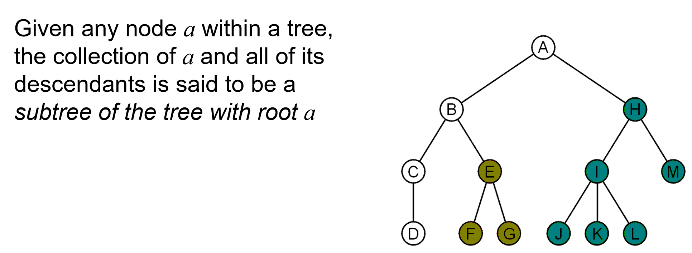

补充：一个含有n个节点的树，它的ordered binary tree一共有$\frac{2n!}{(n+1)!n!}$种，而这就是大名鼎鼎的***卡特兰数***。

### Implementation

类似于之前的关于数据结构的介绍，首先我们要了解树支持我们使用什么操作，如插入，删除，寻找之类。Operations on a tree include:

- Accessing the root
- Access the parent of the current object
- Find the degree of the current object
- Get a reference to a child
- Attach a new sub-tree to the current object
- Detach this tree from its parent

We can implement a general tree by using a class which stores an element and stores the children in a list.

大体上，树的程序设计接口如下图所示：

````c++
class Simple_tree {
    private:
        Type element;
        Simple_tree *parent_node;
        Single_list<Simple_tree *> children;
 
    public:
        Simple_tree( Type const & = Type(), Simple_tree * = nullptr );
 
        Type retrieve() const;
        Simple_tree *parent() const;
        int degree() const;
        bool is_root() const;
        bool is_leaf() const;
        Simple_tree *child( int n ) const;
        int height() const;

        void insert( Type const & );
        void attach( Simple_tree * );
        void detach();
};
````

举一个例子，如下图，一个含有六个节点的树可以用如下的树结构表示。利用node类的地址域来搭建边，而叶子结点的地址域是空指针。

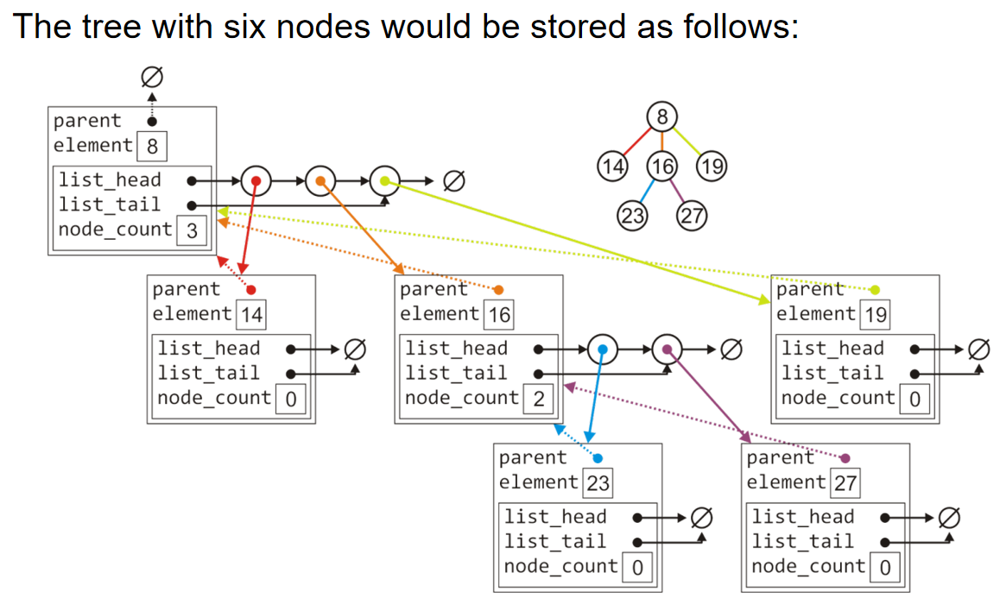

一个经典的implementation如下：

````c++
#include <iostream>
#include <stdexcept>
#include <vector>

// 假设我们有一个模板类 Single_list 来存储子节点
template <typename T>
class Single_list {
private:
    std::vector<T> list;

public:
    void insert(T const &item) {
        list.push_back(item);
    }

    // 非 const 版本的 operator[]
    T& operator[](int index) {
        if (index < 0 || index >= list.size()) {
            throw std::out_of_range("Index out of range");
        }
        return list[index];
    }

    // const 版本的 operator[]，保证不修改成员变量
    const T& operator[](int index) const {
        if (index < 0) {
            throw std::out_of_range("Index cannot be negative");
        }
        // 将 index 转换为 std::size_t 以避免符号不匹配的比较
        if (static_cast<std::size_t>(index) >= list.size()) {
            throw std::out_of_range("Index out of range");
        }
        return list[index];
    }

    int size() const {
        return list.size();
    }
    
    void clear() {
        list.clear();
    }
};


template <typename Type>
class Simple_tree {
private:
    Type element;
    Simple_tree *parent_node;
    Single_list<Simple_tree *> children;

public:
    Simple_tree(Type const &elem = Type(), Simple_tree *parent = nullptr)
        : element(elem), parent_node(parent) {}

    // 返回当前节点的元素
    Type retrieve() const {
        return element;
    }

    // 返回父节点的指针
    Simple_tree *parent() const {
        return parent_node;
    }

    // 返回当前节点的子节点数量
    int degree() const {
        return children.size();
    }

    // 判断当前节点是否为根节点
    bool is_root() const {
        return parent_node == nullptr;
    }

    // 判断当前节点是否为叶节点
    bool is_leaf() const {
        return children.size() == 0;
    }

    // 返回第n个子节点的指针
    Simple_tree *child(int n) const {
        if (n < 0 || n >= children.size()) {
            throw std::out_of_range("Invalid child index");
        }
        return children[n];
    }

    // 计算树的高度
    int height() const {
        if (is_leaf()) {
            return 0;
        }
        int max_child_height = 0;
        for (int i = 0; i < children.size(); ++i) {
            max_child_height = std::max(max_child_height, children[i]->height());
        }
        return 1 + max_child_height;
    }

    // 插入一个新节点
    void insert(Type const &elem) {
        Simple_tree *new_child = new Simple_tree(elem, this);
        children.insert(new_child);
    }

    // 添加已经存在的子树为当前节点的子节点
    void attach(Simple_tree *child_tree) {
        if (child_tree == nullptr) {
            throw std::invalid_argument("Cannot attach a null tree");
        }

        // 如果该子树已经有父节点，则先从其原父节点分离
        if (child_tree->parent() != nullptr) {
            child_tree->detach();
        }

        // 将当前树作为子树的父节点
        child_tree->parent_node = this;
        children.insert(child_tree);
    }

    // 从父节点分离自己（detach）
    void detach() {
        if (parent_node != nullptr) {
            for (int i = 0; i < parent_node->children.size(); ++i) {
                if (parent_node->children[i] == this) {
                    parent_node->children[i] = parent_node->children[parent_node->children.size() - 1];
                    parent_node->children.size()--;
                    break;
                }
            }
        }
        parent_node = nullptr;
    }

    int size() const {
    // 当前节点的大小至少为1
    int total_size = 1; 

    // 遍历所有子节点，递归计算子树大小
    for (int i = 0; i < children.size(); ++i) {
        total_size += children[i]->size();  // 递归调用子节点的 size()
    }

    return total_size;
}
};

int main() {
    // 示例用法
    Simple_tree<int> root(10);
    root.insert(20);
    root.insert(30);

    Simple_tree<int> *child1 = root.child(0);
    Simple_tree<int> *child2 = root.child(1);

    std::cout << "Root: " << root.retrieve() << std::endl;
    std::cout << "Child 1: " << child1->retrieve() << std::endl;
    std::cout << "Child 2: " << child2->retrieve() << std::endl;
    std::cout << "Root height: " << root.height() << std::endl;
    std::cout << "Size: " << root.size() << std::endl;
    return 0;
}
````

特别地，当detach的时候，如果已经是要分离的是根节点，那么什么都不做；而否则，把这个对象从父节点的子节点列表删除掉，并把父节点的地址域置为NULL。

当计算树的size的时候，如果没有任何子节点，那么size就是1；否则遍历所有的children节点并递归式地调用size方法，求总size。

计算树的height的时候，如果没有子节点，高度就是0；否则高度就是1+任何子树的高度的最大值

### Tree Traversals

离散数学中已有介绍：树的搜索有两种，广度优先和深度优先。

广度优先遍历（Breadth-first traversals）会在下移至下一层之前访问给定深度的所有节点。***最简单的实现方式是利用队列（queue）：***

- Place the root node into a queue
- While the queue is not empty: ***Pop the node at the front of the queue and Push all of its children into the queue***

对于广度优先来说，运行时间是$\Theta(n)$，而需要的空间是$\Theta(n)$（ maximum nodes at a given depth）

深度优先遍历（Depth-first Traversal）是一种用于遍历树的回溯算法。在任何节点，前往尚未访问的第一个子节点；

如果我们已经访问了所有子节点（其中叶子节点是一个特殊情况），则回溯到父节点并重复此过程。 我们一旦访问了根节点的所有子节点，遍历就结束了。示例如下图：

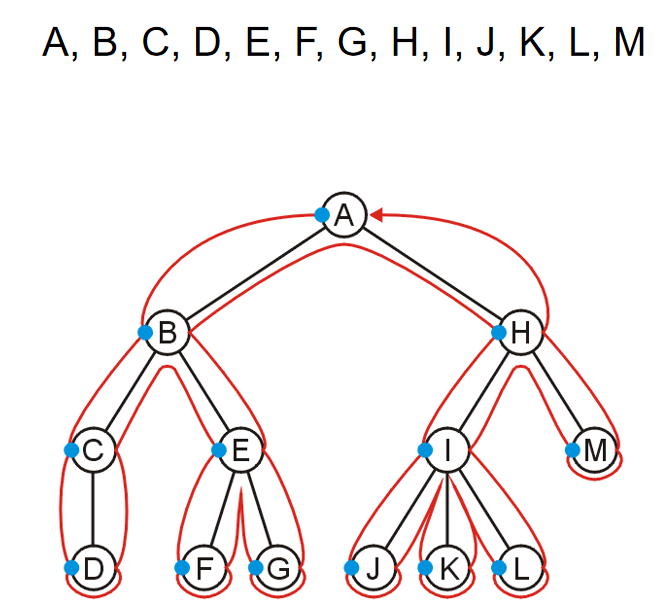

***而实现深度优先，可以使用栈stack***。Create a stack and push the root node onto the stack。While the stack is not empty: Pop the top node and Push all of the children of that node to the top of the stack ***in reverse order***. 

栈方法实现的深度优先算法，运行时间是$\Theta(n)$，而内存需求：If each node has a maximum of two children, the memory required is $\Theta(h)$:  the height of the tree.

> The objects on the stack are all unvisited siblings from the root to the current node

关于深度优先的总结如下：

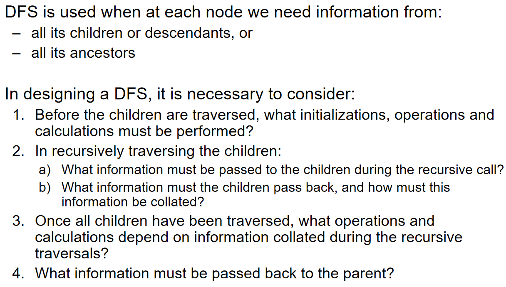

### Monte Carlo Tree Search

#### In a nut shell

> Reference: ChatGPT o4 model

Monte Carlo Tree Search（蒙特卡罗树搜索）是一种基于 **随机模拟** 和 **树结构搜索** 的算法。它用于解决具有不确定性或复杂性的问题，通过在可能的决策空间中进行模拟来评估选择的效果。

MCTS 的基本思路是通过构建一棵搜索树来探索决策空间，并基于模拟的结果来引导搜索。它逐步扩展树的节点，并通过随机采样（即蒙特卡罗方法）评估每个节点的潜在价值。

MCTS 主要包括四个核心步骤：

1. **选择（Selection）**
2. **扩展（Expansion）**
3. **模拟（Simulation）**
4. **反向传播（Backpropagation）**

每个步骤都有特定的角色，且会反复进行，直到达到设定的时间限制或计算资源限制。

1. 选择（Selection）

在树中，从根节点开始，根据某种选择策略（如基于已知信息的启发式算法），选择一个节点进行扩展。通常会选择那些具有较高探索价值的节点。

常用的选择策略是 **UCB1 (Upper Confidence Bound for Trees)**，它平衡了探索新路径和利用已有知识之间的关系： $UCB1 = \overline{X_i} + C \sqrt{\frac{\ln N}{n_i}}$

- $\overline{X_i}$是节点的平均获胜率。
- $N$是父节点的访问次数。
- $n_i$ 是该节点的访问次数。
- $C$ 是平衡探索和利用的常数。

2. 扩展（Expansion）

一旦选择到了需要扩展的节点，如果该节点还没有所有的可能后续动作作为子节点，则可以扩展一个或多个子节点。每个子节点代表当前决策点后的某个可能状态。

3. 模拟（Simulation）

在扩展的节点上进行一次或多次模拟，随机在该节点之后的状态中进行一系列行动，直到到达游戏的结束状态或设定的深度。这种模拟通常是随机的，也可以根据某些启发式规则进行。

- 模拟的结果可以是 **胜利、失败** 或 **平局** 等终结状态。

4. 反向传播（Backpropagation）

在模拟结束后，将模拟结果（如胜利、失败）沿着从新扩展的节点到根节点的路径反向传播，更新经过路径上所有节点的统计信息（如获胜次数、访问次数等），以便后续搜索时可以更好地引导决策。

优点与缺点

优点：

1. **无需大量手工设计的评估函数**：MCTS 通过随机模拟和搜索树自动评估局面，不需要像传统游戏AI那样手动设计评估函数。
2. **渐进最优**：随着模拟次数的增加，MCTS 的决策效果会越来越好，理论上可以达到最优解。
3. **适用于不完全信息问题**：MCTS 也可以处理那些不完全信息或有随机性的决策问题。
4. **探索与利用的平衡**：通过像 UCB1 这样的选择策略，MCTS 既能探索新的可能决策路径，又能利用当前已有的信息。

缺点：

1. **计算量较大**：MCTS 依赖于大量的模拟，因此在计算资源不足或时间紧张的情况下，效果可能不佳。
2. **模拟质量依赖于策略**：如果模拟策略过于随机，可能导致模拟效果不准确，从而影响整体算法性能。

应用领域：MCTS 已广泛应用于各种领域，尤其是在 **游戏AI** 和 **规划问题** 中。它最著名的应用是在 **围棋** 中，比如谷歌的 AlphaGo 使用了基于 MCTS 的搜索算法。此外，MCTS 也被用于机器人控制、自动规划、数据挖掘等多个领域。

#### Elaboration

假设在一个游戏过程建模中，我们把所有的可能的按照顺序发生的情况都用树的结构存储下来，这颗树就叫做game tree。假设玩tic-tac-toe，那么我们按照第一步下在哪里，之后我们就能模拟出一系列的可能场景。更特殊地，我们可以认为，节点就是一种状态，而节点之间的连线就是代表进行了一种操作。我们对数进行深度优先搜索，然后尝试找到最好的操作系列。

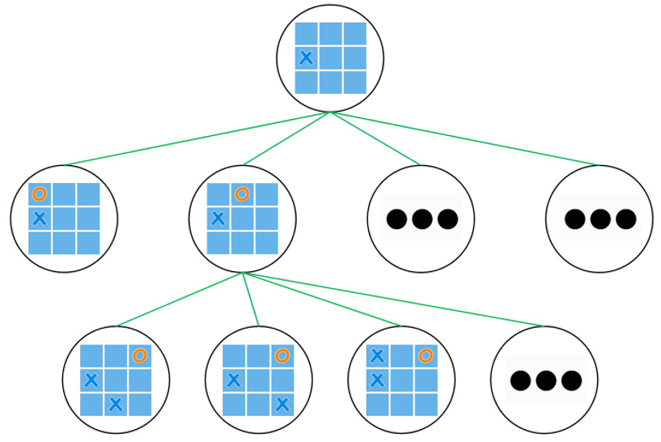

对于这样一个游戏的game tree来说，节点的数量是$O(n!)$，n很大的时候瞬间爆炸。所以说：DFS is infeasible to search all (leaf) nodes for the game tree in a limited time and computation budget. 那么如何缩减game tree的搜索空间呢？那么蒙特卡洛树搜索应运而生（MCTS）。Selection, Expansion, Simulation, BackPropagation如上文所述。

我们想要找到好的action，那么什么样的action可能称为好的action呢？An action with high winning rate according to the history；An action rarely searched。We need to balance Exploration and Exploitation! A well-known exploration policy is Upper Confidence Bound (UCB). 

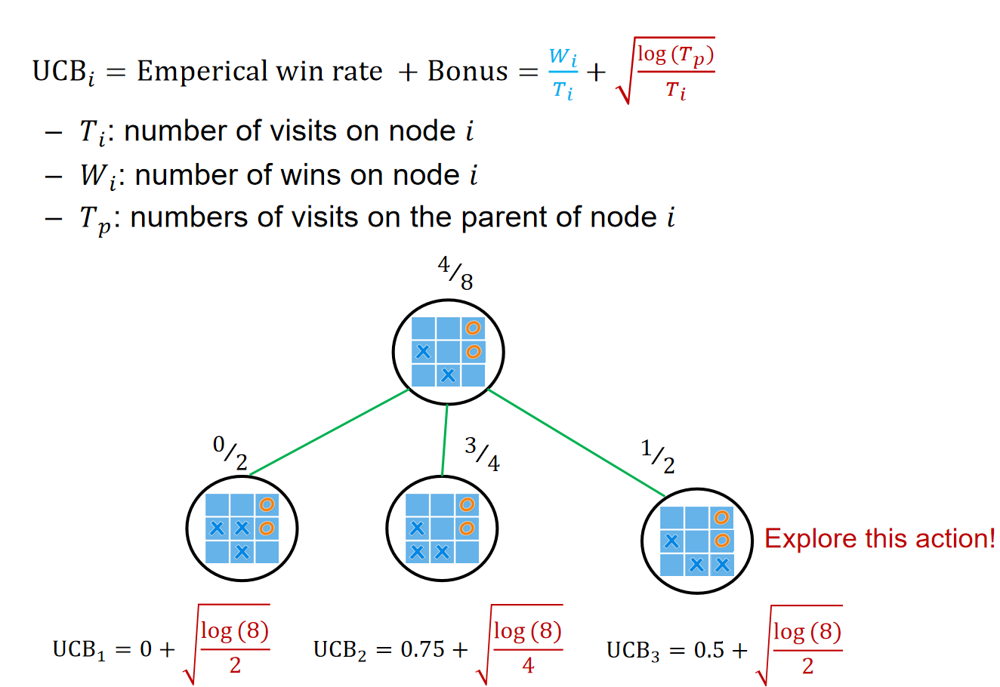

Selection过程中，一直用UCB策略访问节点，直到访问叶子结点。然后以该叶子结点为根，创建数个孩子节点，扩建树；然后模拟随机的action，最后根据结果进行反向传播，每一个叶子结点到根节点上的数据的分子分母都+1。

### Forest

A rooted forest is a data structure that is a collection of disjoint rooted trees. 

Note that:

- Any tree can be converted into a forest by removing the root node

- Any forest can be converted into a tree by adding a root node that has the roots of all the trees in the forest as children

Traversals on forests can be achieved by treating the roots as children of a notional root. 如下图所示：

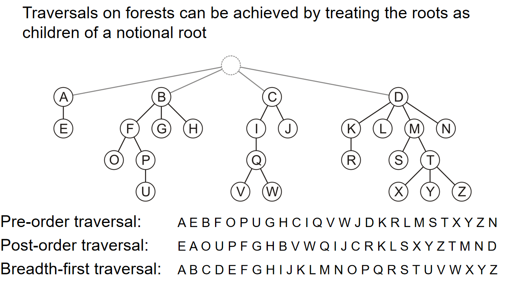

### Traversal Order

#### Definition and Methodology

> Reference: kimi.moonshot.cn

当然可以。树的遍历是指按照某种顺序访问树中的每个节点，确保每个节点都被访问一次。树的三种主要遍历方式是前序遍历（Pre-order Traversal）、中序遍历（In-order Traversal）和后序遍历（Post-order Traversal）。这些遍历方式通常用于二叉树，但也可以应用于任何树结构。下面我将详细介绍这三种遍历方式：

1. **前序遍历（Pre-order Traversal）**：
   - **访问顺序**：根节点 -> 左子树 -> 右子树
   - **过程**：首先访问根节点，然后递归地对左子树进行前序遍历，最后递归地对右子树进行前序遍历。
   - **应用**：前序遍历常用于创建树的副本、打印树结构等。
2. **中序遍历（In-order Traversal）**：
   - **访问顺序**：左子树 -> 根节点 -> 右子树
   - **过程**：首先递归地对左子树进行中序遍历，然后访问根节点，最后递归地对右子树进行中序遍历。
   - **特点**：对于二叉搜索树，中序遍历可以得到一个有序的节点序列。
   - **应用**：中序遍历常用于二叉搜索树的有序遍历。
3. **后序遍历（Post-order Traversal）**：
   - **访问顺序**：左子树 -> 右子树 -> 根节点
   - **过程**：首先递归地对左子树进行后序遍历，然后递归地对右子树进行后序遍历，最后访问根节点。
   - **特点**：后序遍历可以用于删除树，因为它会先访问子节点，最后访问根节点，确保在删除节点时不会丢失对子树的引用。
   - **应用**：后序遍历常用于删除树、计算表达式的值等。

通过上述的定义，能够很容易认同下面的结论：

1. 前序的第一个是 `root`，后序的最后一个是 `root`。
2. 先确定根节点，然后根据中序遍历，在根左边的为左子树，根右边的为右子树。
3. 对于每一个子树可以看成一个全新的树，仍然遵循上面的规律。

> Reference: oi.wiki

#### Using Traversal to Determine Tree

> Reference: [1] https://zhuanlan.zhihu.com/p/668057634
>
> [2] https://blog.csdn.net/qq_37437983/article/details/79613947
>
> [3] oi.wiki
>
> [4] https://www.cnblogs.com/lanhaicode/p/10390147.html

假定已知遍历结果，能否确定二叉树结构？先说结论[1]：

| 已知序列  | 能否确定 |
| --------- | -------- |
| 先序+中序 | 一定可以 |
| 中序+后序 | 一定可以 |
| 先序+后序 | 不一定   |

##### 先序+后序

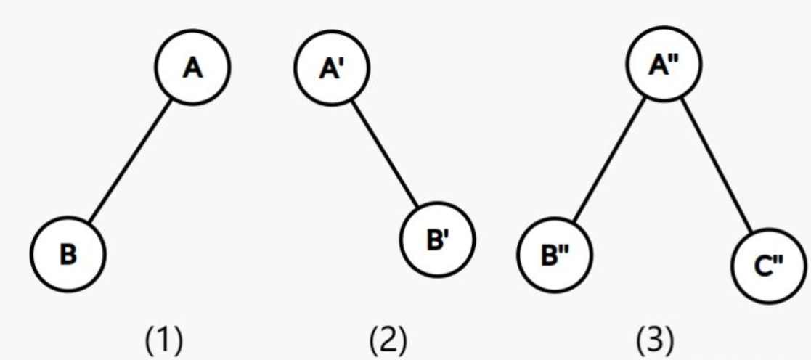

既然先序遍历和后序遍历的结果无法决定原二叉树，那么反例就是上图。1，2图的先序遍历都是AB，后续遍历都是BA，说明同一个结果可以对应出两种树，因此先序+后续无法决定树。

那么变态的出题人就可以出这个问题：[2]

***输入描述*** Input Description：输入文件共2行，第一行表示该树的前序遍历结果，第二行表示该树的后序遍历结果。输入的字符集合为{a-z}，长度不超过26。***输出描述*** Output Description：输出文件只包含一个不超过长整型的整数，表示可能的中序遍历序列的总数。

我们知道：前序遍历：根结点 ---> 左子树 ---> 右子树；中序遍历：左子树---> 根结点 ---> 右子树；后序遍历：左子树 ---> 右子树 ---> 根结点。由以上的前中后遍历顺序可以看出在已知前序遍历和后序遍历的情况下，中序遍历不是唯一确定的。***而且中序遍历的不确定性是由一个节点（只有一边子树）的左右子树的不确定性决定的***。所以当这种节点有n个时，中序遍历的可能性就有:2^n。

那么问题就转变为如果确定这种节点的数量。可以总结出一个规律，如上例。前序遍历为ab，后序遍历为ba，此时无法确定b是为左子树还是右子树，那么就产生了一个特殊节点。所以规律就是(此时a,b分别为前序遍历和后序遍历的字符串)：***a[i]==b[j]时，a[i+1]==b[j-1]***则产生一个特殊节点。（*其中a字符串代表前序遍历，b字符代表后序遍历*）

##### 前序+中序

首先要明确：前序遍历的第一个元素是二叉树的根节点；中序遍历中根节点的左边的元素是左子树，右边的是右子树；后序遍历得到最后一个元素是二叉树的根节点。

关于上述的结论，下面这张图[3]生动地进行了展现：
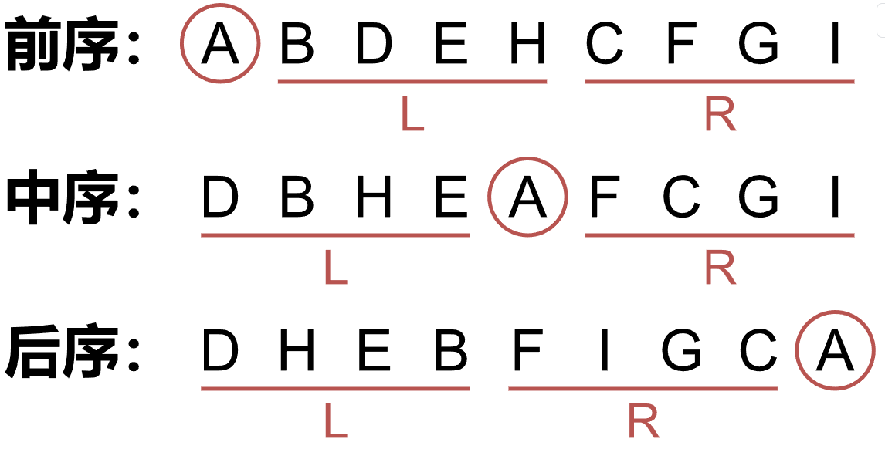

大致流程如下（部分思路借鉴[4]）：

第一步：看前序遍历的第一个节点，它就是根节点

第二步：找到中序遍历中的根节点的位置。确定左子树和右子树里面有哪些节点

第三步：此时***不能***利用中序遍历的特点得出左子树的样子，而是应该使用前序遍历的条件，找出左子树的根节点（就是前序遍历的第二个节点），然后就能知道对于左子树来说，根节点是谁，以及左右都有哪些元素。

第四步：把前序遍历结果中左子树和根节点结果遮住不看，剩下的第一个元素就是右子树的根节点，然后知道了这个根节点之后，结合中序遍历的结果就能知道右子树的左右子树都有什么元素了

第五步：如此重复下去，就能知道最终的结果了。

##### 后序+中序

后序遍历的最后一个元素是根节点。思路和上一个十分的类似（部分思路借鉴[4]）：

第一步：看后序遍历的最后一个节点，它就是根节点

第二步：找到中序遍历中的根节点的位置，确定左子树和右子树里面有哪些节点

第三步：此时***不能***通过中序遍历的特点得到右子树的样子。后序遍历的倒数第二个节点是右子树的根节点，然后再中序遍历的右子树内的节点元素中找到根节点，就能确定右子树的左右子树了。

第四步：在后序遍历中遮住根节点和右子树的元素，那么剩下的序列中的倒数第一个就是左子树的根节点了。在中序遍历中的左子树元素序列中找到左子树的根节点，那么就能知道左子树的左右子树里面的元素有哪些了。

第五步：重复上述的步骤，就能得到最终的结果。

### Tree and Full Binary Tree

二叉树的定义是什么：二叉树其实是一种限制restriction，限制每一个节点最多有两个孩子；同时我们定义，***a full node***是左右子树***都不是***空树的节点。那么显而易见地：

1. Each child is either empty or another binary tree  
2. This restriction allows us to label the children as left and right subtrees

以及关于***full node***定义的示意图如下；同时相对地，我们把能够插入叶子节点的节点称为***empty node***

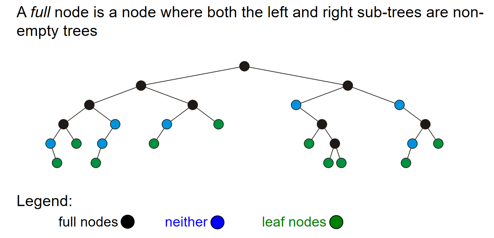

一个***full binary tree***（完整二叉树）是每个节点***要么是满节点（左右子树均非空），要么是叶子节点的二叉树。***

> 注意！一个完整二叉树如果有n个非叶子节点，那么这个完整二叉树一共有2n+1个节点

> A binary tree is a full binary tree if and only if every node has an odd number of descendants. (True! Because the descendants include the node itself! )

而在二叉树上的一些操作的时间复杂度的总结如下图：

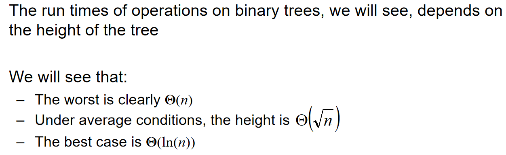

二叉树的经典应用就是Expression Tree了。一个表达式，可以利用二叉树来表示，然后需要的得到表达式的时候，遍历一遍二叉树就可以了。例子如下：值得注意的是，***中序遍历即可得到表达式，而后序遍历能够得到逆波兰表达式***：

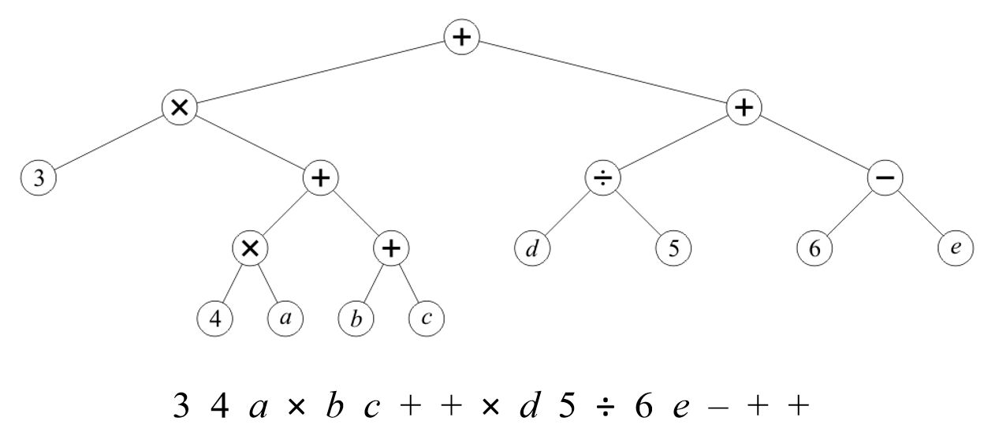

### Perfect Binary Tree

上一节介绍了完整二叉树，此处介绍*完美二叉树*（又称*满二叉树*）。所有叶结点的深度均相同，且所有非叶节点的子节点数量均为 2 的二叉树称为完美二叉树。关于完美二叉树有如下的定律：

- A perfect binary tree of height $h$ has $2^{h + 1} – 1$ nodes
- A perfect binary tree with n nodes has height $lg(n + 1) – 1$
- The height is $\Theta(ln(n))$
- There are $2^h$ leaf nodes
- The average depth of a node is $\Theta(ln(n))$

其中值得补充证明的是第五条，其证明过程如下：

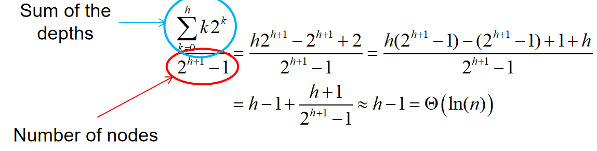

完美二叉树被认为是十分理想的情况，因为深度和平均深度都是$\Theta(ln(n))$。但是这终究是理想的情况，因此我们很是希望尽可能找到接近完美二叉树的二叉树。

### Complete Binary Tree

**完全二叉树（complete binary tree）**：只有最下面两层结点的度数可以小于 2，且最下面一层的结点都集中在该层最左边的连续位置上。那么有一个容易遗忘的点：如果要计算完全二叉树的叶节点，那么除了完全二叉树的最后一层有叶节点，倒数第二层其实也有可能由叶节点！（倒数第二层没有挂上孩子的节点，注意可能有一个倒数第二层的节点只挂了一个孩子，那么这个父节点不是叶节点）

> ***注意1：完全二叉树不一定是完整二叉树，因为完全二叉树倒数第二层可能有节点只有一个孩子节点。***
>
> ***注意2：完全二叉树一定有一个子树是完美二叉树，但是这个完美二叉树的高度可能是h-1也可能是h-2！***

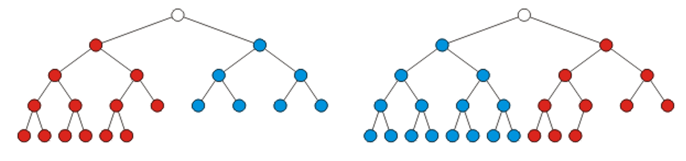

之前提到，我们很是希望尽可能找到接近完美二叉树的二叉树。因此对于n个节点来说，如果不能摆成完美二叉树的结构，那么按照顺序地、合乎逻辑的摆法就是完全二叉树了。关于完全二叉树，有以下几个性质和定理：

$Theorem1:$ The height of a complete binary tree with n nodes is $h = ⌊lg(n)⌋$

证明：当n=0的时候，明显是正确的。那么假设n个点的时候，高度是$h = ⌊lg(n)⌋$。那么欲证明：$h = ⌊lg(n+1)⌋$是n+1个节点的完全树的高度。那么当节点+1的时候，有两种情况：本来n的时候，树是完美二叉树；以及n个节点的时候，是完全二叉树，但不是完美二叉树。

第一种情况：如果原来是完美二叉树，那么$n=2^{h+1}-1$。当n+1的时候，自然知道：$h = h+1$，符合；

第二种情况：证明过程图如下：

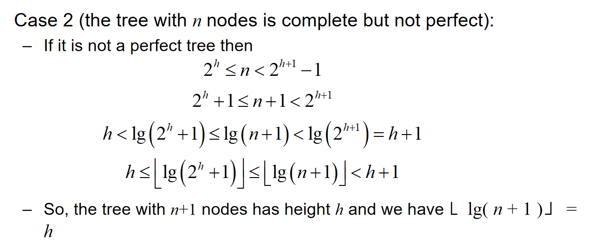

可以利用数组来储存完全二叉树：用广度优先方式遍历所有的节点，然后把节点们以此放入数组里面。这样一来，完全二叉树里面加减节点，完全等效于数组里面增加和删除元素。值得注意的是，在数列储存的时候，第一个元素可以空出来，这是一个非常重要的技巧，因为这样一来：index为k的节点的两个孩子的数组索引恰好就是$2k,2k+1$；同时index为k的节点的父节点就是$k//2$。

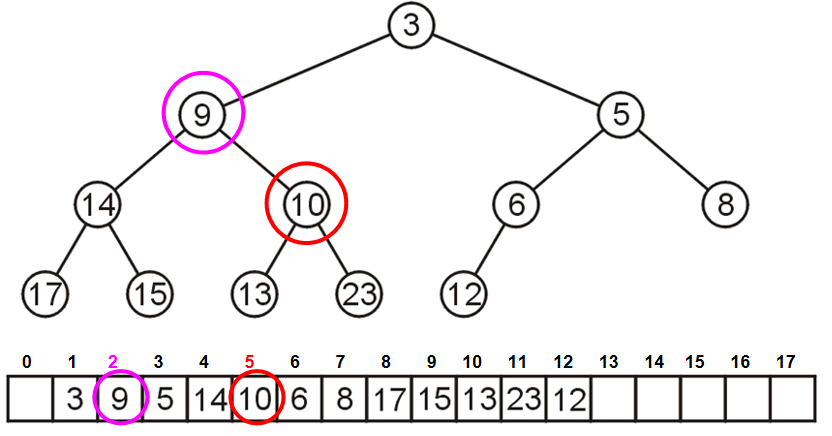

这种和2乘除就能得到孩子或者父节点的方法在c++里面可以利用***位运算***简化计算：

````c++
parent = k >> 1;
left_child = k << 1;
right_child = left_child | 1;
````

那么这就引人思考一个问题：为什么不用数组储存任何的二叉树呢？这是因为会有大量浪费的内存。如果需要保持之前上述所说的优化，for instance，一个12个节点的树需要32的位置用来储存。在最坏的情况，需要的内存将会是**指数级增长**。

### Left-child Right-sibling Binary Tree

对于常规的树结构，我们貌似只能用链表来储存结构。那么：有没有可能可以把常规的树当做二叉树来存储呢？如果我们考虑如下的储存思路：

- The first child of each node is its left sub-tree
- The next sibling of each node is in its right sub-tree

那么这种存储方式就是一种Left-Child Right-Sibling（左孩子右兄弟）。如下图所示：每一个节点的有节点都是这个节点的sibling，而左节点存放的全是这个节点的孩子节点：

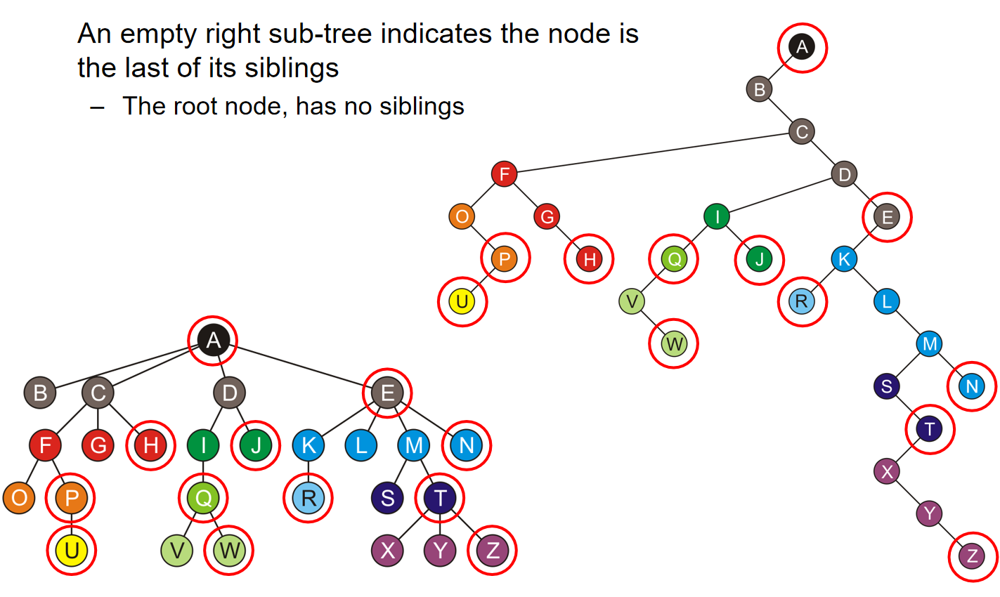

The transformation of a general tree into a left-child right-sibling binary tree has been called the ***Knuth transform***。特别地：

- ***A pre-order traversal of the original tree is identical to the pre-order traversal of the Knuth transform***
- ***A post-order traversal of the original tree is identical to the in-order traversal of the Knuth transform***

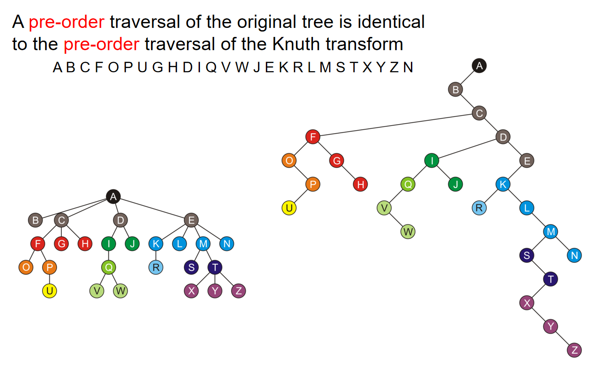

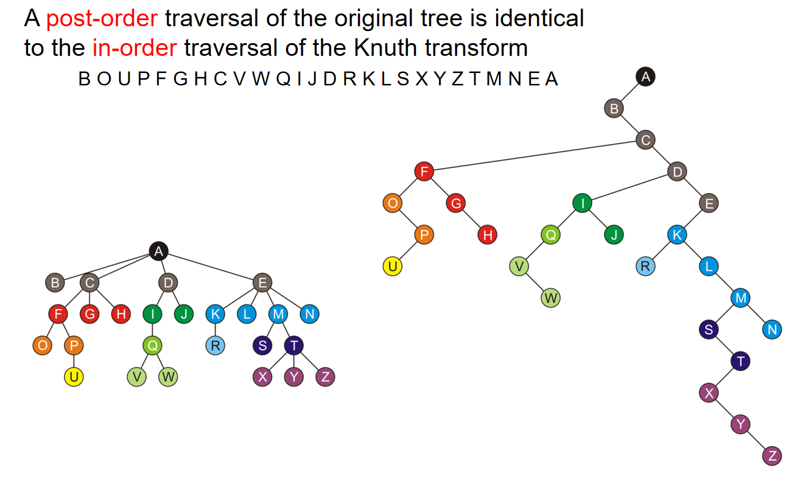

更有意思的是，一个森林forest也可以通过这种方式进行储存：

- Choose one of the roots of the trees as the root of the binary tree
- Let each subsequent root of a tree be a right child of the previous root
- This is the binary-tree representation of this forest
- Think of the roots as siblings of each other

示意图如下：

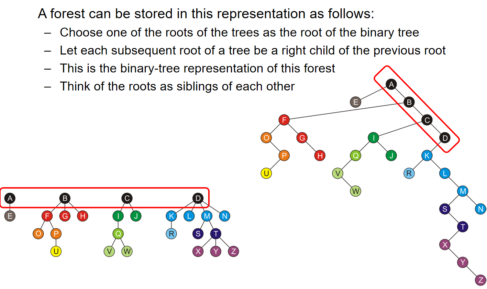

## 堆

> Now we will look at a restriction on an implicit linear ordering.

### Priority Queue

队列遵循FIFO，*first in first out*的规则。而在优先队列中，*每一个物体都关联着一个优先级*：

- 值为0的有着最高的优先级
- 关联数字值越高，优先级越低

而优先队列的特别支出就在于：***每一次弹出的都是优先级最高的***。操作上：

- 优先队列的头部是优先级最高的
- 弹出会把队列中当前优先级最高的物体弹出
- 而在push的时候，应该按照优先级把Push进的元素放在合适的位置

有的时候“优先级”规则可以不是一个数字，可以是相对复杂一点的，比如说取决于多个变量。那么如何实现这个优先队列呢？我们将尝试使用***Multiple queues——one for each priority***。

假设我们有M个固定优先顺序的数字，那么我们操作：

- 创建M个队列(queues)
- push元素的时候，应放在对应优先级的队列里面
- Top and Pop操作的时候，找到第一个***non-empty queue with highest priority***

这种操作下的运行时间非常的合理：push是$\Theta(1)$，Top and Pop都是$\Theta(M)$。但是依然有点问题：它限制了优先级的范围，而且内存消耗是$\Theta(M+n)$。我们可以用AVL树简化插入物体的过程，但这也只是后话了。总而言之，问题在于：***There is significant overhead for maintaining both the tree and the corresponding balance***。那么有没有非常好的解决这一方法的数据结构呢？堆应运而生。

### Heap

#### Basic Operation

Definition: A non-empty tree is a ***min-heap*** if：

- The key associated with the root is less than or equal to the keys associated with the sub-trees (if any)

- The sub-trees (if any) are also min-heaps

  > Tip: ***由上述定义可知：如果一颗完全二叉树的后序遍历是递减序列，那么这颗完全二叉树就是min-heap***；***但是反之不然，如果一个二叉树是min-heap，它的后序遍历不一定是递减序列。***

可见上述是一个Recursive Definition。同时再次强调subtree的概念：***Given any node $a$ within a tree, the collection of $a$ and all of its descendants is said to be a subtree of the tree with root $a$.***

那么我们可以定义binary min heap，就是min heap的基础上规定父节点只能有至多两个子节点。同时也可以类似地定义Binary max-heap：A binary max-heap is identical to a binary min-heap except that the parent is always larger than either of the children。

值得注意的是，通过上述定义可以看出：***There is no other relationship between the elements in the subtrees!***而且Heap本质上是树，树的种类也有很多种，其中最经典的就是二叉树。因此此处，最常见的数据结构是二叉堆。

下图是一个经典的(naive) binary min-heap：不难发现，从根节点出发一直到叶节点上的priority都是单调递增的。换而言之，对于一个节点来说，它的ancestor一定都比它大。

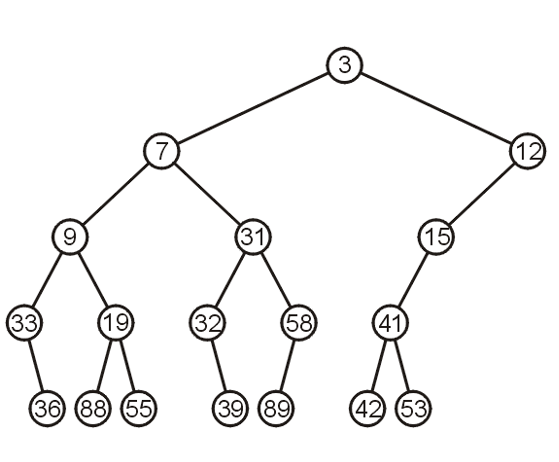

接下来就考虑三种操作：Top Pop and Push

关于top操作，我们只需要$\Theta(1)$的时间就能找到top元素了（因为就是根节点）。而关于pop操作，我们首先要明确思路：（***注意！这里的pop操作还不涉及到保持完全二叉树的性质！***）

- Promote the node of the sub-tree which has the least value
- Recursively process the sub-tree from which we promoted the least value

因为根节点的元素pop掉了，那么它有两个子树的根节点。谁的根节点更小，谁上位；但是同时子树根节点上位的同时，也会留下空位，因此相当于是对于这个根节点上了位的子树来说，发生了pop操作，因此需要recursive operation。当然，一直处理到子树是一个叶节点的时候，叶节点的元素上位，那么这个叶节点随后也会被删除。

那么关于Push，将一个元素插入二叉堆，一般来说有两种方式：At a leaf or At the root。在此处我们介绍At a leaf方式，而对于第二种方式来说，其他部分种类的堆会使用它。在At a leaf操作中，只需要随便选择一个任意的节点插入该元素的新的叶子节点，然后该叶子结点和它的父节点进行比较；如果小于它，就和这个父节点元素互换位置。重复这个操作一直到元素节点无法和父节点交换位置。上述过程称为***percolation***，也就是说越小的物体越能从底部向上移动。

***因此pop push的时间复杂度是O(n)***(注意这不是二叉堆的插入的时间复杂度！而是随意一个min-heap！)，而在二叉树高度不平衡的时候，会达到worst case。

而在二叉树中，我们定义了balance的概念。那么我们如何决定push操作一开始插入的位置，从而保持良好的balance呢？此处我们介绍***完全二叉树***方式——It has optimal memory characteristics but sub-optimal run-time characteristics。除此之外，完全二叉树还支持array implementation。

> :warning: ***Complete binary trees*** defines the actual “binary heap”；而之前展示的图片是**naive** heap

> Binary max-heap中（n > 3），倒数第二小的节点一定是叶子结点吗？不一定！如果总节点数量是奇数，那么意味着所有的非叶子结点将拥有两个孩子，而每一个孩子都是比自己小的，说明如果倒数第二小不是叶子结点，那么将有两个孩子都比它小，矛盾，故结论正确；但是奇数就不一定了，一位有一个非叶子结点有一个孩子，可以做到这个父节点是倒数第二小的，叶子孩子是最小的。

如何操作呢？如何maintain the complete-tree shape of a heap？We may store a complete tree using an array, and this array is filled using breadth-first traversal on the tree。那么在push pop的时候，就需要考虑***保持完全二叉树的性质***！

在push的时候，***在完全二叉树最后一层紧接着插入叶子结点***，然后经过percolation即可。

:warning: 但是在pop的时候，***需要把最后一层的最后一个叶子节点（i.e., array中的最后一个元素）copy到根节点***，并且删除这个叶子结点，然后这个元素从根节点开始下沉：下沉的过程中，遇到两个子节点，如果它们都小于自己，则和相对更小的子节点交换；如果它们一个大于自己一个小于自己，那么和小于自己的节点元素交换；如果两个子节点元素都比自己大，那么就停止下沉。

#### Analysis

通过以上的操作规则，我们总是能保持二叉堆是完全二叉树。对于这种操作来说，***top时间复杂度是$O(1$)，Pop操作是$O(ln(n))$，而push时间复杂度是$O(ln(n))$**，*而且非常好的是，空间复杂度是$O(n)$。所以说二叉堆是一个相比于优先队列来说更好的实现。

> 注意，上述的时间复杂度描述全部都是O，而不是$\Theta$，事实上马上会详细讨论更为具体的时间复杂度分析

> More specifically, if we are inserting an object less than the root (at the front), then the run time will be $O(ln(n))$; if we insert at the back (greater than any object) then the run time will be $O(1)$.

关于push操作，如果我们插入任意元素呢？那么平均时间复杂度是多少呢？

With each percolation, it will move an object past half of the remaining entries in the tree. Therefore, after one percolation, it will probably be past half of the entries, and therefore on average will require no more percolations. 则平均时间时间复杂度如下：
$$
\begin{align*}
\frac{1}{n}\sum_{k=0}^{h}(h-k) 2^{k} &= \frac{2^{h+1}-h-2}{n} \\
&= \frac{n-h-1}{n} = \Theta(1)
\end{align*}
$$
所以我们知道了渗透操作的平均运行时间是O(1)，即arbitrary insert时间复杂度是$\Theta(1)$。那么接下来将分析push，insert，access（top是特殊的access）的元素不同情况的时间复杂度：front（优先级高于所有二叉堆中的元素、或者访问二叉堆中优先级最高的元素）、arbitrary（任意一个元素）、back（优先级低于二叉堆中所有元素、或者访问二叉堆中优先级最低的元素）

***Push，i.e.，Insert***

如果要插入一个优先级高于二叉堆中所有元素的元素，i.e.，front，那么需要把这个元素放在root，然后后面进行percolation。由于深度是$\Theta(log_2n)$，而且一定会所有height都进行一次换位置，所以时间复杂度是$\Theta(ln(n))$。而如果是插入任意一个元素，那么平均一次的percolation如上文所推导的那样，是$\Theta(1)$。那么如果是插入一个优先级小于二叉堆中所有元素的元素，那么直接插入**array的最后一个位置**即可。

***Access***

如果要访问二叉堆中优先级最高的元素，直接访问top即可；而如果是任意的元素或者是优先级最小的元素，那么都需要遍历array才能知道，所以说是$\Theta(n)$

***Delete***

如果是要删除二叉堆中优先级最高的元素，那么下面一定要有元素上位，而且上位的次数一定是二叉堆的高度，所以说时间复杂度是$\Theta(ln(n))$；如果是删除任意的一个、或者是优先级最低的元素，那么还是需要$\Theta(n)$遍历，然后percolation，总体上来说是$\Theta(n)$。

因此上述的时间复杂度总计如下图:***（重要！）***

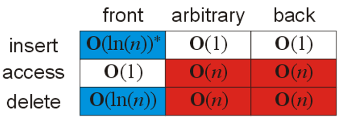

同时我们也可以有以下的观察；

- 连续在堆的前面插入（即新对象比堆中所有对象都小）导致运行时间降低到$\Theta(ln(n))$
- 如果对象按照优先级顺序到来，使用带有交换的常规队列。如果元素是按照优先级顺序（从小到大或从大到小）到达的，那么使用一个常规的队列（如数组实现的队列）并结合交换操作可能比使用二叉堆更高效。因为在这种情况下，二叉堆的优势（快速插入和删除最大/最小元素）并不明显，而常规队列的插入和删除操作都是 *O*(1) 的，只是在需要找到特定优先级的元素时可能需要遍历队列，这在元素顺序到来的情况下是不必要的。
- 合并两个大小为 n 的二叉堆是一个 $Θ(n) $操作：

当然，不同的heap结构可能会在某些操作的时间复杂的上进行优化，例如用斐波那契堆，那么插入front元素的时间复杂度会降到$\Theta(1)$。

### Build Heap & Floyd's Method

Task: Given a set of n keys, build a heap all at once。

当然我们可以不断的重复二叉堆的push操作，那么在这种情况下，***时间复杂度是$\Theta(nln(n))$***。可能会有所困惑: arbitrary insertion的时间复杂度难道不是O（1）么？那么解释如下：

> Reference:kimi.moonshot.cn

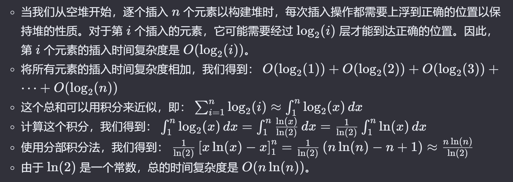

 有没有时间复杂度更低的构建方式呢？下面介绍最常见的优化方式：Floyd's Method

我们可以拿这个array过来构建二叉树，然后合理地修改成为二叉堆！示意图如下：

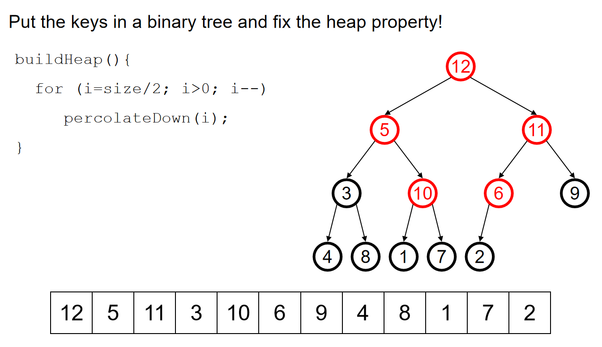

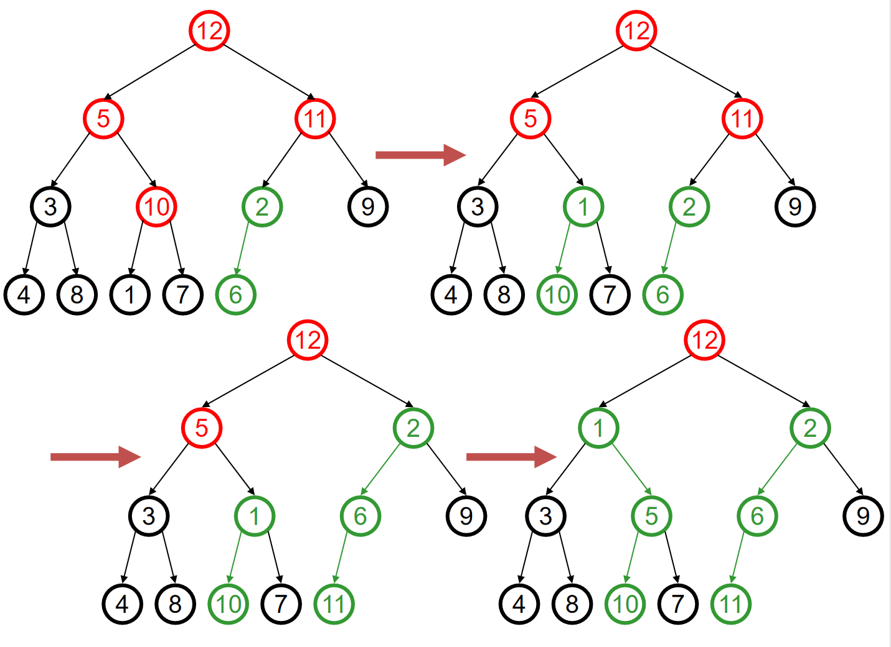

相当于是从小sub tree开始不断调整sub tree的根节点，根节点在这颗子树内的调整规则如先前所介绍的那样。然后sub tree不断变大，知道变成了整棵树。所以如图片中介绍的代码那样，只用对前一半引索的节点进行判断，因为只有这些节点才可能是一颗子树的根节点（这充分利用了二叉树的索引性质；且需要注意的是，二叉堆的array[0]依然是空出来的，为的就是方便访问子节点的索引）

那么这种操作方式的时间复杂度是多少呢？分析如下图： 

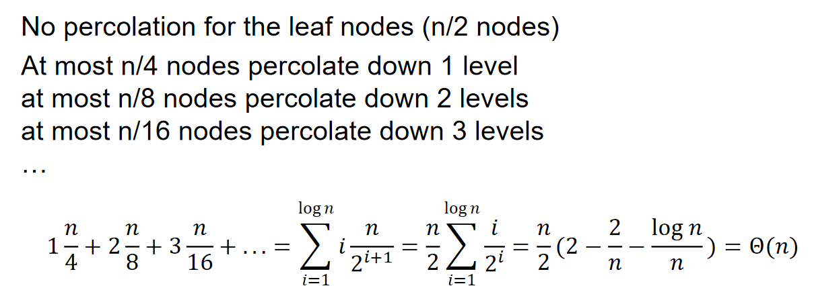

### Heap sort

有了上述构建heap的基础，那么我们就知道：对于任何一个array来说，构建heap只需要$\Theta(n)$的时间复杂度，而构建完成之后不断弹出top元素，那么最后总共的时间复杂度是$\Theta(nln(n))$。这听起来好极了！但是有一个小疑问：这个solution需要额外的内存$\Theta(n)$，那么如果对于这个数组来说，它们已经存在了array里面，我能不能就地操作呢？

那么这时候我们的思路只需要改变一下：***Instead of implementing a min-heap, consider a max-heap***，这样最大的元素就是top，然后top出来的元素就放在array中由于pop而产生的最后面的空位里面。

举一个例子，如下图：


接下来对于每一个子树的根节点进行操作，下图中举例的是最后一步：树的根节点元素的变化。

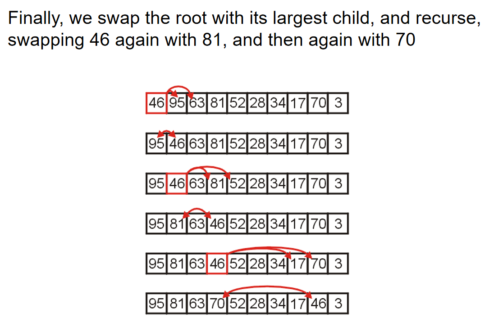

最终我们得到了max heap：

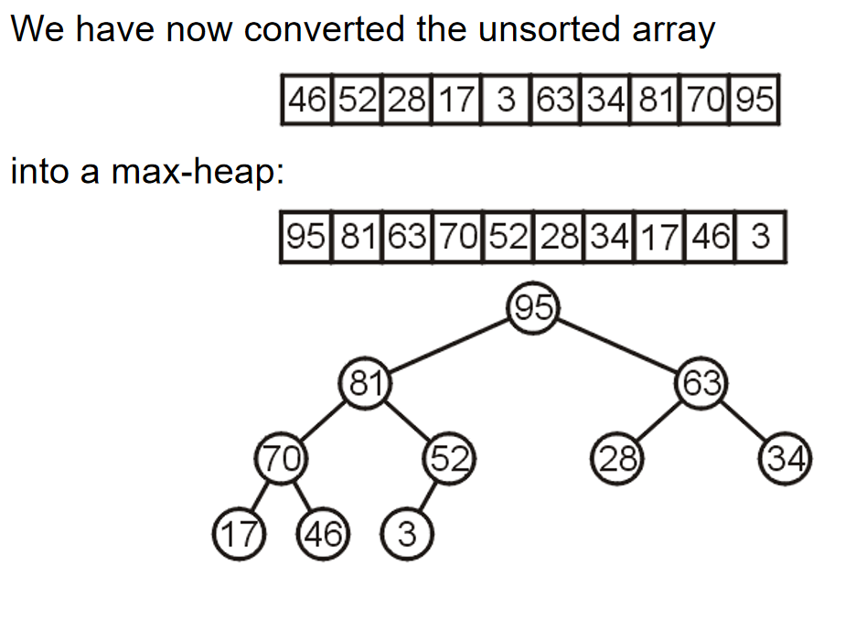

那么按照之前的思路就能得到最终的sorted array了。值得注意的是，这里其实是在就地操作，所以说array第一个位置，即0号索引，无法空出来，所以说对于索引为i的节点来说，访问父节点和左右孩子节点的逻辑是需要做出略微的修改的：

````c++
int father = (i-1)/2;
int left = 2*i + 1;
int right = 2*i + 2;
````

最后，还有一个小疑问：如果array中有相同的元素怎么办？那么一个非常好的解决方法就是采用混合优先级：Hybrid Priority。例如$(n1, k1) < (n2, k2)$ if $n1 < n2$ or $(n1 = n2$ and $k1 < k2)$。这样的话，关于相同元素内部的次优先级问题就能迎刃而解了。

***重要！堆排序的最好情况和最坏情况的时间复杂度都是$\Theta(logn)$，而且堆排序是一个不稳定的算法。***

### Application——Huffman Coding

#### In a nut shell

Huffman Coding（霍夫曼编码）是一种常用于数据压缩的算法，由David A. Huffman于1952年提出。它是一种无损压缩技术，可以高效地编码数据，使得常用的数据（比如字母、字符）占用较少的比特位，从而减少总体存储或传输的数据量。霍夫曼编码在文件压缩、传输等领域应用广泛，尤其是图像压缩（如JPEG）和文本压缩。

***霍夫曼编码的核心思想***

霍夫曼编码的主要目标是使用更短的编码表示高频出现的数据，而低频数据则用较长的编码表示。通过这样的方式，可以实现数据压缩，因为总编码长度被大大减少。

***霍夫曼编码的特点***

1. **前缀编码**：霍夫曼编码是一种前缀编码（Prefix Code），即不会出现某个编码是另一个编码的前缀，确保解码过程唯一。
2. **自适应性**：霍夫曼编码根据数据的频率来生成编码，因此不同的数据集会生成不同的编码树，适应性很强。
3. **二进制树结构**：霍夫曼编码通过构建一个二叉树来实现编码。树中的每一个叶节点代表一个数据或字符，路径上的"0"和"1"构成了编码。

***霍夫曼编码的步骤***

1. **统计字符频率**：遍历整个数据集（如文本文件），统计每个字符出现的频率。
2. **构建霍夫曼树**：
   - 将每个字符及其频率作为一个节点，所有节点组成一个最小优先队列（频率越低的节点优先级越高）。
   - 从优先队列中取出两个最小频率的节点，作为子节点生成一个新节点，其频率为两个子节点的频率之和。
   - 将新节点加入优先队列，重复该步骤，直到队列中只有一个节点，这个节点就是霍夫曼树的根节点。
3. **生成编码表**：从根节点出发，沿着每条路径生成编码。通常约定左边的分支为`0`，右边的分支为`1`。遍历树的每个叶节点，记录从根节点到叶节点的路径，即为该字符的编码。
4. **编码数据**：根据编码表将原始数据中的每个字符替换为对应的霍夫曼编码。
5. **解码数据**：通过霍夫曼树来解码。解码时从根节点开始，读取编码串的每一位，如果是`0`则进入左子节点，`1`则进入右子节点，直到到达叶节点，得到相应字符。

***示例***

假设我们有以下字符及其出现频率：

| 字符 | 频率 |
| ---- | ---- |
| A    | 5    |
| B    | 9    |
| C    | 12   |
| D    | 13   |
| E    | 16   |
| F    | 45   |

按照上述构建霍夫曼树的步骤，我们最终得到如下编码：

- F: 0
- C: 100
- D: 101
- A: 1100
- B: 1101
- E: 111

通过这样的编码，字符`F`只用1比特，而频率较低的字符`A`和`B`则用较长的编码，使得整体数据量降低。

***优缺点***

**优点**：

- 无损压缩，适合需要精确还原的数据。
- 能适应不同的数据集，灵活性高。

**缺点**：

- 需要事先统计字符频率，适合静态数据，对于动态数据则不太合适。
- 每次构建树需要额外的存储和计算，复杂度较高。

霍夫曼编码是一个经典的贪心算法的应用，它在数据压缩、文件传输等场景下非常有效，是数据压缩技术中的基础算法之一。

#### Elaboration

在in a nut shell中介绍到，霍夫曼编码是用来压缩数据的。那么首先我们就要定义什么是压缩：压缩就是***reduce the size of data, more specifically, the number of bits needed to represent data***。压缩好处多多，能够减少内存，能够减少传输成本、带宽等等。

霍夫曼编码的核心idea是：不是所有的字符都有着相同的出现频率的！但是所有的字符却都占用着相同的byte！所以基本的idea就是：能不能越频繁的字符，我就用越少的bits表示；而频率越低的字符，我就用更多的bits表示。

就随便举一个例子就能生动的展示上述的思想，以及思想所带来的好处：


霍夫曼编码总的algorithm步骤可以总结如下：

- Scan text to be compressed and count frequencies of all characters.
- Prioritize characters based on their frequencies in text.
- Build Huffman code tree based on prioritized list.
- Perform a traversal of tree to determine all code words.
- Encode the text using the Huffman codes.

首先是scan the text。如下图中的例子，首先我们能够统计text中出现的text种类，然后我们也能够统计所有character出现的次数，aka，频率。


统计完成之后：***Create binary tree nodes with character and frequency of each character***。然后讲节点放进优先队列里面，其中我们定义优先级为：出现频率越低，则队列中的优先级越高。构建示意图如下：


然后利用这个优先队列创建二叉树，创建的规则如下图：


下面展示上述操作了一步、两步、三步、倒数第三步、倒数第二步、最后一步之后的示意图：


这样一来我们就得到了Huffman code tree。得到了最后的这个二叉树之后，我们就能从根节点出发去访问（traverse）最后的character了。如果我们规定：遇到了一个节点之后，选择了它的左孩子节点，那么这一步就是0，而如果选择了它的右节点，那么这一步就是1。这样一来，每一个character就对应着一种编码：


这样我们就能够通过上述的编码规则，重新编码这句话：


这样我们就只是了73个bit去表示句子了，而如果正常使用ASCII进行编码，需要使用208个bit。为什么对于任意两个任意两个code之间，我们不需要加分隔符？***因为这些code没有一个是另一个code的前缀！***

***重要！***如何判断一个code set是不是一个valid Huffman code，需要判断两个条件：***第一，是否没有一个code是另外一个code的前缀；第二，根据code set画树，树上的每一个节点要么是叶节点要么是满节点。***两个条件都满足了，就说明code set是valid Huffman code。

那么在对方收到了这个码之后，我们再发给对方这个Huffman code tree。这样decode的时候，只需要按照0是left，1是right的traverse规则就能够成功地找到一个个character，从而实现信息的传递。

> Tip: 霍夫曼编码出来的code set***可以做到***所有的character的code length都一样

> Tip:  ***For the same character set, if their frequencies differ, then the Huffman coding trees generated by them may be the same***. For example, two characters of frequency 10 and 20, and two characters of frequency 100 and 200, will have the same Huffman Coding Trees

### Summary

对于Binary Heap的push pop access三种情况操作的时间复杂度如下：


二叉堆的操作的时间复杂度（其中build method是Floyd'd Method）以及堆排序的时间和空间复杂度：（注意Push是$O(ln(n))$，更具体的说是worst case $\Theta(ln(n))$，average $\Theta(1)$）。

:warning:堆排序的最好情况和最坏情况的时间复杂度都是$\Theta(logn)$，而且堆排序是一个不稳定的算法。

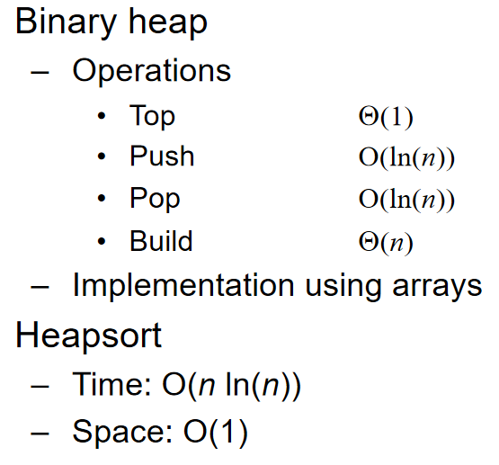

## 平衡二叉树（AVL Tree）

### Balance Matters

之前提到过，在查找二叉树中，相关操作的时间复杂度都是O(h)，但是在最坏的情况下会达到O(n)，而这个最坏的情况就是二叉树极度不平衡。我们很是希望一颗树能够保持良好的“平衡”，比如说，树的高度是$\Theta(ln(n))$。Balance的定义此处再次补充：

:label:在二叉树中，如果一个节点的两个子树的高度相差不超过1，那么就称这个节点是平衡的。

那么如何保持平衡呢？接下来展示几个保持平衡的思想：

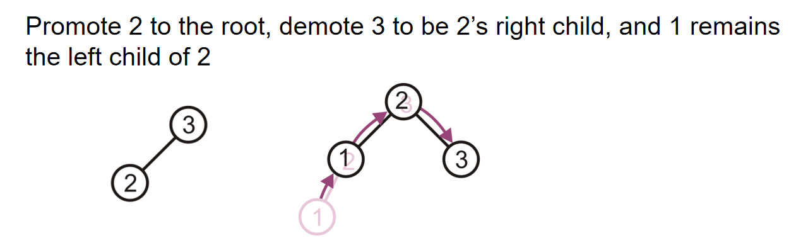

首先是如上面这个例子，想要在这个树中插入1，那么如果1作为2的左孩子节点，那么这棵树很明显就不平衡了。所以说可以考虑2上位，3作为根节点的右孩子节点。

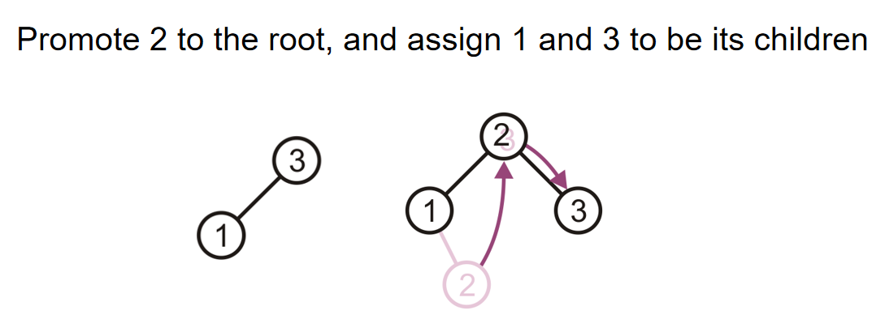


其次如上面这个例子，想要在树中插入2，如果作为1的右孩子节点那么就明显不平衡了。所以可以考虑2上位到根节点，然后3作为根节点的右孩子节点，那么树的平衡就保证了。

这些例子都显得可能太特殊了，这些操作不具有普适性。但是其实这些就是平衡二叉树中保持平衡的关键基础。

### AVL Tree

:label:一颗查找二叉树被认为是AVL树如果：根节点左右两棵树的高度插不超过1，而且左右两子树都是AVL树。（Recursive Definition）

:warning:关于高度，有两点需要再次强调：一颗空树的高度是-1，而一颗只有根节点的树的高度是0

根据上述定义，可以预见的是：***完整（complete）二叉查找树一定是AVL树***。因此，AVL树如果高度是h，那么***节点数量的上限***是：$2^{h+1}-1$。那么下限呢？

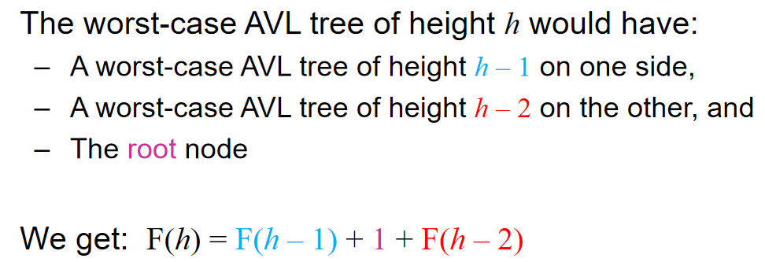

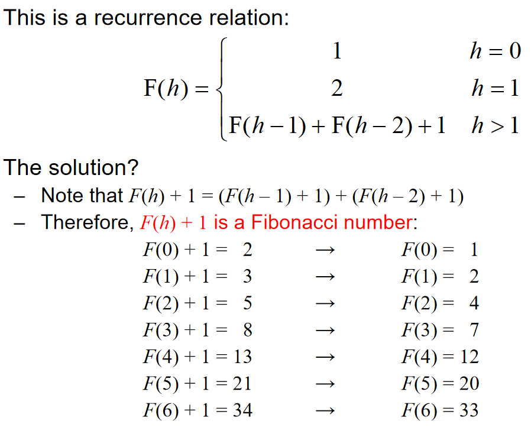

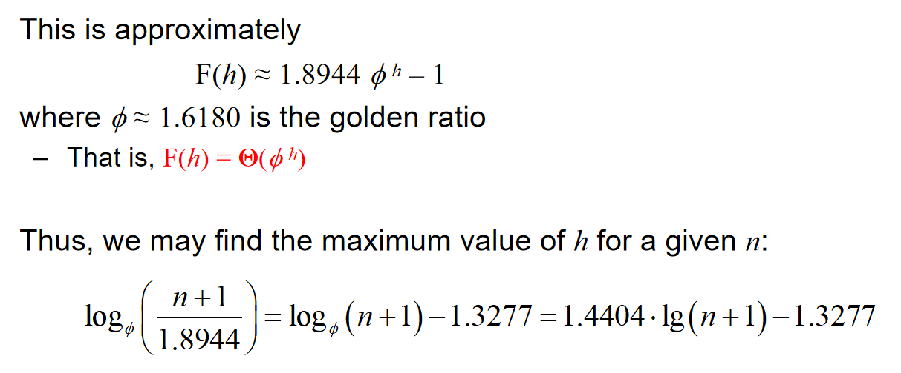

:label: 对于一个高度为n的AVL树，最少的节点数量为：
$$
f_{n}=\frac{5+2\sqrt{5}}{5}\left(\frac{1+\sqrt{5}}{2}\right)^{n}+\frac{5-2\sqrt{5}}{5}\left(\frac{1-\sqrt{5}}{2}\right)^{n}-1
$$

> Considering an AVL tree whose height is h, then this tree contains $\Omega(\alpha ^h)$ nodes, where $\alpha = \frac{\sqrt{5}-1}{2}$

### Maintaining Balance

注意到：插入节点可以让树的高度增加1，同时删除一个节点能够让树的高度减少1。这两种操作都会导致某些节点产生不平衡现象，我们需要在插入或者删除之后rebalance。

为了记录高度上的变化，Node成员函数`height()`时间复杂度必须O（1），因此最好所有的Node成员维护一个变量叫做`int tree_height;`，然后在我们插入和删除的过程中对这个变量进行更新。

下面将会按照不同的case来介绍不同的操作以维持二叉树的平衡：

#### Case 1 of Insertion

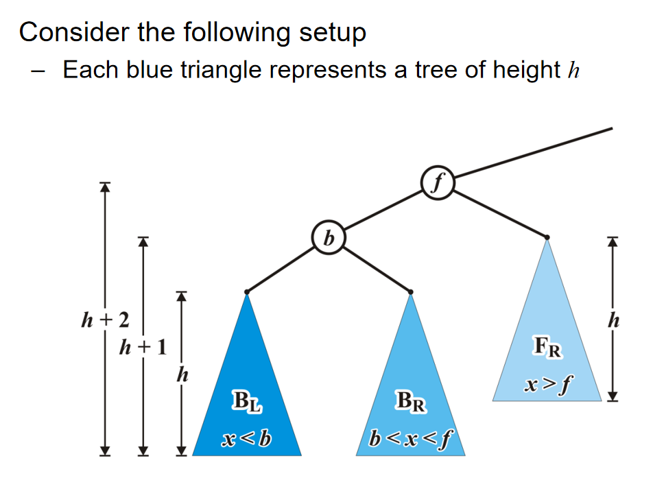

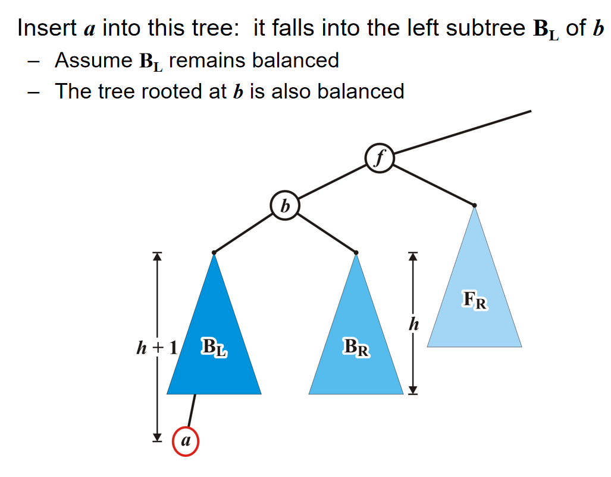

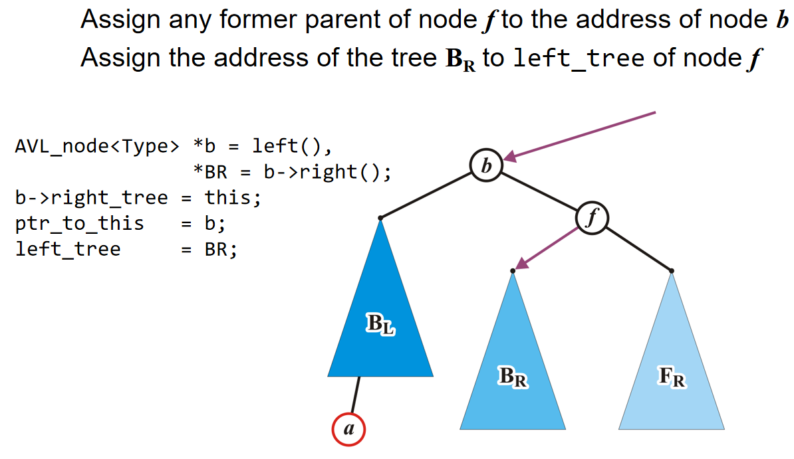

这种情况下，需要“右旋”。b节点将作为这个系统的根节点，然后f作为右孩子节点，同时BR树的根节点将接在f的左孩子节点处。

另外，寻找这个f节点其实也是有技巧的：插入了a节点之后，**在插入的a节点到根节点的path中**（注意方向！节点到根节点！），逐个检查节点的平衡性，**第一个不平衡的点**就是上述case的f节点了。

#### Case 2 of Insertion

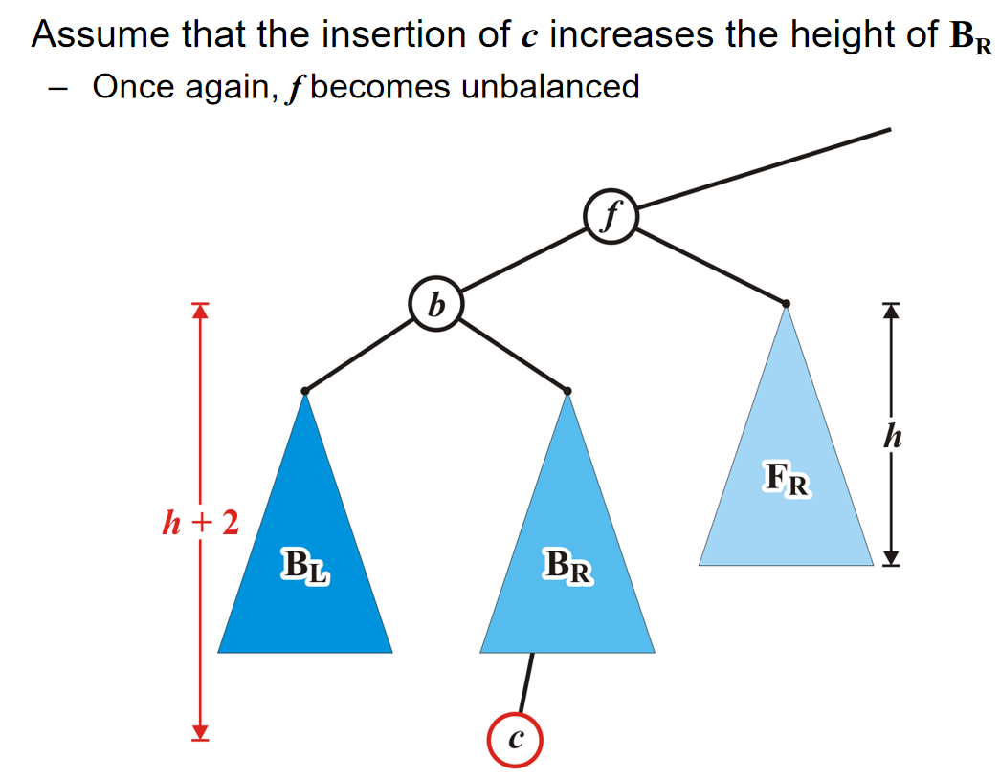

如果新插入的节点c在b节点的右子树下面，那么case1的方法就并不奏效了。因此需要重新设计解决方案：

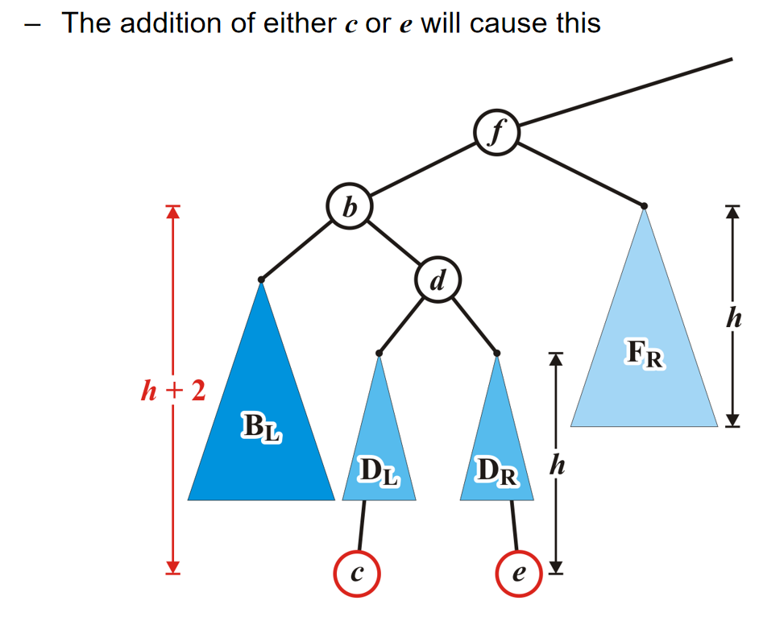

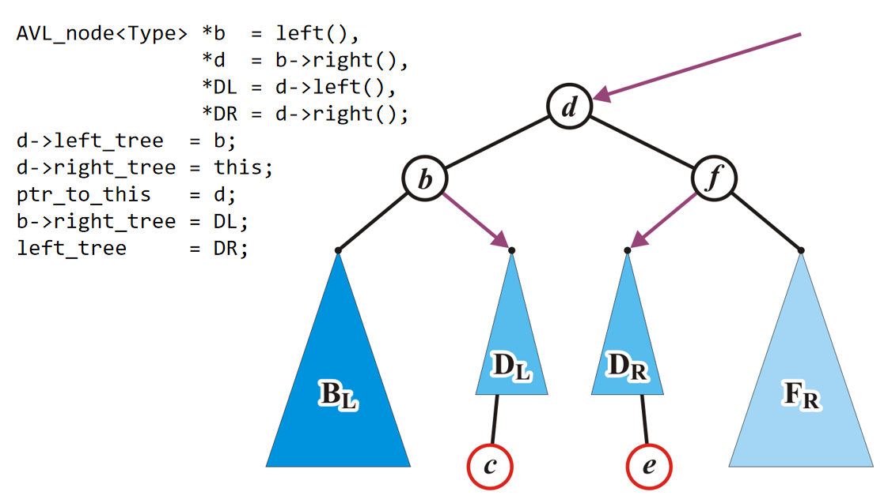

此处我们对BR子树的插入新节点情况进行了进一步的细化，插入元素的位置要么在c要么在e，并且单独拎出来了b节点的右子树根节点。可以看到解决方案中，d上位f原本的根节点地位，然后f作为d节点的右孩子节点，之后原本d的两颗子树根节点分别作为了b节点的右孩子节点和f的左孩子节点。

#### Symmetric Cases of Case 1 and 2

上述的case中都是右旋，那么当然有左旋的case，思路完全一样，只不过操作是镜像的——左旋。

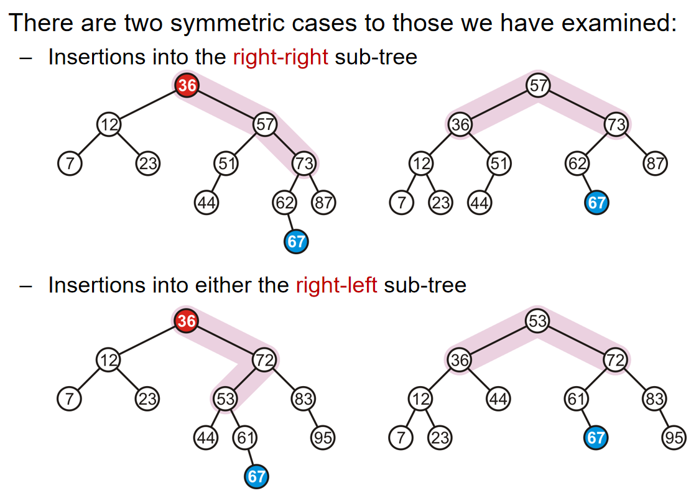

#### Comments of Insertion

所有的插入之后的左右旋平衡操作，在代码中的实现能够做到时间复杂度为O(1)；但是在平衡查找二叉树中插入元素依然是$\Theta(ln(n))$的时间复杂度。

#### Erase

删除一个叶节点可能会造成多个不平衡，当然，这也是“可能”，因此需要删除之后检查是否有不平衡现象的产生。但是不幸的是，删除可能会造成O(h)程度不平衡，而它们又必须要修正。相比之下，插入就只需要修改一个不平衡现象就OK。

而如果要删除一个内部节点，那么就按照查找二叉树中的删除操作即可。

而删除一个节点在破坏平衡性上来看，可以类似于另一个地方插入节点，所以说很多情况还是左右旋操作，但是特殊的情况如下：但依然，可以视为插入的Case 1。在删除了节点之后，该节点到根节点一路上的节点***都要***（不是第一个！）检查是否有不平衡现象！

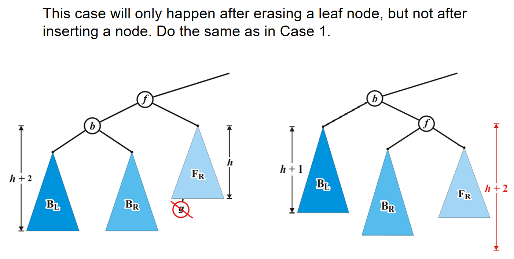

#### Time Complexity

**插入**可能只需要一次correction就能再次维持平衡，而每次平衡**只需要O(1)的时间**

但是**删除**可能需要O(h)次correction，每次都是O(1)时间，而h就是高度，所以对于删除来说时间复杂度是$O(ln(n))$。

题外话：这三个选项都是正确的。

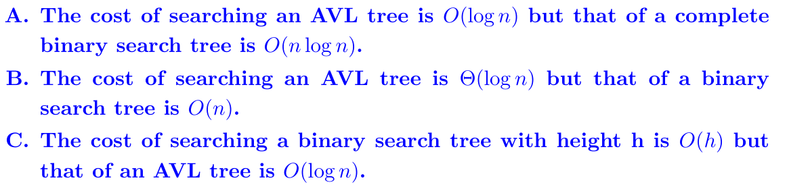

### AVL Tree as Arrays

之前我们见到，完整二叉树（complete）可以用O(n)的内存去在数列上进行储存，而任意一个n个节点的树也可以通过$O(2^n)$的内存去在内存中储存。那么是否可能用数组来储存AVL树并且不用需要指数级别的内存空间呢？

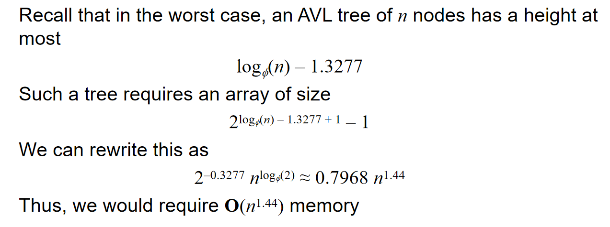

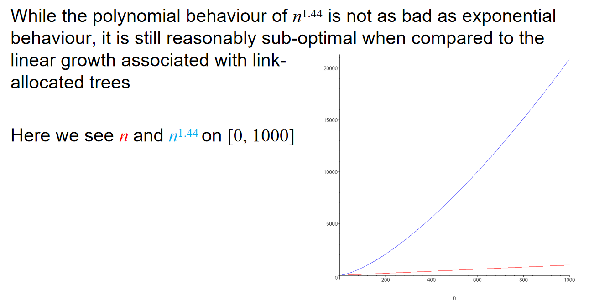

## Disjoint Sets 并查集

### Equivalence Relations

"Equivalence Relations" 在数学中被称为“等价关系”。等价关系是集合上的二元关系，它满足以下三个性质：

1. **自反性（Reflexivity）**：对于集合中的任何一个元素 *a*，*a* 与自身是等价的，即 *a*∼*a*。
2. **对称性（Symmetry）**：如果集合中的元素 *a* 与元素 *b* 是等价的，那么 *b* 也与 a*a* 等价，即如果 *a*∼*b*，则 *b*∼*a*。
3. **传递性（Transitivity）**：如果集合中的元素 *a* 与元素 *b* 是等价的，且 *b* 与元素 *c* 是等价的，那么 *a* 也与 *c* 等价，即如果 *a*∼*b* 且 *b*∼*c*，则 *a*∼*c*。

**An equivalence relation partitions a set into distinct equivalence classes**. Each equivalence class may be represented by a single object:  the representative object. ***Another descriptive term for the sets in such a partition is disjoint sets***.

以下是一些经典***Implicitly Defined Relations***例子，在集合中通过一种等价关系对元素进行划分，划分出不同的集合。

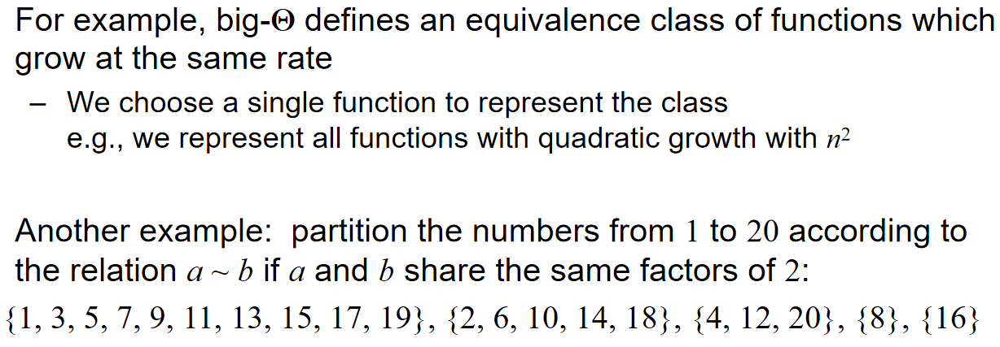

以下是Explicitly Defined Disjoint Sets的例子，先对集合进行划分，然后再用这个划分规定每一个set中的元素都是等价的：

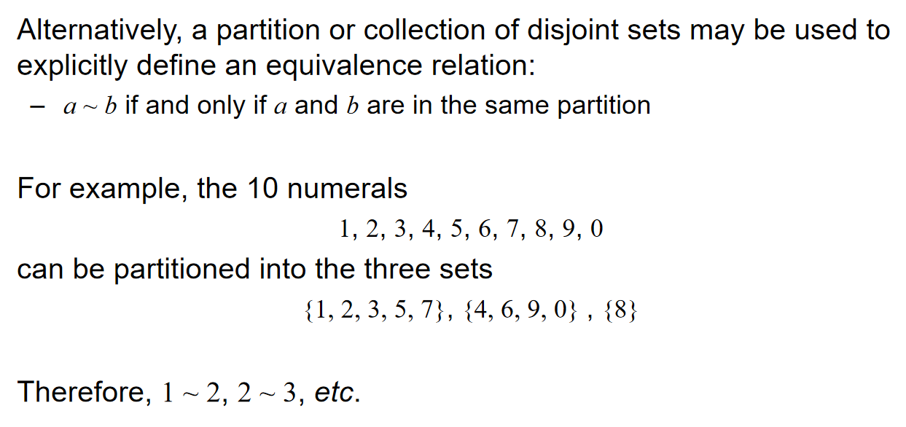

### Disjoint Sets

***:label: Definition: a set of elements partitioned into a number of disjoint subsets***

***There are two operations we would like to perform on disjoint sets:***

- Determine if two elements are in the same disjoint set, and
- Take the union of two disjoint sets creating a single set

We will determine if two objects are in the same disjoint set by defining a ***find*** function，注意这个函数的定义应该如下：

- ***find(a)***: **find the representative object of the disjoint set that a belongs to**
- Given two elements a and b, they are in the same set if $find(a)==find(b)$

那么应该如何实现呢？既然这个函数需要输入的是元素，返回的是该元素属于的并查集中的代表元素，那么一种朴素的想法是创建两个数组，一个是元素，另一个的对应位置储存的是它对应的并查集中的代表元素。如下：

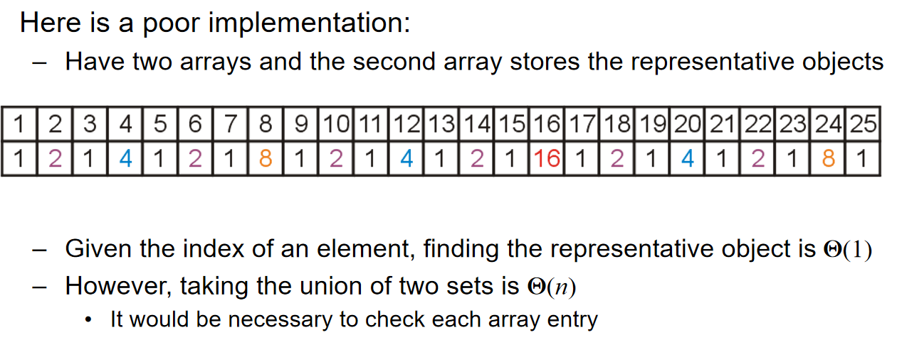

那么这种“带着代表元素的集合”关系，不难想到可以使用树进行表示，（子树）根节点就是代表元素，而其他在集合中的元素都是该节点的孩子节点。如下图：

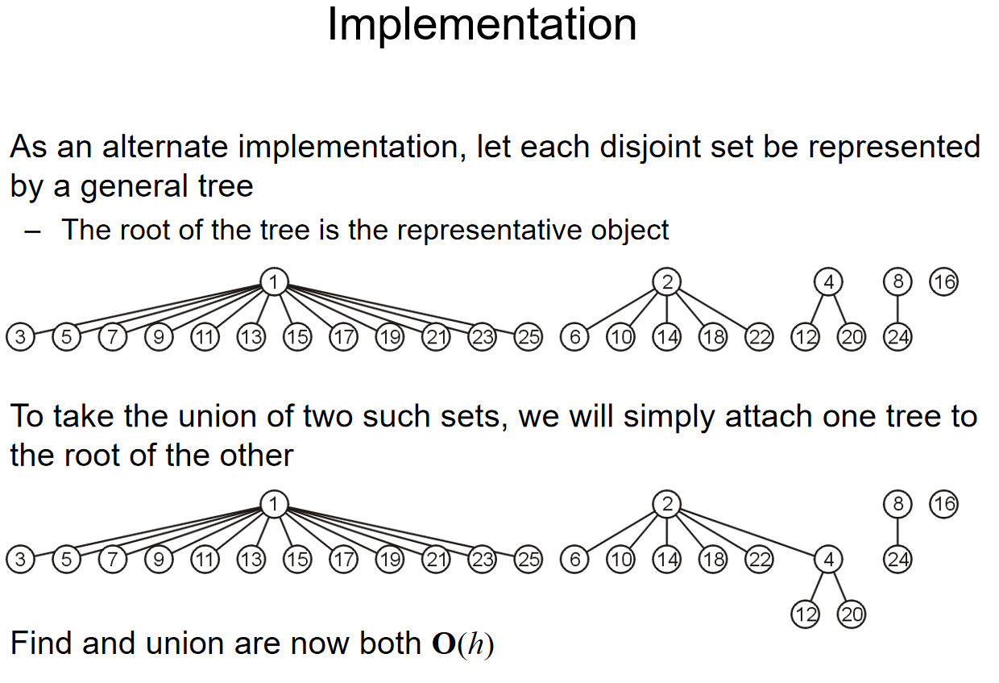

:warning:当然，在之前的树的代码实现中，节点储存的都是孩子节点的指针，但是在并查集的情况中，我们对“该元素所在集合的代表元素，i.e.，该元素节点的父亲节点的指针”。因此，用树结构实现并查集，每一个节点应该储存的是父亲节点的指针。

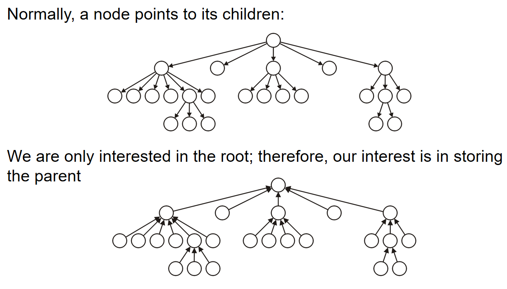

### Operation, Optimization and Analysis

#### Operation

首先是`set_union(i,j)`，表示要把j元素所在的并查集加进以i元素所在的并查集。以下图为例子：左边为当前状态的结果，假如说我想`set_union(5, 6);`，***说明是我想要把6所在的并查集加入到5所在的并查集中***。那么我就需要寻找6所在的并查集中的代表元素4，然后把它的父亲节点指针设置为5所在的并查集的代表元素节点指针，aka，1号元素节点。注意，对于一个原来的set来说，分成的一个个并查集中不能嵌套并查集，i.e.，4、6、8、9在虽然说是这颗子树的高度是2，但是其实都是在一个并查集里面，而且都是以4为代表元素的。

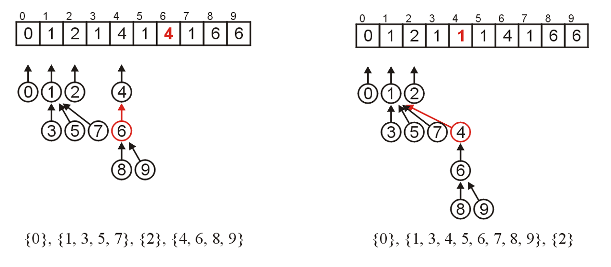

上述的操作在逻辑上是自洽的，但是实践中还是有一个小问题：那就是树的高度会非常的大，否则在find的过程中，从叶子结点出发，要经过O(h)操作才能访问到父亲节点指针为空指针的元素，代表元素。因此为了优化***find and set_union***方法，必须要想方法降低树的高度。

#### Optimization 1: 启发式合并

:label:优化策略如下：

- point the root of the shorter tree to the root of the taller tree
- The height of the taller will increase if and only if the trees are equal in height

也就是说，我们加入了判断谁加到谁身上的逻辑。在之前“我想要把6所在的并查集加入到5所在的并查集中”的描述中，这种谁家到谁身上的逻辑貌似是固定的，这就会导致树的高度可能会增长下去。但是其实谁加到谁身上在`set_union();`这个方法的本质上是等价的，因为都是讲元素的代表元素进行统一，只不过是统一到谁身上的区别，在find判断上其实是等价的。所以说，我们可以引入“根节点谁加到谁身上的”逻辑。

那么我们来考虑最坏的情况（Worst-Case Scenario），那就是树的高度很高，但是里面的节点数量应该要尽可能的少。那么为了达到这个目的，就需要每一次插入子树的时候，两棵树的高度都是一样的。那么这个并查集的创建过程就如下图所示：
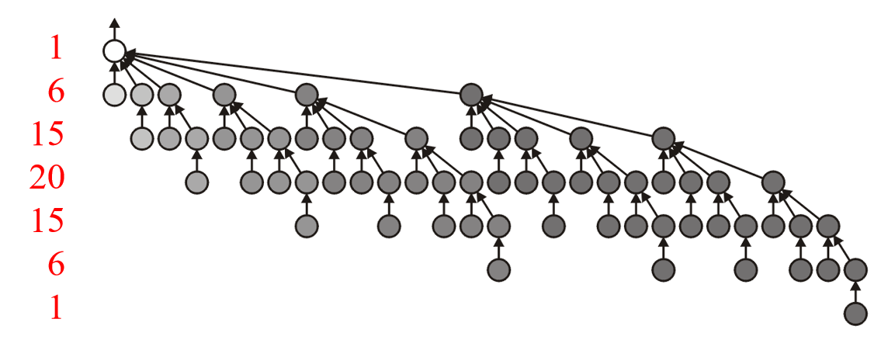

上图中子树的形状十分有规律，总的来说这个子树的诞生可以迭代式定义：对于一开始的只有一个节点的情况，那么新来的节点直接加载这个节点下面；之后，这颗子树和与自己形状一样的子树进行union操作，会得到新的树；重复上述的过程。

我们惊喜地发现，对应高度h，并查集树最小的节点数量貌似好像和二项式有关系，因此我们能够得到如下的结论：

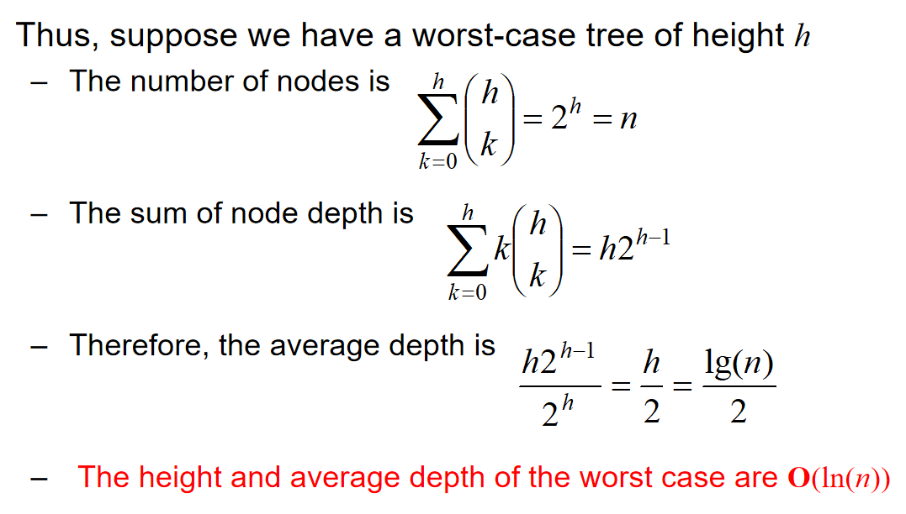

:warning:优化后的union操作下，对于n个节点来说，汇合成一个并查集树的结构的高度和平均节点深度都是$O(ln(n))$。而明显地，最好的情况下，n个节点的整体并查集树的高度是1，如下图所示：

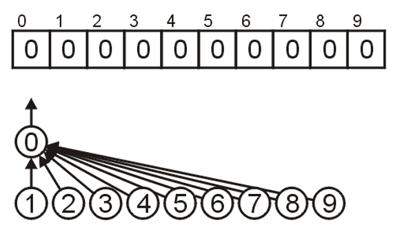

那么上述过程中我们分析了最好的和最坏的情况，那么平均情况呢？可能对于平均情况的分析，理论分析是比较困难的，那么通过实验结论可以说明：
:warning: 对于n个节点来说，随机产生一个整体的并查集树，这棵树的平均高度是$o(ln(n))$

#### Optimization 2: 路径压缩

:label:还可以考虑另一种优化策略：每当调用一次`find`方法，那就：update the object to point to the root

什么意思呢？假如说进行find操作，那么就会从叶子节点一直走到根节点，path上面的节点其实都是以根节点为代表元素，但是除了紧接着根节点的那个在path上的节点，其他的节点其实都没有直接指向根节点，这造成了高度的增加。所以说我们可以考虑将path上面的节点（除了根节点）的父亲节点指针都设置成最后的这个根节点，从而有效降低并查集树的高度。示意图如下：

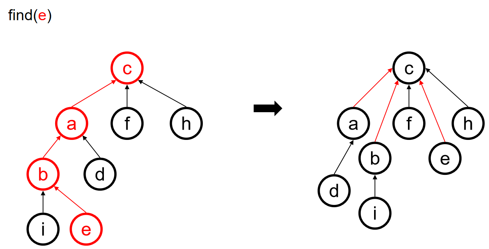

#### Analysis

有了上述的两种优化策略，那么时间复杂度有没有可能优于$O(ln(n))$？事实证明，在同时使用路径压缩和启发式合并之后，并查集的每个操作平均时间仅为$O(\alpha (n))$，其中$\alpha$为阿克曼函数的反函数，其增长极其缓慢，也就是说其单次操作的平均运行时间可以认为是一个很小的常数。

> Reference: oi.wiki

总结图如下：
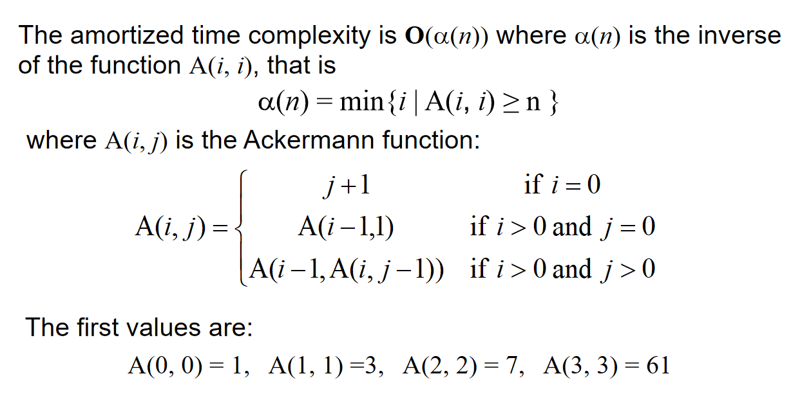

那么这个$A(i,i)$多大就是一个非常关键的问题了。好消息是：$A(4,4)$是一个19729位的正整数，因此我们可以在实践中认为：

:warning: 在同时使用了路径压缩和启发式合并之后，并查集每个操作的平均时间为$O(\alpha (n))$，**实践中**认为$\alpha(n)$一般不超过4，而**理论上**时间复杂度依然视为n的函数。

### Application

#### Lotto 6/49 Problem

如何在1-49个数字中随机选取6个数字，而且不会选出相同的数字？可以考虑先在1-49中随机选取一个数字，然后把最后一个元素，即49，复制到被选中的这个数字的位置上面。之后再从1-48中随机选取数字。上述的操作重复六次。

下图例子中演示了Lotto 2/20：

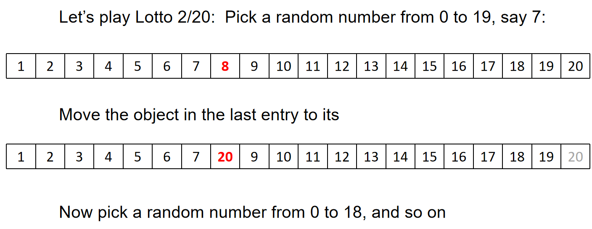

#### Maze Generation

在这里讲的不是如何解决一个迷宫问题，而是如何创造一个迷宫让别人玩。We will do as the followings:

- Start with the entire grid subdivided into squares
- Represent each square as a separate disjoint set
- Repeat the following algorithm: Randomly choose a wall; If that wall connects two disjoint sets of cells, then remove the wall and union the two sets
- To ensure that you do not randomly remove the same wall twice, we can have an array of unchecked walls

总的来说，就是选择一个墙，合并两个并查集，同时维护一个数组，数组中一开始引索为i的地方代表的是i号正方形的父亲节点的正方形编号，因此在合并两个并查集之后，需要更新这个被移动的正方形的父亲节点，这样就确保了每一个节点都能够通过不断访问父亲节点从而最终访问到代表节点，也就是根节点。下图中展示了一开始的初始化状态（fig1）、中间的某一步（fig2为步骤前状态，fig3为步骤后状态）和最终的状态（fig4）。

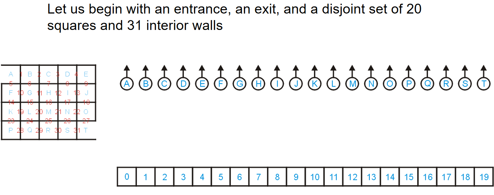

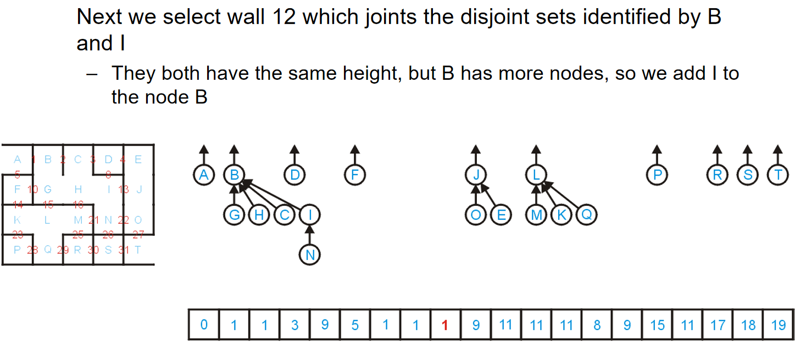

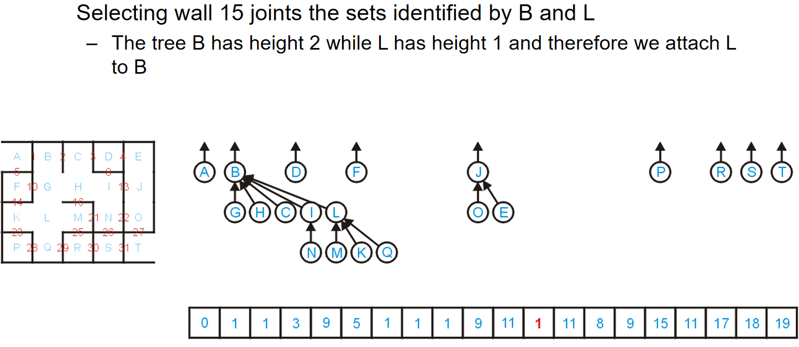

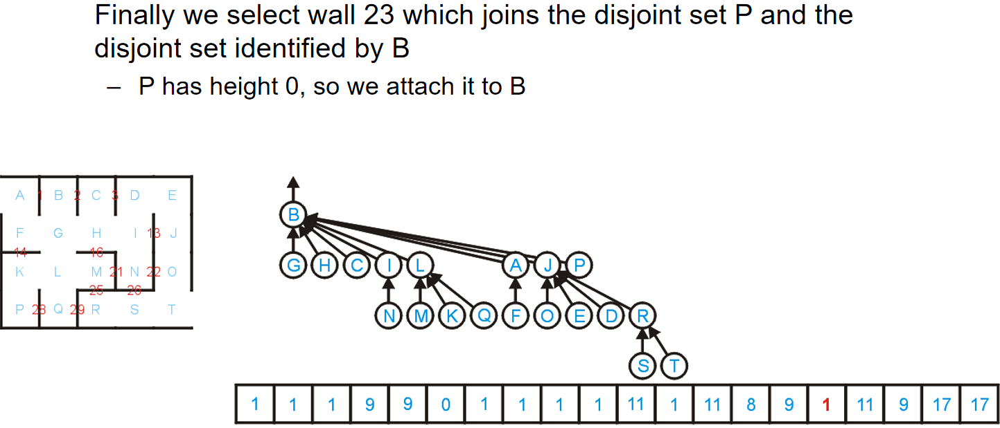

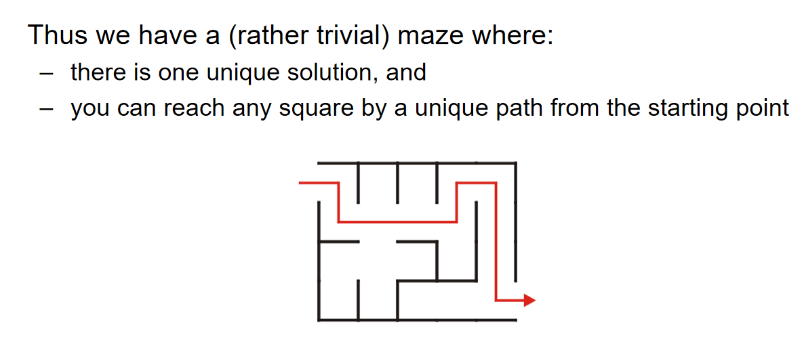

而且还有一个非常有意思的现象：最后的并查集树的平均节点深度是1.6，而在最坏的情况下平均节点深度是2。它的代码实现逻辑大致如下：

> Reference: kimi.moonshot.cn

````c++
#include <vector>
#include <algorithm>
#include <cstdlib>
#include <ctime>

// 假设 DisjointSets 是一个已经实现的并查集类
class DisjointSets {
public:
    DisjointSets(int size) {
        // 初始化并查集
    }

    int disjoint_sets() {
        // 返回集合的数量
    }

    int find(int x) {
        // 查找元素 x 所在的集合的代表元素
    }

    void set_union(int x, int y) {
        // 合并 x 和 y 所在的集合
    }
};

// 假设 Permutation 是一个已经实现的排列类
class Permutation {
private:
    std::vector<int> data;
public:
    Permutation(int n) {
        // 初始化排列
    }

    int next() {
        // 返回下一个元素并从排列中移除
    }
};

int main() {
    int m, n; // 迷宫的行数和列数
    DisjointSets rooms(m * n); // 创建并查集实例
    int number_of_walls = 2 * m * n - m - n; // 计算墙的数量
    bool is_wall[number_of_walls]; // 标记墙是否被检查过

    // 初始化墙的状态，初始时所有墙都是存在的
    for (int i = 0; i < number_of_walls; ++i) {
        is_wall[i] = true;
    }

    Permutation untested_walls(number_of_walls); // 创建未检查墙的排列

    // 生成迷宫，直到所有房间连通
    while (rooms.disjoint_sets() > 1) {
        int wall = untested_walls.next(); // 随机选择一堵墙
        int room[2]; // 存储相邻房间的索引
        find_adjacent_rooms(room, wall, n); // 查找墙两边的房间

        if (rooms.find(room[0]) != rooms.find(room[1])) {
            is_wall[wall] = false; // 标记墙为已检查，即移除墙
            rooms.set_union(room[0], room[1]); // 合并两个房间所在的集合
        }
    }

    return 0;
}

// 假设 find_adjacent_rooms 是一个已经实现的函数，用于查找墙两边的房间
void find_adjacent_rooms(int room[2], int wall, int n) {
    // 实现查找逻辑
}
````

### Painpoint

- The combination of path compression and union by rank ensures that both the time complexity of the Find and Union operations is nearly constant in practice.
- Joint Set的伪代码：

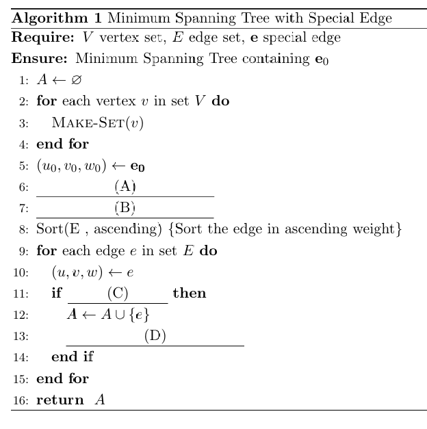

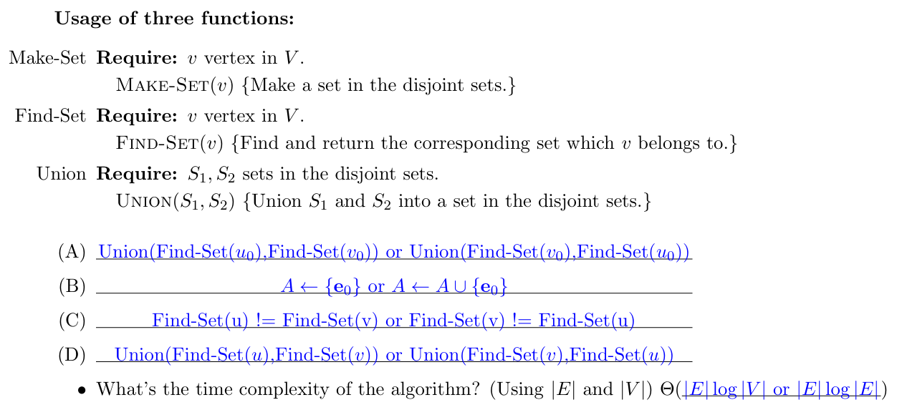

## Graph 图


什么是图？这个概念在离散数学中学习过，总的来说：***A graph is an abstract data type for storing adjacency relations***。图中两点之间的连线，就能够代表一种相邻关联。关于图，有很多的专业术语来描述它的组成部分，图的组成部分经典的有：Vertices, edges, degree and sub-graph, etc（顶点、边、度、子树）。同时我们也可以描述图中的路径：它们大致分为simple paths and cycles。

### Undirected Graph

- We will define an Undirected Graph ADT as a collection of ***vertices***：$V = \{v_1, v_2, ..., v_n\}$。The number of vertices is denoted by: $|V|=n$。与定点配对的，是：a collection E of unordered pairs $\{v_i, v_j\}$ termed ***edges*** which connect the vertices。下面是一个经典的无向图的例子：

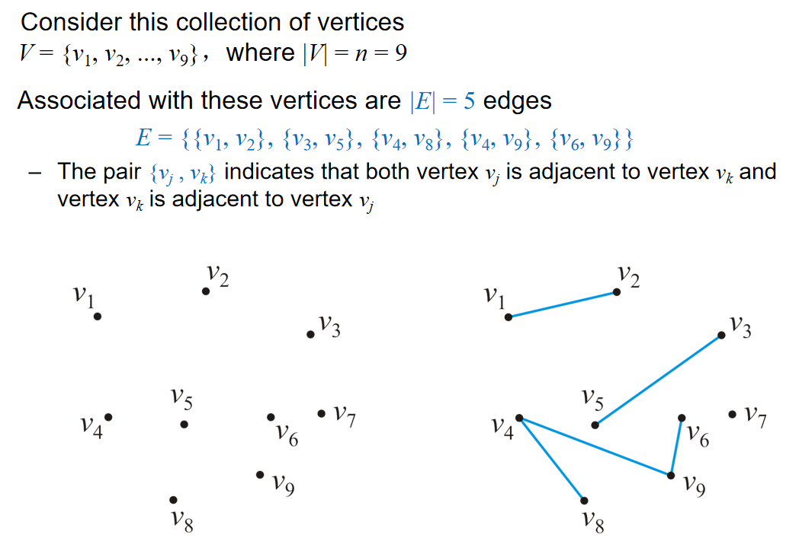

> 那么很明显地可以想到：在一个$|V|=n$的无向图中，边长的数量最多是：$\frac{n(n-1)}{2} = O(|V|)^2$。

- The ***degree*** of a vertex is defined as the number of adjacent vertices，and those vertices adjacent to a given vertex are its neighbors。简而言之，一个点和多少个其他的点相连，那么这个点的度就是多少；同时那些和这个点相连的点，就是这个点的邻居。

- A ***sub-graph*** of a graph contains a subset of the vertices and a subset of the edges that connect the subset of the vertices in the original graph。下面是一个经典的子图例子：左边的两个图都是右边这个图的子图。注意，子图中可以出现单独的点，没有任何的邻居；但是不可以出现一条一段消失的边。

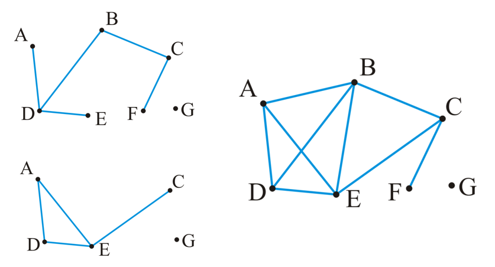

- A ***path in an undirected graph*** is an ordered sequence of vertices $(v0, v1, v2, ..., vk)$，where $\{vj – 1, vj\}$ is an edge for j = 1, ..., k。对于上述定义中1的路径，我们称为$v_0 \ to\ v_k$的路径，而且路径的长度是k。没错，路径的长度是k，不是k-1。

> 特别地：对于只有一个顶点组成的路径，我们认为这个路径的长度是0

除此之外，关于路径的定义还有一个非常重要的性质：A ***simple path*** has no repetitions (other than perhaps the first and last vertices)。重要！simple path中是不允许重复的顶点出现的（能够允许的重复顶点仅仅是起点和终点）！

- A ***simple cycle*** is a ***simple path*** of ***at least two vertices*** with the first and last vertices equal. 根据这个定义：路径的终点和起点是一样的，但是不允许一条路径上面只有两个点，而这两个点是一样的。
- ***Connectedness***: 两个顶点可以称为“相连的”如果以这两个点分别为终点和起点，它们之间有一条路径。
- ***Weighted Graphs***：A weight may be associated with each edge in a graph，and such a graph is called a weighted graph。这个权重可以在多种场景中代表多种含义，例如距离等。而在weighted graph中，路径的***length***是路径上所有边长的权重总和。

> 隐藏问题：两个顶点之间可能有多种路径，那么如何找到length最小的路径？

- ***Tree***: A graph is a tree if it is connected and there is a unique path between any two vertices

> 因为树的特殊性质，因此树这种图也有特殊的性质：
>
> - The number of edges is $|E| = |V| – 1$
> - The graph is acyclic, that is, it does not contain any cycles
> - Adding one more edge must create a cycle
> - Removing any one edge creates two unconnected sub-graphs

同时，通过操作，任何的树都可以转化为rooted tree：可以选择一个顶点作为根，然后定义它的邻居定点为它的孩子，然后递归定义。

- A ***forest*** is any graph that has no cycles。我们知道forest含有许多小树，然后每一个树里面又没有环，因此，forest可以用“没有环的图”来进行定义。因为forest的特殊定义，有以下结果：

> - The number of edges is $|E| < |V|$
> - The number of trees is $|V| – |E|$
> - Removing any one edge adds one more tree to the forest

### Directed Graph

有向图和无向图的最大区别，顾名思义，就是边有了方向，而因此定义有所差异的就有路径等。

- In a directed graph, the edges on a graph are be associated with a direction

> - Edges are ordered pairs (vj, vk) denoting a connection from vj to vk 
> - The edge (vj, vk) is different from the edge (vk, vj)
> - The maximum number of directed edges in a directed graph is: $|V|(|V|-1)=O(|V|)^2$

- The degree of a vertex in a directed graph: 

> - The out-degree of a vertex is the number of outward edges from the vertex
> - The in-degree of a vertex is the number of inward edges to the vertex

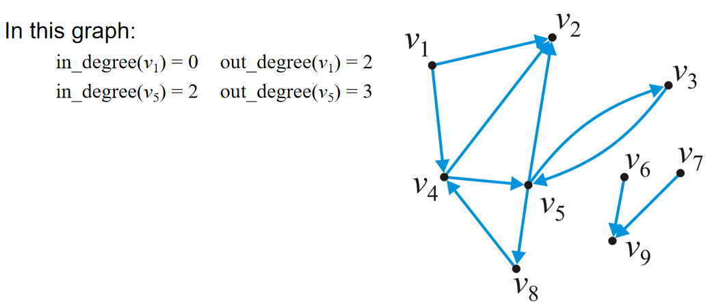

- 关于一些特殊的顶点，我们有特殊的术语来描述它们：对于in-degree为0的顶点，它们被称为***sources***；对于out-degree为0的顶点，它们被称为***sinks***。

> 例如上面的例子中，Sources顶点有1 6 7，Sinks有2 9.

- A ***path*** in a directed graph is an ordered sequence of vertices $(v0, v1, v2, ..., vk)$，where $\{vj – 1, vj\}$ is an edge for j = 1, ..., k。
- ***Correctedness***：两个顶点可以称为“相连的”如果以这两个点分别为终点和起点，它们之间有一条路径（注意这里的路径是带着方向的）。

> - A graph is strongly connected if there exists a directed path between any two vertices
> - A graph is weakly connected if there exists a path between any two vertices that ignores the direction

- ***Weighted Graphs***：In a weighted directed graphs, each edge is associated with a value。

> 需要注意的是：如果两个顶点之间互相都有一条edge，那么这两条edge的权重***没有硬性规定要相同***！

- A directed acyclic graph is a directed graph which has no cycle

### Representation

如何存储相邻关系呢？在离散数学中，介绍了adjacency matrix and adjacency list。这些思想都对于相邻关系的representation有重要的作用。首先我们介绍一下Graph ADT是什么。

> Reference: kimi.moonshot.cn

Graph ADT（Abstract Data Type）指的是图的抽象数据类型。在计算机科学中，ADT是一种数据模型，它定义了一组操作，但不指定这些操作的具体实现细节。对于图来说，Graph ADT定义了图的基本操作和属性。一个典型的Graph ADT包括以下操作：

1. **创建图**：创建一个新的空图。
2. **添加顶点**：向图中添加一个顶点。
3. **添加边**：在图中添加一条边，可能包括有向边和无向边。
4. **获取顶点**：根据顶点的标识符找到图中的顶点。
5. **获取所有顶点**：返回图中所有顶点的列表。
6. **判断顶点是否在图中**：判断一个顶点是否存在于图中。
7. **删除顶点**：从图中删除一个顶点及其相关的边。
8. **删除边**：从图中删除一条边。
9. **获取邻接顶点**：获取与指定顶点相邻的所有顶点。

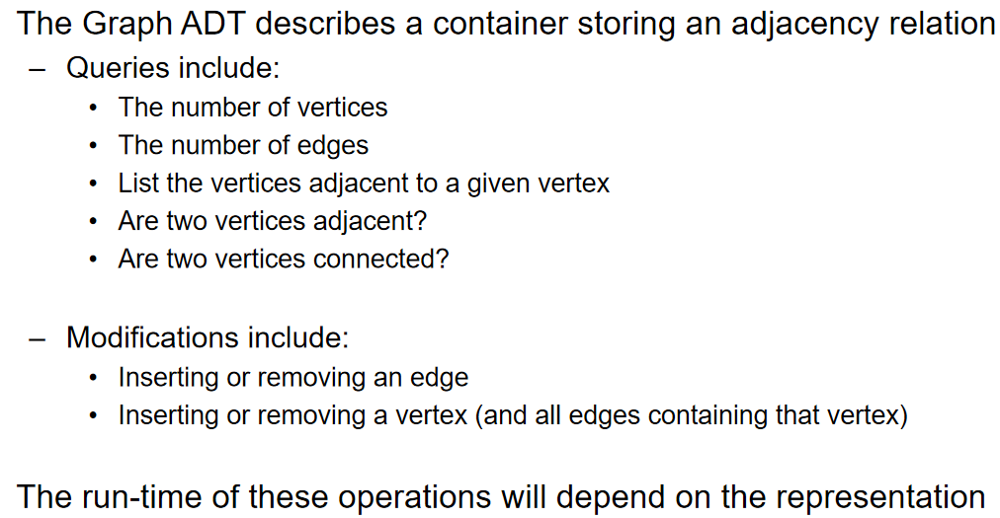

接下来介绍几种常见的相邻关系表达形式：

- ***Binary-relation list***

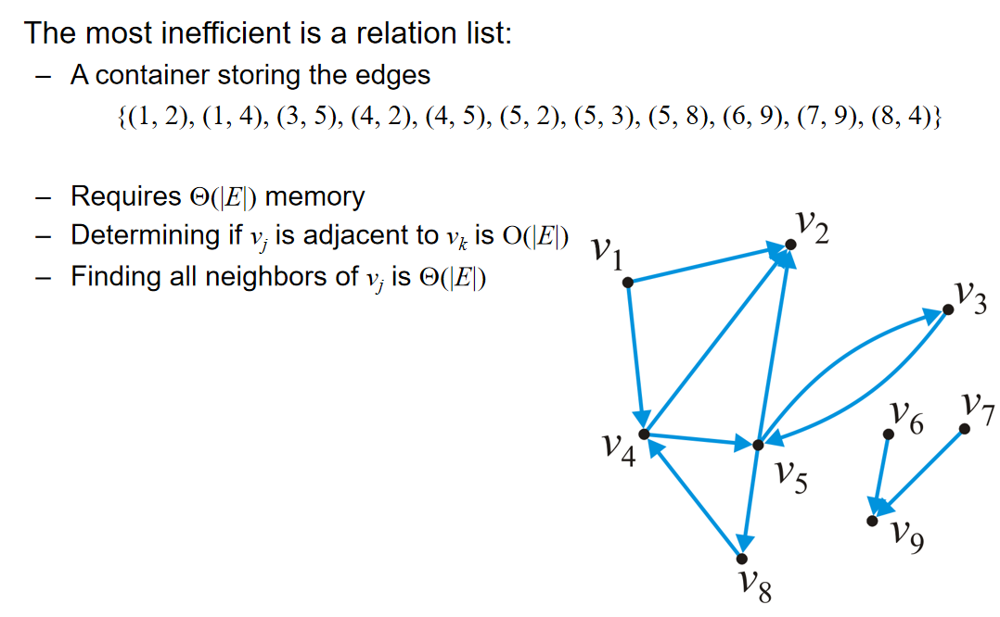

- ###### ***Adjacency matrix***

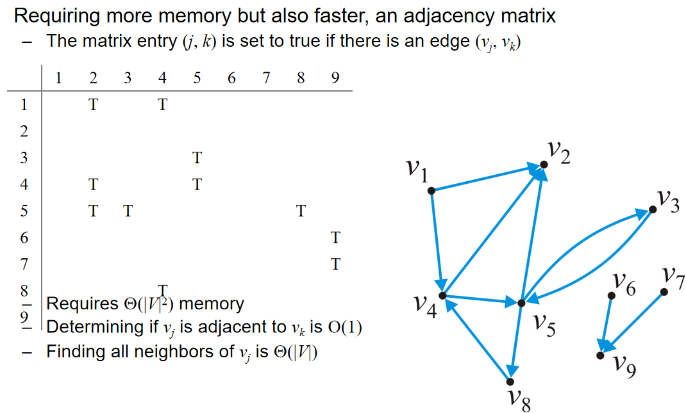

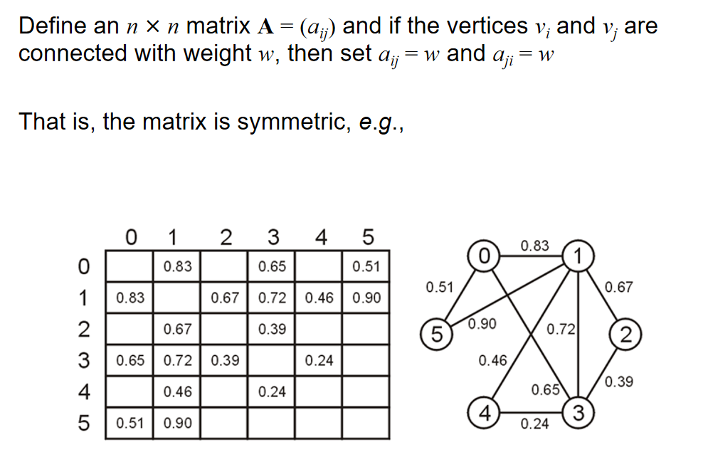

> 如果是无向图，那么这个矩阵应该是对称的；但是如果是有向图，那么就不必是对称的（虽然也可以做到对称）

那么在程序中如何设计数据结构来储存这个矩阵呢？首先我们必须给这个二维的数组分配空间。C++中对于非1维的数组没有太多的语法支持，因此我们此处必须采用："an array of arrays strategy"。假如说我们要储存n×n个浮点数，那么这个矩阵中的每一行都用一个数组来表示，而数组中第一个元素的指针必定是`double *`。因此，我们可以把n个数组的第一个元素的指针全部按照顺序储存起来，***也就是说，我们必须储存一个指向一个`double *`类型指针的指针***：`double **`。所以逻辑上：通过访问这个指针数组，就能够访问到对应数组的首元素的指针，然后就能非常接近索引操作了。

因此可以设计类似下方的代码：

````c++
int n = ?;
double **matrix;
matrix = new double * [n];
for (int i = 0; i < 16; i++){
    matrix[i] = new double[16];
}
matrix[3][4] = 3.14;
for (int i = 0; i < 16; i++){
    delete[] matrix[i];
}
delete[] matrix;
````

最后还有一个小问题：About default：如果两个点之间没有相连，那么它们之间的距离应该是多少？最合理的方式是设置为infinity；0是不符合逻辑的，因为一个点到自己本身的距离是0。因此初始化的时候，可以`matrix[i][j] = INF;`，其中INF代表无穷。代码实例如下：

````c++
static const double INF;
const double Weighted_graph::INF = std::numeric_limits<double>::infinity(); 
for ( int i = 0; i < N; ++i ) {
    for ( int j = 0; j < N; ++j ) {
        matrix[i][j] = INF;
    }
    matrix[i][i] = 0;
}
````

当然，如果adjacency代表的仅仅是两个顶点之间是否是connected，那么不同顶点之间初始化就为false，而相同顶点之间就初始化为true。代码示例如下：

> 一个顶点和自己是connected的，因为有路径（仅该点可以组成一个路径）。

````c++
for ( int i = 0; i < N; ++i ) {
    for ( int j = 0; j < N; ++j ) {
        matrix[i][j] = false;
    }

    matrix[i][i] = true;
}
````

内存要求很明显是$\Theta(n^2)$。另外地：Matrices where less than 5% of the entries are not the default value (either infinity or 0, or perhaps some other default value) are said to be sparse。

- ***Adjacency list***

> 用链表串联起该顶点的所有的邻居

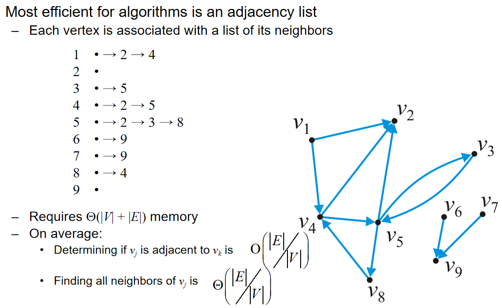

***对于无向图来说***，用一个由链表组成的数组来储存边。每一个顶点都有一个链表，链表里面储存了所有和这个点相连的顶点；同时，对于每一个节点来说，都应该包含了顶线的信息，以及这个两点之间的权重数值。因此关于节点，我们可以定义结构体如下：然后创建数组，里面储存的都是一个个链表的头结点。而为了减少冗余信息的记录，链表中含有的节点，其中的顶点索引都比头结点的高，因为否则在这个较高索引节点为头结点的链表中，这个较小顶点索引的节点储存的信息vice versa。

````c++
class Pair {
    private:
        double edge_weight;
        int adacent_vertex;
    public:
        Pair( int, double );
        double weight() const;
        int vertex() const;
};
SingleList<Pair> * array; // SingleList是之前的链表相关的封装的类
array = new SingleList<Pair>[16];
void insert( int i, int j, double w ) {
    if ( i < j ) {
        array[j].push_front( Pair(i, w) );
    } else {
        array[i].push_front( Pair(j, w) );
    }
}
````

下面是一个例子的生动可视化：

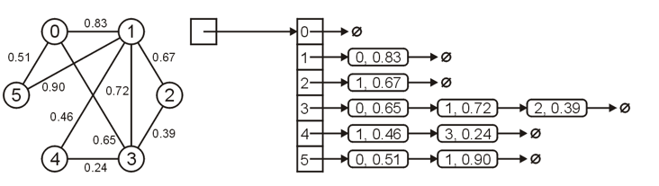

而对于无向图来说，那么上面提到的“减少冗余信息的记录”就是作废的。而其他方面都是高度相似的。下面是一个例子的生动可视化：

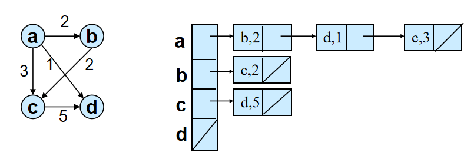

### Graph Traversal

#### Overall

一个图的遍历，traversal，是一种遍历图中所有顶点的方式，和树的遍历十分相似，图中的遍历也有广度优先和深度优先，而且更妙的是，实现方式都是高度相似的：用队列实现广度优先，用栈实现深度优先。

但是和树的遍历依然还是有差别：在两个顶点之间可能有多个路径，而树中“两个顶点只有唯一的一条路径”的性质让这个问题从未被思考过。为了避免重复访问一个顶点，因此我们必须得记录（track）那些顶点已经被访问过了：

- We may have an indicator variable in each vertex
- We may use a hash table or a bit array
- Requiring $\Theta(|V|)$ memory

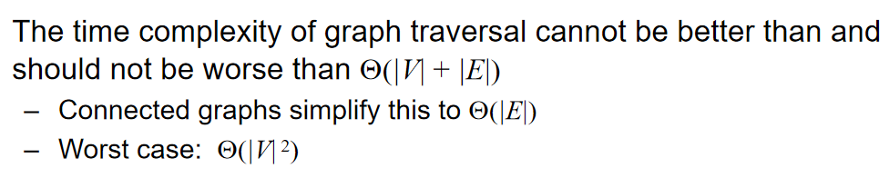

> Reference: ChatGPT o1-preview

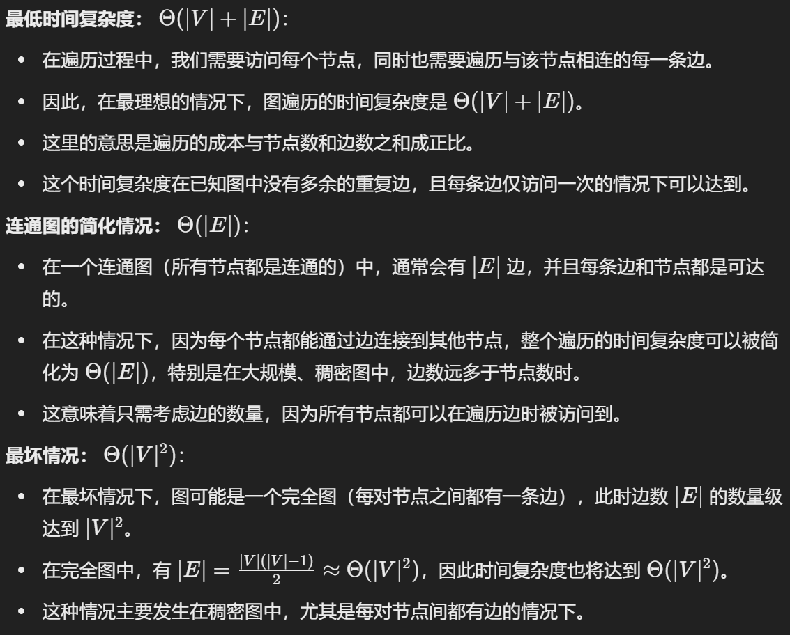

#### Breadth First Traversal

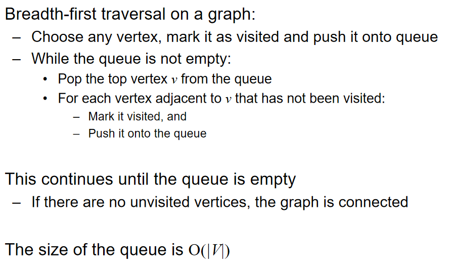

选定一个顶点，把它标记为“visited”并且放进队列。只要队列不是空的，那么就弹出队头的顶点，然后把这个顶点的unvisited的顶点都push进队列中，同时这些被push的顶点都要标记为visited。代码示例如下：

````c++
void Graph::breadth_first_traversal( Vertex *first ) const {
    unordered_map<Vertex *, int> hash;
    hash.insert( first );
    std::queue<Vertex *> queue;
    queue.push( first );

    while ( !queue.empty() ) {
        Vertex *v = queue.front();
        queue.pop();
        // Perform an operation on v

        for ( Vertex *w : v->adjacent_vertices() ) {
            if ( !hash.member( w ) ) {
                hash.insert( w );
                queue.push( w );
            }
        }
    }
}
````

#### Depth First Traversal

##### Recursive DFS

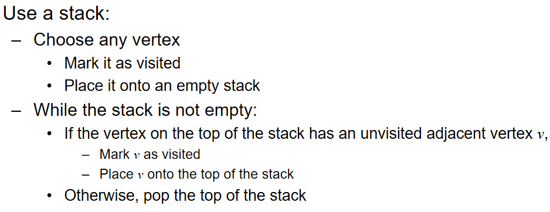

````pseudocode
procedure DFS(G, v) is
    label v as discovered
    for all directed edges from v to w that are in G.adjacentEdges(v) do
        if vertex w is not labeled as discovered then
            recursively call DFS(G, w)
````

> 虽然伪代码中有for all，但是因为是函数迭代，所以结果上来看，仅仅是考虑一个邻居中的不是visited的点，然后关注这个新的点

可以使用栈来协助实现：选择一个顶点入栈并标记为visited；然后如果栈不是空的话，那么如果栈顶的顶点有unvisited邻居，那么***一个***这样的邻居顶点入栈，并被标记为visited；而如果栈顶顶点的所有邻居都是visited的话，那么这个元素就会被弹出。顶点依次入栈的顺序，就是DFT的顺序。这种栈叫做路径栈

##### Iterative DFS

这种DFS有点类似树那一节中介绍的DFS：将一个顶点的所有的unlabeled邻居都放进栈中，然后***弹出的时候***才标记为labeled：这样的栈使用方法称为前沿栈。

````pseudocode
procedure DFS_iterative(G, v) is
    let S be a stack
    S.push(v)
    while S is not empty do
        v = S.pop()
        if v is not labeled as discovered then
            label v as discovered
            for all edges from v to w in G.adjacentEdges(v) do 
                S.push(w)
````

> 之前在介绍*树*的时候，里面提到的DFT是将栈顶节点的所有孩子都放入栈中。树的DFT使用的就是前沿栈。

#### Applications

##### Connectedness

我们可以使用图的遍历来帮助我们判断两个顶点之间是否是相连的（i.e.，是否两点之间有路径），以及帮助我们把顶点都分成connected sub-graphs。

首先是判断两个顶点之间是否相连：只要以其中一个顶点为起点，然后开始图的遍历，那么如果遍历中访问到了另外一个顶点，那么我们就知道这两个顶点之间是相连的了。

> By the way：如果以一个顶点进行图的遍历之后，如果图的任何一个点都标记为了visited的话，那就说明这个图是connected

其次是我们希望把顶点都分成connected sub-graphs。如果树中有unvisited顶点，那么就任选一个然后进行遍历，然后所有的遍历到的点都放进一个集合里面，并且都标记为visited。重复这样的操作直到所有的点都是visited的。

> Tip：我们可以使用一个并查集作为集合，这样的话就有最大化效率。那么相当于：在一次完整的遍历中，第一次选中的unvisited元素就是并查集的代表元素。示意图如下：

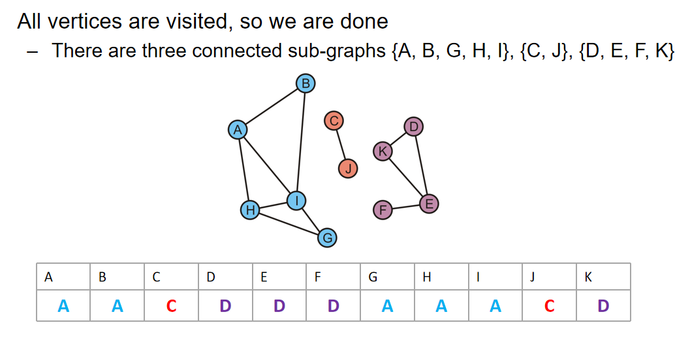

那么上述流程的实现还有几个细节问题：如何实现一个集合用来储存所有的unvisited顶点，从而能够在常数时间内访问一个unvisited顶点，并且在这个顶点在被遍历访问到后，从这个集合中删除呢？一个好的solution是：用哈希表来储存所有的未被访问的顶点；或者是用一个数组来储存顶点，并且对于每一个顶点储存它在数组中的位置。

此处我们来探讨后者的具体实现。如下图：创建了两个数组，第一个数组中的每一个元素都是未被访问的，然后另外一个数组索引是顶点，然后对应的是该顶点在数组中的索引。

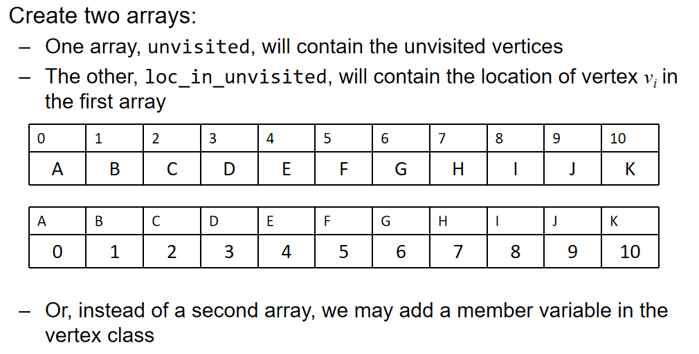

那么删除元素的时候，这里的操作值得注意：假如说我们删除掉D元素，那么通过D在数组二中进行索引，发现在第一个数组中的索引是3，因此成功在第一个数组中的3号索引位置元素。但是之后，还需要将第一个数组中的最后一个元素K***移动***到3号位置，同时通过K索引第二个数组，将K的索引信息更新为3，因为这正是K元素移动到的删除D之后的第一个数组中的空位。

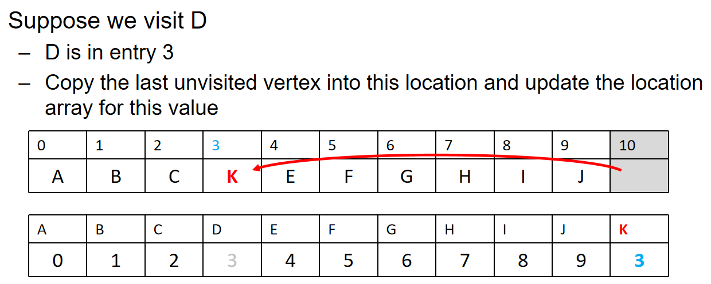

##### Unweighted path length

问题：在一个没有权重的图中，找到一个顶点到另外所有顶点的距离。其中距离的定义是：两个顶点之间最短路径的长度。Solution如下：

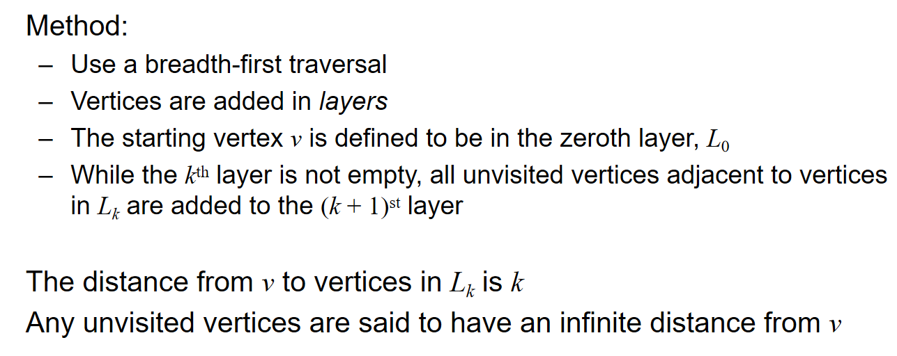

维护一个栈：开始选一个感兴趣的顶点入栈并标记为visited，记为layer0；然后顶点出栈，顶点的邻居全部入栈并标记为visited，记为layer1；然后目前所有的元素都要出栈，然后每出栈一个顶点，就把它的邻居的入栈；这样重复操作，直到一次操作中，目前所有的栈中元素都出栈，然后没有任何一个元素能够入栈了，栈变成了空栈，那么这个时候就结束操作（其实上述的所有操作就是广度优先搜索）。结果示意图如下：

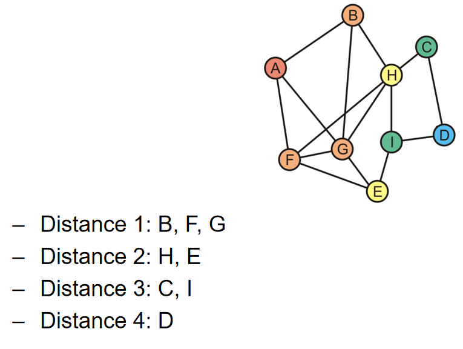

那么这样一来，我们就能知道这个我们感兴趣的点到每一个顶点的距离是多少了。

***$Theorem: $If, in a breadth-first traversal of a graph, two vertices v and w appear in layers Li and Lj, respectively and {v, w} is an edge in the graph, then i and j differ by at most one.*** 证明如下：

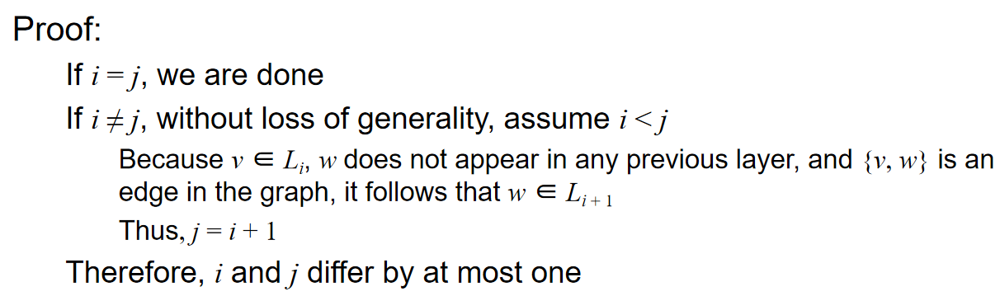

##### Identifying bipartite graphs

二分图，bipartite graph的定义：A bipartite graph is a graph where the vertices V can be divided into two disjoint sets V1 and V2 such that every edge has one vertex in V1 and the other in V2 . 肉眼判断一个图是不是二分图其实是一件困难的事情，那么有没有算法能够帮助我们实现二分图的判断呢？在离散数学中，介绍了两种颜色标色的方式来判断一张图是不是二分图，那么能不能类似地设计流程呢？流程如下：


也就是说第一次入栈的用红色，第二次的是蓝色，第三次的是红色，以此类推；然后弹栈的过程中，这个元素周围的元素，应该要么是unvisited，要么是另外一个颜色的，i.e.，不能和自己的颜色相同；一旦发现了反例，那么立马直到这个元素不是二分图。

> DFS and BFS都可以用来实现这个任务

### Painpoint

- Any tree is a bipartite graph.
-  DAG(Directed Acyclic Graphs) must have at least one vertex with no incoming edges (source) and at least one vertex to be the sink.
- Undirected Graph $G = (V, E)$ is stored in an adjacency matrix $A$. We let $A_{i, j}=1$ if and only if there is an edge between $V_i$ and $V_j$ in G, otherwise $A_{i,j}=0$. We want to know whether there is a path \textbf{with length $m$} between $V_i$ and $V_j$ by visiting $P_{i,j}$; if $P_{i,j}$=0, then there is no such path. Then P is $A^m$. 

> 这在离散数学中学过

- Both the time complexity of DFS and that of BFS are $\Theta(|V| + |E|)$. 这是因为每一个顶点都遍历过，而每一条边都检查过（检查体现在：一个点的邻居是否是visited）
- In a simple undirected graph with 3n vertices and 3 connected components, the maximum number of edges in the graph is $\frac{(3n-3)(3n-2)}{2}$, 而不是$\frac{3(n-1)n}{2}$
- A directed graph with n vertices has n edges may be strongly connected.
- Adjacency matrix ***is not*** better than adjacency list when inserting a new vertex.
