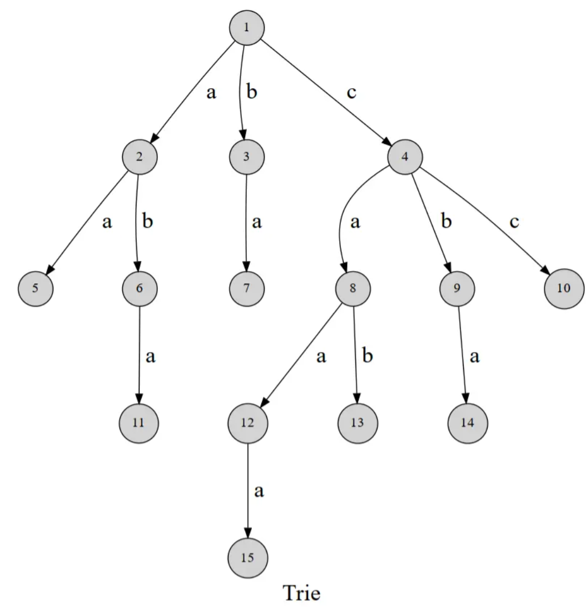
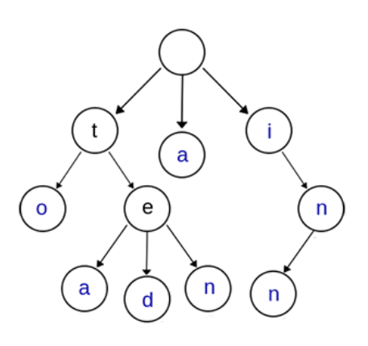

# 进阶与拓展

在CS101课程的学习过程中，除了固定的一些算法和数据结构，还有一些课上或TA补充的知识。在此进行记录。

## Trie树

> Reference: [1] oi.wiki
>
> [2] [Trie树（Prefix Tree）介绍-CSDN博客](https://blog.csdn.net/lisonglisonglisong/article/details/45584721)

Trie的名字来源于re***trie***val，Trie树又称为字典树、前缀树、单词查找树，是一种多叉树的结构。一种经典的Trie树如下[1]：




这棵树用边来表示字母，从根节点到树上的每一个节点就代表一个字符串。最经典的应用就是检索字符串：判断一个字符串是否在字典中出现过。

另一种trie树如下[2]：



上图是一棵Trie树，表示了关键字集合{“a”, “to”, “tea”, “ted”, “ten”, “i”, “in”, “inn”} 。从上图可以归纳出Trie树的基本性质：

- ***根节点不包含字符***，除根节点外的每一个子节点都包含一个字符。
- 从根节点到某一个节点，路径上经过的字符连接起来，为该节点对应的字符串。
- 每个节点的所有子节点包含的字符互不相同。
- 通常在实现的时候，会在节点结构中设置一个标志，用来标记该结点处是否构成一个单词（关键字）。

可以看出，Trie树的关键字一般都是字符串，而且Trie树把每个关键字保存在一条路径上，而不是一个结点中。另外，***两个有公共前缀的关键字，在Trie树中前缀部分的路径相同***，所以Trie树又叫做前缀树（Prefix Tree）。Trie树的核心思想是***空间换时间***，利用字符串的公共前缀来减少无谓的字符串比较以达到提高查询效率的目的。

Trie树的常见操作包括插入、查找和删除字符串：

> Reference: chatgpt.com

- **插入字符串**

从根节点开始，依次检查字符串的每个字符，沿树路径插入节点。如果字符节点不存在，则创建新节点，最后一个字符节点标记为字符串的结尾。

- **查找字符串**

从根节点开始，逐字符向下检查，如果路径上有每个字符节点且结尾节点存在，则表示字符串存在于Trie树中。

- **删除字符串**

从根节点开始遍历，找到要删除的字符串末尾节点，如果没有其他子节点则可以删除节点，递归向上检查和删除多余节点。

Trie树被广泛应用于处理字符串相关的问题：

- **自动补全**：例如输入“app”后可以自动提示“apple”、“application”等前缀匹配的单词。
- **拼写检查**：查找前缀或近似匹配的单词，用于纠正拼写错误。
- **字符串前缀匹配**：快速查找一组字符串中所有以某个前缀开始的单词。
- **字符串排序**：Trie树可以对大量字符串按字典序进行排序，思路也很简单：遍历一次所有关键字，将它们全部插入trie树，树的每个结点的所有儿子很显然地按照字母表排序，然后先序遍历输出Trie树中所有关键字即可。
- **作为其他数据结构和算法的辅助结构**：如后缀树；[AC自动机][[AC 自动机 - OI Wiki].

以下是一个手动实现的trie树：

````python
class TrieNode:
    def __init__(self):
        self.children = {}  # 存储子节点
        self.is_end_of_word = False  # 是否为单词结尾,i.e.,是不是叶节点

class Trie:
    def __init__(self):
        self.root = TrieNode()
    
    def insert(self, word):
        node = self.root
        for char in word:
            if char not in node.children:
                node.children[char] = TrieNode()
                # 如果没有，开辟并进入
            node = node.children[char]
        node.is_end_of_word = True
    
    def search(self, word):
        node = self.root
        for char in word:
            if char not in node.children:
                return False
            node = node.children[char]
        return node.is_end_of_word
    
    def starts_with(self, prefix):
        node = self.root
        for char in prefix:
            if char not in node.children:
                return False
            node = node.children[char]
        return True
````

````c++
#include <iostream>
#include <unordered_map>
#include <string>

class TrieNode {
public:
    bool isEndOfWord;  // 表示是否为单词结尾
    std::unordered_map<char, TrieNode*> children;  // 存储子节点

    TrieNode() : isEndOfWord(false) {}
};
class Trie {
private:
    TrieNode* root;

public:
    Trie() {
        root = new TrieNode();
    }
    // 插入一个单词
    void insert(const std::string &word) {
        TrieNode* node = root;
        for (char ch : word) {
            if (node->children.find(ch) == node->children.end()) {
                node->children[ch] = new TrieNode();
            }
            node = node->children[ch];
        }
        node->isEndOfWord = true;
    }
    // 查找一个完整单词是否存在
    bool search(const std::string &word) {
        TrieNode* node = root;
        for (char ch : word) {
            if (node->children.find(ch) == node->children.end()) {
                return false;
            }
            node = node->children[ch];
        }
        return node->isEndOfWord; // 注意判断是“完整单词”
    }
    // 查找是否存在以指定前缀开始的单词
    bool startsWith(const std::string &prefix) {
        TrieNode* node = root;
        for (char ch : prefix) {
            if (node->children.find(ch) == node->children.end()) {
                return false;
            }
            node = node->children[ch];
        }
        return true;
    }
    // 递归释放Trie节点的内存
    void deleteTrie(TrieNode* node) {
        for (auto &child : node->children) {
            deleteTrie(child.second);
        }
        delete node;
    }
    // 析构函数
    ~Trie() {
        deleteTrie(root);
    }
};
````

## Moore's Voting

> Reference: [摩尔投票算法（Moore‘s Voting Algorithm）及例题_moore algorithm-CSDN博客](https://blog.csdn.net/liupang14159/article/details/131752116)

摩尔投票算法（Moore’s Voting Algorithm）是一种用于在数组中寻找多数元素的有效方法。所谓多数元素，是指在数组中出现次数超过一半以上的元素。最经典的例子就是用于众数的寻找。

摩尔投票算法的基本思想很简单，它通过消除不同元素之间的对抗来找到可能的多数元素。***算法遍历数组并维护两个变量***：候选元素和其对应的票数。开始时，候选元素为空，票数为0。然后对于数组中的每个元素，执行以下步骤：

1. 如果票数为0，将当前元素设为候选元素，并将票数设置为1。
2. 如果当前元素等于候选元素，则票数加1。
3. 如果当前元素不等于候选元素，则票数减1。

**这样做的效果是，相同元素的票数会相互抵消，不同元素的对抗也会导致票数减少。由于多数元素的出现次数超过一半以上，所以最终留下的候选元素就很有可能是多数元素。**

遍历完整个数组后，候选元素即为多数元素的候选者。然后我们需要进一步验证候选元素是否真的是多数元素，***因为可能存在没有多数元素的情况***。我们再次遍历数组，统计候选元素的出现次数，如果发现它的出现次数超过了一半以上，则确认它为多数元素；否则，表示没有多数元素。

这种算法时间复杂度是$\Theta(n)$，而且不需要额外空间，是一种非常香的算法。

变式：如果需要找到出现次数超过$\lfloor\frac{n}{3}\rfloor$的元素呢？ 可以这样设想，***这次需要投票选举出一位或者两位候选人***，而每位候选人的票数只要大于总人数的三分之一即可。基于摩尔投票算法的核心思想，可以这么写：

- 我们每次检测当前元素是否为第一个选中的元素或者第二个选中的元素。


- 每次我们发现当前元素与已经选中的两个元素都不相同，***则将两个候选元素都进行抵消一次，因为当三个元素互不相同时会被抵消，最终只剩下1个元素。***


- 如果存在最终选票大于 0 的元素，我们还需要再次统计已选中元素的次数,检查元素的次数是否大于$ \lfloor\frac{n}{3}\rfloor $


## Advanced Master Theorem

> Reference: [Advanced master theorem for divide and conquer recurrences - GeeksforGeeks](https://www.geeksforgeeks.org/advanced-master-theorem-for-divide-and-conquer-recurrences/)

主定理能够处理$T(n) = aT(n/b) + \Theta(n^d)$的情况，但是这个杂项不能支持对数级就有点难受。那么有没有一种强大的主定理能够支持对数级函数呢？那么广义主定理（*advanced master theorem*）不容错过：

对于$T(n) = aT(n/b)+\Theta(n^klog^pn)$来说：

- if $a > b^k$, then $T(n) = θ(n^{log_ba})$

- if $ a = b^k$, then :

  (a) if p > -1, then $T(n) = θ(n^{log_ba} log^{p+1}n) $

  (b) if p = -1, then $T(n) = θ(n^{log_ba} log(logn) $

  (c) if p < -1, then $T(n) = θ(n^{log_ba}) $

-  if $a < b^k$, then 
  (a) if p >= 0, then $T(n) = θ(n^k log^pn) $
  (b) if p < 0, then $T(n) = θ(n^k) $

## 单调队列

给出一个长度为n的数组，编程输出每k个连续的数中的最大值和最小值。暴力算法非常容易超时，那么如何优化？答案就是单调队列+滑动窗口。

每k个连续的树视为一个滑动窗口，为了维护滑动窗口的最大值，那么我们考虑如下的逻辑：

- 创建一个单调队列，队列里面单调递减，那么很明显队头的元素就是窗口中的最大值
- 如果队列是空的，那么滑动一次窗口之后，新看到的元素进队
- 如果队列不是空的，那么滑动一次窗口之后，判断新看到的元素：

1. 如果比队头元素还大，那么队列清空，新元素进队
2. 如果队尾元素比新元素大, 新元素进队
3. 如果新元素在队头和队尾元素范围之间, 那么不断pop_back(), 直到队尾元素比新元素大
4. 滑动窗口之前, 访问front(), 它是窗口中的最大值.

- 移动窗口之后, 要判断队头元素是否出了视野; 如果离开视野，那么队头元素出队

这个逻辑的核心是什么? **是储存可能是之后窗口中最大值的元素!** 如果新元素非常大, 那么队列里面储存的元素**不可能是**后面窗口中看到的最大的元素了；而虽然如果新元素很小，它依然有可能是后面窗口中的最大值，因为前面的元素**可能会离开视野**。

实例代码：

> Reference: oi.wiki

````c++
#include <cstdlib>
#include <cstring>
#include <iostream>
constexpr int MAXN = 1000100;
using namespace std;
int q[MAXN], a[MAXN];
int n, k;

void getmin() {  // 得到这个队列里的最小值，直接找到最后的就行了
  int head = 0, tail = -1;
  for (int i = 1; i < k; i++) {
    while (head <= tail && a[q[tail]] >= a[i]) tail--;
    q[++tail] = i;
  }
  for (int i = k; i <= n; i++) {
    while (head <= tail && a[q[tail]] >= a[i]) tail--;
    q[++tail] = i;
    while (q[head] <= i - k) head++;
    cout << a[q[head]] << ' ';
  }
}

void getmax() {  // 和上面同理
  int head = 0, tail = -1;
  for (int i = 1; i < k; i++) {
    while (head <= tail && a[q[tail]] <= a[i]) tail--;
    q[++tail] = i;
  }
  for (int i = k; i <= n; i++) {
    while (head <= tail && a[q[tail]] <= a[i]) tail--;
    q[++tail] = i;
    while (q[head] <= i - k) head++;
    cout << a[q[head]] << ' ';
  }
}
````

## 单调栈

何为单调栈？顾名思义，单调栈即满足单调性的栈结构。与单调队列相比，其只在一端进行进出。将一个元素插入单调栈时，为了维护栈的单调性，需要在保证将该元素插入到栈顶后整个栈满足单调性的前提下弹出最少的元素。

使用单调栈的时候，从栈顶读出来一个元素，该元素满足单调性的一端。

单调栈是一种特殊的数据结构，通常用于在保持栈内元素单调递增或递减的情况下完成一些复杂问题的高效解答。它的主要应用场景包括解决具有单调性质的区间、范围问题。以下是一些典型的应用场景：

> Reference: ChatGPT

1. **下一个/前一个更大或更小元素问题**：
   - 给定一个数组，找到每个元素的“下一个更大元素”或“前一个更小元素”。可以使用单调栈来维持栈中元素的递增或递减顺序，逐个遍历数组元素并找到符合条件的元素。
   - 例如，LeetCode 的“下一个更大元素”问题（Next Greater Element）就可以用单调栈实现，时间复杂度是 $O(n)$。
2. **柱状图中的最大矩形问题**：
   - 给定一个柱状图，要求计算其中可以形成的最大矩形面积。可以使用单调递增栈来帮助找到每个柱子的左右边界，从而计算出该柱子为高度的矩形面积。
   - 这是著名的“柱状图中最大的矩形”问题（Largest Rectangle in Histogram）。
3. **接雨水问题**：
   - 在给定的数组中，求可以接住的雨水量。使用单调栈来存储左侧比当前元素低的柱子位置，通过匹配右侧更高的柱子来计算中间积水的高度和宽度。
   - 这种方法可以在 $O(n)$ 的时间复杂度内解决问题，节省空间。
4. **滑动窗口中的最值问题**：
   - 在固定长度的滑动窗口中，求每次滑动后的最大或最小值。单调栈可以在维护窗口内单调性的同时，使得每次移动窗口后快速获取窗口中的最值。

这些场景中，单调栈通过压入和弹出元素实现高效的单调性维护，在寻找范围边界、计算跨度和积水等问题上起到了关键作用。


