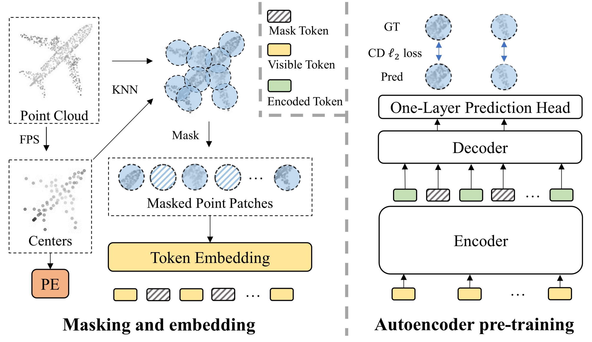
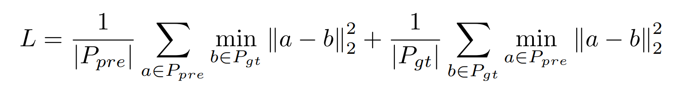

# Analysis of PointMAE

## Introduction

掩码自编码作为一种很有前途的自监督学习方案，在自然语言处理和计算机视觉方面具有显著的进步。***受此启发，我们提出了一种用于点云自监督学习的掩蔽自动编码器的简洁方案，以解决点云特性带来的挑战，包括位置信息泄漏和信息密度不均匀。具体来说，我们将输入点云划分为不规则的点斑块，并以高比例随机屏蔽它们。然后，一个基于 Transformer 的标准自动编码器，具有非对称设计和移动掩码标记操作，从未屏蔽的点补丁中学习高级潜在特征，旨在重建屏蔽的点补丁。***大量的实验表明，我们的方法在预训练期间是有效的，并且在各种下游任务中可以很好地推广。具体来说，我们的预训练模型在 ScanObjectNN 上实现了 85.18% 的准确率，在 ModelNet40 上实现了 94.04% 的准确率，优于所有其他自监督学习方法。我们通过我们的方案展示了一个完全基于标准 Transformer 的简单架构可以超越监督学习的专用 Transformer 模型。我们的方法还将小镜头物体分类中最先进的精度提高了 1.5%-2.3%。此外，我们的工作启发了将语言和图像的统一架构应用于点云的可行性。


Transformer最初用于文本生成。给出数个单词，然后根据模型预测出可能的下一个单词(实际上是许多可能及其对应的可能性)，然后不断重复这样的操作就能创造文本。在论文的场景中，将一个点云进行部分（并且是高比例）的遮掩，然后尝试利用Transformer的方法来学习未被遮掩的部分的特征，从而复原原来的点云模型。这种想法是自然的，因为transformer已经用于了文本、音频和图片的“遮挡+学习+复原”的任务了。


自监督学习从未标记的数据中学习潜在特征，而不是基于人类定义的注释构建表示。它通常是通过设计一个pretext任务来预训练模型，然后对下游任务进行微调来完成的。自监督学习对标记数据的依赖较少，显著提高了自然语言处理（NLP）[11,4,32,33]和计算机视觉[28,3,8,18,7,2,17,49]。其中，图1所示的掩码自动编码[17,49,2]是一种很有前途的语言和图像方案。它随机屏蔽了一部分输入数据，并采用自动编码器来重建与原始屏蔽内容相对应的显式特征（例如像素）或隐式特征（例如离散标记）。由于屏蔽部件不提供数据信息，因此此重建任务使自动编码器能够从未屏蔽部件中学习高级潜在特征。此外，屏蔽自动编码的强大功能归功于其自动编码器的骨干网，该主干采用Transformers[40]架构。例如，NLP 中的 BERT [11] 和计算机视觉中的 MAE [17] 都应用了屏蔽自动编码，并采用标准 Transformer 架构作为自动编码器的骨干，以实现最先进的性能。


屏蔽自动编码的思想也适用于点云自监督学习，因为点云本质上与语言和图像共享一个共同的属性（见图1）。具体来说，承载信息的基本元素(token?)（即点、词汇表和像素）不是独立的。相反，相邻元素形成一个有意义的子集来呈现局部特征。与局部要素一起，完整的元素集构成了全局要素。因此，在将点子集嵌入到token中后，可以使用语言和图像进行类似的处理。此外，考虑到点云的数据集相对较小，屏蔽自编码作为一种自监督学习方法，可以自然地满足作为自编码器主干的 Transformers 架构的大数据需求。事实上，最近的一项工作Point-BERT [54]尝试了一种类似于掩码自动编码的方案。该文提出一种BERT式的预训练策略，即屏蔽点云的输入token，然后采用Transformer架构预测掩码token的离散token。然而，这种方法相对复杂，因为它需要在预训练之前训练基于DGCNN [44]的离散变分自动编码器（dVAE）[35]，并且在预训练期间严重依赖对比学习和数据增强。此外，在预训练过程中，来自其输入的屏蔽令牌会从Transformers的输入进行处理，导致位置信息过早泄露，计算资源消耗高。与他们的方法不同，更重要的是，为了将掩码自编码引入点云，我们旨在设计一种简洁高效的掩码自编码器方案。为此，我们首先从以下几个方面分析了点云引入掩码自编码的主要挑战：

（i） 缺乏统一的变压器架构。与NLP中的Transformers[40]和计算机视觉中的Vision Transformer（ViT）[12]相比，Transformer的点云架构研究较少，而且相对多样化，主要是因为小数据集无法满足Transformer的大数据需求。与之前使用专用 Transformer 或采用额外的非 Transformer 模型来辅助的方法不同（例如 Point-BERT [54] 使用额外的 DGCNN [44]），我们的目标是完全基于标准 Transformer 构建自动编码器的骨干，它可以作为点云的潜在统一架构。

（ii） 掩码token的位置嵌入导致位置信息泄露。在屏蔽的自动编码器中，每个屏蔽的部分都由一个共享加权的可学习掩码标记替换。所有掩码token都需要通过位置嵌入在输入数据中提供其位置信息。然后经过自动编码器处理后，使用每个掩码标记来重构相应的掩码部分。对于语言和图像来说，提供位置信息不是问题，因为它们不包含位置信息。虽然点云在数据中自然具有位置信息，但位置信息泄露以掩盖token使重建任务变得不那么具有挑战性，这对自动编码器学习潜在特征是有害的。我们通过将掩码标记从自动编码器编码器的输入转移到自动编码器解码器的输入来解决此问题。这延迟了位置信息的泄漏，并使编码器能够专注于从未屏蔽的零件中学习特征。

（iii） 与语言和图像相比，点云以不同的密度携带信息。语言包含高密度信息，而图像包含大量冗余信息[17]。在点云中，信息密度分布相对不均匀。构成关键局部要素的点（例如，尖角和边缘）包含的信息密度比构成不太重要的局部要素（例如，平面）的点高得多。换言之，如果被屏蔽，在重建任务中，包含高密度信息的点更难恢复。这可以在重建示例中直接观察到，如图 2 所示。以图2的最后一行为例，masked的桌面（左）可以很容易地恢复，而masked摩托车的车轮（右）的重建要差得多.

尽管点云包含的信息密度不均匀，但我们发现高比例（60%-80%）的随机掩蔽效果很好，这与图像惊人地相同。这表明点云在信息密度方面类似于图像而不是语言。在分析的驱动下，我们通过设计一种简洁高效的掩蔽自动编码器方案（Point-MAE），提出了一种新型的点云自监督学习框架。如图 3 所示，我们的 Point-MAE 主要由点云遮蔽和嵌入模块以及自编码器组成。将输入点云划分为不规则的点斑块，以高比例随机屏蔽，以减少数据冗余。然后，自编码器从未屏蔽的点面片中学习高级潜在特征，旨在重建坐标空间中的屏蔽点面片。具体来说，我们的自动编码器的主干完全由标准Transformer模块构建，并采用非对称编码器-解码器结构[17]。编码器仅处理未屏蔽的点面块。然后，将编码的标记和掩码标记作为输入，具有简单预测头的轻量级解码器重建掩码点补丁。与从编码器输入处理掩码令牌相比，将掩码令牌转移到轻量级解码器可以节省大量计算，更重要的是，避免了位置信息的早期泄露。我们的方法是有效的，预训练的模型在各种下游任务上都很好地泛化了。在对象分类任务中，我们的Point-MAE在真实数据集ScanObjectNN的最难设置下实现了85.18%的准确率，在干净的对象数据集ModelNet40上实现了94.04%的准确率，优于所有其他自监督学习方法。同时，Point-MAE超越了所有来自监督学习的专用Transformers模型。

## PointMAE

**输入前的处理步骤：**

1. ShapeNet里的点云先用FPS（Farthest Point Sampling）采样1024个点
2. 再采用FPS，采样得到64个point patches的中心点
3. 采用KNN算法，得到每个中心点的32个邻近点，构成point patches
4. 通过64个point patches中心点通过一个MLP得到positional embedding
5. random mask 60%的point patch中心点
6. 被mask的point patch用一个可学习的mask token代替，另外的visible point patches通过一个mini-PointNet得到其embedding



**PointMAE的处理步骤：**

1. visible tokens + 其对应的positional embedding，输入进Encoder**（注意：每个Encoder的Transformer Block都要输入这个positional embedding），**得到embedded tokens
2. embedded tokens和mask tokens进行concatenation，并加上对应的positional embedding，进入解码器（同理，这里positional embedding也要输入进每一个Transformer Block）
3. **仅mask tokens得到的embedding**，要通过一层MLP（prediction Head），进行reconstruction loss的计算

最后重建的符合比率用Chamfer Distance 来衡量：




# 代码部分

核心是Point_MAE.py, 定义了model, 这个model会用在配置文件yaml里面。

例如``pretrain.yaml``

````yaml
optimizer : {
  type: AdamW, # AdamW优化器
  kwargs: {
  lr : 0.001, # 学习率
  weight_decay : 0.05 # 学习率衰减
}}

scheduler: {
  type: CosLR, # 调节器
  kwargs: {
    epochs: 300,
    initial_epochs : 10
}}

dataset : { # 使用ShapeNet进行train val and test 
  train : { _base_: cfgs/dataset_configs/ShapeNet-55.yaml,
            others: {subset: 'train', npoints: 1024}},
  val : { _base_: cfgs/dataset_configs/ShapeNet-55.yaml,
            others: {subset: 'test', npoints: 1024}},
  test : { _base_: cfgs/dataset_configs/ShapeNet-55.yaml,
            others: {subset: 'test', npoints: 1024}}}

model : {
  NAME: Point_MAE, # 使用的模型
  group_size: 32,
  num_group: 64,
  loss: cdl2, # 损失函数类型
  transformer_config: {
    mask_ratio: 0.6, # 掩码比例，设置为0.6，表示在自监督学习中将掩码掉60%的输入
    mask_type: 'rand', # 随机掩码
    trans_dim: 384,
    encoder_dims: 384, # 编码器维度！
    depth: 12, # Transformer编码器的深度
    drop_path_rate: 0.1, # Dropout路径率，设置为0.1，用于正则化
    num_heads: 6, # 注意力机制中的头数，设置为6
    decoder_depth: 4,
    decoder_num_heads: 6,
  },
  }
npoints: 1024
total_bs : 512
step_per_update : 1
max_epoch : 300
````

## Encoder

`Encoder`类通过两个顺序的卷积层（`self.first_conv`和`self.second_conv`）来实现这一功能。

````python
	self.first_conv = nn.Sequential(
            nn.Conv1d(3, 128, 1), # 将输入的3维特征（点云中的x, y, z坐标）转换成128维的特征，使用1维卷积
            nn.BatchNorm1d(128), # 批量归一化层，用于规范化上一层的输出
            nn.ReLU(inplace=True), # 参数inplace=True意味着ReLU的计算将在输入数据的内存位置上直接进行
            nn.Conv1d(128, 256, 1) # 将128维的特征进一步转换成256维
        )
	self.second_conv = nn.Sequential(
            nn.Conv1d(512, 512, 1), # 512 = 256(first_conv得到) +(concat) 256(maxpooling)
            nn.BatchNorm1d(512),
            nn.ReLU(inplace=True),
            nn.Conv1d(512, self.encoder_channel, 1) # 将512维的特征转换成encoder_channel维，这个维度是模型配置中指定的
        )

def forward(self, point_groups):
        # 前向传播函数，处理输入的点云数据并生成特征表示
        '''
            point_groups : B G N 3
            其中B是批次大小,G是每个批次中的组数,N是每个组中的点数,3是因为每个点的坐标是三维的
            -----------------
            feature_global : B G C
        '''
        bs, g, n , _ = point_groups.shape
        point_groups = point_groups.reshape(bs * g, n, 3) # 将所有的点云组展平为一个长序列
        # encoder
        feature = self.first_conv(point_groups.transpose(2,1))  # BG 256 n
        # 将维度从(bs * g, n, 3)转换为(bs * g, 3, n)，这是因为nn.Conv1d期望第一个维度是通道数
        feature_global = torch.max(feature,dim=2,keepdim=True)[0]  # BG 256 maxpooling
        # [0]引索能够去掉最后一个维度
        feature = torch.cat([feature_global.expand(-1,-1,n), feature], dim=1)# BG 512 n
        feature = self.second_conv(feature) # BG 1024 n
        feature_global = torch.max(feature, dim=2, keepdim=False)[0] # BG 1024
        return feature_global.reshape(bs, g, self.encoder_channel)
````

过程是： 3维——128维（使用1×1卷积）—— （归一化）——（ReLU）——256维（使用1×1卷积）——maxpooling——512维（concat）——1024维（1×1卷积）

这样就是实现了将点云数据通过一个嵌入模块来获取特征表示

## FPS+KNN

````python
batch_size, num_points, _ = xyz.shape
# fps the centers out
center = misc.fps(xyz, self.num_group) # B G 3  G是self.num_group
# knn to get the neighborhood
_, idx = self.knn(xyz, center) # B G M 只关心索引，不关心实际的距离
````

首先使用FPS找到中心点，然后使用KNN找到邻域点.

## Transformer

每个Transformer块包含自注意力机制和多层感知机。`Block`类将`Attention`和`Mlp`组合在一起，并添加了DropPath正则化。

`Mlp`类定义了一个标准的MLP，包括两个线性层和一个激活函数；而`Attention`类实现了多头自注意力机制，包括查询（Q）、键（K）、值（V）的生成和注意力分数的计算。

Encoder实现了embedding, 递交给了transformer的encoder。联想自学的transformer。

另外，Point_MAE.py里面也定义了TransformerEncoder and Decoder

## Point_MAE

`Point_MAE`是论文中提出的自监督学习模型，结合了`MaskTransformer`、`Group`、`TransformerDecoder`和损失函数来实现自监督学习。

``@MODELS.register_module()``表示正在使用一个名为 `MODELS` 的注册表来管理模型类。当定义一个模型类并使用 `@MODELS.register_module()` 装饰它时，这个模型类就会被注册到 `MODELS` 中，以便可以通过名称来检索和使用它。

可以通过 `MODELS.get('Point_MAE')` 来获取这个模型类的实例。

## PointTransformer模型（微调模型）

`PointTransformer`类使用了与`Point_MAE`类似的结构，但专注于分类任务，并包含了从预训练模型加载权重的逻辑。

## Loss Function

在`Point_MAE`类的`__init__`方法中，通过`build_loss_func`函数构建了损失函数。

````python
def build_loss_func(self, loss_type):
    if loss_type == "cdl1":
        self.loss_func = ChamferDistanceL1().cuda()
    elif loss_type =='cdl2':
        self.loss_func = ChamferDistanceL2().cuda()
    else:
        raise NotImplementedError
        # self.loss_func = emd().cuda()
````


最后大部分的注释过的代码放在了code文件里面（重要的我都尝试去理解代码是在干什么了）


# 详细读Point_MAE.py

## class Group

这一部分旨在给点分组, 先FPS选中心点, 然后每一个中心点根据KNN去选相近的点.

````python 
class Group(nn.Module):  # FPS + KNN 如何进行分组
    def __init__(self, num_group, group_size):
        super().__init__()
        self.num_group = num_group # 存储要采样的中心点的数量，即组数
        self.group_size = group_size # 每个组内的点数
        self.knn = KNN(k=self.group_size, transpose_mode=True) # 创建一个KNN类的实例，用于执行k最近邻搜索
````

初始化中, 规定了要分多少组, 每一个组里面多少个点(这里是32组, 每组64个点), 并且初始化了一个KNN实例, 用于选点

````python
    def forward(self, xyz):
        '''
            input: B N 3
            输入xyz的维度是B N 3,其中B是批次大小,N是点云中的点数,3表示每个点的三维坐标
            ---------------------------
            output: B G M 3
            center : B G 3
        '''
        batch_size, num_points, _ = xyz.shape
        # fps the centers out
        center = misc.fps(xyz, self.num_group) # B G 3  G是self.num_group
        # center就是选中的num_group个中心点 
        # knn to get the neighborhood
        _, idx = self.knn(xyz, center) # B G M 只关心索引，不关心实际的距离
        # idx是   tensor.Size([batch_size, num_group, group_size])
        assert idx.size(1) == self.num_group
        assert idx.size(2) == self.group_size
        idx_base = torch.arange(0, batch_size, device=xyz.device).view(-1, 1, 1) * num_points
        '''
        KNN搜索返回的索引是相对于每个中心点的局部索引.
        torch.arange(0, batch_size, device=xyz.device):创建一个从0到batch_size(不包括batch_size)的整数序列。
        batch_size是输入点云数据的批次大小。device=xyz.device确保这个序列在与点云数据相同的设备上
        view(-1, 1, 1)：将上述创建的一维整数序列重塑为一个三维张量，其形状为(batch_size, 1, 1)。
        这里的-1是让PyTorch自动计算该维度的大小,以便保持元素总数不变。
        * num_points:将每个元素在最后一个维度上乘以num_points(每一批次点的数量)
        最终,idx_base是一个张量,其作用是为每个批次中的每个点提供一个全局的偏移量索引。
        这个偏移量索引随后用于将局部邻域索引(idx)转换为原始点云中的全局索引。
        原来idx里面全都是相对于一个batch下的引索,从0到num_points-1;xyz里面引索是全局的
        '''
        idx = idx + idx_base # 得到点云中的全局索引
        idx = idx.view(-1) #  将 idx 张量重塑为一个一维张量 
        '''
        为什么需要将索引展平为一维？在处理点云数据时，我们通常需要根据这些索引从原始点云中提取特定的点。
        通过将索引展平为一维，我们可以更方便地使用这些索引来索引原始点云张量
        '''
        neighborhood = xyz.view(batch_size * num_points, -1)[idx, :]
        '''
        .view()改变张量的形状而不改变其数据类型
        [idx, :]::表示选取每个索引行中的所有列（即每个点的所有三维坐标）
        neighborhood张量包含了根据idx索引从xyz中提取的邻域点。其形状是(B * G * M, 3)，其中每个点的三维坐标是连续排列的。
        '''
        neighborhood = neighborhood.view(batch_size, self.num_group, self.group_size, 3).contiguous()
        # normalize
        neighborhood = neighborhood - center.unsqueeze(2) # 将邻域点相对于中心点进行归一化，即从每个邻域点中减去对应的中心点坐标
        return neighborhood, center

````

首先``center = misc.fps(xyz, self.num_group) # B G 3``很轻松地获取了中心点的信息, 然后配上KNN, 获得了一个idx tensor, 它的尺寸是tensor.Size([batch_size, num_group, group_size]), 值得注意的是, 这里面包含的数据全是引索. 

但是有一个问题: KNN搜索返回的索引是相对于每个中心点的局部索引. 但是直觉上, 我想要绝对引索, 那么就需要把点的局部引索转化为绝对引索. 这个局部引索是相对于谁是局部引索? 是相对于batch! 那么就直接给每个数据加上所在batch * N就可以构建全局引索了! ``idx_base = torch.arange(0, batch_size, device=xyz.device).view(-1, 1, 1) * num_points``就是在创造"加上的数字", 最后idx加它就是全局引索了.

然后idx里面的所有引索展为1维, 来去从xyz中提取点放进neighborhood, 它reshape后再连续储存一下(因为原来是取出的切片).最后, 相对于中心点归一化, 即从每个邻域点中减去对应的中心点坐标, 分组就分完了, 注意返回的尺度: ``output: B G M 3``

## class Encoder 

分好组了之后, 就可以对每一个点嵌入进潜空间了. 

````python 
class Encoder(nn.Module):   ## Embedding module
    def __init__(self, encoder_channel):
        super().__init__()
        self.encoder_channel = encoder_channel
        self.first_conv = nn.Sequential(
            nn.Conv1d(3, 128, 1), # 将输入的3维特征（点云中的x, y, z坐标）转换成128维的特征，使用1维卷积
            nn.BatchNorm1d(128), # 批量归一化层，用于规范化上一层的输出
            nn.ReLU(inplace=True), # 参数inplace=True意味着ReLU的计算将在输入数据的内存位置上直接进行
            nn.Conv1d(128, 256, 1) # 将128维的特征进一步转换成256维
        )
        self.second_conv = nn.Sequential(
            nn.Conv1d(512, 512, 1), # 512 = 256(first_conv得到) +(concat) 256(maxpooling)
            nn.BatchNorm1d(512),
            nn.ReLU(inplace=True),
            nn.Conv1d(512, self.encoder_channel, 1) # 将512维的特征转换成encoder_channel维，这个维度是模型配置中指定的
        )
        '''
        nn.Conv1d(in_channels, out_channels, kernel_size):
        输入数据的通道数;输出数据的通道数;卷积核（或滤波器）的大小
        '''
````

在初始化中 ,encoder_channel是嵌入的潜空间的维度, 其实最后对应的是yaml文件中的encoder_dim; 然后定义了两个卷积层, 讲述了一个三维的数据是如何嵌入到384维的潜空间的. 具体的实现见下面的forward方法:

````python 
def forward(self, point_groups):
        # 前向传播函数，处理输入的点云数据并生成特征表示
        '''
            point_groups : B G N 3
            其中B是批次大小,G是每个批次中的组数,N是每个组中的点数,3是因为每个点的坐标是三维的
            为什么有"组"?下面的class Group就是在分组!
            -----------------
            feature_global : B G C
        '''
        bs, g, n , _ = point_groups.shape # batch_size, 一个batch里面点组数,一组里面点的数量,一个点的三维信息
        point_groups = point_groups.reshape(bs * g, n, 3) 
        # encoder
        feature = self.first_conv(point_groups.transpose(2,1))  # BG 256 n
        # 将维度从(bs * g, n, 3)转换为(bs * g, 3, n)，这是因为nn.Conv1d期望第一个维度是通道数;匹配输入格式
        # nn.Conv1d 期望输入张量遵循一定的格式，这个格式通常表示为 (batch_size, channels, length)
        feature_global = torch.max(feature,dim=2,keepdim=True)[0]  # BG 256 maxpooling
        # torch.max返回的是元组,只取第一个(要值而不是引索);torch.Size([batch_size, channels, 1])
        # "1"的存在是因为keepdim = True
        feature = torch.cat([feature_global.expand(-1,-1,n), feature], dim=1)# BG 512 n
        # feature_global.expand(-1, -1, n) 将 feature_global 张量沿 length 维度扩展 n 次，而不改变其他维度。-1 表示该维度保持原有大小。
        # dim = 1代表沿着拼接的维度
        feature = self.second_conv(feature) # BG encoder_channel n
        feature_global = torch.max(feature, dim=2, keepdim=False)[0]
        return feature_global.reshape(bs, g, self.encoder_channel)
````

首先要明确输入进来的数据"尺寸": 张量里面第一个一定是batch_size, 一个batch里面有很多group, 一个group里面很多点,最后一个点有三个数据(三维坐标)(***因为是已经分完组了***). 因此尺寸如注释所说是: B G N 3. 输入之后要为了能够放入nn.Conv1d, 需要进行尺寸上的改变. 输入的一定是以一堆点的形式输入的, 因此B G 要合并, 而且通道数3应该放在第二位(transpose). 然后就进入了第一层卷积,然后进行max pooling. 注意, torch.max()返回的是元组, 第一个元组元素张量包含的是各自选中的值, 而第二个元组元素张量包含的是各自选中的在原张量里面的引索. 

``注意keepdim=True``的使用, 因为选出来后, 一个特征只带上了一个最大值, 如果不加上这句话, 这个维度的"1"就会被省略掉, 尺寸就对不上了(torch.Size([batch_size, channels, 1])). 然后就是concatenation, 注意对应维度的延长. 这一池化然后和原特征拼接的思想, 应该是来源于PointNet. 

这里的池化应该是n个256维的特征里面, 每一个维度都会在n个特征里面找最大, 最后得到一个256维的max pooling feature. 这也就是为什么这个feature要repeat n遍然后去拼接了

最后经过第二层卷积层, 然后最大池化(这里``keepdim = False``), 得到了一个384维的特征, 有这个特征就认为是embedding完成了.reshape()回原来的结构, 只不过是维度不再是3, 这个Encoder就完成了.

## Transformer组件

### 组件一: class Mlp(Multi-Layer Processing)

````python
class Mlp(nn.Module):
    def __init__(self, in_features, hidden_features=None, out_features=None, act_layer=nn.GELU, drop=0.):
        # GELU（Gaussian Error Linear Unit）
        super().__init__()
        out_features = out_features or in_features
        hidden_features = hidden_features or in_features
        # 如果是None,就用后面的值
        self.fc1 = nn.Linear(in_features, hidden_features)
        self.act = act_layer() # 激活层的类型，默认为nn.GELU（高斯误差线性单元）
        self.fc2 = nn.Linear(hidden_features, out_features)
        self.drop = nn.Dropout(drop) # 防止过拟合

    def forward(self, x):
        '''
        在forward方法中,输入x首先通过第一个全连接层fc1,然后通过激活函数act,接着通过Dropout层drop进行正则化。
        这一过程重复一次,首先通过第二个全连接层fc2,再次应用激活函数和Dropout。最终,处理后的张量x被返回
        多层感知机是Transformer模型中的一个重要组成部分,它在自注意力机制之后应用,用于进一步处理和提取特征
        '''
        x = self.fc1(x)
        x = self.act(x)
        x = self.drop(x)
        x = self.fc2(x)
        x = self.drop(x)
        return x
````

它的构建很容易看懂, 多层感知机是Transformer模型的一个重要组成部分,它在自注意力机制之后应用,用于进一步处理和提取特征.

### 组件二: class Attention(自注意力)

````python
class Attention(nn.Module):
    def __init__(self, dim, num_heads=8, qkv_bias=False, qk_scale=None, attn_drop=0., proj_drop=0.):
        super().__init__()
        self.num_heads = num_heads
        head_dim = dim // num_heads
        self.scale = qk_scale or head_dim ** -0.5
        self.qkv = nn.Linear(dim, dim * 3, bias=qkv_bias)
        self.attn_drop = nn.Dropout(attn_drop)
        self.proj = nn.Linear(dim, dim)
        self.proj_drop = nn.Dropout(proj_drop)
'''
    self.num_heads:设置注意力机制的头数。
    head_dim:计算每个头的特征维度,这是通过将输入维度dim除以头数num_heads得到的。
    self.scale:设置注意力分数的缩放因子,通常使用head_dim的负0.5次方，这是为了在计算注意力分数时进行缩放，以保持梯度的稳定性。
    self.qkv:定义一个线性层,用于生成查询(Query, Q)、键(Key, K)和值(Value, V)的表示。它将输入特征维度扩展为dim * 3,因为每个输入需要生成Q、K、V三个输出。
    self.attn_drop:定义一个Dropout层,用于在注意力分数上应用Dropout,以进行正则化。
    self.proj:定义一个线性层，用于在注意力机制的输出上进行变换。
    self.proj_drop:定义另一个Dropout层,用于在变换后的输出上应用Dropout。
    '''
````

注意这里还分了多头, 其实就是分组了一下, 各组去操作, 之后reshape合并. 注意到这里设置了两个dropout层(if needed)以防止过拟合, 也设置了scale. 这里的scale是为了公式: 


注意到第一个全连接层输出的维度是3*dim, 这是为了分出qkv. 自注意力机制中q k v是同源的, 但是仍然是要通过一个权重矩阵乘法得到的. 这里没有设置偏置项的学习

````python 
    def forward(self, x):
        B, N, C = x.shape
        qkv = self.qkv(x).reshape(B, N, 3, self.num_heads, C // self.num_heads).permute(2, 0, 3, 1, 4)
        # reshape和permute操作将Q、K、V的表示重排并分割成多个头，以实现多头注意力机制。
        '''
        permutate的含义:
        2:原来表示Q、K、V的维度,现在放在第一位,这样每个头的Q、K、V可以连续存储。
        0:原来的批次大小维度，现在放在第二位。
        3:头数维度，现在放在第三位。
        1:原来的序列长度维度，现在放在第四位。
        4:每个头的特征维度，现在放在最后一位。
        '''
        q, k, v = qkv[0], qkv[1], qkv[2]   # make torchscript happy (cannot use tensor as tuple)

        attn = (q @ k.transpose(-2, -1)) * self.scale # @是阿达玛积
        # 计算查询和键的点积，然后乘以缩放因子。
        attn = attn.softmax(dim=-1) # 对注意力分数进行softmax归一化，得到注意力权重
        attn = self.attn_drop(attn)

        x = (attn @ v).transpose(1, 2).reshape(B, N, C) # 使用注意力权重和值（V）计算加权和 
        x = self.proj(x) # 使用注意力权重和值（V）计算加权和
        x = self.proj_drop(x) # 在变换后的输出上应用Dropout
        return x
````

这里前几步都是为了提取出q k v的相关信息, 然后后面就是按照自注意力机制的流程操作. 注意即使是阿达玛积, 矩阵也需要转置. 然后得到的矩阵乘以权重之后softmax得到权重矩阵, 和v相乘之后transpose + reshape再nn.Linear + dropout

在多头注意力机制中，`attn`和`v`的形状通常是这样的：

- `attn` 的形状：`[B, num_heads, N, N]`，其中：
  - `B` 是批次大小（batch size）。
  - `num_heads` 是注意力头的数量。
  - `N` 是序列长度（sequence length），即每个头中的元素数量。
  - 注意力权重是通过 `q` 和 `k` 的点积并且应用了softmax得到的。
- `v` 的形状：`[B, num_heads, N, C // num_heads]`，其中 `C` 是输入特征的维度，并且被平均分配到每个头上。

当我们执行 `attn @ v` 时，矩阵乘法沿着最后一个维度进行，即：

- `attn` 的最后一个维度 `N` 与 `v` 的倒数第二个维度 `N` 对齐并相乘。
- `attn` 的倒数第二个维度 `num_heads` 保持不变，因为这是加权和操作的一个扩展维度。

因此，`attn @ v` 操作得到的张量形状将是 `[B, num_heads, N, C // num_heads]`。解释了为什么要transpose.

### 拼接组件1&2: class Block

````python
class Block(nn.Module):
    def __init__(self, dim, num_heads, mlp_ratio=4., qkv_bias=False, qk_scale=None, drop=0., attn_drop=0.,
                 drop_path=0., act_layer=nn.GELU, norm_layer=nn.LayerNorm):
        super().__init__()
        self.norm1 = norm_layer(dim)

        # NOTE: drop path for stochastic depth, we shall see if this is better than dropout here
        # 然后输出通过第二层归一化self.norm2,进入MLPself.mlp,再通过DropPath正则化。
        self.drop_path = DropPath(drop_path) if drop_path > 0. else nn.Identity()
        self.norm2 = norm_layer(dim)
        mlp_hidden_dim = int(dim * mlp_ratio)
        self.mlp = Mlp(in_features=dim, hidden_features=mlp_hidden_dim, act_layer=act_layer, drop=drop)

        self.attn = Attention(
            dim, num_heads=num_heads, qkv_bias=qkv_bias, qk_scale=qk_scale, attn_drop=attn_drop, proj_drop=drop)
        
    def forward(self, x):
        x = x + self.drop_path(self.attn(self.norm1(x)))
        x = x + self.drop_path(self.mlp(self.norm2(x)))
        return x
````

drop_path是随机丢弃路径, 是一种用于训练深度网络的正则化技术，特别是在具有大量参数的网络中。DropPath 是一种路径丢弃（path dropout）的形式，它在训练期间随机丢弃网络中的整条路径，而不是单个的神经元或连接。

显而易见, 一个模块里面是先自注意力, 然后再跟上多层感应. 

### 使用Block: class TransformerEncoder(编码器)

````python 
class TransformerEncoder(nn.Module):
    def __init__(self, embed_dim=768, depth=4, num_heads=12, mlp_ratio=4., qkv_bias=False, qk_scale=None,
                 drop_rate=0., attn_drop_rate=0., drop_path_rate=0.):
        super().__init__()
        
        self.blocks = nn.ModuleList([
            Block(
                dim=embed_dim, num_heads=num_heads, mlp_ratio=mlp_ratio, qkv_bias=qkv_bias, qk_scale=qk_scale,
                drop=drop_rate, attn_drop=attn_drop_rate, 
                drop_path = drop_path_rate[i] if isinstance(drop_path_rate, list) else drop_path_rate
                )
            for i in range(depth)])
    '''
    embed_dim:输入特征的维度。
    depth:Transformer编码器块的数量。
    num_heads:每个自注意力机制中的头数。
    mlp_ratio:多层感知机(MLP)隐藏层维度与输入维度的比例。
    qkv_bias:是否在线性层中添加偏置。
    qk_scale:注意力机制中的缩放因子。
    drop_rate:MLP中Dropout的比率。
    attn_drop_rate:自注意力机制中Dropout的比率。
    drop_path_rate:DropPath正则化的比率,可以是一个列表或单个值
    '''
    def forward(self, x, pos):
        for _, block in enumerate(self.blocks):
            x = block(x + pos)
        return x
    '''
    使用一个for循环遍历self.blocks中的每个Block实例。
    在每次迭代中,将当前块应用于输入x,同时将x与位置编码pos相加,以将位置信息融入模型的输入中。这种位置编码通常是必要的,
    因为Transformer模型本身不具备捕捉序列中位置关系的能力。每个块的输出会作为下一个块的输入。
    最后,循环结束后的x作为整个编码器的输出返回
    '''
````

一个编码器里面可能有很多的block, 多少个block代表深度有多深(depth), yaml文件中定义是4

注意的是, 扔进TransformerEncoder的还应该有position embedding, 为了学习到位置信息. 

值得一提的是, enumerate函数很不错, 循环的同时能给一个迭代器方便使用(当然这里用不到迭代器数字)

### 使用TransformerEncoder 组件三: MaskTransformer

实现了一个带有掩码操作的Transformer编码器，这在自监督学习中常用于数据增强和特征提取

````python 
class MaskTransformer(nn.Module):
    # 实现了一个带有掩码操作的Transformer编码器，这在自监督学习中常用于数据增强和特征提取
    def __init__(self, config, **kwargs):
        super().__init__()
        self.config = config
        # define the transformer argparse
        self.mask_ratio = config.transformer_config.mask_ratio 
        self.trans_dim = config.transformer_config.trans_dim
        self.depth = config.transformer_config.depth 
        self.drop_path_rate = config.transformer_config.drop_path_rate
        self.num_heads = config.transformer_config.num_heads 
        print_log(f'[args] {config.transformer_config}', logger = 'Transformer')
        # embedding
        self.encoder_dims =  config.transformer_config.encoder_dims
        self.encoder = Encoder(encoder_channel = self.encoder_dims)

        self.mask_type = config.transformer_config.mask_type

        self.pos_embed = nn.Sequential(
            nn.Linear(3, 128),
            nn.GELU(),
            nn.Linear(128, self.trans_dim),
        )

        dpr = [x.item() for x in torch.linspace(0, self.drop_path_rate, self.depth)]
        self.blocks = TransformerEncoder(
            embed_dim = self.trans_dim,
            depth = self.depth,
            drop_path_rate = dpr,
            num_heads = self.num_heads,
        )

        self.norm = nn.LayerNorm(self.trans_dim)
        self.apply(self._init_weights)
````

定义了掩码比率, trans_dim(在 Transformer 架构中，输入数据通常会经历一个升维的过程)(但是yaml中认为, trans_dim = encoder_dims), 深度, 多注意力机制的头数, drop_path比率. 创建了encoder实例, 确定了掩码方式, 确定了positional embedding模块, 创建了TransformerEncoder实例, 并且创造了归一化实例

`nn.LayerNorm` 是 PyTorch 中的一个层归一化（Layer Normalization）模块，用于对输入张量的每个样本（batch）的特征通道进行归一化处理。层归一化是深度学习中一种常用的技术，旨在提高训练速度、稳定性和模型的泛化能力。

`self.apply(self._init_weights)` 是一种在模型初始化时使用的方法，用于为模块内的所有子模块应用一个特定的权重初始化函数。初始化方式, 即``self._init_weights``定义如下: 

````python 
def _init_weights(self, m):
        if isinstance(m, nn.Linear):
            trunc_normal_(m.weight, std=.02)
            if isinstance(m, nn.Linear) and m.bias is not None:
                nn.init.constant_(m.bias, 0)
        elif isinstance(m, nn.LayerNorm):
            nn.init.constant_(m.bias, 0)
            nn.init.constant_(m.weight, 1.0)
        elif isinstance(m, nn.Conv1d):
            trunc_normal_(m.weight, std=.02)
            if m.bias is not None:
                nn.init.constant_(m.bias, 0)
````

掩码方式定义如下: 

````python 
def _mask_center_block(self, center, noaug=False):
        # 生成基于点云中心的块状掩码
        '''
            center : B G 3
            --------------
            mask : B G (bool)
        '''
        # skip the mask
        if noaug or self.mask_ratio == 0:
            return torch.zeros(center.shape[:2]).bool()
        # mask a continuous part
        mask_idx = []
        for points in center:
            # G 3
            points = points.unsqueeze(0)  # 1 G 3
            index = random.randint(0, points.size(1) - 1)
            distance_matrix = torch.norm(points[:, index].reshape(1, 1, 3) - points, p=2,
                                         dim=-1)  # 1 1 3 - 1 G 3 -> 1 G

            idx = torch.argsort(distance_matrix, dim=-1, descending=False)[0]  # G
            ratio = self.mask_ratio
            mask_num = int(ratio * len(idx))
            mask = torch.zeros(len(idx))
            mask[idx[:mask_num]] = 1
            mask_idx.append(mask.bool())

        bool_masked_pos = torch.stack(mask_idx).to(center.device)  # B G

        return bool_masked_pos

    def _mask_center_rand(self, center, noaug = False):
        # 生成基于随机选择的掩码
        '''
            center : B G 3
            --------------
            mask : B G (bool)
        '''
        B, G, _ = center.shape
        # skip the mask
        if noaug or self.mask_ratio == 0:
            return torch.zeros(center.shape[:2]).bool()

        self.num_mask = int(self.mask_ratio * G)

        overall_mask = np.zeros([B, G])
        for i in range(B):
            mask = np.hstack([
                np.zeros(G-self.num_mask),
                np.ones(self.num_mask),
            ])
            np.random.shuffle(mask)
            overall_mask[i, :] = mask
        overall_mask = torch.from_numpy(overall_mask).to(torch.bool)

        return overall_mask.to(center.device) # B G  这是一个布尔类型的张量
````

论文中推荐的是随机掩码, 那么这个随机掩码中心点如何实现的呢? kimi讲的比我思考的详细, 故引用kimi的讲解:

在这段代码中，`_mask_center_rand` 函数的作用是生成一个随机的掩码（mask），用于数据增强或自监督学习中的特征提取。掩码是一种指示哪些数据点应该被保留，哪些应该被忽略的机制。在自监督学习中，掩码可以帮助模型学习到更加鲁棒的特征表示。

函数的参数和步骤说明如下：

1. **参数**：
   - `center`：一个形状为 `[B, G, 3]` 的张量，表示中心点的位置信息。其中 `B` 是批次大小，`G` 是每个批次中的点的数量，`3` 表示三维空间中的坐标。
   - `noaug`：一个布尔值，默认为 `False`。如果设置为 `True`，则跳过掩码操作。
2. **掩码生成过程**：
   - 首先，检查 `noaug` 参数或 `self.mask_ratio` 是否为0。如果是，那么不需要掩码，直接返回一个全为0的布尔张量，表示不掩码任何点。
   - 如果需要掩码，计算需要掩码的数量 `self.num_mask`，它是通过将 `mask_ratio` 与 `G`（每个批次中的点的数量）相乘得到的。
   - 使用 `np.zeros` 创建一个形状为 `[B, G]` 的 NumPy 数组 `overall_mask`，初始化所有值为0。
   - 遍历每个批次 `i`：
     - 创建一个长度为 `G` 的 NumPy 数组 `mask`，其中 `num_mask` 个值为1（表示掩码），其余 `G - num_mask` 个值为0（表示不掩码）。
     - 使用 `np.random.shuffle(mask)` 随机打乱 `mask` 数组中的值，以确保掩码是随机的。
     - 将打乱后的 `mask` 数组赋值给 `overall_mask` 对应的批次。
   - 将 NumPy 数组 `overall_mask` 转换为 PyTorch 张量，并确保其数据类型为布尔型（`torch.bool`）。
   - 使用 `to(center.device)` 确保掩码张量和输入的 `center` 张量位于同一个设备上（CPU 或 GPU）。
3. **返回值**：
   - 返回的 `overall_mask` 是一个布尔张量，形状为 `[B, G]`，其中的 `True` 表示对应的点被掩码（在后续操作中将被忽略），`False` 表示对应的点没有被掩码（将被保留）。

那么forward方法如下: 

````python 
def forward(self, neighborhood, center, noaug = False):
        # generate mask
        if self.mask_type == 'rand':
            bool_masked_pos = self._mask_center_rand(center, noaug = noaug) # B G
        else:
            bool_masked_pos = self._mask_center_block(center, noaug = noaug)

        group_input_tokens = self.encoder(neighborhood)  #  B G C

        batch_size, seq_len, C = group_input_tokens.size()

        x_vis = group_input_tokens[~bool_masked_pos].reshape(batch_size, -1, C)
        # 从 group_input_tokens 中选取那些未被掩码的点，即保留 bool_masked_pos 为 False 的位置对应的点。
        # add pos embedding
        # mask pos center
        masked_center = center[~bool_masked_pos].reshape(batch_size, -1, 3)
        pos = self.pos_embed(masked_center)

        # transformer
        x_vis = self.blocks(x_vis, pos)
        x_vis = self.norm(x_vis)

        return x_vis, bool_masked_pos
````

首先先创造掩码布尔张量, 然后根据它在embedding完成后的点里面选出可见的中心点,  而根据论文, 掩码之后的中心点(未进行embedding)会进行positional embedding; 可见的中心点和不可见的点的positional embdding 会一同进入transformer

值得注意的是, 这一步里面已经实现了潜空间的embedding了

### 组件四: class TransformerDecoder

````python 
class TransformerDecoder(nn.Module):
    # Transformer解码器逐步处理输入数据的特征表示，并将解码器的输出用于生成或预测任务
    def __init__(self, embed_dim=384, depth=4, num_heads=6, mlp_ratio=4., qkv_bias=False, qk_scale=None,
                 drop_rate=0., attn_drop_rate=0., drop_path_rate=0.1, norm_layer=nn.LayerNorm):
        super().__init__()
        self.blocks = nn.ModuleList([
            Block(
                dim=embed_dim, num_heads=num_heads, mlp_ratio=mlp_ratio, qkv_bias=qkv_bias, qk_scale=qk_scale,
                drop=drop_rate, attn_drop=attn_drop_rate,
                drop_path=drop_path_rate[i] if isinstance(drop_path_rate, list) else drop_path_rate
            )
            for i in range(depth)])
        self.norm = norm_layer(embed_dim) # 一个层归一化层，用于规范化解码器的输出
        self.head = nn.Identity()

        self.apply(self._init_weights) # 使用_init_weights方法对模型的权重进行初始化
    '''
    embed_dim:输入特征的维度。
    depth:Transformer解码器块的数量。
    num_heads:每个自注意力机制中的头数。
    mlp_ratio:多层感知机(MLP)隐藏层维度与输入维度的比例。
    qkv_bias:是否在线性层中添加偏置。
    qk_scale:注意力机制中的缩放因子。
    drop_rate:MLP中Dropout的比率。
    attn_drop_rate:自注意力机制中Dropout的比率。
    drop_path_rate:DropPath正则化的比率,可以是一个列表或单个值。
    norm_layer:归一化层的类型,默认为nn.LayerNorm。
    '''
    def _init_weights(self, m):
        if isinstance(m, nn.Linear):
            nn.init.xavier_uniform_(m.weight) # 对于线性层（nn.Linear），使用Xavier均匀分布初始化权重，并初始化偏置为0
            if isinstance(m, nn.Linear) and m.bias is not None:
                nn.init.constant_(m.bias, 0)
        elif isinstance(m, nn.LayerNorm):
            nn.init.constant_(m.bias, 0)
            nn.init.constant_(m.weight, 1.0)

    def forward(self, x, pos, return_token_num):
        for _, block in enumerate(self.blocks):
            x = block(x + pos)

        x = self.head(self.norm(x[:, -return_token_num:]))  # only return the mask tokens predict pixel
        # 只取x的最后一部分（由return_token_num指定的元素数量），经过层归一化和恒等映射处理后作为输出
        return x
    '''
    使用一个for循环遍历self.blocks中的每个Block实例。
    在每次迭代中,将当前块应用于输入x,同时将x与位置编码pos相加,以融入位置信息。
    循环结束后,通过层归一化self.norm和恒等映射self.head处理x的最后return_token_num个元素,
    通常这些元素代表解码器的输出,如预测的像素或标记。
    '''
````

`nn.Identity`是一个模块，它的作用是返回输入的副本而不进行任何改变。简单来说，`nn.Identity`可以被看作是一个“直通”层，它不改变数据的任何属性，只是将输入原样传递到输出。

注意这里面没有把norm完成后的数据转化为点云三维的正常数据, 这一步之后会实现

`nn.LayerNorm`（层归一化）是一种在深度学习模型中常用的技术, 对输入数据的每个样本的每个特征维度进行归一化处理，使其具有均值为0和方差为1的分布。层归一化的主要目的是稳定训练过程，加快收敛速度，并有助于减少内部协变量偏移（Internal Covariate Shift），即确保网络层输入的分布不会因为网络层参数的变化而发生大的变化。

``x[:, -return_token_num:]``是为了只关注被掩码的部分和原来掩码的部分的相似度. 一开始还好奇, 为什么倒着取return_token_num个就能够是取出新生成的内容? 后来想想, 其实是机器不断学习, 使得最后输出的倒数这么多个内容是尽可能接近被掩码的部分(不知道这样的理解是不是正确的)

当然, 也是因为事实上, 输入的时候,不论是潜空间数据还是位置编码数据, ***最后N个的数据全都是属于被掩码的数据,*** 然后用一堆0来代替这N个潜空间数据(空间), 希望最后产出的这N个都是十分贴近原来被掩码的部分. 

``x_full = torch.cat([x_vis, mask_token], dim=1)`` (from class Point_MAE, mask_token是什么就在下面有说明) 

##  class Point_MAE——拼接所有组件

````python 
class Point_MAE(nn.Module):
    '''
    super().__init__():调用基类nn.Module的构造函数。
    self.config:存储模型的配置信息。
    self.MAE_encoder:创建一个MaskTransformer实例,用于编码器部分。
    self.group_size和self.num_group:定义点云分组的大小和数量。
    self.mask_token:定义一个掩码标记，用于在解码器中表示掩码位置。
    self.decoder_pos_embed:定义一个位置嵌入网络，用于将点的位置信息编码成特征。
    self.MAE_decoder:创建一个TransformerDecoder实例,用于解码器部分。
    self.group_divider:创建一个Group实例,用于将点云分割成多个局部组。
    self.increase_dim:定义一个网络，用于将解码器的输出增加到所需的维度。
    self.build_loss_func(self.loss):根据配置中的损失函数类型,构建损失函数。
    '''
    def __init__(self, config):
        super().__init__()
        print_log(f'[Point_MAE] ', logger ='Point_MAE')
        self.config = config
        self.trans_dim = config.transformer_config.trans_dim
        self.MAE_encoder = MaskTransformer(config)
        self.group_size = config.group_size
        self.num_group = config.num_group
        self.drop_path_rate = config.transformer_config.drop_path_rate
        self.mask_token = nn.Parameter(torch.zeros(1, 1, self.trans_dim))
        self.decoder_pos_embed = nn.Sequential(
            nn.Linear(3, 128),
            nn.GELU(),
            nn.Linear(128, self.trans_dim)
        )

        self.decoder_depth = config.transformer_config.decoder_depth
        self.decoder_num_heads = config.transformer_config.decoder_num_heads
        dpr = [x.item() for x in torch.linspace(0, self.drop_path_rate, self.decoder_depth)]
        self.MAE_decoder = TransformerDecoder(
            embed_dim=self.trans_dim,
            depth=self.decoder_depth,
            drop_path_rate=dpr,
            num_heads=self.decoder_num_heads,
        )

        print_log(f'[Point_MAE] divide point cloud into G{self.num_group} x S{self.group_size} points ...', logger ='Point_MAE')
        self.group_divider = Group(num_group = self.num_group, group_size = self.group_size)

        # prediction head
        self.increase_dim = nn.Sequential(
            # nn.Conv1d(self.trans_dim, 1024, 1),
            # nn.BatchNorm1d(1024),
            # nn.LeakyReLU(negative_slope=0.2),
            nn.Conv1d(self.trans_dim, 3*self.group_size, 1)
        )

        trunc_normal_(self.mask_token, std=.02)
        self.loss = config.loss
        # loss
        self.build_loss_func(self.loss)
````

初始化的时候, 创建了: MaskTransformer, decoder_pos_embed(位置嵌入), TransformerDecoder, increase_dim(最后解码器输出内容转化为embedding前的形式), Group实例

这样一来, 分组+embedding+encoder+decoder+decoder->正常数据结构+center的positional embedding全部准备好了

这里的loss function 采用的是chamferdist2(论文中的)

````python 
    def build_loss_func(self, loss_type):
        if loss_type == "cdl1":
            self.loss_func = ChamferDistanceL1().cuda()
        elif loss_type =='cdl2':
            self.loss_func = ChamferDistanceL2().cuda()
        else:
            raise NotImplementedError
````

````python 
    def forward(self, pts, vis = False, **kwargs):
        '''
        使用self.group_divider将点云分割成多个局部组。
        使用self.MAE_encoder对点云进行编码,得到可见部分的特征和掩码。
        对中心点应用位置嵌入，生成可见点和掩码点的位置嵌入。
        将可见特征、掩码标记和位置嵌入组合m输入到self.MAE_decoder进行解码。
        使用self.increase_dim将解码器的输出转换为点云的预测。
        计算重建的点云和原始点云之间的损失。
        如果vis标志为真m生成可视化所需的数据并返回:否则m只返回损失。
        '''
        neighborhood, center = self.group_divider(pts)

        x_vis, mask = self.MAE_encoder(neighborhood, center)
        B,_,C = x_vis.shape # B VIS C

        pos_emd_vis = self.decoder_pos_embed(center[~mask]).reshape(B, -1, C)

        pos_emd_mask = self.decoder_pos_embed(center[mask]).reshape(B, -1, C)

        _,N,_ = pos_emd_mask.shape
        mask_token = self.mask_token.expand(B, N, -1)
        x_full = torch.cat([x_vis, mask_token], dim=1)
        pos_full = torch.cat([pos_emd_vis, pos_emd_mask], dim=1)

        x_rec = self.MAE_decoder(x_full, pos_full, N)

        B, M, C = x_rec.shape
        rebuild_points = self.increase_dim(x_rec.transpose(1, 2)).transpose(1, 2).reshape(B * M, -1, 3)  # B M 1024

        gt_points = neighborhood[mask].reshape(B*M,-1,3)
        loss1 = self.loss_func(rebuild_points, gt_points)
````

forward方法中,  首先拿到中心点以及对应的neighborhoods, 然后放进带有掩码功能的embedding+encoder, 得到潜空间形式的且可见的编码器产出的tokens(原论文图片中的绿色方块, ``x_vis``), 以及拿到掩码的点的全局引索:

````python
neighborhood, center = self.group_divider(pts)
x_vis, mask = self.MAE_encoder(neighborhood, center)
B,_,C = x_vis.shape # B VIS C
````

然后按照论文, 将center中被掩码的和不被掩码的中心点都进行positional embedding, 并用N字母代表被掩码的中心点的数量:

````python 
pos_emd_vis = self.decoder_pos_embed(center[~mask]).reshape(B, -1, C)
pos_emd_mask = self.decoder_pos_embed(center[mask]).reshape(B, -1, C)
_,N,_ = pos_emd_mask.shape
````

为了将那些被掩码的部分顺利扔进decoder, 用下面这个式子创造出一堆的0, 然后进行expand和cat实现decoder的总输入:

``self.mask_token = nn.Parameter(torch.zeros(1, 1, self.trans_dim))``

并且最后也是将x_vis(绿色部分)l和未见的位置掩码拼接;`` x_full, pos_full``这两个参数都是需要进入transformer里面的; 最后这两个都扔进MAE_decoder

***注意: 下图中所有的token其实都包含两层信息: 潜空间形式的数据以及位置嵌入信息; 其中masked其实是潜空间数据全都是0, 但是位置编码都还在!*** 

````python 
mask_token = self.mask_token.expand(B, N, -1)
x_full = torch.cat([x_vis, mask_token], dim=1)
pos_full = torch.cat([pos_emd_vis, pos_emd_mask], dim=1)
x_rec = self.MAE_decoder(x_full, pos_full, N)
````

最后, 数据从潜空间变为正常三维形式, 然后和ground_truth进行损失函数(chamfer distance2)的计算, 最后返回损失.

````python
B, M, C = x_rec.shape
rebuild_points = self.increase_dim(x_rec.transpose(1, 2)).transpose(1, 2).reshape(B * M, -1, 3)  
gt_points = neighborhood[mask].reshape(B*M,-1,3)
loss1 = self.loss_func(rebuild_points, gt_points)
return loss1
````


# 结语

至此, Point-MAE模型的构建完全结束, register to module (``@MODELS.register_module()``)

在训练的时候, optimizer选择了AdamW优化器, Scheduler选择了CosLR来衰减学习率

一开始读代码, 十分痛苦, 但是越读收获越多,直至终于理解八九不离十. 

最重要的转折点还是我偶然在分析完github上面一份关于pytorch实战讲解的一份代码: 

````python
import torch
import torch.nn as nn
import torchvision
import torchvision.transforms as transforms


# Device configuration
device = torch.device('cuda' if torch.cuda.is_available() else 'cpu')
# 这行代码检查是否有可用的CUDA（GPU），如果有则使用GPU进行训练，否则使用CPU。
# Hyper-parameters 
input_size = 784 
'''
MNIST 数据集中的手写数字图像是 28x28 像素的。
由于这是一个全连接(fully connected)的神经网络，我们需要将每个图像展平成一个一维的向量，以便它可以作为网络的输入。
'''
hidden_size = 500
num_classes = 10
num_epochs = 5
batch_size = 100
learning_rate = 0.001

# MNIST dataset 
train_dataset = torchvision.datasets.MNIST(root='../../data', 
                                           train=True, 
                                           transform=transforms.ToTensor(),  
                                           download=False)

test_dataset = torchvision.datasets.MNIST(root='../../data', 
                                          train=False, 
                                          transform=transforms.ToTensor())
'''
download参数默认是False;如果是True,且没有在root里面找到数据集,那么就会自动下载 
transform=transforms.ToTensor()将数据转化为了张量
train: 一个布尔值，指示是否加载训练集。第一个调用中设置为 True 来加载训练数据，第二个调用中设置为 False 来加载测试数据。
'''
# Data loader
train_loader = torch.utils.data.DataLoader(dataset=train_dataset, 
                                           batch_size=batch_size, 
                                           shuffle=True)
# 测试阶段，我们通常不需要打乱数据
test_loader = torch.utils.data.DataLoader(dataset=test_dataset, 
                                          batch_size=batch_size, 
                                          shuffle=False)

# Fully connected neural network with one hidden layer
class NeuralNet(nn.Module):
    def __init__(self, input_size, hidden_size, num_classes):
        super(NeuralNet, self).__init__()
        self.fc1 = nn.Linear(input_size, hidden_size) 
        self.relu = nn.ReLU()
        self.fc2 = nn.Linear(hidden_size, num_classes)  
    
    def forward(self, x):
        out = self.fc1(x)
        out = self.relu(out)
        out = self.fc2(out)
        return out

model = NeuralNet(input_size, hidden_size, num_classes).to(device)

# Loss and optimizer
criterion = nn.CrossEntropyLoss()
# 组合损失函数,将 nn.LogSoftmax 逻辑softmax层和负对数似然损失（negative log likelihood loss）组合在一起。
# 这个损失函数通常用于多分类问题。
optimizer = torch.optim.Adam(model.parameters(), lr=learning_rate)  
# .parameters方法来自nn.Module; 包括权重（weights）和偏置（biases）
# 这些参数在模型训练过程中通过优化算法进行调整，以最小化损失函数。
# 大多数情况下，权重是随机生成的，而偏置默认为0或者也是随机值
# 且有requires_grad成员属性,代表着是否参与梯度计算
# Train the model
total_step = len(train_loader)
for epoch in range(num_epochs):
    for i, (images, labels) in enumerate(train_loader):  
        '''
        enumerate 返回一个由元组组成的迭代器，每个元组包含一对元素：索引和被 enumerate 作用的可迭代对象中对应的元素。
        每个元素实际上是一个批次的数据，通常是一个包含两个张量(tensor)的元组：(images, labels)
        '''
        # Move tensors to the configured device
        images = images.reshape(-1, 28*28).to(device)
        # torch.Size([100, 784]),为了能够放进nn.Linear
        labels = labels.to(device)
        # torch.Size([100])
        # Forward pass
        outputs = model(images)
        # torch.Size([100, 10])
        '''
        当你执行 model(images):
        PyTorch 查看 model 对象，发现它是一个 nn.Module 的子类实例。
        PyTorch 重载了 nn.Module 的 __call__ 方法，所以当你尝试以这种方式调用 model 时，它实际上调用了模型的 __call__ 方法。
        在 nn.Module 的 __call__ 实现中，当触发一个模型对象的调用时，它会自动寻找并执行模型类的 forward 方法。
        forward 方法是模型的前向传播逻辑所在，它接收输入数据 images,通过模型内部定义的层进行一系列计算,然后返回计算得到的输出 outputs。
        '''
        loss = criterion(outputs, labels)
        
        # Backward and optimize
        optimizer.zero_grad() # 防止梯度累加
        loss.backward() # 反向传播
        optimizer.step() # 更新参数
        
        if (i+1) % 100 == 0:
            print ('Epoch [{}/{}], Step [{}/{}], Loss: {:.4f}' 
                   .format(epoch+1, num_epochs, i+1, total_step, loss.item()))

# Test the model
# In test phase, we don't need to compute gradients (for memory efficiency)
# 用于临时禁用在代码块内部的所有计算图和梯度计算。这通常用于模型的评估阶段
with torch.no_grad():
    correct = 0
    total = 0
    for images, labels in test_loader:
        images = images.reshape(-1, 28*28).to(device)
        labels = labels.to(device)
        outputs = model(images)
        _, predicted = torch.max(outputs, 1)
        # torch.max(outputs, 1) 返回了两个张量：每个样本最大得分的张量和最大得分索引的张量
        total += labels.size(0) # 这里是100,batch_size
        correct += (predicted == labels).sum().item()
        '''
        发生了以下几步操作：
        predicted == labels: 这是一个比较操作,predicted 是模型预测的类别索引，而 labels 是数据集中的真实类别索引。
        这个操作会生成一个布尔类型的张量，其中的每个元素都是 True 或 False,取决于预测的类别索引是否与真实标签相匹配。
        .sum(): 这个函数会对布尔张量进行求和，其中 True 被当作 1,False 被当作 0。求和操作会计算出在当前批次中模型预测正确的样本数量。
        .item(): 这个函数将求和得到的标量张量转换为一个普通的Python数字(int 或 float)。
        由于 .sum() 返回的是一个张量，使用 .item() 可以将这个张量中的单个值提取出来,以便可以进行后续的Python算术操作。
        '''

    print('Accuracy of the network on the 10000 test images: {} %'.format(100 * correct / total))

# Save the model checkpoint
torch.save(model.state_dict(), 'model.ckpt')
'''
总结流程:
首先是利用torchvision.datasets.MNIST()(这里是MNIST)来生成train and test dataset
然后利用上面的datasets,通过torch.utils.data.DataLoader()方法生成train and test dataloader,注意batch_size and shuffle
之后创造模型类,继承nn.Module(注意super(NeuralNet, self).__init__());然后在自己的__init__定义fc,激活函数等
然后定义类的forward方法,即网络组成;同时注意从这里开始,.to(device)要纳入考量
定义完了类,创造一个model实例;紧接着配套上loss函数和优化器(注意model.parameters()来获得w b)
开始训练,一个epoch遍历完全部的数据一次;注意for i, (images, labels) in enumerate(train_loader)
然后获取images and labels,注意reshape和.to(device);model(images)训练一批次
一批次训练结束之后,优化器梯度清空,反向传播,优化器更新模型参数
最后评估,注意torch.max()方法和correct += (predicted == labels).sum().item()
以及非常重要的with torch.no_grad():,让梯度不再纳入计算的考量之中
'''
````

注释全都是我自己写的, 这份代码让我意识到一个深度学习工程的核心关键: 

- Dateset Dateloader model optimizer scheduler 的关系是什么? 

- 数据的张量形状非常重要!
- model最后返回loss, 类似于``loss``这样的参数其实就是在代表模型的实例
- loss.backward()是反向传播; optimizer.step()是在更新参数, optimizer.zero_grad() 是防止梯度累加
- 为什么这些方法能够自动进行很多操作? 这些都是nn.Module等功能在操作, 也就是为什么会super继承
- .reshape()  .permutate()   torch.max()   .view()   .expand()   torch.cat()   torch.arrange()等方法的用途

理解了之后, 就能知道每一部分究竟在干什么. 那么事实上, 此次分析的代码, 就是在构建一个自己的Point-MAE model.

真的不容易, 但是终究是"算是拿下了吧"~


