# Deep Learning 

## What we are going to learn

Courses in this sequence:

1.  Neural Networks and Deep Learning :

How to build a neural network including a deep neural network and How to train them on data

Practice: Build a network to recognize cats

2. Improvement: Hyperparameter tuning,Regularization and Optimization
3. Structuring machine learning project
4. Convolutional Neural Networks  (CNN)
5. Sequence models: Natural Language Processing (RNN LSTM)

## 前置内容

### 什么是神经网络?

什么是神经网络呢? 用下面一个例子举例: 如果说知道几个(房子面积, 房子价格)的点, 如图:

那么如何在一个函数去拟合这些点? 即找到一个函数来尽可能对应输入输出. 线性回归当然可以获得一条直线:

注意到如果完全是一根直线, 那么会有价格负数的部分; 因此有一段平的线, 价格一直是零

这个拟合函数就可以认为是最简单的神经网络, 实现了输入面积输出价格.

这种先平线(一直是0)后斜线的模型并不少见, 这称为ReLU模型(Rectified Linear Unit, 修正线性单元), 其中Rectified代表取的y值是不能小于0的, 也就是为什么修正后有一条平线

那么注意到这个东西称之为"单元", 那么呼之欲出: 大的神经网络就是许多个这种ReLU堆叠起来的模型

正如上面这个图所展示的, 现实生活中影响价格的很多: 面积和房间数量影响容纳家庭成员数量, 邮政编码既能反应walkability和附近学校的质量, 而房子附近的家庭财富情况也能反应学校质量; 而family size, workability, school quality最终都与价格挂钩. 而每一个"影响""反应"其实都是ReLU, 或者不那么线性的模型. 在这个情况下, x输入的有四个玩意儿, 而最终输出的还是y这个价格.

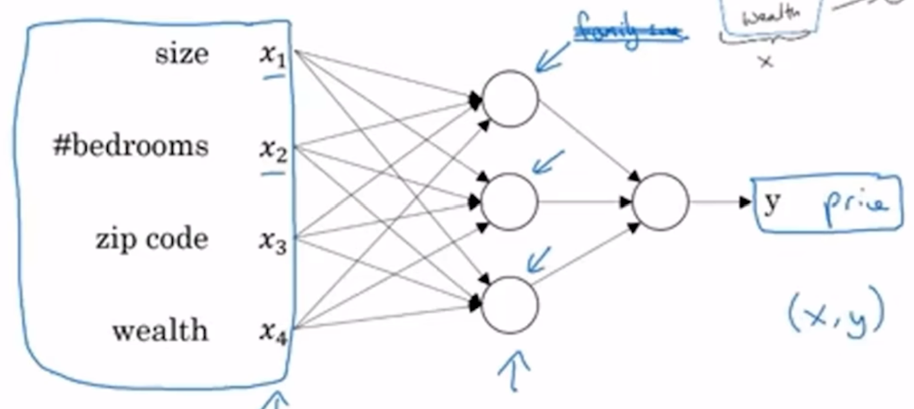

上面就是一个精简的模型. 在真实的神经网络中, 不是我们指定x1 x2和family size有关, 而是实际上中间一层的每一个圆圈都是接受了四个参数的, 然后让计算机自己算去, 喂了足够多的数据之后计算机就很擅长去拟合函数了

中间一层称为**隐藏单元(hidden unit)**, 每一个**节点**(node)都和**输入层**(input layer)的所有特征相连

### 用神经网络进行监督学习

以上列出了许多深度学习的应用:

前两个是标准的神经网络(standard neural network), 第三个是卷积神经网络CNN(convolutional)(cv中经常使用这个), 第四和第五个使用的是RNN(recurrent)(语言是一个一个读入的, 音频是有时间的, 因此是sequential), 第六个更复杂所以是混合模型

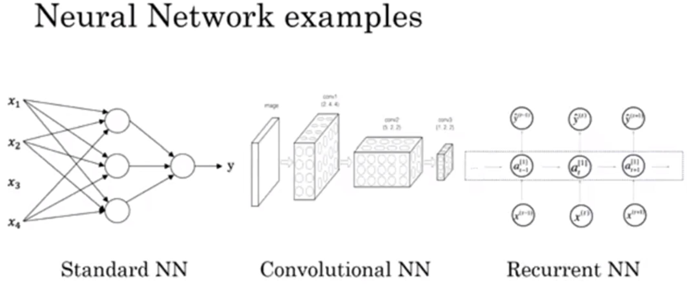

以上是常见的模型演示图

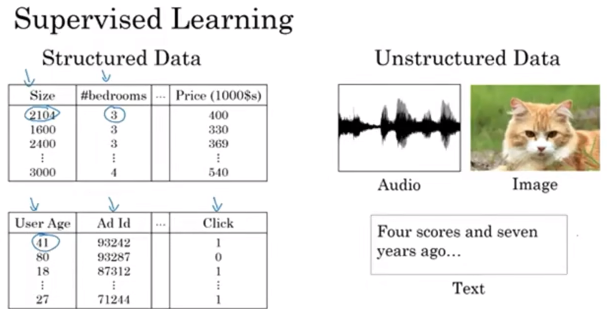

那么还要提及结构化数据和非结构化数据. 结构化数据很好用database去容纳, 但是一短音频, 一张图片可能这种数据结构就非常难以处理. 但是深度学习让计算机开始理解非结构化数据了

### 为什么最近机器学习火起来了?

"规模"促进了深度学习, 这里的规模不仅仅是模型的复杂程度(更多隐藏单元), 也指数据的规模

传统的学习算法, 在喂了一定数据之后表现便不再上升; 而nn的出现使得表现可以随着数据的训练增多而上升

当然这个数据不是什么数据都能算数, 必须是带标签(labeled)数据, 我们经常用``(m)``来代表数据的规模

在数据量不大的regime(领域)中, 其实各个算法之间没有明确说谁更好, 但是当到了大数据regime之后, nn的表现就稳定领先了

而algorithm算法的改进是为了computation计算跟快而服务的, 例如sigmoid函数转化为ReLU使得"梯度下降法"学习更快

### 教学安排

第一部分的安排

## 神经网络编程的基础知识

### 二分分类(Binary Classification)

假设给了一张图片, 让我们判断有没有猫, 如果有就输出1, 如果没有就输出0; 这个输出值我们设为y

那么一张图片是如何读取的呢? 一张照片是通过三个独立矩阵所构成的(三原色), 如果照片是64*64, 那么图片的信息由三个64×64的矩阵构成, 分别是红绿蓝, 然后每一个矩阵的值代表当前像素点该原色的亮度值

那么如何用这些信息构成输入的x呢? 我们一次把每个矩阵的每个元素提取出来, 然后组成一个特征向量x, 如图:

不难发现, 这个矩阵是12288*1, 我们用n来代表这个向量的维度, 这个情况下, n是12288

在二分分类问题中, 目标是训练一个分类器, 以特征向量x为输入, 预测输出是1还是0

记号: (x,y)是一个样本, x是n维向量, y是1/0; m代表样本个数; train和test的m; X代表整个输入矩阵, 通常来说是左边形式; 如图:

那么Y也要有对应的整个的输出矩阵, 我们横过来排放: 

### Logistics Regression(回归)

如果有一个图片x矩阵输入, 我们想要拟合输出y, 那么回归是自然而然想到的: 但是如果是单纯线性, 那么y的值可能会变化莫测

于是使用sigmoid函数, 我们想要一个w(nx*1)和b, 得到z后带入sigmoid函数(w转左乘x相当于求内积)

其中sigmoid函数长上面这个样子:  z很大, 那么输出值很接近1; z很小, 那么就接近0

注意: 很容易想到要不要升维然后把b和w合并, 但是不建议这么做, w和b还是分开来比较好

### Logistic regression cost function(回归损失函数)

总而言之: 为了训练出w和b的取值, 我们要设计一个成本函数

回顾以下; 顺便提一下notational convention: 上标代表第i个样本

那么在训练的过程中, 我们希望知道训练后模拟出来的结果和真正的结果相差有多大, 那么直觉上我们想到方差

但是事实上, 方差并不好, 在梯度下降法中, 直接用差的平方之类的Loss Function会面临凸优化问题, 这个之后会提到

因此, 我们设计这样的Loss Function:

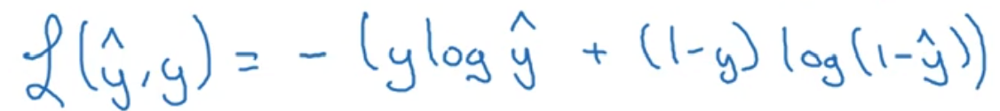

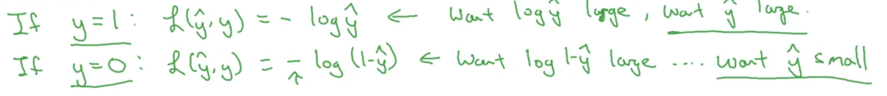

上面绿色推导可以看出来: 这个函数很符合我们的预期! 为什么这个函数非常好? 这个我们之后会讲

Finally, 损失函数反映了在**单个**训练样本上的表现; 那么我再定义一个成本函数, 用来衡量在全体训练样本上的表现

在这个式子中, w和b是自变量, yhat(i)与w, b, x(i)相关,然后最后除以样本总数量以求平均值

很明显, 我们希望这个函数最后的值越小越好

### 梯度下降法(Gradient Descent)

我们知道了Logistics Regression, 也知道了损失函数和成本函数

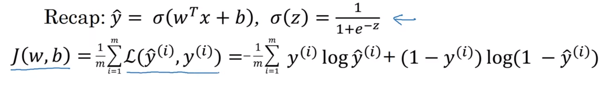

不难看出, J将会是一个二元函数, 那么在三维坐标系中是一个曲面:

我们定义的函数很好的做到了凸函数这一点, 避免了多个局部最优解的问题(选择了那个Loss Function定义的原因正是这个)

那么我们随便初始化一个点, 然后试图在不断迭代中往下面走, 直到走到最低点, 那么最终走到的集中的点就是最优解了

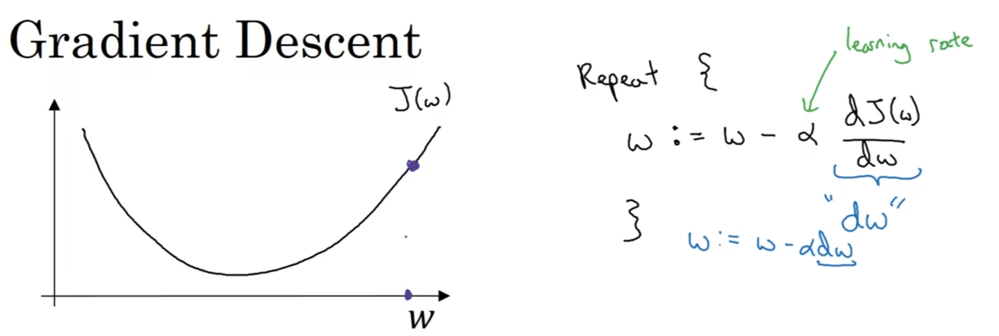

我们先只看w轴, 我们重复操作, 操作如上图: 注意到alpha就是学习率, 然后这个学习率乘以的是当前点的导数

自己想想下, 就会发现这个是合理的; 当然, 在编程的时候, notational convention是用**"dw"**来代表当前点的导数(蓝字)

在程序中, w和b通过这样的形式不断进行更迭; 在微积分中, 我们更喜欢用偏导符号; 在编程中, 就是db  dw

### 计算

上面的计算反应了一个点(假设特征nx=2)所对应的更迭. 这个计算我是能推的, 就是流程图与偏导计算; 但是现实是有m个训练样本:

xk(i)代表第i个样本的第k行的值(特征); w1, w2,....wn都这样累加算完之后, 把它们竖着放就得到了w矩阵

上面仅仅是一个梯度下降, 而注意到一次我们就用了两次循环(一次样本, 一次每一个x的各个特征), 这在python里面是十分致命的

为了解决这种低效的问题, 我们使用向量化vectorization

### Vectorization 向量化

向量化是一种解决for循环的艺术:  

实质: 充分利用GPU的并行命令计算功能(for是一个个一次行动, 向量化是直接全体行动)

``np.dot(w,x)``可以快速帮忙算出内积

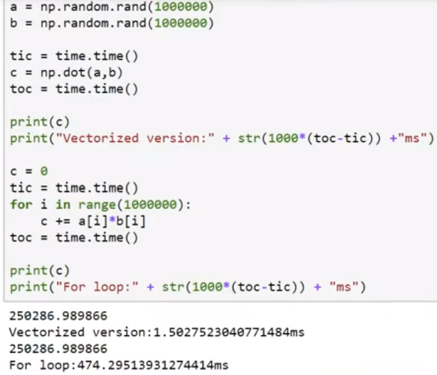

所以在logistic regression里面, 我们也可以使用这种艺术:

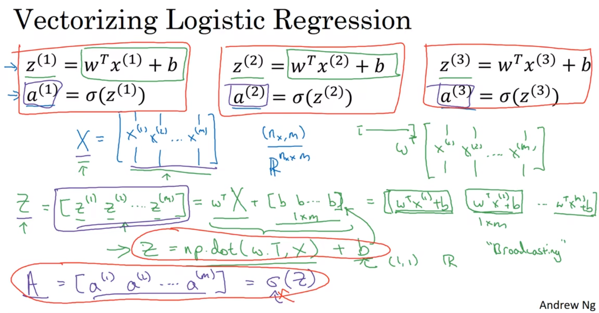

注意到``Z = np.dot(w.T, X) + b``这行代码: w.T代表是转置, X代表是总输入矩阵, 因此返回的是每一列和w.T内积的大矩阵

这个矩阵+ b, python会自动把b转化为1*m的矩阵(这是一种**广播broadcasting**); 趁热打铁完成后面的向量化

算出Z的大矩阵之后, 每一个分别带入sigmoid函数, 然后组成大矩阵A

根据偏导公式, 把dw1  dw2....放在**dw大矩阵**里面(1×m), 那么**根据定义**, Z转置并左乘一个X, 乘以1/m

最后w是[w1, w2, ...], 并相对应的做出改变; 当然, b作为一个实数很好操作

当然, 假如说实现1000次更迭, 依然, 必须用for, 因为更迭有时序!

### 为什么是这个损失函数?

核心还是理解第三行这个函数是符合要求的

## Neural Network

### Overview

首先是notational convention: 上标方括号代表层数

然后, logistic regression让我们得以更新w和b, 而更新之后呢? 我们能再迭代! 最后迭代到满意为止, 我们直接用sigmoid函数和满意的w, b去处理上一层的a, 得到的新a就是最终的输出值

上面这个模型中, 有输入层, 隐藏层和输出层, 中间的节点的值我们是看不见的

表示输入层还可以用图中的a[0], 上标, a代表activation

注意a[1]在Python中的四维表达形式, 四维是因为这里面只有四个节点; **注意, 输入层不算层, 第一个隐藏层是第一层, 这个图是两层**

这个图中加上了隐藏层与w, b的关系, 注意这些矩阵的维数, 理解是为什么

### 计算神经网络的输出

神经网络都在干些什么呢? 

注意到第一个隐藏层的每一个节点的流程都在上方标出, 那么四个节点都能表达出来: 

看得出来, 四个节点的计算可以同时进行, 那么我们就可以考虑使用向量化了. 向量化的式子推导如上图

上图再次进行了总结, 然后注意到为了方便, x换成了a[0]相关表示, 而中间节点算出来的a1,2,3,4[1]都用于了后续的计算

### 多个样本的向量化

当然, 我们对一份样本输入可以进行向量化, 当然, 我们可以对整个训练集的输入进行向量化, 从而实现同时进行所有样本点的运算

不进行向量化的话, 我们可能要for循环遍历所有样本点:

注意notational convention: a[] ()都代表什么意思; 那么如何向量化呢

之前说输入的X是一个nx*1的向量, 那么一列列堆叠起来自然而然是容易想到的, 那么Z和A也由此启发设计出来, 如上图:

注意到A[1]横向代表一个个样本, 纵向代表一个样本中每个节点

### 激活函数

之前的激活函数我们一直使用的是sigmoid函数, 当然有些函数其实会表现的更好一点, 例如tanh(z)函数:

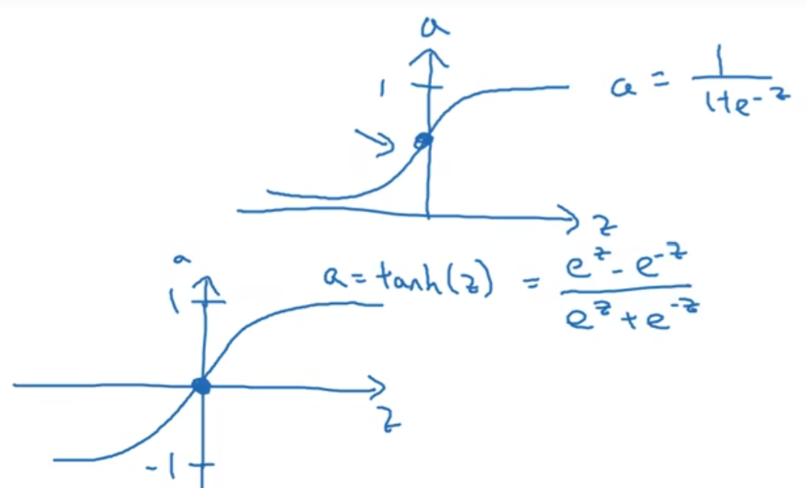

这个函数的处理后的数据平均值更偏向0, 帮忙实现了数据的中心化, 也让下一层的学习变得更加容易

但是注意有例外: 输出层还是习惯使用sigmoid函数, 因为输出值在0-1之间是更容易接受的

而深度学习中还喜欢ReLU(修正线性单元):

这个函数的斜率: 当z是正的话, 斜率就是1; 如果是负数, 就是0; 注意到如果z是0, 这个地方的倒数是没有定义的

但是在编程中, 其实z值完全是0的概率非常非常低; 注意到如果z是负数的话, 斜率就是0, 这在实践中没有意义, 所以有"泄露ReLU"

总结: 在二分分类中, 输出层一定要sigmoid函数; 而其它层, tanh函数都更好; 而如果中间隐藏层不知道选什么好, 选ReLU更保险

### 为什么激活函数不能是线性的?

为什么不直接a = z = Wx+b? 那么事实上, 最终输出的yhat其实只是x1, x2...的线性组合

那么事实上那么多层的神经网络完全一点意义也没有, 其实只有一层, 这样的话纯属无稽之谈

### 神经网络的梯度下降

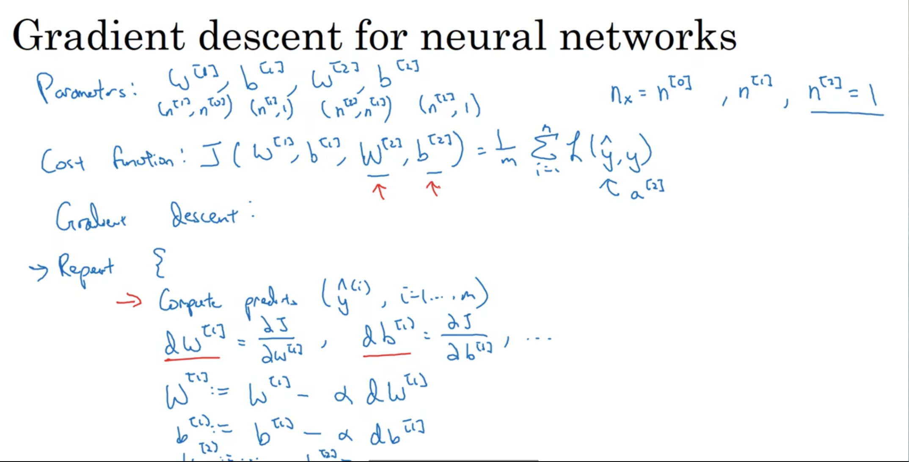

梯度下降过程: 先随机设置w[1] b[1] (注意, 随机初始化是十分重要的), 然后算出所有的预测y值, 通过这些东西计算dw db, 然后更新w, b作为[2]的材料

### 反向传播

注意星号是两个矩阵相对应元素逐个相乘

### 随机初始化

权重非常重要, 如果一开始所有参数都设置为0, 一点用也没有, 所有隐藏节点都在计算相同的函数

b一开始可以设置为0, 因为w不同, 那么对称性问题就会打破

那么为什么w会乘以一个非常小的数字? z= wx+b, 那么这个z如果在w过大的情况下会落在函数比较平缓的地方

(这种问题尤其在tanh和sigmoid中非常突出)

0.01在很浅的神经网络中很好用, 但是如果深层的神经网络的话, 这个常数可能就要稍微改变了, 这个之后会讲

## 深层神经网络

### 什么是深层神经网络?

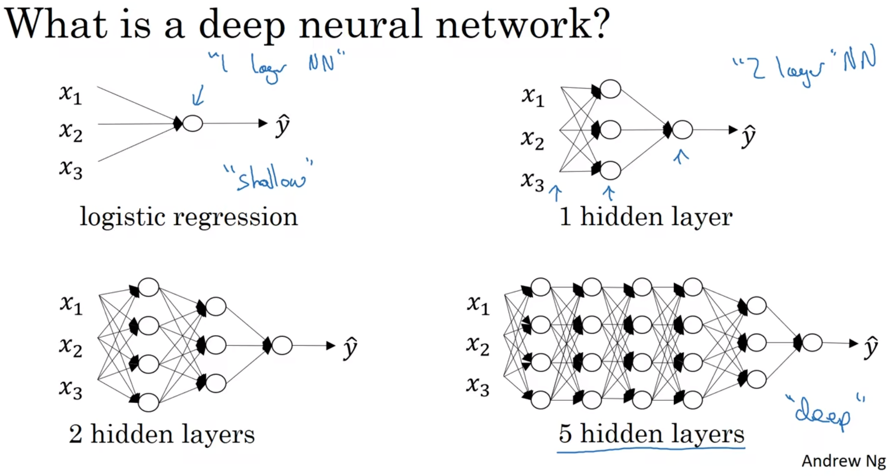

附: 有些函数只有深层的神经网络才能学习, 而对于一开始来说, 尝试Logistics regression总是不会错的

接下来完善一下notational convention

### Forward and Backward Propagation

前向传播很好理解, 输入了a[l-1], 然后用随机初始化的W和b去计算l层的z  a

反向传播, 就是用da[l]来算出da[l-1] (用于继续反向传播), dw, db(用来修正w和b矩阵)

(注意上图左边第二行的a[l-1]还应该要转置)

注意, 头一个da[l]在logistic regression下就是损失熵函数的倒数

上图帮忙算出了w和b矩阵的维数, 还有dw  db的维数, 还有Z A dZ  dA 的维数, 这帮助了我们debug

### 搭建神经网络块

注意每一次c需要cache什么! 内存很珍贵, 每一次的训练其实都是在调整w b两个参数的, 因此我们只想要保存关键

反向传播的过程中, z[l]起到了十分关键的作用, 甚至a[l]在下一层使用完之后其实都没有必要去保留了

因此cache(缓存)z[l]是十分关键的; 整个流程也在第二张图片里面完整展示出来了

### 参数&超参数(Hyperparameter)

正常的参数, 例如w  b, 这些都是最后我们想要得到的, 这些帮助了模型区进行拟合

但是这些参数值上, 其实还有很多参数是可以掌控它们的走向的, 这些就称为超参数, hyperparameter

比如说learning rate α, iterations(正反走多少轮), 隐藏层数量, 节点数量, 激活函数的选择

甚至有momentum, minibatch size, regularization等等超参数可以影响到w 和 b的形成 

说明一件事情: 调参师, 炼丹侠

## Set Up Your Machine Learning Model（Optimizing）

### Train-Dev-Test Set

应用型机器学习是一个高度迭代的过程: hidden layers层数, hidden units(节点)数量, 学习率, 激活函数......
一般来说, 这些超参数很难直接找到, 都是要通过不断尝试得出来的; 而创建好的训练, 开发和测试训练集可以帮助提高试错循环效率

一般来说, 一分数据集分为三个部分: train set; hold-out cross validation set/dev set; test set 

用训练数据来训练多个模型, 然后用交叉验证模型找出最合适的模型, 然后最终测试模型来验证这个模型的准确性

几年前, 一般来说, 数据比例分配是60训练20交叉验证20测试; 但是在大数据时代, 现在数据量可能达到百万级别

那么这种大前提下, 验证集和测试集占数据总量的比例会区域变小, 因为验证集的目的就是找哪种算法最佳, 我们不需要20%的数据, 其实有的时候1%就可以了, 帮助我们找出1-2个非常好的算法; 测试集也可以差不多1%, 因为总量还是很大, 1%足以验证模型性能

当然, 这两个数据可以更小, 因为现在数据时代数据量非常大, 尽量把数据花在训练上

注意: 尽量验证集和测试集都来自于同一个分布! 当然有的时候训练集和dev test set并不是来源于一个分布, 但是这还是能接受的, 只要保证dev和test set 来自于同一个分布

最后: 有的时候, 没有test set也是可以接受的!!  在机器学习中, 假如说真的没有test set, 那么一般dev set也会称为test set

### 偏差(bias)和方差(variance)

这两个概念很难分清, 而这两者的权衡问题也是一个非常大的问题! 

假如说人眼识别的错误率是0, 那么我们称这个为optimal error(最好, 最理想的模型, 例如人, 的最低错误率); 并且假设训练集和验证集来自同一分布(如果不是这样, 分析过程更加复杂)

那么从左到右: 第一个, 训练集上跑的很好, 但是验证集并不理想, 那么通常认为这是一种"过拟合"(over-fitting), 这种情况方差variance很大; 第二个, 虽然说训练集和验证集表现很接近, 说明过拟合并没有产生, 但是整体的错误率还是很高, 那么认为这是偏差bias较高; 第三个, 两者都高, 毋庸置疑; 第四个, 两者都很低, 毋庸置疑

那么如果假如说, 人眼识别客观上就是有15%的失误率呢? 那么第二种情况就十分理想了, 被认为是方差和偏差都非常小

一般来说: 模型过于线性, bias高; 模型过拟合, variance高

### 机器学习基础

Basic recipe for machine learning:

First, we have to check whether there is a high bias problem. If so, we should deal with the network, for example finding a new network with more hidden layers and hidden units or something, or a brand new network based on a new architecture. Secondly, if the problem of high bias is resolved, we have to check if there is a high variance issue, insinuation an over-fitting issue. If so, the common solution is to find more data. If there are no more data available, we can use regularization which will be discussed later, or simply switch to a new architecture.

 在早期的机械学习阶段, "bias variance trade-off(权衡)"问题非常人们, 人们很少用工具能实现降低一者而不影响另一者. 但是到了大数据深度学习, 我们可以使用正则化这种手段, 来实现单方面的下降. 正则化是一种能有效下降方差的工具, 会影响偏差略微上升, 但是如果网络很大的话, 那么这种上升就是非常小的

### 正则化(Regularization)

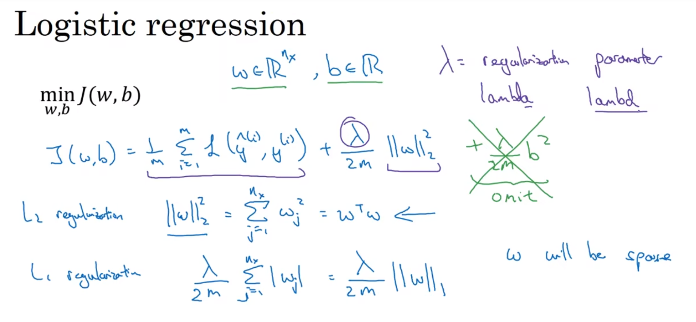

上面展示了在一个Logistic回归中的L2 Regularization的过程, 在损失函数后面加上一个项. W矩阵的L2范数其实就是W自己左乘一个W的转置

而上面的λ就是一个hyper-parameter, 需要我们不断去找最合适的; 而在编程中, 这个参数一般用lambda名字 因为λ在python里面又其他的固定用途(关键词), 这么做是为了防止参数名字重复而产生冲突

L1范数会使得w变的稀疏, 即有很多零, 但是这样并不是很好, 虽然说可以减少内存储存, 或者压缩模型, 但是这事实证明并不是很好

那么在整个Neural network中呢? 

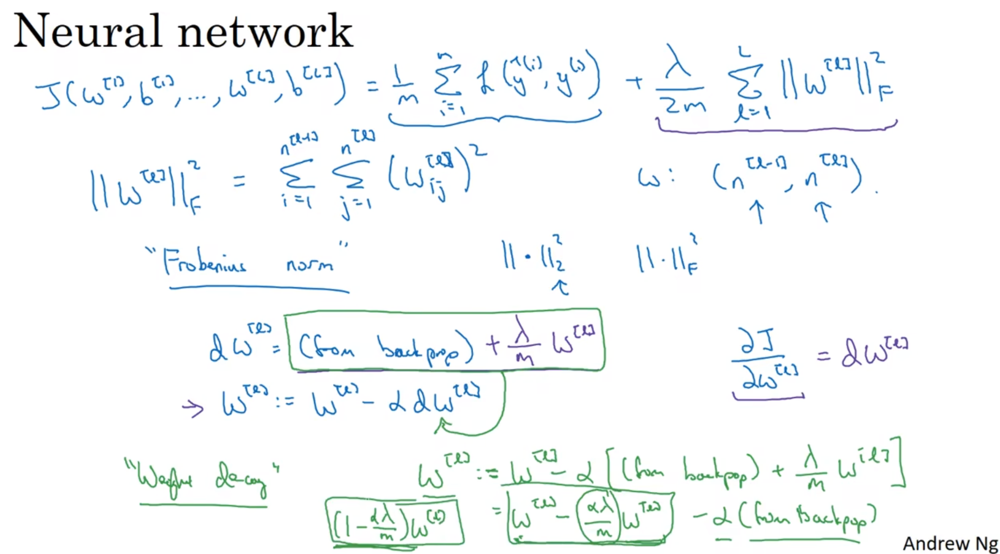

在整个神经网络中, 损失函数后面仍然加上的是每一层的w[l]矩阵的L2范数, 那么这里因为notational convention, 我们称这种L2范数为弗罗贝尼乌斯范数(Frobenius norm), 即一个矩阵中所有元素的平方的和

那么现在dJ/dw后面就加上了lambda/mw[l]了(单独的弗罗贝尼乌斯那一项求导后就是整个玩意儿), 代入公式, 发现实质上是:

w[l]更新的时候, 先乘以了一个(1-αλ/m)的参数(这个参数小于零), 说明其实通过正则化我们想要权重变小

因此, 我们也称正则化为"权重衰减"(weight decay)

### 为什么正则化可以缓解过拟合？

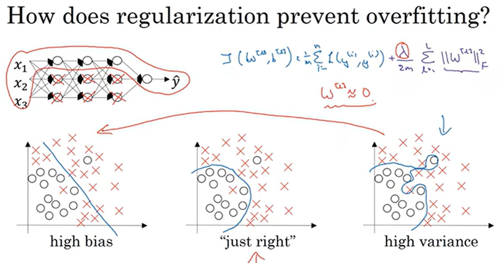

见上图， 我们在损失函数后面加上了Frobenius norm，使得w会趋向于零，那么这样一来，许多节点的作用就几乎为零，几乎可以视而不见，从而达到简化模型规模、但是深度依然保持的效果。我们直观取极限，假如说惩罚系数过大，那么几乎全为0，那么其实就是线性回归了；我们很是希望有一个中间的λ值，达到just right的程度

换个角度去理解：在激活函数中，假如说z很靠近0，那么这一段就越接近线性；如果惩罚了，z下降了，那么落在的激活函数的区间段可能其影响效果更偏向于线性。这样的话，模型就不会过度复杂

### Dropout正则化

每一次的训练，随机丢掉一定的节点，其连线都删除，避免单一依赖于一个特征的情况出现

那么如何实现dropout呢

注意``d3 = np.random.rand(a3.shape[0], a3.shape[1])``，这个矩阵的规模是根据a3来的

``a3 = np.multiply(a3, d3)``代表的是矩阵相应位置的元素相乘

注意最后除以keep_prob, 这是为了a3和z4保持预期值；直观来说，保证消除某些节点的影响同时，保证其他的影响不受影响

但是注意： 在test time的时候，我们并不用dropout了，因为我们希望最后模型是一个输出稳定的模型！为了实现最终预期输出不受影响，因此前面才会/keep_prob以维持预期值

那么为为什么dropout可以有作用呢？我们可以直观感受：一个节点接受一定数量的连线，因为会随机失活，所以权值不能过多集中在一个节点上，因此可以实现类似于L2 正则化的“权值衰减”

当然实战中，每一层的keep_prob可以设置的不一样，一般来说上一层节点数量越多，keep_prob可以稍微设置的小一点，例如0.5；如果有某些层我不担心过拟合，那么这个参数可以设置为1. 同时，为了保证我的操作是有效的（帮助我调整参数），可以让计算机画一个J-iterations的图，来观察我的设置是否让算是函数单调递减了（monotonically decreasing）

### 其他正则化方法

1. 我们希望更多的数据，但是很遗憾的是有的时候再额外获取数据非常困难，因此我们可以人工捏造新数据，例如一张猫的照片，我们可以裁剪，旋转（角度别过大），水平翻转等
2. early stopping, 一般来说随着iterations, dev set error会先下降后上升，而train set error会一直下降。那么可以考虑在dev set error最小的时候直接停止训练。当然这也有缺点，因为它无法同时满足使得损失函数最小化和防止过度拟合

### 归一化输入 （Normalizing Inputs)

假如说输入的特征有两个，首先第一步是取平均值，然后把整个图拉到原点中间；第二部是算出方差，然后每个x除以这个方差的平方根（标准差）

那么为什么要归一化呢？ 有的时候由于特征的scale不同，可能J(w, b)可能就会变得非常狭长；归一化之后，曲线就变得非常好看，而且学习率的设置更容易，更方便优化（狭长的曲线下不同的地方可能希望的学习率不一样，因为斜率差异非常大）

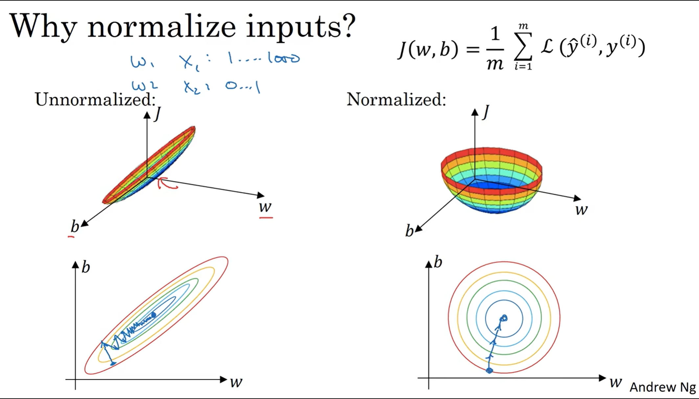

### 梯度消失/爆炸&随机初始化参数

Data Vanishing/Exploding Gradients 

假如说我们训练一个很深的网络，那么yhat的值就是途中的一长串表达式（第一轮，初始化b=0）那么不难发现，w矩阵非常关键，在L很大的情况下，比1大一点或比1小一点都会造成梯度爆炸或消失，使得训练时间增长，训练难度加大

为了解决这个问题，有一个不能完全解决但是能够帮很多忙的方法：更谨慎地选择随机化参数

当n很大的时候，我希望wi还是尽可能的小；那么有研究指出，把wi的方差控制在2/n比较好（归一化输入），因此有了上面这行代码，前面是高斯分布，后面是平方根以控制方差，当然这个代码的例子是针对激活函数为ReLU的平方根式子；如果是tanh激活函数，建议平方根使用右边的式子

### 梯度的数值逼近&梯度检验

Numerical Approximation of Gradients & Gradient Checking

计算机里面计算一个函数的一个点的导数真的是求导然后代入值吗？不是这样的，计算机中采用一种估计算法；最下面的式子反映了导数的基本定义，而误差可以有这两个式子推出来，发现采用双边的计算方式误差更小（当ε小于0的时候），因此在计算机中常常采用双边计算来估算

那么执行梯度检验可以很好的帮助我们debug：

注意这个ratio分子没有平方，意味着是每个元素的平方的和的开根号；如果这个ratio10的多少次方小于-7，非常好；如果是-5左右，可能有问题也可能没有问题；如果是-3左右，那么非常有可能有bug

## Optimization Algorithms（优化算法）

*机器学习的应用是一个高度依赖经验（highly empirical）、迭代（iterative）的过程!*

### Mini-Batch 梯度下降

之前我们用向量化同时处理大量数据样本，但是如果样本数超级大呢？我们不妨取很多子集（mini-batch)，那么根据notational convention，见下图：

上图展示了Mini-Batch的流程：我们假设一共5million个样本，分成5000组，一组1000个样本，那么一轮（epoch），即所有Mini Batch都进行一次梯度下降，共5000次；然后多epoch训练，直到收敛至一定精度

那么为什么mini batch有很好的作用呢？这看起来仅仅是分了一个组！

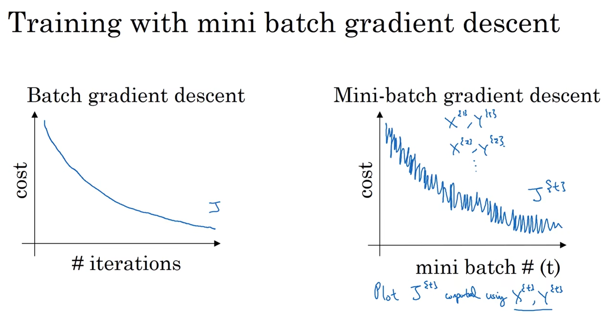

首先我们来看J-iteration的函数图，如果是整个batch，那么曲线应该是平滑的；但是如果是mini batch, 那么对于第t个样本可能会出现oscillation（摆动），因为可能(X{1}, Y{1})是一个比较好的数据集，而（X{2},Y{2}）是一个比较难看的数据集，因为本应该是整体上很常规的数据集分成了多个partition

那么先看左下角这个图，如果说是整个batch，那么会稳定地逐步靠近最低点，因为整体样本的拟合关系还是相对来说比较明确的；而如果mini-batch极端一点，一个样本是一个Mini-Batch，那么就是stochastic gradient descent(随机梯度下降)， 对于一个孤零零的样本来说，迭代速度当然很快，但是这些样本一个个都等着走迭代，换而言之，向量化的优势消失了，并且由于单个样本的拟合特征很低，所以走向最低点的路非常崎岖（当然整体上还是朝着最低点走），并且会在最低点附近徘徊（oscillating）

可见，取一个合适的mini-batch数值是十分关键的！

### 指数加权平均（Exponentially weighted averages）

这个是伦敦的温度图，这个图噪声很大，因此考虑加权取值：``vi = 0.9vi-1 + 0.1θi``

用vi来代替θi，这样的出来的曲线就更漂亮一些。为什么呢？我的感性理解是：vi的值不完全取值于θi的值（若是完全取决于它，那么这个点的独立性相当高，甚至可以飞上天都没人管），而和vi-1建立一种关系，就可以使得这段曲线有一定的coherence；而0.9的实际含义可以粗略理解为10天的平均温度（马上后面会解释）

我们来看不同的取值会怎么影响曲线；如果β很大，那么几乎完全取决于昨天，那么coherence会相当大，那么会得到绿色曲线；而如果β没有那么大比如说0.5，那么coherence并不是那么强，但是还是有一点，那么就会得到噪声情况相对来说较好一点的黄色曲线；一般在实际情况中，我们希望得到类似于红色曲线的曲线

那么这个算法为什么那么重要？因此要深度理解这个算法的实质:

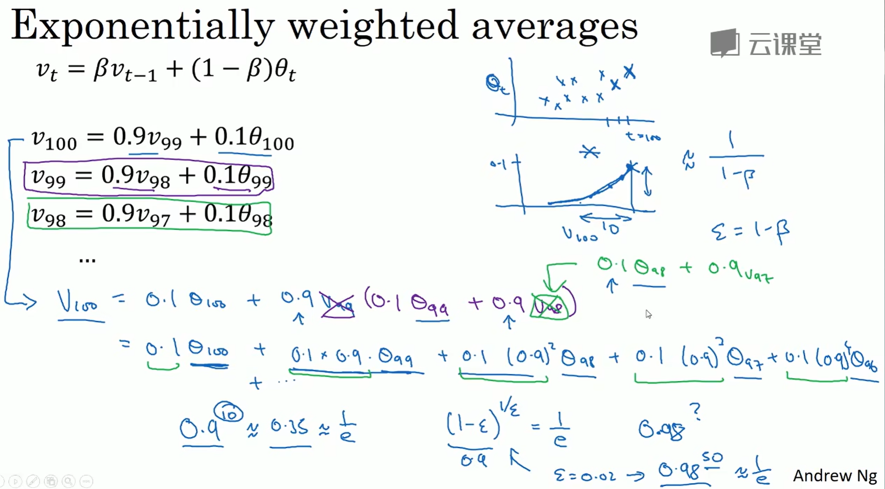

那么不难看出，v1 v2...的推出有点像数列，那么进行式子带入可得到下面的式子；不难看出，系数中出现了了0.9的多少次幂，“指数”因此得名；那么其实这个式子可以用θ（t），0.1*0.9^t两个函数的**离散形式卷积**得到（第二个函数要以50做中心对称，然后相应t的两个两个函数值相乘，之后相加）；而一般来说，当权重下降到 0.1×1/e以下称为“影响很小”，那么根据公式，一般来说当t达到1/epsilon时，之后的权重就很低了，因此我们的称为“前1/epsilon的加权平均”（这些权重之和很接近于1！）

那么注意到v0设置为了0，这导致了前期学习阶段的曲线偏差很大，例如上图，事实上如果没有偏差纠正（bias correction）得到的是紫色曲线；因为不妨看看v1 v2 的权重系数之和，距离1十万八千里。因此有必要加上修正，因此有了右边的式子，努力让权重系数之和为1. 而到了后期，就几乎和正常的重合了，说明收到的影响较小，因此后期并不需要除以修正参数。

### 动量梯度下降法（Momentum）

一般来说，利用了指数加权平均算法的Momentum算法总是比正常的梯度下降要快，计算梯度的指数加权平均数并利用这个梯度来更新权重

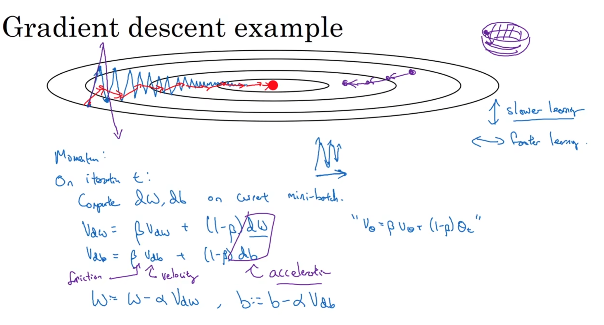

和之前介绍的指数加权平均算法类似，我们不再用dw db来更新w b，我们利用途中的两个式子计算Vdw, Vdb来更新w b. 注意这里的左右两个都是Vθ，代表这一层的更新速度，这也就解释了为什么一开始介绍的时候，数列的第一项是0，因为Momentum梯度下降中的每一层一开始的更新速度也是0！

这个式子使得原先可能摆动幅度非常难以接受的轨迹在纵向上的摆动变得更加平缓，而横向上几乎不受影响；就像一个碗里面一个球在圆周滚，有了摩擦力（横向阻力方向加速度）就会更新慢下来，而纵向上没什么变化，因此球能够顺利向中心滚去，获得动量Momentum。

其中β设成0.9是很不错的，具有相当好的鲁棒性；因为实践中一般10次迭代之后，就度过了偏差很大的阶段。所以实践中，很少人的实验会受到一开始的偏差影响；注意有的时候Vdw Vdb可能等式会结合α进行变形，但是其实没有任何差别，只不过是数值上会影响α的最佳取值（当然图片中的是更好的式子版本）

### RMSprop Algorithm (Root Mean Square)

在原先的计算上面做一些改动，Sdw和Sdb的式子见上图；然后w和b的更新也见上图（矩阵平方指的是对应元素的平方之后的矩阵（element-wise））

这个算法保留了一部分的momentum；**直觉来看**，希望竖直方向上摆动幅度较小，水平方向上幅度较大，而水平和w有关，垂直和b有关，因此在原本一个水平方向上不陡峭竖直方向上陡峭的oscillation, 我希望w会相应地快速增大，b会相应地相应减少。用这个思路来看这个式子，就能大致理解为什么它是正确的

实际操作中，为了保证分子不会除以一个非常小的数字，分母一般加上ε，一般默认10^-8

### Adam Algorithm

历史长河中很多人提出了优化算法，但是事实证明大多数算法不能很好地同时兼容多种网络框架。但是，RMSprop和Adam Algorithm就是少有的坚守住了大量不同网络框架考验的算法

一般来说，adam就是Momentum 和 RMSprop的结合体

先是momentum的质数加权平均，后来是RMSprop, **并且还进行了bias correction**

有很多的hyperparameter, 但是事实上β1 2都是有推荐默认值的，很少会调试它；ε几乎不产生任何影响，所以就使用默认就好了；而学习率是一个非常重要的、需要不断调试的参数! 

***Adam stands for Adaptive moment estimation***

### 学习率衰减

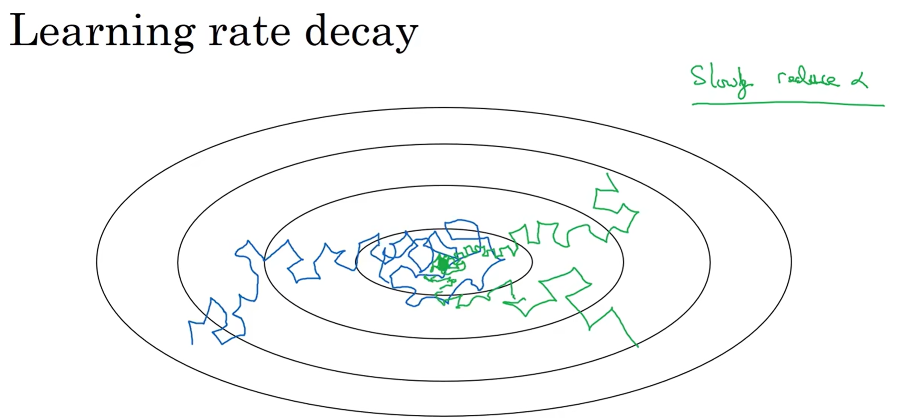

为什么要学习率衰减？直觉上来看，一开始希望轨迹步伐迈的大一点，但是之后当到达了最低点附近，我们不希望步伐依然那么大了，不然就会在最低点附近反复摆动

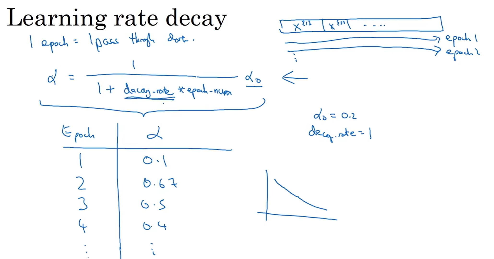

一种常见的衰减方法如上图：decay_rate又是一个超参数，epoch代表训练“轮”数，上面这个式子中，如果epoch很大，说明已经走了很多次了，我们希望学习率下降，那么这个式子正好表示了这种关系

当然还有其他的衰减方法，但是核心思路都是epoch上升后，learning rate要下降（还有手动调参的。）

### 局部最优问题（local optima）

本来以为，在空间中，损失函数曲面长得像有左边；当遇到了四周梯度都为零的点，这可能是局部最优解；但是事实上，在神经网络中，遇到这种四周梯度都为零的点，绝大部分情况下是马鞍点（saddle point）其实朝着合适的方向依然能够继续优化。（**不太可能会进入局部最优点，只要训练的网络是相对来说比较复杂的**）

可能会舒一口气：还好不是撞见了局部最优点。但是依然，saddle point有很大的问题：鞍点附近也很有可能有平缓区（plateau），在这种情况下，一个方向上的梯度长时间接近于0，**导致学习速率非常慢**

而adam等算法能够在这种平缓区尽快走出来，继续寻找接下来的低点

## 调参炼丹——Hyperparameter tuning

### 如何调试

超参数有很多，但是重要性可以分为三个层级：

1. 学习率：非常重要！！
2. momentum β； hidden units; mini-batch size
3. hidden layers; learning rate decay

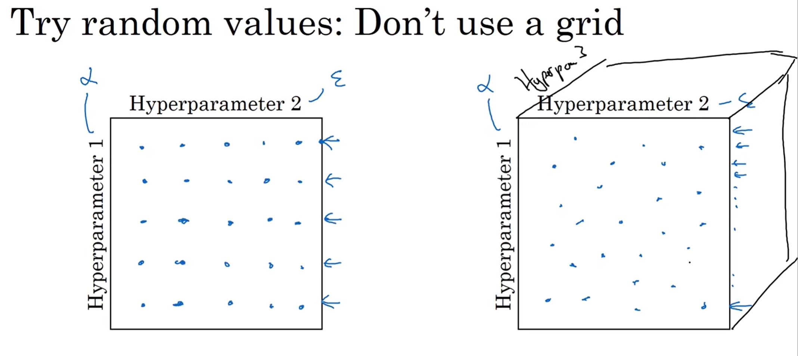

策略1：不要取表格点！假如说一个超参数是学习率，另一个是adam中的epsilon（这里举极端例子）然后你就会发现影响和epsilon几乎一点关系都没有，但是在这种情况下，你的epsilon点只有5个，不能直观看出；而如果25个点都是随机的，那很容易就能发现谁重要谁不是那么重要了

如果是三个超参数，那么就是立方体中取表格；高维以此类推

策略2：从粗到精：先缩小到一个表现点都很好的区域内，再随机取点来进一步找区域，一直找到满意的区域（From Coarse to Fine）

### 选择合适区间

在跨度并不是很大的情况下（数量级）均匀当然是一件理所应当的事情；但是如果数量级上跨度很大呢？

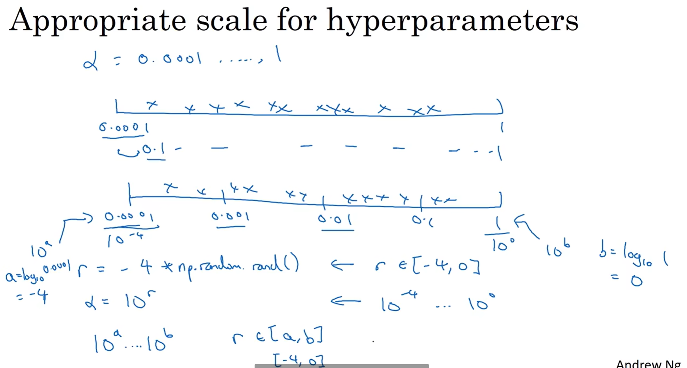

假设考虑的学习率从0.0001到1，那么再均匀取值貌似有点不可取；可以通过对数转换，然后指数区间中堆随机取数字，这样就更合理一些

另外一个值得一提的是指数加权平均中β的合理取值：想到1-β很正常，但是之后是平均还是对数呢？我们知道，如果β从0.9取到0.9005，几乎没有什么影响，代表平均样本数量从10到一个比10大一些的数字，几乎没有什么影响；但是从0.999到0.9995影响就天差地别，因为代表的是平均样本数量从1000到了2000！因此1-β之后应该是取对数然后再随机取值

### Pandas and Caviar Strategies

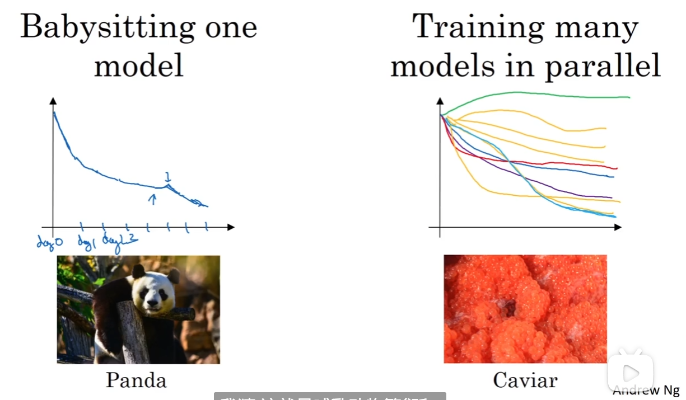

训练模型有两种主流的方式：第一种是“babysitting”, 第一天初始化参数，然后之后不断做调整；第二种是“parallel”, 多个模型在一种参数或算法配置下训练，最后看哪个最好

一般来说，算力很足的情况下采取caviar模式，不够的话采取panda模式

### 正则化网络的激活函数（Batch Norm）

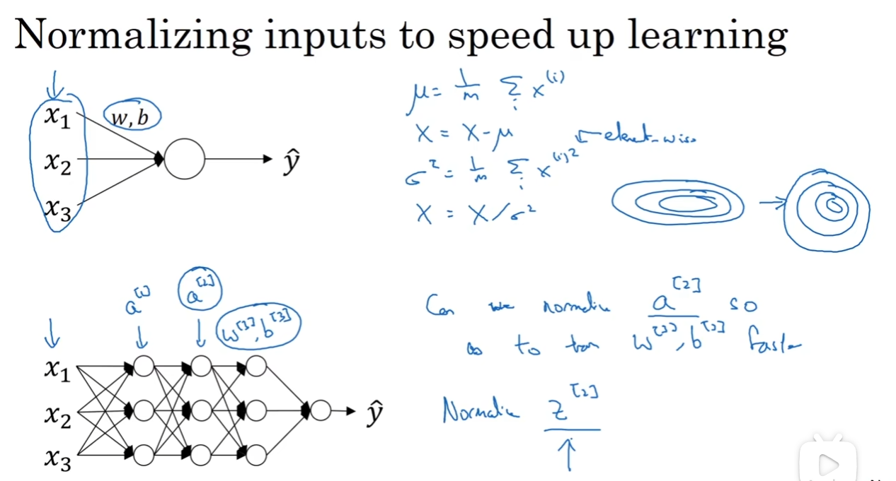

之前提到了归一化输入，让损失函数曲线从狭长的样子（elongated）变成好看的样子，从而使得最佳学习率容易找到，并且方便训练w和b。那么这是针对一个Logistic regression的，如果应用到一个很深的网络中呢？我们对于a[l]进行归一化还是z[l]进行归一化以使得w[l+1] b[l+1]的训练变得更加轻松呢？事实上，在实践中一般对z[l]归一化，这可以认为是一种default choice。

那么如图：μ和σ^2的值都和之前提到过的很相似，然后得到Z[l] (i)norm（注意分母加上了ε，防止除以0），这样一来Znorm的平均值为0，方差为1。但是这样的结果并不是我们想要的，的确曲线好看了，但是对Z的框定太严格。因此有了Z~（tilde），这个式子使得Z~的平均值和方差得以修改，那么最后神经网络训练的还有一个个γ和β（没错，这两个参数在训练的过程中也会迭代，用gradient descent 或者 Adam 或者 或者 RMSprop 或者 Momentum等等）

那么Batch Norm（BN）是如何fit in神经网络的呢？

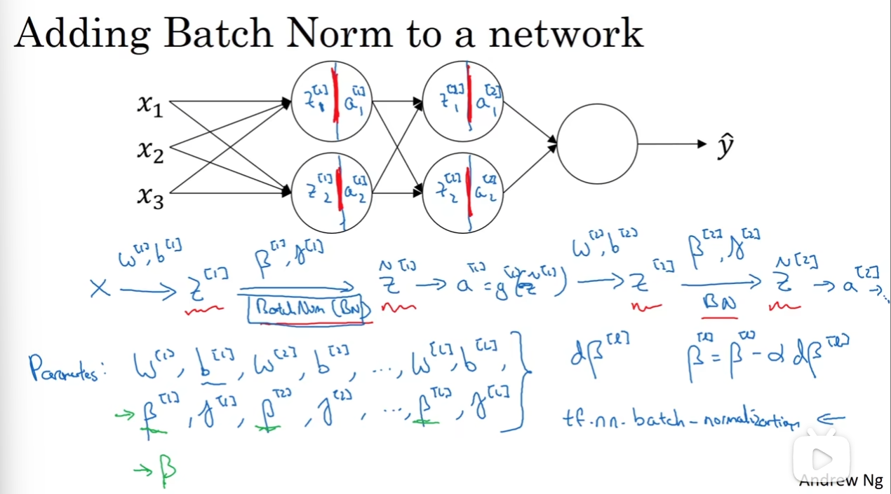

可以看到，X(A[0]) - Z - Z~ - A - Z - Z~ - A......是一个完整的流程。**那么直观上来看**，最后要训练出来的参数就是图中所展示出来的那样。

Batch Norm在代码中往往只要一行就能搞定：``tf.nn.batch_normalization``

在实践中，Batch Norm一般和Mini Batch一起使用。

注意到，因为Batch Norm的实质，Z的计算中后面加上的b其实首先就会被删去。因此其实**训练出来的参数中没有b**。其次要注意的是β和γ的维度，这些在途中都讲清楚了

那么为什么Batch Norm能够显著提升学习速率呢？ 我们已经知道了归一化对于损失函数曲线的改善，这当然是一点原因，那么事实上还有其他原因：

假如说我们左边是训练集，但是测试机是有色的猫。那么我们不能期待左边的模型能够很好的运用到右边。为什么？见图中，左边是训练集，点都集中在一个地方。虽然模型拟合出来了一个函数，但是由于右边根本没有东西，因此不能期待这个模型能够用在右边的测试集上，虽然那个我们想要训练出来的“真正的正确函数”在两个data set里面都是真实存在的。换而言之，假如说有一个X到Y的mapping, 假如说改变了X的分布，这个mapping也会有所失效。这种现象叫做“covariate shift”.

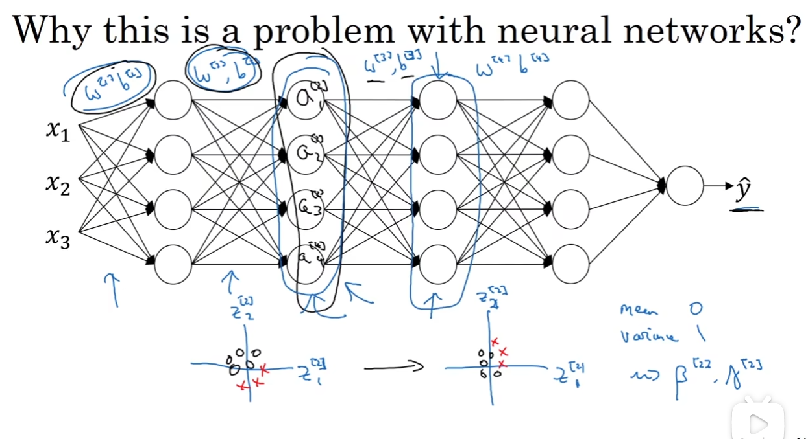

加入我现在单单看第三层：如果没有了Batch Norm，前面两层学习后更新了a[2]，那么这个数据集的分布可能就和之前的不一样了，对于第三层来说非常难受；第三层难受第四层跟着难受。因此我们想要每一次传给下一层的数据都是十分好看的，至于下一层怎么处理这个好处理的数据，就要看它们自己的γ和β。换而言之，每一层的学习的自我独立性相比于之前多了一点点。

同时，Batch Norm还有一点正则化的效果，这是“一阵意想不到的狂喜”。因为mini batch在自己的训练数据上用了mean and variance, 因此数据是有噪点的，而z tilde也是有噪点的，因此会迫使某一层不会过度依赖于一个单元的输出。但是我们一般不能把正则化当作Batch Norm的目的，因为regularization效果其实很小

### Batch Norm at test time

我们用BN来处理Mini Batch，但是在测试的时候，可能需要对每一个样本逐一处理：

简而言之，我们在测试的时候要确定一个μ和σ，但是我们训练的时候用的是mini batch，有很多的参数，用哪个呢？解决方案是得到这些参数后，用指数加权平均得出最后估算的、你要是用的μ和σ的参数，然后用在测试集里面；当然，我们训练的时候也可以直接不要mini batch，在整个训练集上得出一个μ和σ，但是实践中，default是指数加权平均与Mini Batch结合来使用。

### Softmax 回归

之前我们一直讲的是binary classification, 但是如果我想要检测是不是一类中的一种呢？

假如说C代表我想分的类的数量（这里是4，除了三种动物，还有0，代表不是三种动物之一），因此我希望神经网络输出层输出的yhat是一个（4，1）的向量，输出的四个数字分别代表四种可能性（当然，四个数字和应该是1）

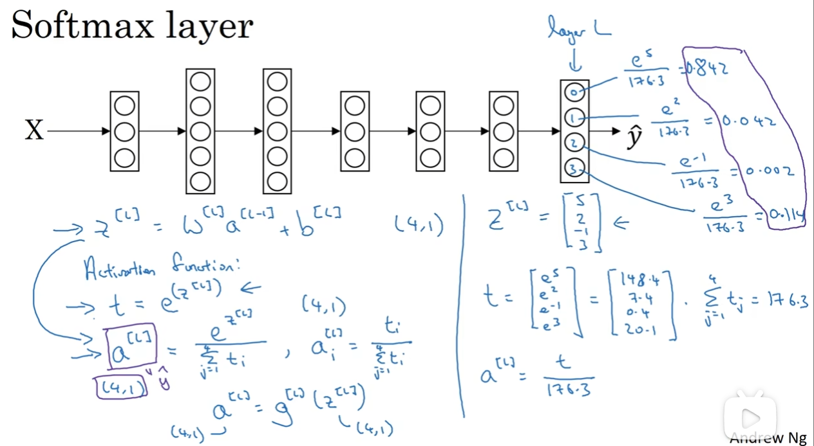

那么肯定是最后一个输出层l要下功夫了：输入的是z[l], 然后取幂得到（4，1）的向量t，然后计算（4，1）的a[l]，计算方式见上图。那么最后得到的a[l]就含有四个元素，每个元素代表“一种”，而且四个概率之和为1，符合我们的设想。

那么这种计算流程——这种输入一个（4，1）矩阵，输出（4，1）矩阵a[l]——的activation function我们就称之为Softmax function

### 训练Softmax分类器

想训练，当然要知道损失函数是什么。如上图，假如说y如图，那么yhat就不是一个非常理想的结果，我希望损失函数因此很大。那么图中的函数恰能反映这种关系！

那么回头算偏导，dz[l] = yhat - y依然是这样；但是编程框架会帮助我们计算导数之类的，因此不用过多纠结导数的计算

### Deep Learning Framework

已经有了很多算法和网络问世了，但是让我们从头开始动手写是一件非常困难的事。例如说，我当然知道两个矩阵相乘怎么实现，也知道如何用代码实现，但是在真正编程中，我还是希望用一行代码来调用函数从而实现矩阵乘法。神经网络也是类似，有很多深度学习框架帮助我们总结了各个神经网络，方便我们轻松训练和调用

经典的有：`Caffe/Caffe2 CNTK DL4J Keras Lasagne mxnet PaddlePaddle TensorFlow Theano Torch`

其中主流是``TensorFlow  Torch``, 它们帮助我们能够提升效率

## Machine Learning Strategy

### 单一数字评估指标&满足、优化指标

一般来说对于一个模型（binary classification）有两个参数衡量它的性能：一个是Precision（查准率）一个是Recall（查全率），接下来介绍这两个概念：

- 查准率：假如说训练了一个辨别出猫的模型，那么查准率代表的是：如果模型指出来这张图片是猫，那么这张图片真的是猫的概率是多少？
- 查全率：假如说模型在测试集上跑，所有的猫图片模型能查出多少张模型认为是猫的图片？

那么这两个数据我们用调和平均（Harmonic Mean）数来作为指标（default）

这当然只是一个例子，但是这种**思想**是十分重要的

当然实战中有的时候一个数据概括所有可能不显示，那么这个时候可以考虑分类：什么是优化指标，指的是我希望尽可能好的指标；什么是满足指标，只要达到了门槛（threshold）就可以了。

### 设立Train/Dev/Test distribitions

在train and dev dataset上面训练就好像是对着一个靶心不断开枪，但是如果最后测试的时候我把靶心已到了另外一个地方，这可能就会酿成悲剧。因此，最好在一个数据池子里面随机分成三组，分别做train dev and test dataset, 这样的话就保证了分布来源相同，保证不会有“靶子临时换位置”的悲剧

当然，至少要保证的是dev and test set comes from the same distribution

- Guideline: Choose a dev set and test set to reflect data you expect to get in the future and consider important to do well on.

那么dev and test set size最好是多少呢？

- Size of test set: Set your test set to be big enough to give high confidence in the overall performance of your system

另外，有的时候dev and test set 会合并，但是更安心的还是有一个test set；现在流行的是把大量的数据留给training set

### 修改不正确的dev and test set examples

- Apply same process to your dev and test sets to make sure they continue to come from the same contribution
- Consider examining examples your algorithm got right as well as ones it got wrong
- Train and dev/test data may now come from slightly different distributions

### 其他Guideline and Skills

1. 尽快建立第一个模型，然后迭代

2. 有的时候可以给特定类型的“惩罚”加权重

## Convolutional Neural Network——计算机视觉

前言：一张图片有多大？假如说一张照片1000*1000，那么假如说按照之前的方法取提取特征值，那么输入的特征值的数量就有3000000。毫无疑问，这么庞大的输入值，会导致w b矩阵都巨大无比，这是难以接受的。因此我们要尝试**提取特征值出来**

### 边缘检测——Edge Detection

首先先介绍卷积convolution的概念：图中中间的3*3矩阵是过滤器（filter / kernel）左图是被处理的图像（由于是灰度图，所以是6×6×1）然后过滤器从左上角开始覆盖一片区域，然后对应元素相乘之后再相加，得出一个值，以此类推

那么为什么这个filter能够检测出边缘呢？ 

左边这个图中间有一条灰色和白色的交界处，对这个图用中间的这个filter进行卷积，得到了右边这个图，惊喜地发现原本左右分别为白灰，都变成了灰；而中间地地方变成了白色！说明中间这条分界线的**特征被放大**！

注：图中的演示：黑色是负数，灰是0，白色是正数

同时注意到，如果从左到右是灰色变成白色的话，之后的结果中间就是黑色的。这是我们想要见到的结果！不然的话怎么知道这个边界从左到右是从灰到白还是从白到灰！

当然上面的都是检测竖直方向垂直的过滤器，水平的也很好猜到：

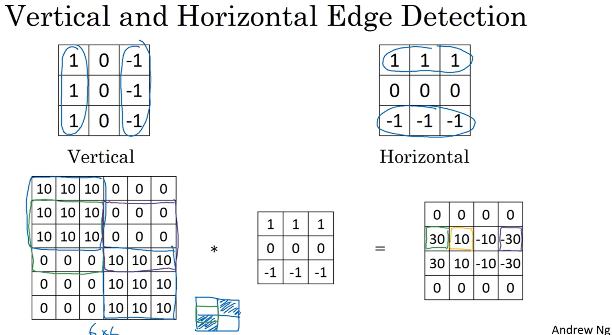

在图中，为了检测到水平边缘，用了右边的filter进行卷积。然后结果中就能知道哪里有边缘了，而且正负值代表了从上到下是白到灰还是灰到白

这里面左右两侧的30看起来非常突兀，但是事实上，真实的图片很大，在3×3的区域中其实数值变化非常平滑（除了边缘）

当然filter不止上面的一种：如sobel filter ; scharr filter 

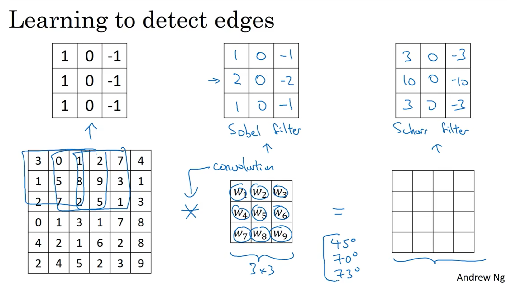

有了这种过滤器思想，我们可以检测任何特征边缘，当然“任何”这个修饰是有赖于过滤器大小和参数设置的。其中找到正确的过滤器参数是一个非常艰难的问题。

当然，人工自己找到合适的过滤器实在是太麻烦。深度学习告诉我们，可以将九个数全部视为参数，然后学习出来。接下来将学习如何通过反向传播把这些参数算出来。

### Padding（填充）

首先我们能够直观感受到卷积的缺点：1. 每一次操作之后图片变小了； 2， 会把边缘信息抛弃掉

因此我们可以采用padding填充策略，在图片最外层补上一层像素，这样的话之后的照片还是6×6，并且边缘的点的信息被利用的次数提升了；我们定义p = padding = 1, 代表最外面填充了1层

在是否填充这方面分为了两种策略： **Valid and Same convolutions strategy**

valid: 直接不要填充，就按照图中的公式，卷积之后的图片灰缩小

same: 我很希望填充之后的图片在卷积之后能够和原来的照片保持一样的大小！因此我可以按照图片中的公式来选择填充的层数。当然，为了p有整数解，CV传统是选择奇数层的填充像素。

### strided convolution(卷积步长)

当然，filter的移动也可以采取不一样的步长（stride）

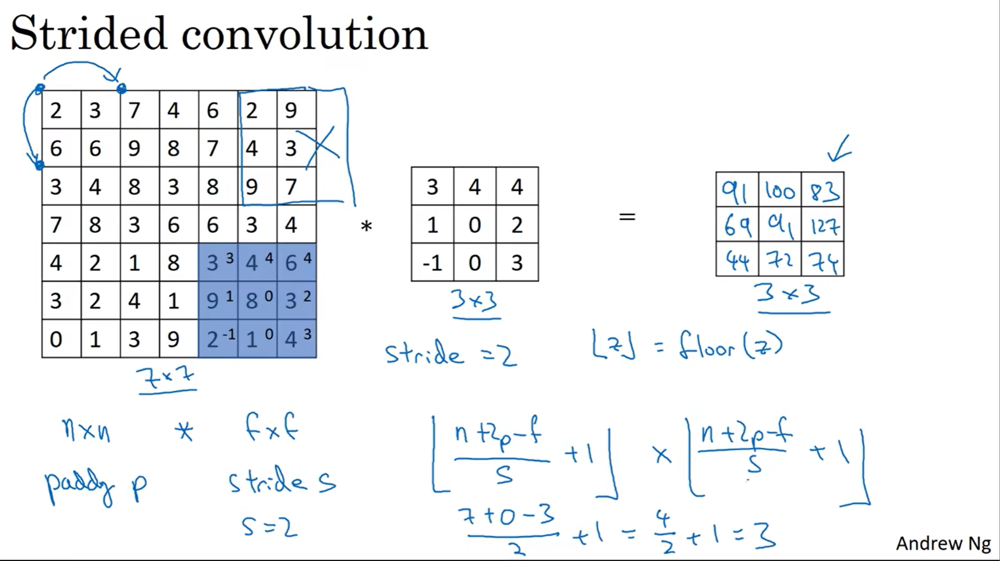

在上面这个例子中，步长是2，因此卷积后的图片不是5×5。注意到公式中的向下取整，事实上如果filter不是完全在原图片中的话，这一次卷积计算就不要进行，这是convention。

注：在计算机视觉中卷积的定义和数学中的不一样。如果是按照数学中的定义的话，filter要先水平和垂直方向反转之后才能用在原图片！但是这里是CV，传统就是filter直接用上去

### 三维卷积

可能会问：图片不是二维的吗，和三维有什么关系？但是之前的图片都是灰白的，而实战中照片是三维的，因为RGB CHANNEL也要考虑进来，所以是三维的。

上面这个案例很好的展示了三位filter究竟是怎么操作的。注意，filter一定？×？×3，因为要涵盖三个通道

当然，如果我只想检测红色通道的边缘，那么两层是0，红色那一层是检测边缘的filter就可以了

那么如果我想同时检测多种边缘特征呢？那么就要用多个filter了。那么这样不会得到很多结果吗？没错，我们把这些结果堆叠起来就可以了，因此就有了图中的公式，代表一次操作时候的“矩阵”的维度。注意：我们常常用channel来代指第三个维数，而有的地方也会使用depth但这并不是很好的notational convention

### 单层卷积网络

学了卷积可能会想：这玩意儿和神经网络有什么关系？ w b activation function呢？ 见下图：

filter相当于w，人为加上的bias相当于b, 对处理完后的图片（类似于z）用非线性激活函数处理（上图中例子为ReLU），最后得到了一个图片（相当于a(i)[l]），最后堆叠起来（相当于a[l]），一切都串联起来了！

接下来总结一下各个参数的维度和notational convention:

输入输出都很好理解，nH/W[l]参数也很容易认同，这个计算之前是讲过的(Height Width)

每一层的filter参数，size（2d）× filter数量，get it 

a[l]，这是要用在[l+1]层的，图中的式子也很容易理解，size和output一样是因为毕竟是从z处理过来的

权重矩阵：size是因为filter size， 后面两个参数是因为channel 数量要进行转化，nc[l-1]代表的是上一层的channels数量，之后的数量是nc[l]，Weights矩阵参数和filter数量（channels数量）挂钩！

最后bias前两个都是1是因为Python的Broadcasting机制，第三个1是因为filter处理之后的channels参数是1，而nc[l]就很容易理解了因为有number of filters个z需要加上bias

这就是**单层卷积网络**！！ 注意：***filter第三维一定和图片的channels数量相等***！

### 卷积神经网络（Convolutional Neural Network）

首先对图片不断进行卷积，操作流程和之前介绍的一层相似；然后最后得到了较为满意的特征提取之后，展平然后作为特征向量进行输入，接下来的就是之前所学习的深度神经网络了。这就是ConvNet的大致思路。注意到图片矩阵的Height and Weight逐渐下降，而channels数量逐渐上升，这是ConvNet中的常见现象

当然，这里的卷积网络中只有一种层，叫做Convolution Layer(CONV), 事实上还有另外两种Layers:

Pooling(POOL) and Fully connected(FC), 在实战中一般三种层都会用上。这些马上会学习

### 池化层 （Pooling Layers）

先看一个例子：假设我采取的池化策略是max pooling, 那么用另外一种filter 2*2, stride = 2, 来扫过这块区域，filter会筛选出这片区域中最大的值。为什么这么做？如果直接点说，就是实验中这种方法很奏效；但是如果硬要感性解释，那么可以理解为这一片区域如果有特征，那么保留最大值，代表这一片有这个特征，而没有的区域保留的最大值依然很小，代表这一片没有这种特征。

这种池化策略**没有任何参数需要学习**，直接就是设定好filter size and stride； 下图是另一个例子：

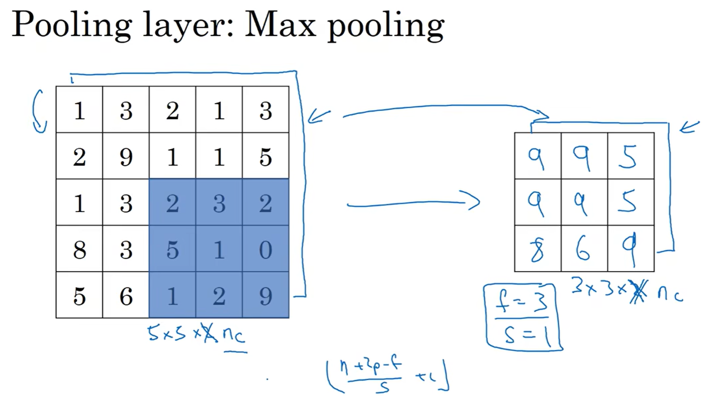

那么还有一种很不常用的池化策略：平均池化（Average Pooling）

一般来说，f = 2, s = 2, 表示长宽取一半；**大部分情况下**，不用padding（**有反例**）

### 深度卷积神经网络

举个例子（Inspired by LeNet-5）

首先是CONV layer, 其中filter数量为6；然后来一层POOL，长宽减半

注意：这里把CONV+POOL称为Layer1，因为不认为POOL需要学习参数；但是有些文献中喜欢CONV和POOl都认为是一层。这里还是采取前者

然后再16层filter，加上POOL，最后得到了5×5×16的矩阵，flatten后得到400单位的特征，之后就是FC3（前面已经有两层）层（类似于隐藏层，FC中每一个node和所有400特征结合），之后是FC4，最后用84个nodes去进行softmax归类，输出结果。这种模型非常经典！

有了CONV  POOL  FC三张牌，那么怎么打就是一个需要探索的问题。如何有效安排卷积层池化层和全连接层从而形成高效的模型一直以来是CV中的研究热门

### 为何卷积如此高效？

reason 1 :  我们来看这个例子，左边有3072个参数，右边得到的结果有4704个结果，如果用正常学习方法的话，如果有一种mapping，那么参数至少3072×4704，虽然现在计算机能学习出来，但是1000*1000的照片立马干碎计算机。而用了卷积之后，只需要（5×5×3+1）×6 = 456个参数就可以实现mapping。注意，这里里面的1是bias, 没错， 不是每个z都配自己的b, 而是像前面的nn一样，b参数广播到所有w[l]a[l-1]

reason 2 & reason 3 ： 

reason2 :　一个特征提取器可以用在任何地方，而不必要在不同的区域重新学习一边 （数据共享） 

reason3 :  结果中的每一个输出都只和9个输入的参数相关联，这恰是我们希望的；我们不希望在提取这个特征的过程中受到其他参数值的影响 （稀疏连接）

 感性认知：除上面三个原因之外： 1. conv特征仅仅代表一部分，可以减少过拟合和噪声

2. conv可以捕捉偏移的特征（特征平移了一点，卷积都能很快发现！）

## Case Studies(实例探究)

### Classic networks——LeNet-5 AlexNet VGG

LeNet-5 : 在那个年代，这个运用场景之一是识别手写数字，因此输入的图片是灰白的，图片尺寸如图；之后通过两次CONV-POOL的Layer处理，得到400个特征，最后通过FC3 FC4和softmax输出类别概率。当然有很多细节：当时人们还不常用ReLU，更多的是——此处也是——sigmoid and tanh；甚至这里还运用了nonlinear pooling, 当然这个现在不常用。这个模型大概60000个参数要学习

AlexNet : 这个网络模型更夸张了，有60000000个参数需要学习；另外，这个模型正式使用了ReLU函数，并且开创性地在两个GPU上面跑这个模型；这个模型还用了LRN（Local Response Normalization）但很少用了

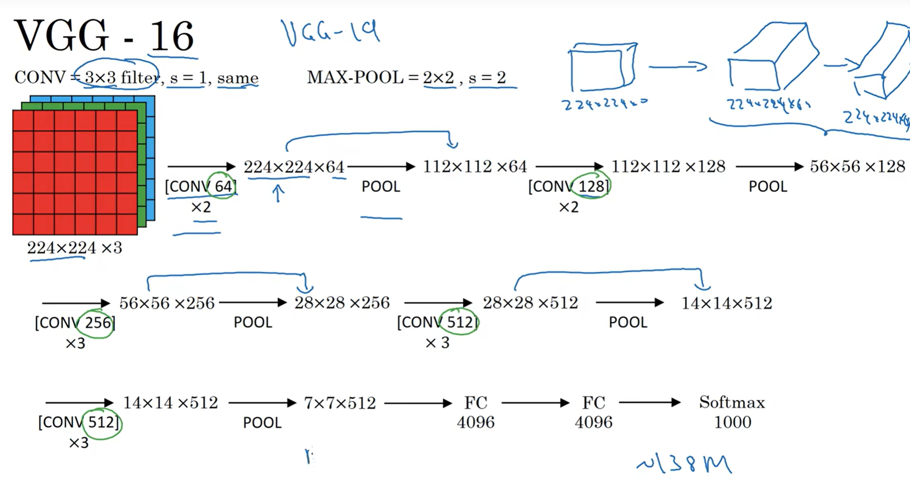

VGG-16 ：这里面先CONV，再same pooling，之后再max pooling, 有16层；尺寸的下降和通道数的增加呈一定规律；这个模型更加庞大，有1.38亿的参数需要学习。

### ResNet

残差网络中的主角是残差块（Residual Block）, 原本a[l+2]只和a[l+1]有关（这里使用的是ReLU function），a[l]的信息想要传到[l+2]层需要走“main path”； 但是现在提供了“short cut” / "skip connection", 使得a[l]的信息能够直接到达a[l+2]；具体操作中，先是a[l+1]算出，传递给[l+2]得到a[l+2], 在a[l]直接加入，一起ReLU

上面就是一个残差网络的例子：如果没有蓝线，那么就是普通的神经网络（Plain Network），但是如果有了skip connection, 那么——举个上图中的例子——这个网络就是5个residual block构成的residual network. 这很有效地解决了网络层数过深而导致的梯度爆炸和梯度消失，允许我们训练到很深的层数

为什么residual network能够如此高效而好用？ 

Let's assume one scenario: 前面有一个网路，如果我最后加上了一个residual block, 那么通过式子可以知道：假如说我这一层学习的很差，z[l+2] = 0（极端例子），那么如果没有skip connection, 那么这一层的学习就很坏；但是如果有skip connection, 在发生这种极端例子下，可以作为恒等式来保留下a[l]这个珍贵的数据，而时间也证明了，计算机学习到这应该是一个恒等式（极端情况下时）也是比较容易地。因此我们保证了加上这个residual block之后网络的学习准确度不会受影响，甚至实践证明学习效率还可能高一点；而如果真的这一个residual block还学到了额外的新东西，那真的是一阵意想不到的狂喜，就保留住了这个新学的东西。值得注意的是，这里的矩阵加法要保证维度相同，因此这个网络模型中有很多"same"卷积，保证了维度的相同，使得相加能够进行；如果维度不相同呢？ 前面乘以Ws矩阵，将维度进行转换，而这个矩阵的参数我们可以让网络去学习，也可以是一个自己设定的一个fixed matrix, 总之是保证了维度的相同

那么上面就是ResNet-34的示意图，注意到很多same CONV用来保证维度相同，然后中间会添加pooling（/2），大致是conv-conv-...-pool-conv-...-conv-pool-...-FC(softmax)， 这和之前的经典交错模式很不一样; 那么这样的网络就是ResNet, 相比于Plain更好！

### 1×1卷积

啊，你说什么？filter还能是1×1？这难道不是很搞笑嘛？我们用了filter是为了检测特征，1×1能检测什么特征？那么卷积操作不就是scalar multiplication吗？

当然，channels为1的情况下这当然是没有意义的；在channels不为1的情况下，例如图中的案例，一个1×1×32的filter会得到一个6×6的矩阵，然后有多少种这样的1×1卷积核，最终得到的结果的channels就是多少。这个1×1卷积核里面可以设置权重，那么用这个视角来看，这种卷积核就相当于是一个神经元node, 接受一个个位置的32个数字，然后按照权重计算，最终输出。这种模式也成为network to network。

那么这个1×1卷积核究竟有什么作用呢？之前提到，pooling可以减小size，但是channels不受影响；但是如果我想减少channels数量呢？那么1×1就是一种手段了，这样可以帮助减少计算。当然，如果不想改变channels，那么这种1×1卷积核就可以视做一个正常的、用来拟合最终函数的函数。再说，如果我想要增加channels数量，那么1×1卷积核依旧可以做到，只要选取自己心仪的filter数量即可。By the way, 1×1卷积核手法在Inception网络中有关键作用。

### Inception Network

在卷积网络中，有的时候不知道选什么filter好？那么不如让神经网络来决定！

在这个模型中，三种filter和一种max pooling都用上了；同时当然要注意维度，因此CONV类型是same；然后提取到的特征都堆叠起来，并且按照一定比例分配channels。最终让计算机算出那种filter的组合比较好。但是有一个问题，那就是计算成本。

可以看到，光光是5×5的filter卷积，都要1.2亿次计算。即使是对于现在的算力，这都是难以接受的（计算式中，前面代表最终得到的数字数量，代表了filter操作次数，后面代表的是一次filter操作的计算数量）

那么如何简化计算成本呢？1×1卷积的减少channel数量的方法可以帮助实现：

发现这样一来，计算量变成了1240万，差不多变成了十分之一

那么有了这样的思想，来看下inception网络的结构：

可以看到，一次上述网络可以分为一个个板块，一个板块的结构如上图：注意到用了很多次1×1卷积的手段改变了channels数量。而在网络中可以发现有几个分支，这些分支都是直接把隐藏层的数据拿来进行FC最后通过softmax输出预测了，这旨在说明这样的网络结构能够很好的抑制过拟合

### 迁移学习

有的时候从头开始学习参数或者是搭建网络框架是一件非常困难的事情，或者说我的数据集非常小，不足以支持搭建非常深的网络，但是如果我们可以迁移别人已经学习好的一些数据，然后拿来作为初始化数据，那么就可能节省非常多的时间

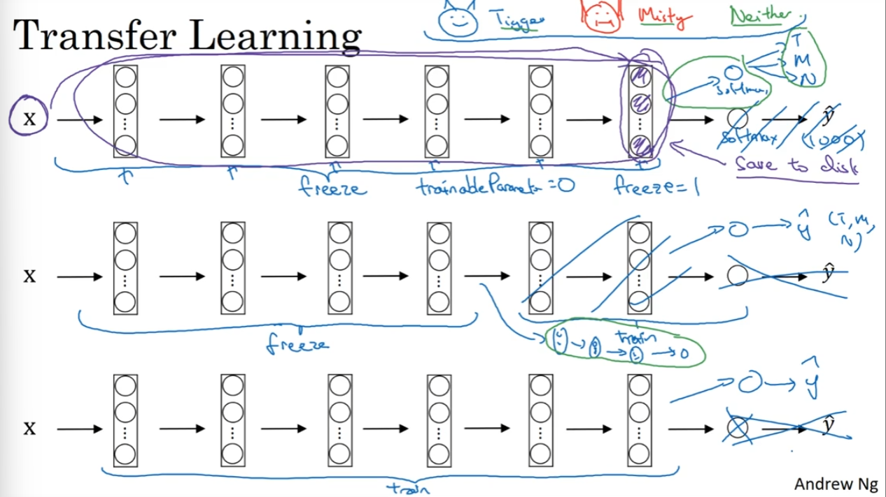

假如说做一个猫猫分类器，输出是tigger还是misty或者都不是。但是关于这两种猫的数据非常少，因此搭建大网络结构不太现实，那么我们可以尝试把其他网络拿过来——假如说是ImageNet的dataset——然后再做一些改进——如将最后1000输出可能的softmax换成输出三种情况的softmax, 然后训练这个softmax的权重。在实践中，我们可以用freeze去保证前面结构中的权重不改变。如果说我的数据还是比较多的，但是就是不想自己搭建网络结构了，那么就直接这个网络结构拿过来然后随机初始化参数进行训练——一般来说，数据量越多，需要freeze的层数越少。因为我们自己有足够多的样本点让计算机去拟合函数了。Transfer learning 在计算机视觉中非常常见。

### 数据扩充（Data augmentation）

计算机视觉非常需要数据，但是事实上这种数据一直以来不是非常充足。因此，使用数据扩充是一种常见的手段

第一类常见的手段就是对这个图片的“图形”进行改变，例如镜像对称，随即截图，或者旋转、sheering等等

第二种常见的手段是对颜色动手，对GRB channels的数值进行改变，从而模仿出——例如阳光打在了猫的身上——这种可能真实情景下的猫的图片，但是这些图片都是猫图

在实战中，一般可以在CPU中单独开一个线程（thread）, 负责对数据进行一定的变化，然后变化后的数据都放在Mini batch里面。

## 目标检测——Object detection

之前一直学习的都是分类问题，但是实际中我们不仅希望能够对物体进行分类，还希望能定位这个物体在哪里

先看关注于背景中的**一个**待检测目标：（现实场景中，要关注同时多个目标）

假如说是在驾驶任务下，那么要分类的可能就是行人，车辆，非机动车，等等。没有他们的话，就认为是正常背景

在这个任务下，我们用这样一套metrics来定位：bxby代表中心点的位置，bwbh代表宽度和高度；同时注意，最左上角和最右下角分别为（0， 0）（1， 1）。这样的话，为监督学习任务定义目的标签就是一个十分关键的问题了。

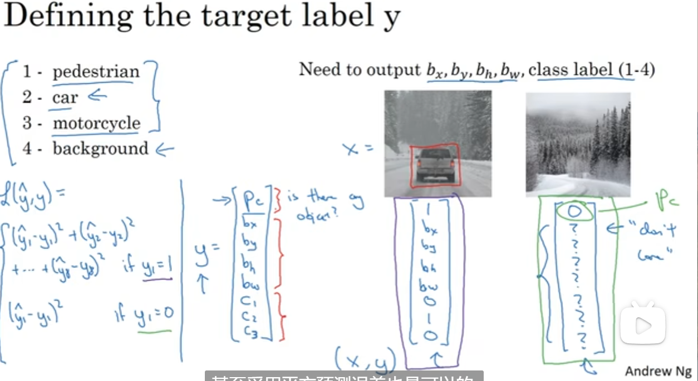

规定y如图，注意到第一个参数是1或0，用来决定是否有1、2、3中的目标；下面四个位置参数和三个分类的各组概率。那么在这种情况下的损失函数也如图：（例）可以是差方来衡量，当然可以更复杂一下，比如c1c2c3用softmax而pc用logistic regression之类的。

### 特征点（landmark）检测

有的时候我们可以通过关键点实现很多事情，例如指出细节（眼角在哪里），应用细节等等（戴皇冠，带的位置？）。因此对于一个特征区域，一般用两个特征点来代表。在Convnet中，希望最后输出的有——假如说——64个特征位置和是否有人脸，那么这个softmax中有129个可能，第一个是有没有人脸，接下来全部是特征点的位置。

### Object Detection

窗口滑动算法：用一个大小的正方形窗口然后按照一定步长滑动，对每一个地方进行卷积计算，输出1或0；然后一轮之后，窗口变大，然后用另一个步长去进行滑动检测；不断这样下去，保证总有合适大小的窗口检测到完整的车。

那么很显然，这个算法的计算复杂度高到爆炸。那么如何科学地实现这个算法呢？

（**Convolutional implementation of sliding windows** is the key）

在这之前，有一个知识点要铺垫一下：如何将全连接层转换为卷积层形式？ 那么如图想必答案非常清楚了，那就是用400种5×5（channel = 16）的filter去卷积，再用4种1×1（channel = 400）的filter去遍历。这两种方法其实是等效的，因为filter中的一个个参数其实就是全连接成中的参数。这是不是很妙呢？

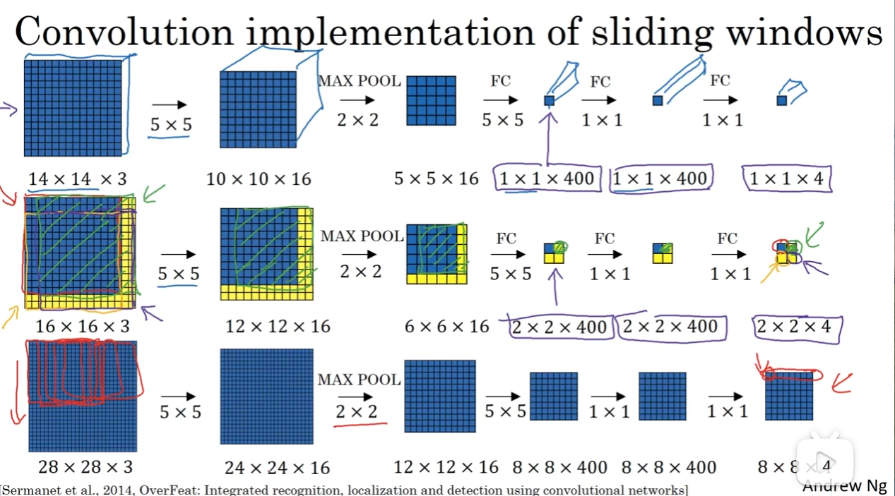

那么现在采用上面的流程，我们尝试让最后的卷积的对应位置就能够对应第一次filter（window）的感受野。这样的话，我们不再是将一个图片分割成很多个子图片，而是整个图片传进去，最后的卷积结果每一个元素都能反应对应窗口的感受野的特征。

但是这个算法还是有点小问题：由于filter大小是定的，那么位置的检测可能就并没有那么精确了。有没有改进呢？

### Bounding Box Prediction

如何获得更精确的位置框？

YOLO孕育而生，代表：You Only Look Once

YOLO的亮点在于：一个物体可能横跨很多格子，但是人工标注之后，取这个框的中心点，然后认为点所落在的网格的向量中的第一个参数是1。在grid更加精细的情况下，两个物体的中心点在一个框内的概率就非常小了

注意到bh bw两个参数可以大于1，因为即使是小格子左上角为（0，0）右下角为（1，1），这个边框也能够超出这个小格子。当然可以使用例如sigmoid function之类的方法将这两个参数范围限制在1以内。当然参数化方式很多。

### 交并比（Intersection over union）& 非极大值抑制

如何检测目标识别算法是否运行良好？那么交并比函数就能够帮助衡量这个算法是否表现良好。

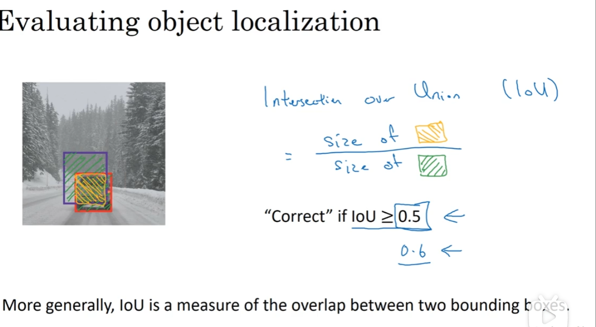

交并比，恰如字面意思，就是交叉区域除以并集区域。这个比值用来衡量目标检测的表现究竟是怎么样。最理想的情况下，完美定位，那么比值就是1。当然通常情况下，一般认为阈值thresold就可以设置为0.5，这个数字以上就认为表现得还不错（当然数值也可以设置地更stringent一点）

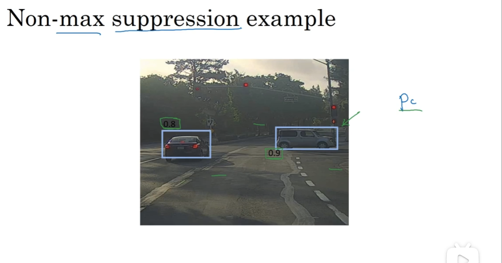

那么在落实“认为中心点只落在一个格子”地时候，现实是周围很多格子都可能会想我这里有个车，因此我的pc参数很接近于1，因此我也应该给出我自己这个格子预测的框的位置。为了避免复杂情况，直接取pc最大的值的框，而放弃其他的框。

具体一点来说，很多格子都有预测，首先pc上面设置阈值，然后找pc最大值的预测框，剩下的和这个框比较，交并比大于0.5的全部去掉（因为认为有较多的重叠，可以简化掉）

### Anchor Boxes

如果一个格子里面能够检测出多个目标呢？

我们提前设定好几种（5-10）anchor box（要覆盖到多种情况，例如人的anchor box就是瘦高形状，车的就是宽宽的），然后看格子给出的两种预测框和哪种anchor box有着最好的交并比，然后因此就归类到了不同的anchor box中，这样就不会把两个框都给理解为一个物体的框的两种可能情况了

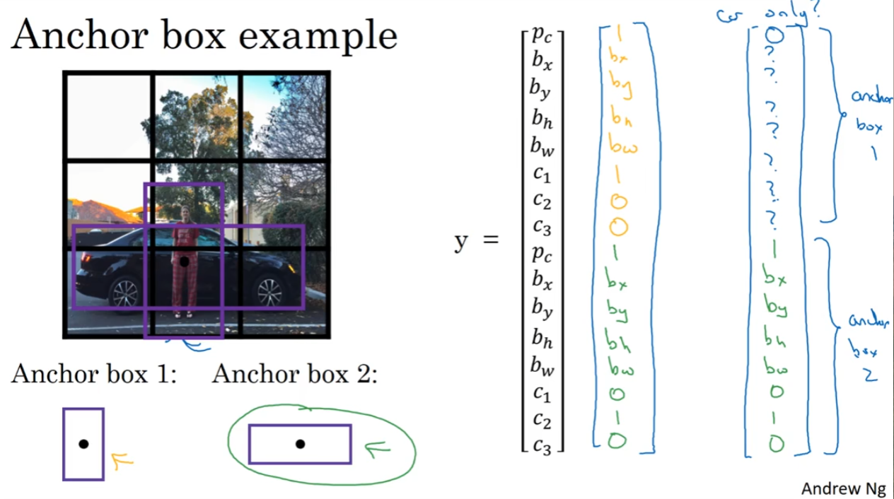

当然如果出现了两个框真的都和一个anchor box高度相似，那么这种情况就很难处理了

### YOLO正式介绍

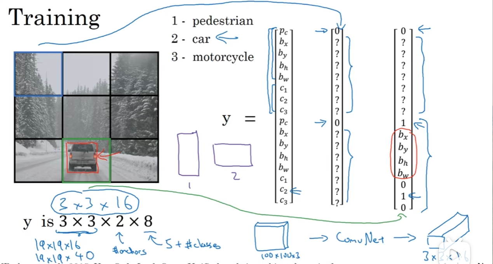

有了前面的铺垫，正式来看YOLO是什么东西。训练部分，首先（例子）3×3网格（filter）铺上，然后训练集的制作上，中心点所落在的网格的y应该pc_? = 1， 然后对应的框框参数都准备好。注意到2×8代表什么，2代表anchor box，8代表一个类别会拥有的参数，这里是5+3，pc bxbybwbh + c1c2c3(概率)。实战中，更可能的是19×19×5×8。那么卷积网络负责的就是把一个RGB三通道的图片转化为3×3×16（例子）。

那么在预测的过程中，需要跑一下非最大值抑制。综合来说，YOLO算法在检测目标上是十分有效的。

