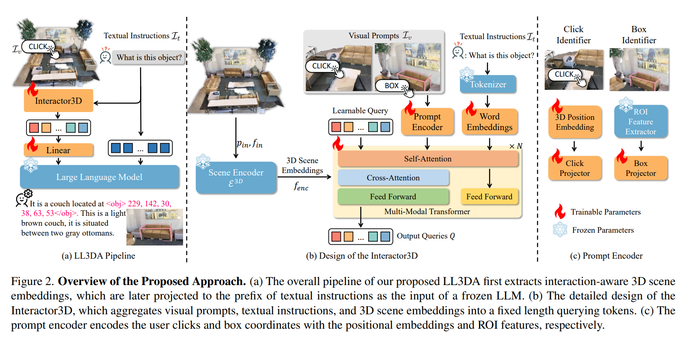
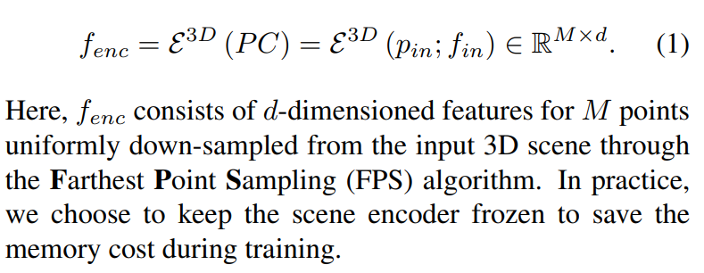

# LL3DA

## 前言 

**摘要：** 最近在大型多模态模型（LMM）方面的进展为各种人工智能应用在人机交互领域的应用提供了可能性。然而，开发能够理解、推理和规划复杂和多样化的3D环境的LMM仍然是一个挑战，特别是考虑到对3D场景中排列不变的点云3D表示的理解需求。现有的研究工作通过多视图图像寻求帮助，并将2D特征投影到3D空间作为3D场景的表示。然而，这导致了巨大的计算开销和性能下降。在本文中，我们提出了LL3DA，这是一个大型语言3D助手，**它采用点云作为直接输入，并响应文本指令和视觉提示。这有助于LMM更好地理解人类交互，并进一步帮助消除复杂3D场景中的歧义。**实验表明，LL3DA取得了显著的结果，并在3D密集字幕（3D Dense Captioning）和3D问答（3D Question Answering）上超越了各种3D视觉-语言模型。

以往处理点云模型都是通过对三维模型进行二维"摄影"然后对着图片进行分析. 但是弊端很多, 计算量大, 而且采取的角度也有讲究, 更难以处理的是, 不同的角度拍摄的图片所处理后得到的信息可能随着处理角度的变化而变化. 

**引言：**大型语言模型（LLM）家族的最近增长为以一种通用方式解决各种机器学习任务打开了巨大的机会。在这场LLM盛会中，研究人员也在寻求各种视觉语言任务的通用LLM解决方案。其中，基于LLM的3D场景理解是一个有价值的主题，将有利于自动驾驶和具身AI代理的发展。然而，鉴于3D环境的多样性和复杂性以及对稀疏3D点的理解需求，这同样是一个挑战。以前的工作在解决各种3D视觉和语言任务方面取得了初步的成功。研究的主流是构建3D specialists，旨在解决一个特定的下游任务，包括3D问答（3DQA）、3D视觉定位（3D-VG）和3D密集字幕（***3D-Dense Captioning***）。同时，其他工作研究了不同3D视觉语言任务之间的相互促进，通过在不同任务上同时训练它们的共享架构。最近，研究人员还引入了LLM用于一般性的3D理解，其中**Point-Bind和Point-LLMs**主要关注3D对象的理解。与此同时，**3DLLM**提出了一个由LLM驱动的解决方案，该方案聚合了多视图特征用于3D特征，**展示了机器能够理解各种3D对象和场景**，并遵循人类产生的文本指令的强大能力。尽管这些方法在理解3D世界和自然语言方面取得了显著的成功，但存在某些局限性。在有限的监督下，3D specialists很难扩展以获得更好的性能，而联合预训练仍然需要为特定任务单独的头部。**提取多视图特征导致巨大的计算开销，并忽略了基本的几何属性**。此外，纯文本经常在杂乱和复杂的3D环境中导致歧义。为了解决上述问题，我们提出了LL3DA，一个大型语言3D助手，能够响应人类的文本和视觉互动，并在复杂的3D环境中理解、推理和规划（见图1）。我们采用了一个多模态变换器(**multi-model**)，通过注意力机制将文本指令、视觉提示和3D场景的信息聚合到固定长度的***learnable querying tokens***中。**querying tokens**被投影并用作***文本指令的前缀***，作为***pre-trained and frozen LLM***的输入。这种设计不仅有助于解决排列不变的3D场景嵌入与LLM嵌入空间之间的矛盾，而且还提取了交互感知的3D场景嵌入，以实现有效的指令遵循。我们进行了广泛的实验，探索了LLM在复杂和多样化的3D环境中理解、推理和规划的能力。我们的模型在两个广泛使用的3D密集字幕和3D问答数据集上取得了最先进的结果。此外，通过引入额外的视觉互动，我们的方法可以进一步消除模糊文本指令中的歧义。总结来说，我们的主要贡献在于：

- 我们提出了一个基于LLM的解决方案，用于在复杂的3D环境中理解、推理和规划。
- 我们的模型接受文本指令和视觉互动作为输入，并提取交互感知特征以有效遵循指令。
- 广泛的实验表明，我们的方法超越了各种现有的最先进的3D视觉语言模型。

3D Dense Captioning 是一种计算机视觉和自然语言处理相结合的任务，它要求模型能够接收一个3D场景（例如，由3D点云或网格表示的室内环境）作为输入，并生成描述这个场景的自然语言句子。这种描述不仅需要捕捉场景的视觉内容，还要能够定位和识别场景中的各个物体或元素。 在3D Dense Captioning中，“Dense”一词通常意味着模型生成的描述是密集的，即它详细地描述了场景中的多个对象和它们之间的关系. 例如，对于一个包含沙发、咖啡桌和植物的室内环境，3D Dense Captioning模型可能会生成如下描述：“房间里有一张棕色的沙发，位于两个灰色的脚踏板之间。沙发下方是一块地毯，上面放着几个抱枕。咖啡桌放在沙发前面，桌上有一个花瓶和一些杂志。左边的角落里有一盆高大的植物。”

在机器学习和特别是自然语言处理领域中，"**Frozen LLM**"（冻结的大型语言模型）指的是在训练过程中不更新其权重的大型语言模型. 

## Pipeline 

LL3DA（Large Language 3D Assistant）的网络框架主要由以下几个关键组件构成：

1. **Scene Encoder (E3D)**: 这是一个采用掩码变换器编码器（预训练于ScanNet检测任务）的场景编码器，它将3D点云PC作为输入，并输出3D场景嵌入。
2. **Visual Prompt Encoder**: 该组件处理两种常见的视觉互动——用户点击和3D框注释。用户点击通过3D傅里叶位置嵌入函数进行编码，而框注释则通过预训练的3D对象检测器提取的ROI特征表示。
3. **Multi-Modal Transformer (MMT)**: 这是一个多模态变换器，它的作用是解决排列不变的3D场景嵌入与位置敏感的因果LLM之间的矛盾，桥接冻结的单模态专家之间的差距，并提取交互感知的特征。MMT通过自注意力机制将视觉信息聚合到固定数量的可学习查询令牌中。
4. **LLM (Large Language Model)**: 使用解码器-仅生成预训练变换器作为大型语言模型的主干，参数和嵌入层在训练期间保持冻结状态。
5. **Q-Former**: 这是一个用于将排列不变的3D嵌入转换为固定长度交互感知场景嵌入的架构，作为LLM输入的前缀。
6. **Prompt Encoder**: 该编码器将用户点击和框坐标与位置嵌入和ROI特征一起编码。
7. **Interactor3D**: 这是一个详细设计，它聚合视觉提示、文本指令和3D场景嵌入到固定长度的查询令牌中。
8. **训练目标和指令调整**: 通过适当的训练数据和指令，指导模型生成期望的输出，并通过优化可训练参数来最大化目标响应序列的可能性。

LL3DA的网络框架通过这些组件的相互作用，实现了对复杂3D环境中的文本指令和视觉提示的理解、推理和规划。该框架的设计允许模型直接从3D场景中提取特征，并且能够处理视觉提示和文本指令，以多样化人类与复杂3D环境的可能互动。

以上分析来自kimi

在LL3DA框架中，多模态变换器（MMT）具体是如何工作的，它如何帮助模型理解复杂的3D场景？

在LL3DA框架中，多模态变换器（Multi-Modal Transformer，简称MMT）起着至关重要的作用，它帮助模型理解和处理来自复杂3D场景的视觉和文本指令。MMT的具体工作流程如下：

1. **特征整合**：MMT通过自注意力机制整合来自不同源的特征，包括文本指令、视觉提示（如用户点击或3D框注释）和3D场景的嵌入。
2. **查询令牌生成**：MMT使用一个称为Q-Former的组件将排列不变的3D场景嵌入转换为固定长度的查询令牌。这些查询令牌是通过注意力机制生成的，能够捕捉场景中的重要信息。
3. **交互感知特征提取**：MMT通过交叉注意力机制，允许查询令牌与3D场景嵌入进行交互，从而提取交互感知的特征。这有助于模型更好地理解场景中不同对象之间的关系。
4. **冻结的单模态专家桥接**：MMT桥接了冻结的单模态专家（如3D场景编码器和视觉提示编码器），使得这些专家生成的特征能够与文本指令相结合。
5. **位置敏感的LLM适应**：MMT解决了排列不变的3D嵌入与位置敏感的LLM之间的矛盾，通过生成固定长度的查询令牌，使得LLM能够以一种有序和连贯的方式处理3D场景信息。
6. **输出投影**：MMT的输出是一组查询令牌，这些令牌被投影到LLM的嵌入空间中，作为LLM输入的一部分。
7. **冻结的LLM**：在LL3DA中，大型语言模型（LLM）的参数和嵌入层在训练期间保持冻结，以节省内存成本。MMT的输出作为LLM的输入，使得LLM能够生成自然语言响应。

通过这种方式，MMT使得LL3DA能够处理复杂的3D场景中的多种交互方式，包括文本指令和视觉提示，从而提高了模型对3D环境的理解能力。此外，MMT的设计允许模型在不同的3D视觉语言任务中进行有效的特征提取和指令执行，这对于在多样化的3D环境中进行机器学习和自主决策至关重要。

在论文的Methodology部分, 详细介绍了模型的方法论 :

 ***问题格式化:*** 

模型输入/输出（Model I/O）：如图2(a)所示，我们模型的输入包括由一组点PC表示的3D场景、文本指令It，以及作为补充空间标识符的潜在视觉互动Iv。这里，点云PC = [pin, fin] ∈ RN×(3+F)，其中pin ∈ RN×3和fin ∈ RN×F分别是点坐标和额外的点特征，包括颜色、法线和高度。我们模型的输出是自由形式的自然语言，其中一部分可以转换为3D坐标。

指令格式化（Instruction Formatting）：遵循现有的大型多模态模型（LMMs）[54]，我们以

``“### human:”``标识符开始文本指令It，并要求模型在``“### assistant:”``标识符后生成响应。这使得模型能够区分来自上下文的信息，并进一步参与多轮对话。

坐标表示（Coordinate Representations）：为了提供LLMs感知和响应3D坐标的能力，我们将3D点和3D边界框转换为纯文本。具体来说，一个点由``<loc>x, y, z</l>``表示，一个边界框由其中心点和大小表示，即``<obj>cx, cy, cz, w, h, l</obj>``。这里，所有的数值数据都被离散化为[0, 255]范围内的无符号整数，与输入3D场景的边界相对应。这种设计可以自然地适应现有预训练LLMs的词汇表。通过不引入任何额外的可学习标记，我们可以节省调整整个LLM的工作。

***模型设计:*** 

如图2(a)所示，我们的模型首先通过Interactor3D聚合固定长度的场景嵌入，Interactor3D将视觉提示、文本指令和3D场景作为输入。接下来，聚合的场景嵌入被投影到文本指令的前缀，作为冻结LLM的输入。Interactor3D的详细设计如图2(b)所示，它包括一个冻结的3D场景编码器E3D、一个视觉提示编码器和一个Q-Former，将排列不变的3D嵌入转换为固定长度的交互感知场景嵌入，作为LLM输入的前缀。

首先是Scene Encoder: 

然后是关于Visual Prompt Encoder的处理: 

用户点击其实是一种"位置相关信息的提供", 那么这就很容易联想到positional embedding中的傅里叶手法. 

而box annotation(注释框)其实是一种关于Ratio of Interest信息的提供, 这个注释框相关信息的提取是另一份论文的工作[9]. 

这些特征都提取或者是映射完成时之后, 进入前馈网络. 什么是前馈网络? 前馈网络，是神经网络中的一种常见架构，它属于较传统的深度学习模型，主要用于简单的模式识别和分类任务。在深度学习和机器学习的背景下，FFN通常指的是一个全连接的神经网络层或由多个全连接层组成的网络，信息在网络中只在一个方向上传播，即从输入层到隐藏层，最后到输出层，而不在网络中循环。

FFN的基本组成如下：

1. **输入层**：接收原始数据。
2. **隐藏层**：一个或多个全连接层，它们对输入数据进行变换。每个隐藏层由多个神经元组成，每个神经元对输入进行加权求和，然后通过一个非线性激活函数。
3. **输出层**：最后一个全连接层，通常没有激活函数或使用特定的激活函数，如softmax函数用于分类任务。

可以说, FFN是一种简单的, 或者说特定的MLP

接下来是多模态变换器:

MMT利用一个称为Q-Former的组件，它使用自注意力机制将场景编码器的输出、视觉提示编码器的特征和文本指令的信息整合起来。这些信息被聚合到一组固定长度的查询令牌中。Q-Former生成的查询令牌是可学习的，并且数量固定，通常是32个查询令牌。这些查询令牌通过自注意力层与文本指令和视觉提示进行交互，然后通过交叉注意力层与3D场景嵌入进行交互。最后输出32个queries, 然后投射到LLM的潜空间里面, 然后放在文本投射到潜空间的tokens前面作为前缀. 还提到,只用BERT模型来初始化预训练词和位置嵌入, 因为如果用BERT去初始化整个Q-Former, 那么会总是得到重复的结果(??)

最后是LLM的选用, 使用的是beam search(束搜索), 束宽为4. 由于位置嵌入和因果注意力掩码，这些模型对输入顺序敏感。LLM的参数和嵌入层在训练期间保持冻结. 

那么响应机制是``s* = arg max s P (s|PC, It, Iv)``

这个式子是条件概率的表达方式，用于机器学习和概率论中，特别是在条件生成模型里。具体来说：

- 𝑠∗*s*∗：表示最优的输出序列，也就是我们希望生成的响应。
- ``arg⁡max⁡𝑠``*：*这是一个数学符号，表示“使函数 𝑃(𝑠∣𝑃𝐶,𝐼𝑡,𝐼𝑣)P(s∣PC,I**t,I**v) 取最大值的 𝑠s”。简单来说，就是找到那个使得概率最大的 𝑠s*。*
- 𝑃(𝑠∣𝑃𝐶,𝐼𝑡,𝐼𝑣)*P*(*s*∣*PC*,*I**t*,*I**v*)：这是一个条件概率分布，表示在给定输入（点云PC、文本指令It和视觉互动Iv）的条件下，输出序列 𝑠*s* 的概率。

将这些组合起来，𝑠∗=arg⁡max⁡𝑠𝑃(𝑠∣𝑃𝐶,𝐼𝑡,𝐼𝑣)*s*∗=argmax*s**P*(*s*∣*PC*,*I**t*,*I**v*) 表示我们要找到那个在给定输入（PC，It，Iv）的条件下，使得输出序列 𝑠*s* 的概率最大的序列。这就是模型在解码阶段试图实现的目标，即生成最有可能的输出响应。

在实际应用中，由于直接计算所有可能序列的概率并找到最大值是非常耗时的，通常会使用一些启发式搜索算法（如束搜索）来近似找到最优解。这些算法能够在合理的计算成本下找到一个概率较高的输出序列，作为最终的响应 𝑠∗*s*∗。

那么以上就是Pipeline的分析 

