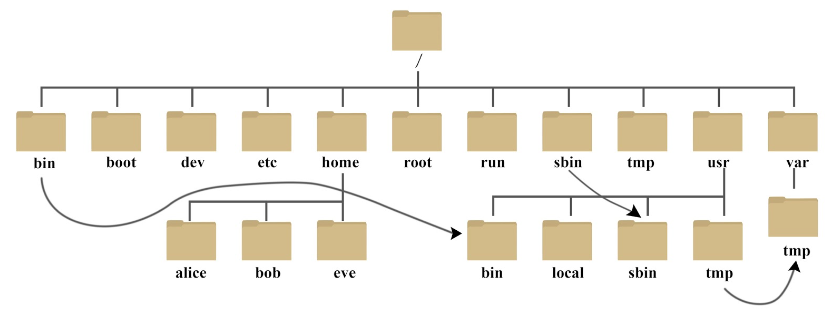
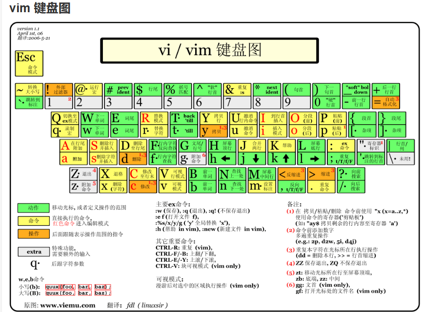

#  快速上手Linux

## 目录系统

``pwd``命令： 返回当前的路径位置（自己在哪里）

文件树状目录系统：



目录的起点是/然后下面分了很多子文件，那么每一个文件的含义是什么呢？ 

- **/bin**：
  bin 是 Binaries (二进制文件) 的缩写, 这个目录存放着最经常使用的命令。

- **/boot：**
  这里存放的是启动 Linux 时使用的一些核心文件，包括一些连接文件以及镜像文件。

- **/dev ：**
  dev 是 Device(设备) 的缩写, 该目录下存放的是 Linux 的外部设备，在 Linux 中访问设备的方式和访问文件的方式是相同的。

- **/etc：*****（没有root权限的时候，这里的东西不能改）***
  etc 是 Etcetera(等等) 的缩写,这个目录用来存放**所有的系统管理所需要的配置文件和子目录**。

- **/home**：
  用户的主目录，在 Linux 中，**每个用户都有一个自己的目录**，一般该目录名是以用户的账号命名的，如上图中的 alice、bob 和 eve。

- **/lib**：
  lib 是 Library(库) 的缩写这个目录里存放着系统最基本的**动态连接共享库**，其作用类似于 Windows 里的 DLL 文件。几乎所有的应用程序都需要用到这些共享库。

- **/lost+found**：
  这个目录一般情况下是空的，当系统非法关机后，这里就存放了一些文件。

- **/media**：
  linux 系统会自动识别一些设备，例如U盘、光驱等等，当识别后，Linux 会把识别的设备挂载到这个目录下。

- **/mnt**：
  系统提供该目录是为了让用户临时挂载别的文件系统的，我们可以将光驱挂载在 /mnt/ 上，然后进入该目录就可以查看光驱里的内容了。

- **/opt**：
  opt 是 optional(可选) 的缩写，这是给主机额外安装软件所摆放的目录。比如你安装一个ORACLE数据库则就可以放到这个目录下。默认是空的。

- **/proc**：
  proc 是 Processes(进程) 的缩写，/proc 是一种伪文件系统（也即虚拟文件系统），存储的是当前内核运行状态的一系列特殊文件，这个目录是一个虚拟的目录，它是系统内存的映射，我们可以通过直接访问这个目录来获取系统信息。
  这个目录的内容不在硬盘上而是在内存里，我们也可以直接修改里面的某些文件，比如可以通过下面的命令来屏蔽主机的ping命令，使别人无法ping你的机器：

  ```
  echo 1 > /proc/sys/net/ipv4/icmp_echo_ignore_all
  ```

- **/root**：
  该目录为系统管理员，也称作超级权限者的用户主目录。

- **/sbin**：
  s 就是 Super User 的意思，是 Superuser Binaries (超级用户的二进制文件) 的缩写，这里存放的是系统管理员使用的系统管理程序。

- **/selinux**：
   这个目录是 Redhat/CentOS 所特有的目录，Selinux 是一个安全机制，类似于 windows 的防火墙，但是这套机制比较复杂，这个目录就是存放selinux相关的文件的。

- **/srv**：
   该目录存放一些服务启动之后需要提取的数据。

- **/sys**：

  这是 Linux2.6 内核的一个很大的变化。该目录下安装了 2.6 内核中新出现的一个文件系统 sysfs 。

  sysfs 文件系统集成了下面3种文件系统的信息：针对进程信息的 proc 文件系统、针对设备的 devfs 文件系统以及针对伪终端的 devpts 文件系统。

  该文件系统是内核设备树的一个直观反映。

  当一个内核对象被创建的时候，对应的文件和目录也在内核对象子系统中被创建。

- **/tmp**：
  tmp 是 temporary(临时) 的缩写这个目录是用来存放一些临时文件的。

- **/usr**：***（重要！配环境很多涉及到它！）***
   usr 是 ***unix shared resources(共享资源)*** 的缩写，这是一个非常重要的目录，用户的很多应用程序和文件都放在这个目录下，类似于 windows 下的 program files 目录。

- **/usr/bin：*****（非常重要，PATH的添加里面经常涉及到它）***
  系统用户使用的应用程序。

- **/usr/sbin：**
  超级用户使用的比较高级的管理程序和系统守护程序。

- **/usr/src：**
  内核源代码默认的放置目录。

- **/var**：
  var 是 variable(变量) 的缩写，这个目录中存放着在不断扩充着的东西，我们习惯将那些经常被修改的目录放在这个目录下。包括各种日志文件。

- **/run**：
  是一个临时文件系统，存储系统启动以来的信息。当系统重启时，这个目录下的文件应该被删掉或清除。如果你的系统上有 /var/run 目录，应该让它指向 run。

在 Linux 系统中，***有几个目录是比较重要的，平时需要注意不要误删除或者随意更改内部文件***。

**/etc**： 上边也提到了，这个是系统中的配置文件，如果你更改了该目录下的某个文件可能会导致系统不能启动。

**/bin, /sbin, /usr/bin, /usr/sbin**: 这是系统预设的执行文件的放置目录，比如 **ls** 就是在 **/bin/ls** 目录下的。

## 常见命令

### vim

vim 后面跟上文件的路径，就会进入到这个文件内部



### cd

cd stands for "change directory" 切换到指定路径

那么关于路径的表示有一些重点： 

**切换到上级目录：**使用 **..** 表示上级目录，可以通过连续多次使用 **..** 来切换到更高级的目录

``cd ../../ 代表切换到上上级目录``

**切换到用户主目录（home）：**使用 **~** 表示当前用户的主目录，可以使用 cd 命令直接切换到主目录

``cd ~/.bashrc``打开用户的bashrc配置文件

### 其他常用

``xxx --version``告诉software的版本，如：``gcc --version   g++ --version``

``which xxx``返回使用的software的储存地址，如： ``which gcc``   ``/usr/bin/gcc-11.2.0/bin``

``locate 名字``返回包含名字的文件（们）的路径

``chmod`` 代表的是change mode， 控制用户对文件的权限的命令

这个命令有很多参数，详见[Linux chmod 命令 | 菜鸟教程 (runoob.com)](https://www.runoob.com/linux/linux-comm-chmod.html)

``git`` 实验复现的时候习惯git clone, 但是clone之前的一大堆公钥问题，详见hw2

``echo xxx``返回xxx, 最常见的是``echo $PATH``

``source``  使文件生效，但是其实``.``一样可以实现

## 环境变量

假如说深度学习的程序跑起来了，它怎么知道一些命令或者程序在哪里呢？其实秘密就在环境变量里面

anaconda下载完成的时候，PATH就会自动把anaconda的路径储存起来，在conda里面配置环境的细节，都能通过anaconda3的路径获知，程序也就知道，例如，torch是在哪里，gcc是在哪里

其实环境变量有很多，但是其中$PATH是最特殊的

它的分隔符是冒号；而在寻找相对应的程序的时候，从左到右依次寻找，找到了之后就不会再继续找

例如我在anaconda环境里面配了13.2.0的gcc，但是如果不小心PATH最前面有/usr/bin，里面有11.2.0的gcc, 那么最后使用的还是11.2.0的gcc

PATH常见的操作有(在 ~/.bashrc 里面)： 

````bash
export PATH=.../bin:$PATH // 代表路径最前面补充上路径
export PATH=$PATH:.../bin // 代表路径最后面补充上路径
````

在bashrc中删掉这些话，那么export的效果会撤销；当然每做出一次修改，就最好source一下


