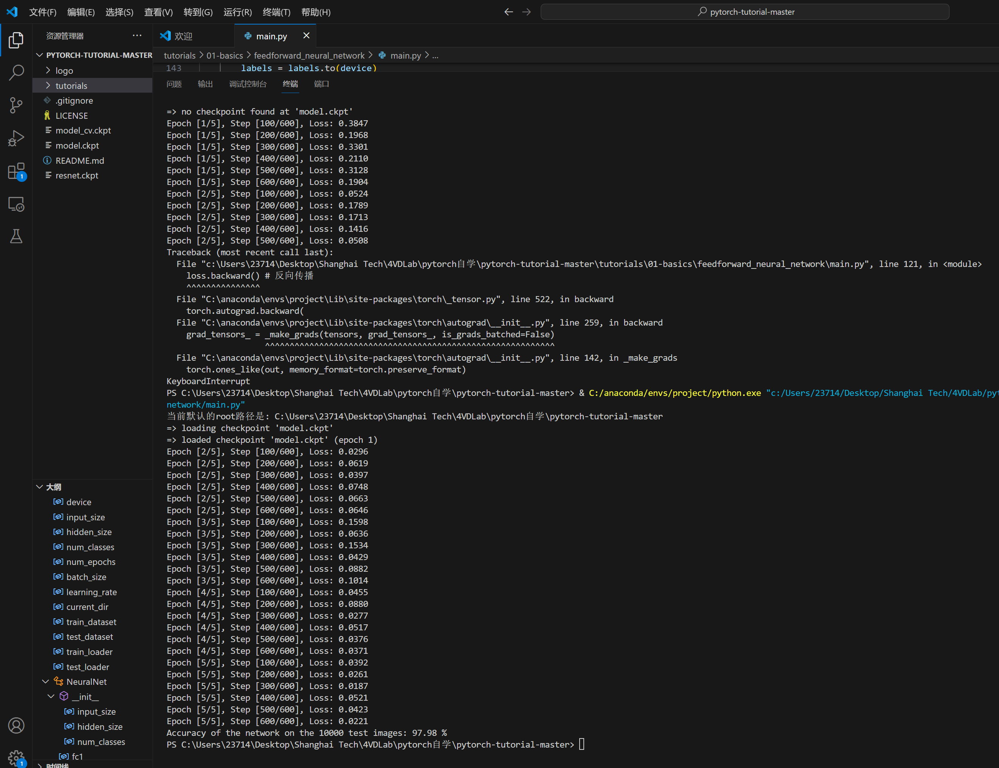

如何实现断点续传

断点续传有几个核心:

- 在初始化模型和优化器之后, 要判断是否之前的模型; 如果有, 那么需要加载检查点
- 加载检查点加载的内容包括模型本身(连带着参数全部都加在了), 优化器, 以及非常重要的``start_epoch``参数, 记录从第几次epoch开始训练
- 训练模型的过程中, 要阶段性(甚至是训练一轮就存储一轮)保存checkpoint. 注意如果是有一定的频率进行保存, 例如5, 10轮保存一次, 那么可能会造成多训练几轮的结果, 但是影响应该不会特别大

接下来介绍常用的函数, 代码

- 首先是在训练循环中保存checkpoint了: 首先我们要定义save_checkpoint函数, 然后训练循环中调用

````python
def save_checkpoint(state, filename='checkpoint.pth.tar'): 
    # 保存到同目录的'checkpoint.pth.tar'
    torch.save(state, filename)
    
for epoch in range(start_epoch, num_epoch):
    # ...
    save_checkpoint({
        'epoch': epoch + 1,
        'state_dict': model.state_dict(),
        'optimizer':optimizer.state_dict(),
    })
````

调用的时候, {}里面的字典构成了state, 然后被储存了起来; 有的时候储存的东西不止这么些, 例如scheduler

- 其次是加载保存好的检查点, 这里需要自己定义``load_checkpoint``函数, 然后再开始训练之前调用:

````python
def load_checkpoint(model, optimizer, filename='checkpoint.pth.tar'):
    if os.path.isfile(filename):
        print("=> loading checkpoint '{}'".format(filename))
        checkpoint = torch.load(filename)
        model.load_state_dict(checkpoint['state_dict'])
        optimizer.load_state_dict(checkpoint['optimizer'])
        epoch = checkpoint['epoch']
        print("=> loaded checkpoint '{}' (epoch {})"
              .format(filename, checkpoint['epoch']))
    else:
        print("=> no checkpoint found at '{}'".format(filename))
        epoch = 0
    return model, optimizer, epoch

# 初始化模型、优化器和损失函数
model = MLP().to(device)
optimizer = optim.Adam(model.parameters(), lr=0.001)
criterion = nn.CrossEntropyLoss()

# 加载检查点
model, optimizer, start_epoch = load_checkpoint(model, optimizer)
````

参数的load都是通过字典访问而实现的; 注意这个函数里面自动带了判断是否有上一个检查点, 更加方便了; 同样注意如果例如scheduler这种也需要load, 那么传参里面要加上它, 并且函数里面要Load

那么这就是大致的pipeline了, 实战演练

````python
import torch
import torch.nn as nn
import torchvision
import torchvision.transforms as transforms
import os

# Device configuration
device = torch.device('cuda' if torch.cuda.is_available() else 'cpu')

input_size = 784 

hidden_size = 500
num_classes = 10
num_epochs = 5
batch_size = 100
learning_rate = 0.001
# 获取当前工作目录
current_dir = os.getcwd()
print("当前默认的root路径是:", current_dir)
# MNIST dataset 
train_dataset = torchvision.datasets.MNIST(root='../data', 
                                           train=True, 
                                           transform=transforms.ToTensor(),  
                                           download=False)

test_dataset = torchvision.datasets.MNIST(root='../data', 
                                          train=False, 
                                          transform=transforms.ToTensor())

# Data loader
train_loader = torch.utils.data.DataLoader(dataset=train_dataset, 
                                           batch_size=batch_size, 
                                           shuffle=True)
test_loader = torch.utils.data.DataLoader(dataset=test_dataset, 
                                          batch_size=batch_size, 
                                          shuffle=False)

# Fully connected neural network with one hidden layer
class NeuralNet(nn.Module):
    def __init__(self, input_size, hidden_size, num_classes):
        super(NeuralNet, self).__init__()
        self.fc1 = nn.Linear(input_size, hidden_size) 
        self.relu = nn.ReLU()
        self.fc2 = nn.Linear(hidden_size, num_classes)  
    
    def forward(self, x):
        out = self.fc1(x)
        out = self.relu(out)
        out = self.fc2(out)
        return out

def load_checkpoint(model, optimizer, filename='model.ckpt'):
    if os.path.isfile(filename):
        print("=> loading checkpoint '{}'".format(filename))
        checkpoint = torch.load(filename)
        model.load_state_dict(checkpoint['state_dict'])
        optimizer.load_state_dict(checkpoint['optimizer'])
        epoch = checkpoint['epoch']
        print("=> loaded checkpoint '{}' (epoch {})"
              .format(filename, checkpoint['epoch']))
    else:
        print("=> no checkpoint found at '{}'".format(filename))
        epoch = 0
    return model, optimizer, epoch
def save_checkpoint(state, filename='model.ckpt'): 
    torch.save(state, filename)

model = NeuralNet(input_size, hidden_size, num_classes).to(device)
# Loss and optimizer
criterion = nn.CrossEntropyLoss()

optimizer = torch.optim.Adam(model.parameters(), lr=learning_rate)  

# Train the model
start_epoch = 0

model, optimizer, start_epoch = load_checkpoint(model, optimizer)

total_step = len(train_loader)
for epoch in range(start_epoch, num_epochs):
    for i, (images, labels) in enumerate(train_loader):  
        # Move tensors to the configured device
        images = images.reshape(-1, 28*28).to(device)
        # torch.Size([100, 784]),为了能够放进nn.Linear
        labels = labels.to(device)
        # torch.Size([100])
        # Forward pass
        outputs = model(images)
        loss = criterion(outputs, labels)
        
        # Backward and optimize
        optimizer.zero_grad() # 防止梯度累加
        loss.backward() # 反向传播
        optimizer.step() # 更新参数
        
        if (i+1) % 100 == 0:
            print ('Epoch [{}/{}], Step [{}/{}], Loss: {:.4f}' 
                   .format(epoch+1, num_epochs, i+1, total_step, loss.item()))
    save_checkpoint({
        'epoch': epoch + 1,
        'state_dict': model.state_dict(),
        'optimizer':optimizer.state_dict(),
    })

# Test the model
# In test phase, we don't need to compute gradients (for memory efficiency)
with torch.no_grad():
    correct = 0
    total = 0
    for images, labels in test_loader:
        images = images.reshape(-1, 28*28).to(device)
        labels = labels.to(device)
        outputs = model(images)
        _, predicted = torch.max(outputs, 1)
        total += labels.size(0) # 这里是100,batch_size
        correct += (predicted == labels).sum().item()
    print('Accuracy of the network on the 10000 test images: {} %'.format(100 * correct / total))

# Save the model checkpoint
torch.save(model.state_dict(), 'model.ckpt')

````

由于这里训练五轮, 所以说每一轮之后都会保存一次; 效果见下图:


在上面情境中, 训练一轮之后直接ctrl+c, 中断了; 但是第一轮结束后的checkpoint都保留了下来



然后再次运行程序, 能够良好的指出: 加载了上一次的检查点, 且告诉了上一次检查点的epoch

同时, 这个程序还打印了root路径~