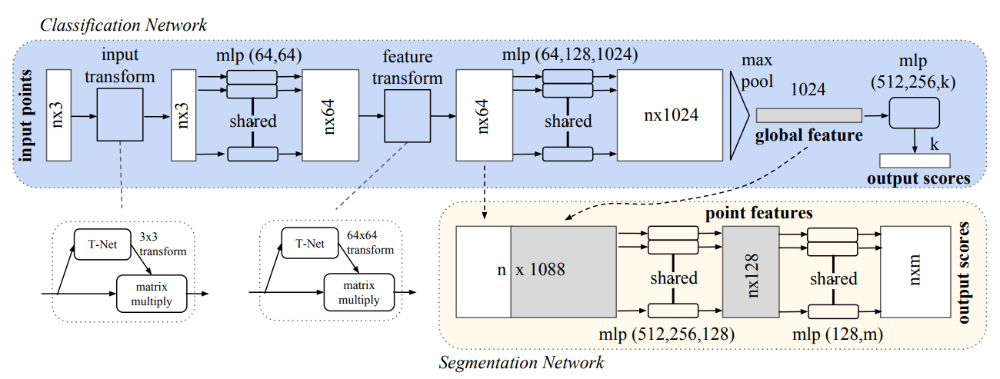
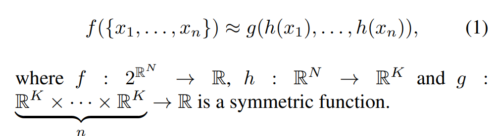

# PointNet

之前处理3D数据, 都是是利用: voxel grid 或者是二维呈现. 


二维呈现, 是为了将convolutional network运用再图像上面

那么Point net网络, 输入的数据形式是点云. 关于点云数据, 论文特别提到: 

Point clouds are simple and unified structures that avoid the combinatorial irregularities and complexities of meshes......still has to respect the fact that a point cloud is just a set of points and therefore ***invariant to permutations.*** 

为了结局组合不敏感(因为点换了位置, 依然整体信息是不变的), 论文使用了一种经典的对称函数, 最大池化

这个模型最后实现的是: 在分类任务上, 输入点云, 输出标签; 在场景分割上, 给每个点打上标签(例如, 这个点是属于椅子? 还是桌子?)

# model

附: pipeline，中文意为管线，意义等同于流水线。baseline意思是**基线**，这个概念是作为算法提升的参照物而存在的，相当于一个**基础模型**，可以以此为基准来比较对模型的改进是否有效。



首先要了解点云数据的特性, 论文论述了三个特点:

- Unordered. 每一个点只有三个坐标, 但是并没有引索! 
- Interaction among points. 点与点并不是孤立的, 而是像图像一样, pixel and pixel之间有关系, 蕴含着信息
- Invariance under transformation. 这个模型在空间中进行线性变换, 例如旋转, 对称等, 应该蕴含的信息是不会改变的

论文中认为, 模型中三个组件非常的关键: 

- Symmetric function to aggregate information

这是为了Unordered Input. 论文中提到:  For example, + and ∗ operators are symmetric binary functions. 因为自变量交换位置, 结果不变. 论文中也提到过, 曾经尝试使用过训练一个小模型去给它们简洁地排列, 但是表现非常差, 但是依然表现好过没有排序. 

所以说论文想找到一种函数, 满足: 



最后, 选择了maxpooling作为g函数

- Local and Global Information Aggregation

在模型图中可以看到, 后面将最大池化提取出来的全局特征与最大池化之前的局部特征进行拼接. 

`` Then we extract new per point features based on the combined point features - this time the per point feature is aware of both the local and global information.(from the paper)``

- Joint Alignment Network

`The semantic labeling of a point cloud has to be invariant if the point cloud undergoes certain geometric transformations`

为了把一个空间变换过的点云"摆正来", 论文提到了:

`Jaderberg et al. [9] introduces the idea of spatial transformer to align 2D images through sampling and interpolation`

`We predict an affine transformation matrix by a mini-network (T-net in Fig) and directly apply this transformation to the coordinates of input points`

当然, 这个训练出来的空间变换的矩阵应该长什么样子? 论文中提到, 希望最后训练出来的矩阵应该非常接近正交矩阵. 因为正交矩阵用作空间变换的最大特征就是: 长度和角度不变. 


因此使用了这个作为损失函数. 这种损失函数的设置其实能带来很多启发. 

最终, 论文提到: `Intuitively, our network learns to summarize a shape by a sparse set of key points`

# 代码


首先是提到的空间变换矩阵的训练: 对应的是`input transform`

````python
class STN3d(nn.Module):
    def __init__(self):
        super(STN3d, self).__init__()
        self.conv1 = torch.nn.Conv1d(3, 64, 1)
        self.conv2 = torch.nn.Conv1d(64, 128, 1)
        self.conv3 = torch.nn.Conv1d(128, 1024, 1)
        self.fc1 = nn.Linear(1024, 512)
        self.fc2 = nn.Linear(512, 256)
        self.fc3 = nn.Linear(256, 9)
        self.relu = nn.ReLU()

        self.bn1 = nn.BatchNorm1d(64)
        self.bn2 = nn.BatchNorm1d(128)
        self.bn3 = nn.BatchNorm1d(1024)
        self.bn4 = nn.BatchNorm1d(512)
        self.bn5 = nn.BatchNorm1d(256)


    def forward(self, x):
        batchsize = x.size()[0]
        x = F.relu(self.bn1(self.conv1(x)))
        x = F.relu(self.bn2(self.conv2(x)))
        x = F.relu(self.bn3(self.conv3(x)))
        # 1024个特征里面最大池化, reshape之后输入全连接层
        x = torch.max(x, 2, keepdim=True)[0]
        x = x.view(-1, 1024)

        x = F.relu(self.bn4(self.fc1(x)))
        x = F.relu(self.bn5(self.fc2(x)))
        x = self.fc3(x)

        iden = Variable(torch.from_numpy(np.array([1,0,0,0,1,0,0,0,1]).astype(np.float32))).view(1,9).repeat(batchsize,1)
        
        # 创建identity matrix
        if x.is_cuda:
            iden = iden.cuda()
        x = x + iden # 可能是为了保持数值稳定, 防止梯度爆炸
        x = x.view(-1, 3, 3) # 用输入进的点云数据训练3*3矩阵
        return x
````

那么这里是特征长度为3的情况, 那么后面`feature transform`就几乎是一模一样了

````python
class STNkd(nn.Module):
    def __init__(self, k=64):
        super(STNkd, self).__init__()
        self.conv1 = torch.nn.Conv1d(k, 64, 1)
        self.conv2 = torch.nn.Conv1d(64, 128, 1)
        self.conv3 = torch.nn.Conv1d(128, 1024, 1)
        self.fc1 = nn.Linear(1024, 512)
        self.fc2 = nn.Linear(512, 256)
        self.fc3 = nn.Linear(256, k*k)
        self.relu = nn.ReLU()

        self.bn1 = nn.BatchNorm1d(64)
        self.bn2 = nn.BatchNorm1d(128)
        self.bn3 = nn.BatchNorm1d(1024)
        self.bn4 = nn.BatchNorm1d(512)
        self.bn5 = nn.BatchNorm1d(256)

        self.k = k

    def forward(self, x):
        batchsize = x.size()[0]
        x = F.relu(self.bn1(self.conv1(x)))
        x = F.relu(self.bn2(self.conv2(x)))
        x = F.relu(self.bn3(self.conv3(x)))
        x = torch.max(x, 2, keepdim=True)[0]
        x = x.view(-1, 1024)

        x = F.relu(self.bn4(self.fc1(x)))
        x = F.relu(self.bn5(self.fc2(x)))
        x = self.fc3(x)

        iden = Variable(torch.from_numpy(np.eye(self.k).flatten().astype(np.float32))).view(1,self.k*self.k).repeat(batchsize,1)
        '''
        np.eye(self.k):
        这使用 NumPy 创建了一个 k x k 的单位矩阵。单位矩阵是一个主对角线上全是1,其余位置全是0的方阵。self.k 定义了矩阵的维度。
        .flatten():
        这个方法将 k x k 的单位矩阵展平成一个一维数组。也就是说，它将二维矩阵转换成只有一行的一维向量。
        .astype(np.float32):
        这将展平后的数组的数据类型转换为 float32。这是因为 PyTorch 张量需要指定数据类型，而 NumPy 默认的浮点类型可能是 float64。
        torch.from_numpy():
        这个方法将 NumPy 数组转换为 PyTorch 张量。这样,NumPy 数组就可以在 PyTorch 中使用，例如在神经网络中。
        Variable():
        在早期版本的 PyTorch,Variable 用于将张量转换为一个可以被优化器处理的变量。在 PyTorch 1.0 以后的版本中，这个步骤不是必需的，因为现在所有的张量都是变量。
        view(1,self.k*self.k):
        view 方法用于改变张量的形状而不改变其数据。这里，将一维向量重新塑形为一个大小为 1 x (k*k) 的二维张量。
        .repeat(batchsize,1):
        repeat 方法用于沿指定的维度重复张量的元素。这里，它在第一个维度（批次维度）重复 batchsize 次，第二个维度保持不变。
        结果是一个 (batchsize, k*k) 形状的张量，其中每个元素都是原始 k x k 单位矩阵的展平形式。
        '''
        if x.is_cuda:
            iden = iden.cuda()
        x = x + iden
        x = x.view(-1, self.k, self.k)
        return x
````

那么接下来就是利用这两个model去设计一条baseline, 一直到合成全局特征, 然后决定是否和局部特征结合: 

````python
class PointNetfeat(nn.Module):
    def __init__(self, global_feat = True, feature_transform = False):
        super(PointNetfeat, self).__init__()
        self.stn = STN3d()
        self.conv1 = torch.nn.Conv1d(3, 64, 1)
        self.conv2 = torch.nn.Conv1d(64, 128, 1)
        self.conv3 = torch.nn.Conv1d(128, 1024, 1)
        self.bn1 = nn.BatchNorm1d(64)
        self.bn2 = nn.BatchNorm1d(128)
        self.bn3 = nn.BatchNorm1d(1024)
        self.global_feat = global_feat
        self.feature_transform = feature_transform
        if self.feature_transform:
            self.fstn = STNkd(k=64)

    def forward(self, x):
        n_pts = x.size()[2]
        trans = self.stn(x)
        x = x.transpose(2, 1) # 为了乘法, 交换矩阵长宽
        x = torch.bmm(x, trans) # 批量矩阵乘法
        x = x.transpose(2, 1)
        x = F.relu(self.bn1(self.conv1(x))) # mlp(64, 64)

        if self.feature_transform:
            trans_feat = self.fstn(x)
            x = x.transpose(2,1)
            x = torch.bmm(x, trans_feat)
            x = x.transpose(2,1)
        else:
            trans_feat = None

        pointfeat = x # 保留一份全局特征
        x = F.relu(self.bn2(self.conv2(x)))
        x = self.bn3(self.conv3(x))
        x = torch.max(x, 2, keepdim=True)[0] # 最大池化
        x = x.view(-1, 1024)
        if self.global_feat: # 如果只要全局变量
            return x, trans, trans_feat
        else:
            x = x.view(-1, 1024, 1).repeat(1, 1, n_pts) # repeat是为了和n x 1024去concat
            # 返回全局和局部结合的特征
            return torch.cat([x, pointfeat], 1), trans, trans_feat
````

首先是蓝色的分类任务, 只需要全局特征就能进行分类了:

````python 
class PointNetCls(nn.Module):
    def __init__(self, k=2, feature_transform=False):
        super(PointNetCls, self).__init__()
        self.feature_transform = feature_transform
        self.feat = PointNetfeat(global_feat=True, feature_transform=feature_transform)
        # 注意global_feat=True, 说明是只要全局特征, 用于classification, 所以是蓝色模块
        self.fc1 = nn.Linear(1024, 512)
        self.fc2 = nn.Linear(512, 256)
        self.fc3 = nn.Linear(256, k)
        self.dropout = nn.Dropout(p=0.3)
        self.bn1 = nn.BatchNorm1d(512)
        self.bn2 = nn.BatchNorm1d(256)
        self.relu = nn.ReLU()

    def forward(self, x):
        x, trans, trans_feat = self.feat(x)
        x = F.relu(self.bn1(self.fc1(x)))
        x = F.relu(self.bn2(self.dropout(self.fc2(x))))
        x = self.fc3(x)
        return F.log_softmax(x, dim=1), trans, trans_feat
````

其次就是情景分割任务. 情景分割的实质是什么? 其实是: 每一个点都蕴含k(类别数量)个概率值, 代表这个点最有可能是在哪一个类别里面

````python
class PointNetDenseCls(nn.Module):
    def __init__(self, k = 2, feature_transform=False):
        super(PointNetDenseCls, self).__init__()
        self.k = k # k 是你想要区分的类别总数
        self.feature_transform=feature_transform
        self.feat = PointNetfeat(global_feat=False, feature_transform=feature_transform)
        # 注意global_feat=False, 说明全局和局部特征都要, 所以是黄色模块
        self.conv1 = torch.nn.Conv1d(1088, 512, 1)
        self.conv2 = torch.nn.Conv1d(512, 256, 1)
        self.conv3 = torch.nn.Conv1d(256, 128, 1)
        self.conv4 = torch.nn.Conv1d(128, self.k, 1)
        self.bn1 = nn.BatchNorm1d(512)
        self.bn2 = nn.BatchNorm1d(256)
        self.bn3 = nn.BatchNorm1d(128)

    def forward(self, x):
        batchsize = x.size()[0]
        n_pts = x.size()[2]
        x, trans, trans_feat = self.feat(x)
        x = F.relu(self.bn1(self.conv1(x)))
        x = F.relu(self.bn2(self.conv2(x)))
        x = F.relu(self.bn3(self.conv3(x)))
        x = self.conv4(x)
        # 输出形状: (batch_size, out_channels, length_out)
        # 需要把点数维度放在第二位, 因为第三个维度将会存放概率值, 更方便
        x = x.transpose(2,1).contiguous()
        x = F.log_softmax(x.view(-1,self.k), dim=-1)
        x = x.view(batchsize, n_pts, self.k)
        # 这个张量包含了每个点对应每个类别的对数几率值
        return x, trans, trans_feat
````

训练空间变换矩阵的时候, 希望训练出来的尽可能使恒等矩阵; 这需要思考, 因为其实我们希望机器不怎么移动点云就能知道信息了, 如果每一次都是需要大动干戈才能得到信息, 那么验证的时候就会层次不齐. 当然以上是我个人观点

````python
def feature_transform_regularizer(trans):
    d = trans.size()[1]
    batchsize = trans.size()[0]
    I = torch.eye(d)[None, :, :]
    if trans.is_cuda:
        I = I.cuda()
    loss = torch.mean(torch.norm(torch.bmm(trans, trans.transpose(2,1)) - I, dim=(1,2)))
    #  计算每个 d x d 矩阵与单位矩阵 I 之间的 Frobenius 范数，这是一种常用的矩阵范数，用于衡量矩阵元素的“大小”。
    return loss # 正则化损失，这个值可以加到模型的总损失中，作为正则化项。
    # 在训练过程中，通过将这个正则化损失添加到总损失中，可以鼓励网络学习到的变换矩阵尽可能地接近恒等矩阵。
    # 这有助于模型学习到更加平滑和合理的变换，从而提高模型的泛化能力，避免过拟合。
````

最后构建pipeline:

````python
if __name__ == '__main__':
    sim_data = Variable(torch.rand(32,3,2500))
    trans = STN3d()
    out = trans(sim_data)
    print('stn', out.size())
    print('loss', feature_transform_regularizer(out))

    sim_data_64d = Variable(torch.rand(32, 64, 2500))
    trans = STNkd(k=64)
    out = trans(sim_data_64d)
    print('stn64d', out.size())
    print('loss', feature_transform_regularizer(out))

    pointfeat = PointNetfeat(global_feat=True)
    out, _, _ = pointfeat(sim_data)
    print('global feat', out.size())

    pointfeat = PointNetfeat(global_feat=False)
    out, _, _ = pointfeat(sim_data)
    print('point feat', out.size())

    cls = PointNetCls(k = 5)
    out, _, _ = cls(sim_data)
    print('class', out.size())

    seg = PointNetDenseCls(k = 3)
    out, _, _ = seg(sim_data)
    print('seg', out.size())
````


