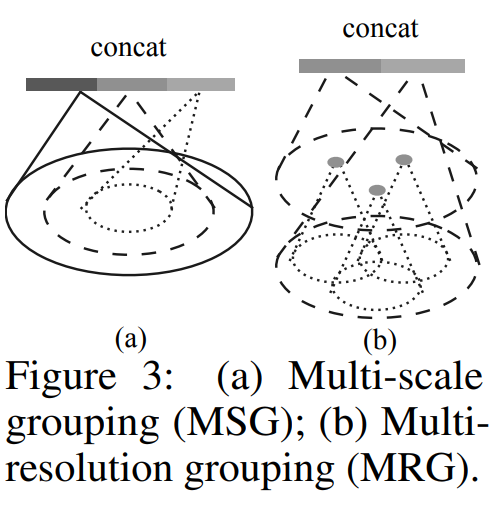
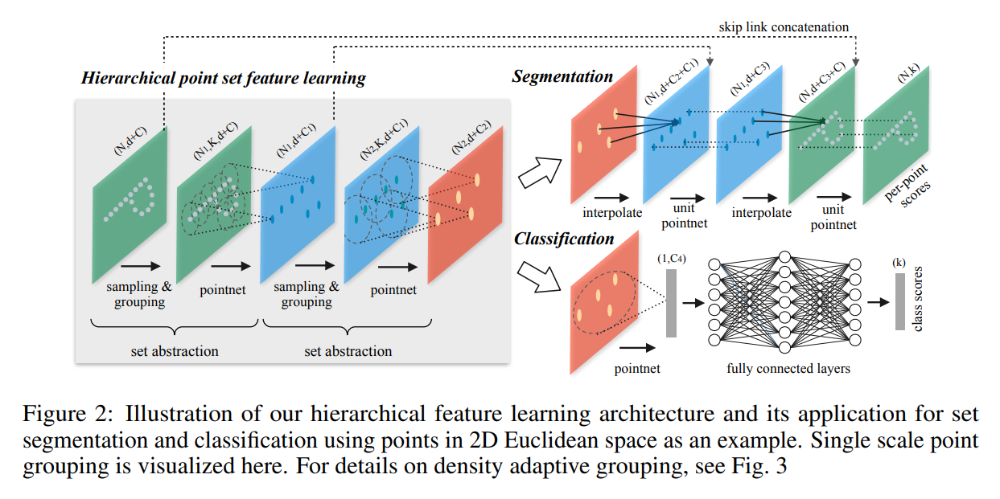

# PointNet++

紧接着pointnet: 之前的网络已经表现的很不错了, 但是最大池化的操作是不是可能会过于粗犷了呢? 因此这篇论文提到了pointnet的局限性: 

`However, by design PointNet does not capture local structures induced by the metric space points live in, limiting its ability to recognize fine-grained patterns and generalizability to complex scenes`

最大池化捕捉到了全局特征, 并且做到了permutation immune. 但是依然可能忽略了一定的局部特征和结构. 因此在细粒度识别(就是区分相似物体的不同变体)任务和复杂场景泛化任务中表现得不尽人意. 

`By exploiting metric space distances, our network is able to learn local features with increasing contextual scales`

'exploiting metric space distances'  指的是在算法或模型设计中，利用度量空间中的距离概念来提取特征、进行决策或优化性能. 度量空间是数学中的一个概念，它是一个集合，配合一个距离函数，能够度量集合中任意两个元素之间的距离。在机器学习和计算机视觉等领域，这个概念被用来捕捉数据点之间的相对位置和关系. 

关于Problem Statement, 依然是: 给一个点云集附上一个label, 从而实现分类; 或者是给每一个点都分配一个标签, 从而实现场景分割

## Method

`Our work can be viewed as an extension of PointNet with added hierarchical structure.`

在空间尺度上, 希望尺度很大的时候, 依然特征的提取能够非常robust. 为了达到这种效果, pointnet使用的是maxpooling, 但是这种操作还是不具有特别强的泛化能力. 所以pointnet++模型中: `our new architecture builds a hierarchical grouping of points and progressively abstract larger and larger local regions along the hierarchy.`

总共有三个layer: 第一个是采样Sampling Layer, 根据输入的点集选出一系列的点, 这些点被认为是局部区域的中心点centroid; 第二个是分组Grouping Layer, 每一个中心点附近找到附近的邻居点; 第三个就是Point net Layer, 把每一个neighbor(局部区域)输入进pointnet提取出特征向量. 

如何选点? 答案是最远点采样, Farthest Point Sampling. 作者特意提到了: 

`In contrast to CNNs that scan the vector space agnostic of data distribution, our sampling strategy generates receptive fields in a data dependent manner.`

关于选邻居, 选的邻居点的数量其实是不固定的(Ball query中没选满), 但是正如作者所说: 

`Note that K varies across groups but the succeeding PointNet layer is able to convert flexible number of points into a fixed length local region feature vector.`

而距离定义也是度量空间上的(metric distance), 而不是像卷积神经网络的曼哈顿距离. 搜索点的空间范围也是定下来的: 在centroid附近以一定半径划出的球内找合适的点, 而KNN就直接是找最近的K个点了. 这种球空间范围的搜寻称为Ball query, 因为可以在固定尺寸的局部空间下找点, 所以被认为更具有泛化能力. 

在论文中, pipeline过程是: 输入`N × (d + C)`矩阵, N是点的数量, d是维度信息(比如说最常见的三维), C是点的其他特征(例如颜色). 那么选出中心点的矩阵信息就是: `N' × d` . 而在选完邻居之后, 变成`N' × K × (d + C)`, 一个`K × (d + C)`就是一个region. 最后, 经过pointnet layer, 希望用一个`(d + C')`来代表一个区域, 所以说输出是: `N' × (d + C')`

关于坐标: 一个区域内的点都被改成了相对于centroid的坐标, 这样的话就能:

`By using relative coordinates together with point features we can capture point-to-point relations in the local region`

点集在不同区域具有非均匀密度是很常见的。这种非均匀性为点集特征学习引入了重大挑战。在密集数据中学习到的特征可能无法泛化到稀疏采样区域。因此，针对稀疏点云训练的模型可能无法识别细粒度的局部结构. 理想情况下，我们希望尽可能地近距离检查点集，以捕捉密集采样区域的最精细细节。然而，在低密度区域，这种近距离检查是被禁止的，因为局部模式可能因采样不足而受到破坏。在这种情况下，我们应该在更大的邻近区域寻找更大尺度的模式。为了达到这个目的, 论文提出了密度自适应的PointNet层: 

`We call our hierarchical network with density adaptive PointNet layers as PointNet++`

在对局部区域进行分组和从不同尺度组合特征方面，论文提出了两种类型的密度自适应层: Multi-scale grouping (MSG) & Multi-resolution grouping (MRG)

多尺度分组（MSG）。如图3（a）所示，捕获多尺度模式的一个简单但有效的方法，是应用不同尺度的分组层，然后根据PointNets提取每个尺度的特征。不同尺度的特征被连接起来形成多尺度特征。 我们训练网络学习一种优化策略，以结合多尺度特征。这是通过为每个实例随机丢弃输入点来完成的，我们称之为随机输入丢弃。具体来说，对于每个训练点集，我们从[0, p]中均匀采样一个丢弃比率θ，其中p ≤ 1。对于每个点，我们以概率θ随机丢弃一个点。在实践中，我们设置p = 0.95以避免生成空点集。这样做，我们向网络展示了不同稀疏度（由θ引起）和不同均匀性（由丢弃的随机性引起）的训练集。在测试时，我们保留所有可用的点。

它不是只关注点云的一个固定尺度，而是同时考虑多个尺度，从而捕获更丰富的局部和全局特征。在提取了不同尺度的特征之后，MSG通常会将这些特征进行某种形式的组合，例如通过连接（Concatenation）或加权（Weighting）等方法，以形成一个综合的特征表示。MSG的一个关键优势是它的适应性。由于它能够处理不同尺度的特征，MSG可以更好地适应点云的非均匀密度，即在密集区域捕获细节，在稀疏区域捕获更大尺度的特征。在训练过程中，MSG允许网络学习如何最佳地结合不同尺度的特征。例如，通过随机输入丢弃（Random Input Dropout），网络可以学习在不同稀疏度条件下如何平衡不同尺度特征的重要性。

多分辨率分组（MRG）。上述MSG方法在计算上是昂贵的，因为它为每个中心点运行大规模邻域的局部PointNet。特别是，由于在最低级别上中心点的数量通常相当大，时间成本是显著的。 在这里，我们提出了一种替代方法，**避免了这种昂贵的计算**，但仍然保留了根据点的分布属性自适应聚合信息的能力。在图3（b）中，某个级i的区域特征是两个向量的连接。一个向量（图中左侧）是通过使用集合抽象级别总结每个子区域在较低别Li-1的特征获得的。另一个向量（图中右侧）是通过直接使用单域中的所有原始点获得的特征(直接对这个区域使用PointNet)。 当局部区域的密度较低时，第一个向量可能比第二个向量不太可靠，因为计算第一个向量的子区域包含的点更稀疏，并且更容易受到采样不足的影响。在这种情况下，第二个向量应该被赋予更高的权重。相反, 如果说区域的点密度非常高, 那么第一个向量就非常可靠, 因为第一个向量提供的信息更加的细节, 因为: 

`it possesses the ability to inspect at higher resolutions recursively in lower levels.`

在点集抽象层，原始点集会被子采样。然而，在点集分割任务，如语义点标记中，**我们希望为所有原始点获得点特征**。一种解决方案是在所有点集抽象层中始终将所有点作为中心点进行采样，但这会导致高计算成本。**另一种方式是从子采样点传播特征到原始点**(和pointnet的全局特征和局部特征concat有相似之处)。 我们采用了一种分层传播策略，结合基于距离的插值和跨层跳跃连接（如图2所示）。在特征传播层，我们将Nl × (d + C)个点的特征从第l层传播到Nl−1个点，其中Nl−1和Nl（Nl ≤ Nl−1）分别是点集抽象层l的输入和输出点集大小。我们通过在Nl−1个点的坐标上插值Nl个点的特征值f来实现特征传播。在多种插值选择中，我们使用基于k近邻的逆距离加权平均（如下图的公式，默认情况下我们使用p = 2, k = 3）。然后在Nl−1个点上插值得到的特征与来自点集抽象层的跳跃连接点特征进行拼接。接着，拼接后的特征通过一个“单元PointNet”传递，这类似于CNN中的一对一卷积。应用一些共享的全连接和ReLU层来更新每个点的特征向量。这个过程会重复进行，直到我们将特征传播到原始点集的所有点。

逆距离加权平均的核心思想是距离已知点越近的点对未知点的估计值影响越大。这通过距离的倒数来实现，距离越小，权重越大。逆距离加权平均适用于那些需要根据空间分布的已知数据点来估计未知点值的场景，尤其是在数据点分布不均匀的情况下。