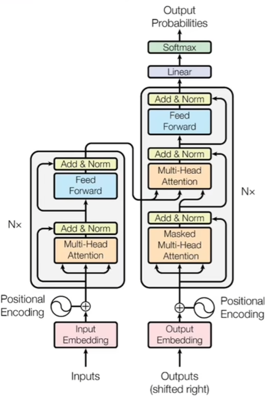
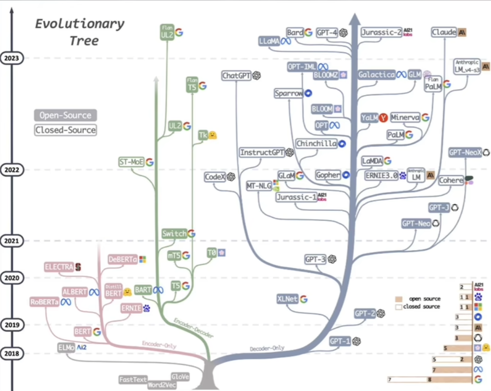
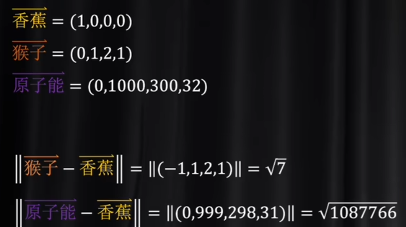
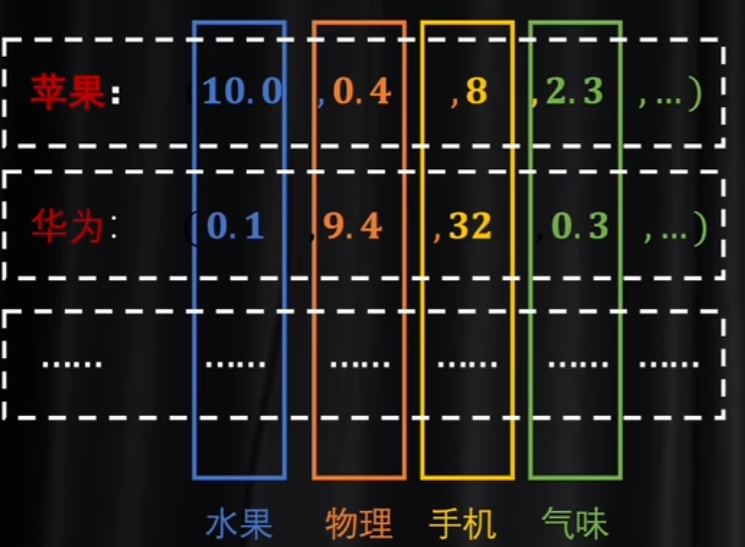
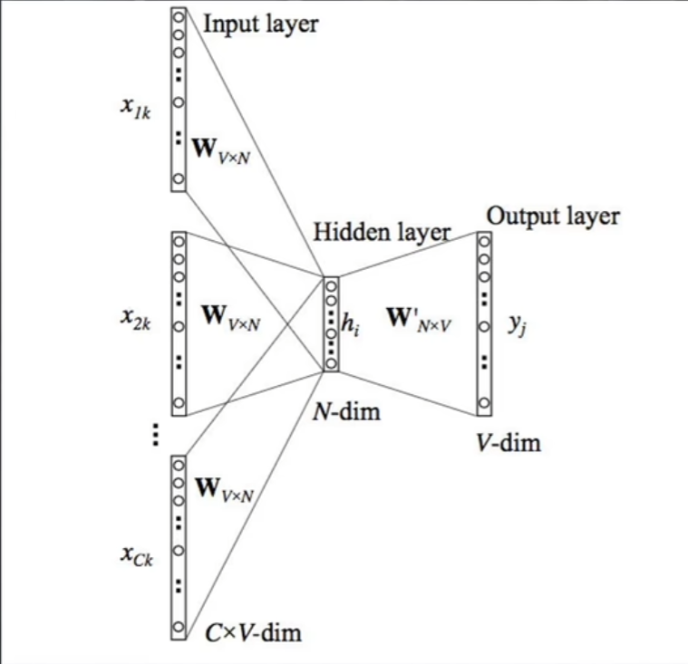
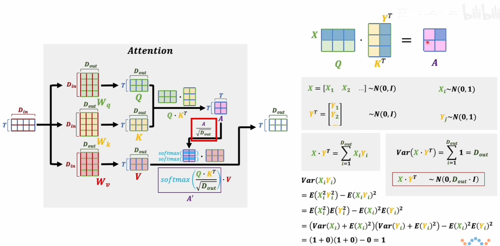
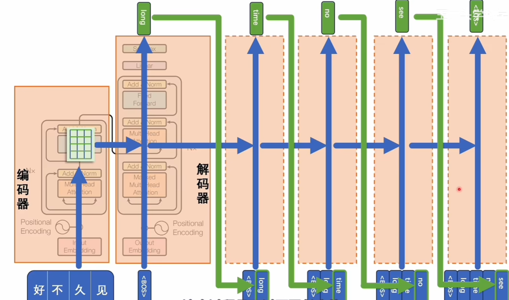
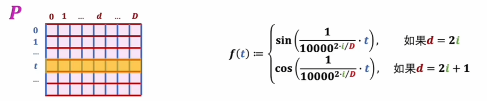

# Transformer

## 编码和解码

如今又三个主流的关于transformer的模型：最右边的是decoder-only，只保留了解码器，擅长文本输出创造；最左边的是只保留了编码器的部分，例如BERT，擅长学习和理解语言的内容；中间的是两者都保留，用于辅助左右两个分叉。

那么编码和解码的码是什么呢？  简单来说就是各种语言里面那些符号发音等等形式上的不同剥离掉之后，剩下来的单纯的语义关系。不难想到，这种语义关系应该要数字化体系，并且，数值上应该能够呈现语义关系。见下面这个例子：假如说用高维坐标来代表单词，那么： 

猴子和香蕉应该距离模很近，但是原子能和香蕉的模很远，这个高维坐标就是“码”。

### 升维与降维

那么直觉上，应该要对最基础的语义单元进行数字化，那么其实这种语义单元其实就是token，比如说英文中的字母，中文里面的字或词，甚至可以是英文单词的词根。常见的数字化token的方法是标记器和独热编码。标记器的数字化非常简单，就是在一维数轴上面一一对应；而独热编码就是单独为每一个token开辟一个维度。这是两种数字化的极端，视觉化例子见下：

直觉上，分词器没有利用维度信息，难以表达复杂的语境，例如苹果香蕉梨都是非常接近的数字，但是苹果还可以是手机的名字，而华为可能都是一个非常大的数字了，距离非常远，但是实际上“苹果”和“华为”在数轴上应该离得非常近。而独热编码维度过高，信息非常稀疏，token之间的关系并没有用“模长”去体现，仅仅使用维度来区分开。

那么列举完了两个极端情况，就能理解：想找到一种维度不是特别高，且能利用模长信息的编码方式，那就是“潜空间”。那么如何寻找呢？要么是分词器升维，要么是独热编码降维。那么直觉上，一般认为降维会更好一点，毕竟压缩比换元是一件更容易的事情。那么维度的变换，就不得不涉及到矩阵乘法了，因为矩阵乘法实际上就可以理解为一种空间变换。那么提到空间变换，就不禁想到了神经网络，因为权重矩阵其实就是实现空间变换。

### 词嵌入  （embedding）

编码就是先把一个文件里面的token都先编写成独热码，然后进行降维，这个过程相当于是把输入的一句话根据语义投射到一个潜空间里面。嵌入的数据不一定是单词，但是在NLP里面主要就是针对单词。因此翻译的过程就可以通过这样一套流程来实现：中文-中文潜空间-共同潜空间（算法）-英文潜空间-英文，因此编码和解码共同使用。有一个小哲学思想，就是“一个房间里面理解中文的AI”，实际上AI只知道通过中文然后翻“手册”然后给出回复。其实这种“只关注语义空间”和编码解码很类似，但是依然有区别：手册给出的信息是离散的，能做的仅仅是一一对应；但是潜空间是连续的，有的时候机器遇到没有学习过的情景，也依然能够根据潜空间进行分析，但是手册就无能为力了。

因此，潜空间是什么？其实就是语义维度。下面有一个非常生动的例子：

每一个维度其实是一个语义空间，例如第一个是水果语义空间，第二个是物理，第三个是手机，第四个是气味。当然这里是举例子，实际上机器最后算出来的语义空间，可能我们自己都无法理解，但是最后整体效果就是正确的。那么NLP里面，这种token就是语义，而在图像处理中，token就是channel（RGB）。不妨迁移想想，卷积核其实也是降维和升维的手段！

所以说为什么手册无能为力呢？一种理解是这种key-value的对应方式的势是阿列夫零，和自然数等势，是可数的countable；但是我们所期望的模型应该能实现“超越经验去生成合理内容”，即uncountable。

## Word2Vec

如何将token降维投射至潜空间呢？这肯定需要机器学习，但是如何操作呢？谷歌2013年提出了Word2Vec就是一个办法。值得注意的是，这个模型最后得出的结果，是一个参数训练好的嵌入矩阵，更像是编写字典，而不是为了实现某一个功能。因此，Word2Vec并没有使用激活函数，计算更加简单。

那么如何设计神经网络？我们希望token经过矩阵和逆矩阵，即编码和解码的过程之后，结果依然是token本身，那么在这种设计上根本不能训练，因为压根没有偏差，无法进行backward propogation。那么论文中提出了两个办法：CBOW & skip-gram

首先是CBOW,准备奇数个token，然后去掉一个，剩下的各自和嵌入矩阵相乘，然后算出的几个向量相加，然后对这个和向量进行解码，比较这个解码结果和token是否一致。为什么得到的和向量应该就是那个缺失的向量？因为类似于受力分析，一个完整的语义下，***token能且只能通过上下文理解***，那么直觉上，认为这个缺失的力是另外几个力的合力是能够认同的。

skip-gram其实就是CBOW反过来用，已知一个token,求出上下文的token,看和训练数据是否一致。两种方法都是自监督学习。

在训练中，其实神经网络就是看成只有一个隐藏层，而计算步骤中也没有偏置参数b，以及激活函数（空间变换是线性的）。那么有一个细节，就是看似我们不需要计算decoder matrix, 因为encoder and decoder两个矩阵不应该是相乘为单位矩阵吗？但是实际上，两个矩阵都是各自训练各自的。

## 注意力

### 自注意力

注意到输入的其实已经进行过编码了，那么流程中最重要的其实是橙色的注意力模块。如何在一个文本中理解一个token的语义？不同语境下，一个token语义可能不同，选择哪个便是问题。那么如何处理？ 

先不管QKV是干什么的，先谈A为什么除以标准差：是为了标准正态分布。然后对得到的A逐行softmax，然后再和V相乘。那么V其实就是字典里面的语义，而QK是干什么用的呢？A'其实就是相当于这段话因为上下文而产生的修改系数。为什么代表修改系数？要明确的一点是，其实QKV都是相同的，那么得到的A其实每一项都是一个词向量和另外（或者本身）词向量的内积，这种内积其实就是投影，能够体现关系，

这种关系再进行标准正态分布化，用softmax得到修正权重，最后和原本的V（编码后的）进行上下文修正。这样的话就可以使得一段文本增加了主观性。

那么QK存在的意义是什么？一种理解是二次型有更强的非线性，即更强的泛化能力；另外一种理解是“设定语义”与“表达语义”之分。

### 交叉注意力

自注意力其实就是自己”闷头苦学“，而交叉注意力就相当于是有了一本参考：

修正参数不再是仅仅取决于文本本身了，还引入了外界语义Q。

在上面这个模型中，“好久不见”就相当于是参考，而一开始解码器里面输入的是“开始”，然后顶上softmax得出下一个，也就是第一个单词的每一个token的概率分布，选取最大的可能性的token, 比如说是long, 然后再不断重复，直到最后softmax里面概率最大的是“终止符”。这样就是解决了seq2seq的问题（中英文同一语义的token数量可能不一样）。

## 位置编码（Positional Encoding）

token的序列、位置是十分重要的，不同顺序的token携带的语义是不一样的。论文里面使用的是“加法”。

相对位置编码过于复杂，这里不多说了QAQ。

## 多头注意力

三个独立的训练参数各自算，然后算出来之后拼接在一起，再乘以W得到结果。这就是多头语义的结合。灵感来源于“通道”，不同语义也是一种通道，类似于RGB。那么算出来了Z012，其实不同的语义，然后拼接在一起，最后用权重决定应该是哪一种语义。

## 掩码

在Transformer模型中，掩码（mask）是一种用于屏蔽输入序列中某些位置的机制。在自注意力机制中，每个位置都可以与其他位置进行交互，但是在某些情况下，我们希望模型不能访问某些位置的信息，比如在语言模型中，为了避免模型在生成某个词时看到未来的词，我们需要屏蔽当前位置之后的位置。在这种情况下，我们会使用一个掩码矩阵，将要屏蔽的位置对应的元素设为一个非常大的负数，这样经过softmax后，这些位置对应的权重就会接近于0，从而实现了对这些位置的屏蔽。掩码通常是一个二维矩阵，其维度与输入序列的长度相同。

