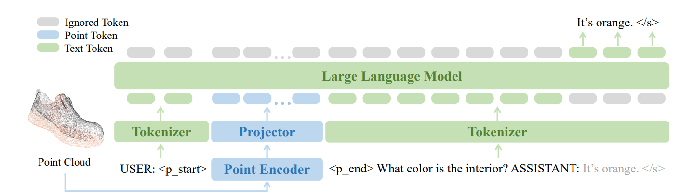

# PointLLM: Empowering Large Language Models to Understand Point Clouds

看到这个标题, 其实论文工作的核心呼之欲出. 如何让大预言模型理解点云呢? 

直接从第三部分Methodology开始看: (translated by kimi)

3.1 点云文本指令遵循数据 开发端到端多模态大型语言模型（MLLM）的一个巨大挑战是获取大规模多模态指令遵循数据，这对于表示学习、对齐潜在空间以及指导模型遵循人类意图至关重要。然而，手动标记此类数据成本高昂且劳动密集。为了克服这一问题，我们提出了一种自动化数据生成技术，利用大规模点云字幕数据集Cap3D和GPT-4的协助。生成的数据遵循统一的指令遵循模板，并由简略描述指令和复杂指令组成，分别有助于潜在空间对齐和指令调整。简略描述指令。Cap3D数据集为Objaverse中的3D对象提供了两种变体的字幕：由图像字幕模型生成的和人类注释的。虽然有660K个对象附带生成的字幕，但只有40K个样本具有人类注释的字幕。对于简略描述指令，我们利用模型生成的分割，因为需要更大的数据量来对齐点云和文本模态的潜在空间。我们创建了一个包含30条指令的列表，**指导模型提供给定3D对象点云的简洁描述**。从这个列表中随机选择一个指令作为用户指令，而Cap3D中的字幕直接用作模型响应，形成一个单轮指令遵循样本。这产生了660K个简略描述指令数据，每个数据对应一个独特的对象点云。

3.2 模型架构 如图2所示，我们的PointLLM是一个生成模型，旨在完成包含点云和文本的多模态句子。模型由三个主要部分组成：预训练的点云编码器fpe、投影器fproj和预训练的大型语言模型（LLM）骨干fllm。点云编码器fpe接受一个点云P ∈ Rn×d作为输入，其中n是点的数量，d是每个点的特征维度。编码器的输出是一系列点特征X = (x1, x2, ..., xm) ∈ Rm×c，其中m是点特征的数量，c是特征的维度。投影器fproj是一个MLP（多层感知机），它将点特征X映射到点标记Y = (y1, y2, ..., ym) ∈ Rm×c'，其中c'是点标记的维度，与文本标记相同。LLM骨干fllm是一个仅解码器的Transformers，它接受由文本和点标记组成的标记序列。这种混合标记序列表示为Z = (z1, z2, ..., zk) ∈ Rk×c'，其中k是标记的总数。利用自注意力机制，LLM骨干能够理解不同类型的标记之间的上下文关系，从而能够根据文本和点云输入生成响应。正式地，LLM骨干fllm的输出是一系列预测标记ˆZ = (ˆz1, ˆz2, ..., ˆzk) ∈ Rk×c'。第i个标记的预测，ˆzi，取决于所有先前的标记，Z<i = (z1, ..., zi−1)。这可以数学表达为：

``ˆzi = fllm(Z<i)。 (1)``

每个ˆzi通过一个最终的线性层，然后是一个softmax操作，将隐藏状态映射到词汇表上的概率分布。这个额外的层表示为fvocab : Rc' → RV，其中V是词汇表的大小。最终预测的第i个标记˜zi是词汇表中概率最高的词：

``˜zi = arg max w∈vocab fvocab(ˆzi)[w]。 (2)``

3.3 训练 损失函数。我们通过最小化每个位置的文本标记的负对数似然来训练PointLLM。我们的损失函数仅计算构成模型响应的文本标记，包括句子结束标记``</s>``。我们排除了人类指令中的标记，确保模型专注于学习生成准确和连贯的响应。这种端到端的训练方法使PointLLM能够有效地整合点云和文本模态。

两阶段训练。我们的训练过程包括两个阶段，每个阶段关注模型的不同方面。在第一阶段，称为特征对齐阶段，我们冻结点云编码器和LLM的参数，仅训练MLP投影器。在这个阶段，训练过程使用简略描述指令，旨在有效地将点特征与文本标记空间对齐。这个阶段还包括调整两个新添加的特殊标记``
``和``
``的标记嵌入。在第二阶段，称为指令调整阶段，我们冻结点云编码器，同时联合训练投影器和LLM。这第二阶段使用复杂指令，帮助模型建立理解和响应包括点云数据在内的复杂指令的能力。

