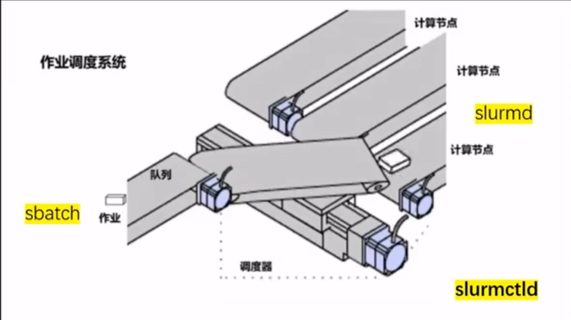

# 如何使用slurm（自学）

学校手册：http://10.15.89.177:8889/job/index.html

## 调度系统是什么



sbatch提交作业，然后调度器按照一定规则，会分配至相对应的计算节点

## 作业相关

 **非交互式**作业提交方式：``sbatch xxxx.sh``


上面的参数中： ``-p normal ``代表分区分到normal区； -n代表GPU核心数量； -mem代表内存数量； -N是节点数量

注意：这里面的井号不是注释的意思！务必带上！

取消作业： ``scancel job_id`

查看集群中节点状态和资源信息： ``sinfo``


alloc就是正在申请，idle就是空闲，down就是故障

``squeu``查看当前在集群中排队和运行的作业情况

``sacct``查看作业的执行和计费信息

提交作业需要写批处理文件，包含三个部分：

a. 计算资源申请

````bash
#!/bin/bash
#SBATCH -J test
#SBATCH -p normal
#SBATCH --cpus-per-task=4
#SBATCH --mail-type=all
#SBATCH --mail-user=xiongzhzh2023@shanghaitech.edu.cn 
#SBATCH -N 1 
#SBATCH --gres=gpu:4
#SBATCH --output=%j.out  // %j代表用作业名字
#SBATCH --error=%j.err 
````


b. 指定自己安装的家目录下的python, 或者说，使用自己的环境

````bash
module purge
module load anaconda
source activate myenv
python your_script.py
````

c. 运行python文件（python脚本文件必须和批处理文件放在一个文件夹中）

**在这里需要注意：要指定python版本，使用命令python3 xxx.py**


# 实操

## 失败经历

首先进入了登陆节点，然后安装anaconda3（一开始不知道为什么没有自动配置到环境变量里面，但是之后``vi ~/.bashrc``）人工配置就好了

``export PATH="/home/your_username/anaconda3/bin:$PATH"``

然后就是喜闻乐见的配环境时刻，好消息是，我们的slurm里面，在public里面有一个专门安装了很多下载包的地方，直接环境配置文件里面配上就可以使用了

````bash
export PATH=/usr/local/cuda/bin${PATH:+:${PATH}}
export LD_LIBRARY_PATH=/usr/local/cuda/lib64${LD_LIBRARY_PATH:+:${LD_LIBRARY_PATH}}
````

我选择的是cuda11.4因此尝试下载对应的pytorch包：

``conda install pytorch==1.8.1 torchvision==0.9.1 torchaudio==0.8.1 cudatoolkit=11.3 -c pytorch -c conda-forge``

````bash
#!/bin/bash
#SBATCH -J test
#SBATCH -p normal
#SBATCH --cpus-per-task=4
#SBATCH --mail-type=all
#SBATCH --mail-user=xiongzhzh2023@shanghaitech.edu.cn 
#SBATCH -N 1 
#SBATCH --gres=gpu:4
#SBATCH --output=%j.out 
#SBATCH --error=%j.err 
module purge
module load anaconda
source activate pointnext
python3 test.py
````

````python
import torch
print(torch.cuda.is_available())
print(torch.cuda.device_count())
print(torch.cuda.get_device_name())
print(torch.__version__)
print(torch.version.cuda)
print("this is a test")
````

但是总是不成功，因此尝试salloc后进入计算节点，进行交互式作业

## 成功！SALLOC办法

``salloc -N 1 -n 4 -p normal --gres=gpu:4``， 代表着在normal队列里面申请四块GPU

然后通过``squeue``来查看申请到的节点是什么，然后``ssh (node)``

就可以成功登录计算节点了；登录上来之后，首先要``source ~/.bashrc``再次激活环境

进入conda之后依然是老流程，最后成功激活环境：


几个重要的点： 英伟达驱动是计算节点自带的，cuda是``/public/software``中的cuda11.3， 并且已经路径输入到了PATH和LIBRARY里面

