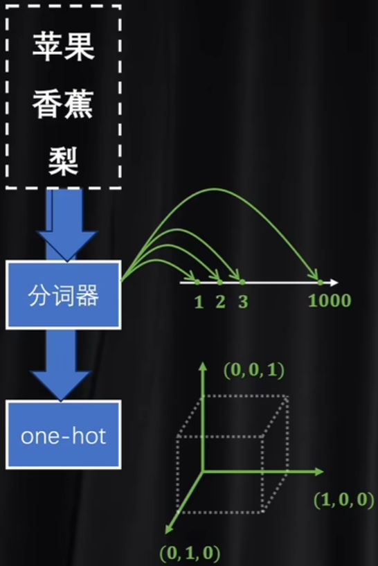

# Transformer

## 编码和解码

如今又三个主流的关于transformer的模型：最右边的是decoder-only，只保留了解码器，擅长文本输出创造；最左边的是只保留了编码器的部分，例如BERT，擅长学习和理解语言的内容；中间的是两者都保留，用于辅助左右两个分叉。

那么编码和解码的码是什么呢？  简单来说就是各种语言里面那些符号发音等等形式上的不同剥离掉之后，剩下来的单纯的语义关系。不难想到，这种语义关系应该要数字化体系，并且，数值上应该能够呈现语义关系。见下面这个例子：假如说用高维坐标来代表单词，那么： 

猴子和香蕉应该距离模很近，但是原子能和香蕉的模很远，这个高维坐标就是“码”。

### 升维与降维

那么直觉上，应该要对最基础的语义单元进行数字化，那么其实这种语义单元其实就是token，比如说英文中的字母，中文里面的字或词，甚至可以是英文单词的词根。常见的数字化token的方法是标记器和独热编码。标记器的数字化非常简单，就是在一维数轴上面一一对应；而独热编码就是单独为每一个token开辟一个维度。这是两种数字化的极端，视觉化例子见下：

直觉上，分词器没有利用维度信息，难以表达复杂的语境，例如苹果香蕉梨都是非常接近的数字，但是苹果还可以是手机的名字，而华为可能都是一个非常大的数字了，距离非常远，但是实际上“苹果”和“华为”在数轴上应该离得非常近。而独热编码维度过高，信息非常稀疏，token之间的关系并没有用“模长”去体现，仅仅使用维度来区分开。

那么列举完了两个极端情况，就能理解：想找到一种维度不是特别高，且能利用模长信息的编码方式，那就是“潜空间”。那么如何寻找呢？要么是分词器升维，要么是独热编码降维。那么直觉上，一般认为降维会更好一点，毕竟压缩比换元是一件更容易的事情。那么维度的变换，就不得不涉及到矩阵乘法了，因为矩阵乘法实际上就可以理解为一种空间变换。那么提到空间变换，就不禁想到了神经网络，因为权重矩阵其实就是实现空间变换。

### 词嵌入  （embedding）

编码就是先把一个文件里面的token都先编写成独热码，然后进行降维，这个过程相当于是把输入的一句话根据语义投射到一个潜空间里面。嵌入的数据不一定是单词，但是在NLP里面主要就是针对单词。因此翻译的过程就可以通过这样一套流程来实现：中文-中文潜空间-共同潜空间（算法）-英文潜空间-英文，因此编码和解码共同使用。有一个小哲学思想，就是“一个房间里面理解中文的AI”，实际上AI只知道通过中文然后翻“手册”然后给出回复。其实这种“只关注语义空间”和编码解码很相似。

因此，潜空间是什么？其实就是语义维度。下面有一个非常生动的例子：

