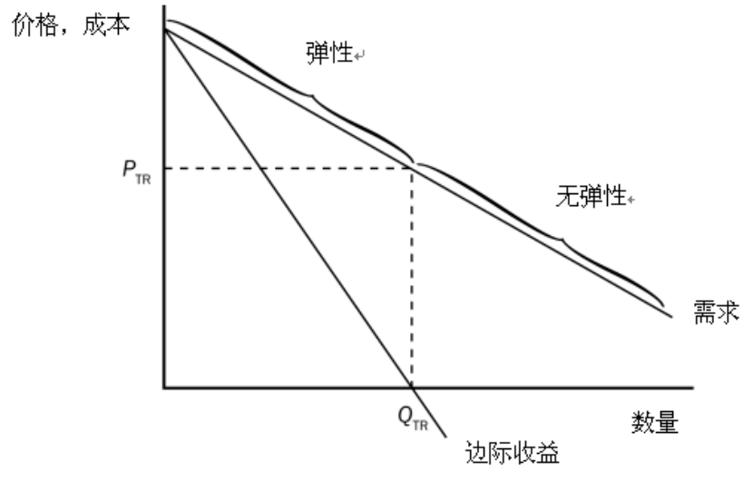

# Lec3 供给与需求的市场力量

1. 需求曲线的移动: ①: 收入降低, 左移 ②: 替代品价格上升, 互补品价格下降, 右移 ③: 偏好, 爱好

④: 预期: 预期下个月赚更多的收入, 预期之后产品价格上升, 右移 ⑤: 买者数量增加: 右移

注意: 价格变动表现为: 沿着需求曲线移动

2. 供给曲线的移动: ①: 投入品价格上升, 左移 ②: 生产技术进步, 右移 ③: 预期: 预期未来市场价格上升, 左移

④: 卖者数量: 卖者增加, 右移     注意: 价格变动表现为: 沿着供给曲线移动; ***替代品不是它的影响因素!***

3. ***供给***增加将引起沿着既定需求曲线的变动, 这种变动称为***需求量***的变动. 
4. 低档物品: 收入越低, 需求量越大; 因此经济进入衰退而收入下降, 则低档物品市场价格和数量都会提高. (需求曲线右移)

# Lec4 弹性及其应用&政府政策

1. 需求价格弹性 = 需求量变动百分比/价格变动百分比. 但是这里百分比的计算是**差值/中点值 * 100%**.  (通常使用中点发)

2. 如果知道"斜率", 计算一个点的弹性, 那么要注意弹性 = (ΔQ/ΔP)***(P/Q)**. 注意一般给出的式子都是Q关于P的函数, 画图的时候却是P为纵坐标, Q为横坐标. 因此**斜率计算**一定要小心! 一定是用Q关于P的函数来计算斜率. 

3. 注意弹性计算的分式里面, 价格永远是在分母的. 

4. 缺乏弹性, 则价格上涨, 总收益增加, 这很好理解; 那么富有弹性就是反过来, 价格上涨, 总收益下降

5. 其他需求弹性: 需求收入弹性: 需求变动百分比/收入变动百分比   供给价格弹性: 供给量变动百分比/价格变动百分比

   物品1需求量关于2价格变动的需求交叉价格弹性: 1需求量变动百分比/2价格变动百分比 (代替品为整数, 互补品为负数)

6. 弹性解释禁毒可能减少毒品供给量, 但是可能增加毒品相关犯罪: 因为毒品需求缺乏弹性.

7. 限制性价格上限造成短缺; 限制性价格下限造成过剩, 从而引发失业, 最先影响的是原先的均衡工资低于最低工资的工人. 

8. 对买者征税和对卖者征税是相同的; 税收负担更多落在缺乏弹性的市场一方. 

9. 对买者征收比例税, 则需求曲线斜率乘以(1/1+税率%)

# Lec5 福利经济学

1. 价格上升, 消费者剩余减少的原因: ①: 一些买者离开市场; ②: 留在市场中的买者必须支付更高的价格; 价格降低, 生产者剩余下降, 原因是: ①: 一些卖者离开市场; ②: 留在市场中的卖者只能以更低的价格成交
2. 资源配置使总剩余最大化, 那么称这种配置使有效率的; 除了效率外, 经济决策者还应该关心平等
3. 如果政府允许肾脏等移植器官的自由市场存在, 则最有可能器官短缺的问题将被解决，且不会出现器官过剩的问题
4. 两人之间不成交交易, 那么总剩余就是0
5. 市场均衡时, 买者使支付意愿最高的人, 而卖者是成本最低的人; 生产大于均衡产量是没有意义的, 因为边际买者支付意愿是正数, 但是小于边际卖者的成本
6. 供给和需求弹性越大, 税收的无谓损失越大; 拉弗曲线说明, 在某种情况下, 政府可能做到减税并且增加税收

# Lec7 生产成本

1. 平均总成本最低的点对应的数量是企业的有效规模
2. 短期成本的表达式里面有常数, 但是长期成本的表达式里面没有; 长期里面, 任何企业的产量都被调整为有效规模
3. 规模经济(**长期平均总成本随产量增加而减少**)的产生是因为较高的产量水平允许在工人实现专业化; 规模不经济的产生是由于任何一个大型组织中固有的协调问题
4. 机会成本会计不记作成本; 而经济利润是收益-隐性成本-显性成本, 会计利润是收益-显性成本; 因此经济利润为0不糟糕, 因为隐形成本就是会计利润, 会计利润为正. 这种隐性成本, 有例如机会成本, 时间成本等

# Lec8 竞争市场上的企业

1. 竞争企业不能影响市场价格：所以竞争企业最大化利润是通过选择最优的产量
2. 竞争市场有时也成为完全竞争市场: 市场上有许多卖者和买者, 卖者提供的物品大致相同, 企业可以自由进入或推出市场
3. MR = MC 时的产量是利润最大化的产量, 因此, MC 曲线便是每个企业的供给曲线
4. 竞争企业**长期**供给曲线是边际成本曲线位于**平均总成本曲线**之上的部分; MC曲线其实是MR曲线, 只有P=MR>ATC, 进入市场

而**短期**的供给曲线时边际成本曲线位于**平均可变成本曲线**之上的部分

1. 在企业进入和退出过程结束时, 仍然留在市场中的企业的经济利润必定为0; P与ATC相等时, 进入和退出才会结束; 因此在可以自由进入和退出的竞争市场的长期均衡中, 企业一定是在其有效规模上运营. (P=ATC=MC, 而ATC=MC代表ATC此时最低)
2. 长期中企业价格等于**最低平均总成本**(ATC), 但是长期中企业价格只要不低于**最低平均可变成本**(AVC)就可以继续运营
3. 一个行业已经实现了长期均衡的完全竞争行业. 突然开始政府决定征税, 则短期内产品成交数量没有变化, 但是长期中会减少. 因为短期中, 企业数量固定, 企业边际成本不变, 企业通过选择生产时边际成本等于价格的产量来实现利润的最大化, 因此价格不变, 均衡成交量也不变; 但是长期下来, 企业自由进出驱动价格上升, 则均衡成交量上升. 

# Lec9 垄断

1. 垄断者的边际收益总是小于其物品的价格; 垄断者边际收益曲线位于需求曲线之下
1. 垄断市场上, 价格大于边际成本, 边际成本等于边际收益
1. 垄断市场转换为竞争市场, 边际收益等于价格, 则价格会下降到边际成本, 因为原来边际成本低于价格. 
1. 垄断者生产的产量小于社会有效率的产量, 有无谓损失
1. 如果垄断者固定成本增加, 则价格保持不变(因为边际收益曲线不变), 但是成本上升, 利润会因此下降
1. 当垄断者收取高于边际成本的价格时, 一些潜在消费者对物品的评价高于其边际成本, 但低于垄断者价格. 这些消费者不会购买该物品, 所以结果是无效率的. 换而言之, 购买物品的消费者不得不支付高于边际成本的价格, 这就减少了他们的消费者剩余, 从而引起无谓损失
1. 解释为什么垄断者绝不生产需求曲线缺乏弹性的数量: 因为如果缺乏弹性, 那么价格上升, 数量下降幅度小于价格上涨幅度, 所以企业会一直选择提升价格, 直到富有弹性

8. 公式上: 边际收益=价格-边际成本的导数; 边际收益等于总收益的导数
9. 总成本和利润的变动(如利润分红)等, 不会影响价格和产量; 但是若影响MC MR曲线, 如每卖出一个产品分红多少钱, 或收益50%分红, 那么就会影响Q P了. 

# Lec10 垄断竞争

1. 垄断竞争保留了MR<P的特点, 不是价格接收者, 但是拥有行业总体利润为0的特点, 因此在**长期**中, MR=MC时, P=ATC; 而**短期**中垄断竞争企业行为与垄断者类似
2. 垄断竞争中, 企业有市场势力; 垄断竞争相比完全竞争, 因为产量不是ATC最低的有小规模, 因此有生产能力过剩
3. 完全竞争垄断竞争垄断, 三者短期都能赚经济利润, 但是只有垄断能在长期中赚经济利润
4. 长期均衡的垄断竞争市场变成完全竞争市场, 那么需求曲线会切着ATC, 沿着它变为水平

# Lec11 GDP与通货膨胀

1. 消费是GDP最大的组成部分 
2. 如果生产增加x%, 但是价格下降x%, 那么真实GDP+x%, 名义GDP不变
3. 公司从存货中出售了一个商品: 消费增加, 但是投资减少, 总的来说不影响这一年的GDP
4. 铺路, 购入公务用车, 等等项目都是政府投资(但是支付转移撒币不算)
5. 外国扩大了在我国的工厂, 增加了GDP中的投资
6. 购买外国进口的商品, 虽然消费增加, 但是净出口下降, 总的来说不影响GDP
7. 不论求x+1年的真实/名义GDP变动百分比, 还是它的平减指数, 分母永远都是x年的对应数据
8. 消费物价指数可以与GDP平减指数近似地衡量相同的经济现象
9. 计算CPI的篮子里面最大的组成部分是住房, 然后是交通, 其次是食物与饮料 
10. GDP平减指数反应国内生产的所有物品与服务的价格, 而CPI消费物价指数反应消费者购买的所有物品与服务的价格. 因此假如说一个公司卖给国家的武器的价格上涨, 那么GDP平减指数上升, 而CPI不变, 因为政府不能算作消费者 
11. 计算CPI的时候, 以哪一年为基年, 就用哪一年的消费比例作为篮子 
12. "更多选择"=>提高消费者的福利, 例如饮料出了新口味等
13. CPI的权重不仅和消费数量有关, 甚至和***单位体积***有关, 例如只看消费数量, 但是忽略一瓶饮料体积增大的情景, 会让我们高估通货膨胀, 因为在那一年的相同数量下, 体积增多代表"消费数量(体积)"增多, CPI权重应当增大 
14. 用CPI算法(算出来的就是通货膨胀率)和GDP平减指数算法算出来的物价总水平变动是不一样的, 因为CPI计算使用固定的一篮子的物品和服务, 但是GDP平减指数计算允许物品和服务的变化

# Lec12 货币制度 通货膨胀

1. 计算题里面的活期存款

2. 信用卡不是货币, 信用卡可以获得的信贷金额也不是货币
3. 社会的通货膨胀和失业之间短期内存在权衡取舍
4. 货币创造过程结束的时候, 从交换媒介增多的意义上来说, 经济更具有流动性, 但是经济并没有变得更富有
5. 尽管实际的联邦基金利率是由银行间贷款市场上的供求决定的, 但是美联储可以用公开市场操控来影响市场
6. 居民选择更多通货, 或者银行选择持有更多超额准备金, 那么货币供给也会减少

7. 用已在流通中的钱存入银行以增加货币供给量, 那么计算供给增量的时候要减去原来已经流通的钱的金额; 但是如果是美联储直接通过买债券"灌进"市场的钱, 那么这些钱计算造成的货币增加量不必减去这些钱的金额
8. 只要总准备金率不改变, 那么货币乘数和货币供给就不会改变(注意, 这里不是法定准备金率! 是实际的准备金占存款的比率)
9. 计算为达到x货币增量而美联储需要购买的债券的数量: x*R(法定准备金率)
10. 通货膨胀本身并没有降低人们的实际购买力
11. 当政府通过引发货币筹集收入的时候, 可以说是在征收一种通货膨胀税, 像是一种向每一个持有货币的人征收的税
12. 名义变量是以货币单位计量的变量(物价, 名义GDP), 而实际变量是以实物单位计量的变量; 物价水平是可以影响货币真实价值的
13. 通货膨胀成本中, 在债务人和债权人之间的任意的再分配不会带来痛苦
14. 通货膨胀率控制为0, 那么货币增长率应该等于产出增长率(真实GDP增长率)
15. <u>税率作用在名义利率上; 税前真实利率=名义利率-通货膨胀率; 税后名义利率=(1-税率)*名义利率; 税后真实利率=税后名义利率-通货膨胀率</u>
16. 当预期通货膨胀率低于实际通货膨胀率:

政府收益: 因为可以获得更多的税收并减少政府负债的真实价值 

有固定利率抵押贷款的房主收益: 因为只需支付基于预期通货膨胀率的一个固定名义利率, 还款实际利率低于预期

损害签订劳动合同第二年的工会工人: 因为合同规定的名义工资可能是基于预期的通货膨胀率

损害资金投入政府债券的群体: 因为高通货膨胀率意味着比预期更低的实际利率

17. "如果价格以一种使物价总水平不变的方式变动, 那么没有一个人的状况会变得更好或更坏"错误, 因为总是会有人变好游人变坏
18. "通货膨胀损害了债务人的利益而帮助了债权人, 因为债务人必须支付更高的利率"错误, 因为: 假如说预期到了通货膨胀率, 那么实际利率是不变的; 另一方面, 超过预期的通货膨胀率会使债务人变好, 而债权人变得更坏
19. 银行如果通过卖债券获得了钱, 或者说有X元的超额准备金, 那么这些部分都可以直接进行放贷

# Lec13 总需求与总供应 

1. 理解总需求: AD = Y = C+I+G+NX; 即便AD下降的背景下, 也有可能是上升的部分是G; 且通常C下降程度小于I下降程度 
2. 短期中, 真实变量与名义变量高度相关, 货币供给变动可以短暂地使真实GDP背离长期趋势 
3. 政府的目的使减少经济波动; 衡量经济好坏的标准是: Yn是大还是小
4. 经导中的利率代指所有利率的统称, 没有明确的话, 默认代指整体利率; 为什么能这么干, 因为各个利率之间相关性大 
5. 物价上升, 换而言之货币供给下降会导致利率上升, 而利率又可以影响投资I下降, 从而降低服务与物品的需求量
6. 产量减少而物价上升的时期称为滞涨; 高物价引起高工资, 高工资又引起更高物价, 这一现象称为工资-物价螺旋式上升
7. 总供给向左移动会引起滞胀——产量减少和通货膨胀的结合; 那些能影响总需求的决策者可以潜在地缓解对产量的不利影响, 但是只能以加剧通货膨胀问题为代价 
8. 如何判断经济波动中失业率的变动? 原来的平衡点处代表自然的失业率, 变动之后关注产量: 如果短期内的均衡产量下降, 那么失业率会上升, 反之下降. 
9. 在短期总供给线上的每一个点, 代表的名义工资都是相同的; 但是如果曲线左移, 均衡点上移动, 那么名义工资就会上涨
10. 股市崩盘影响的是: 短期需求曲线左移 
11. 为什么短期总供给曲线不是垂直的原因之一还有: 企业不会因为物价水平上涨而认为相对价格上涨而增加供给 
12. "国外工作机会增加使许多人离开"会同时影响短期供给和需求曲线
13. 投资高涨可以增加经济中的资本存量, 从而增高生产率,  从而增加物品与劳务供给量, 从而长期供给曲线右移
14. 预期价格水平上升, 则工人要求的工资上升, 则企业生产成本上升, 则SRAS曲线左移

# Lec15 货币与财政政策对总需求的影响 

1. 央行操控货币的三种常见手段: 公开市场操作(买卖国债), 降低贴现率, 改变法定准备金率
2. 如果决策者能找到一种避免时滞的方法, 那么经济会更稳定; **自动稳定器:** 经济衰退时, 决策者不必采取任何有意的行动就可以**刺激总需求**的财政政策变动; 税制是最重要的稳定器, 政府支出也是一种自动稳定器
3. 政府支出和减税的乘数效应计算是不一样的! G:1/(1-MPC)   T: MPC/(1-MPC)
4. 美联储把联邦基金利率(隔夜利率)作为目标利率. 因为难以衡量货币供给, 而且货币需求一直在波动, 在任何一种既定的货币供给时, 货币需求的波动会引起利率,总需求和产量的波动. 美联储把联邦基金利率作为目标, 就通过调整相应的货币供给调整了每天的货币需求变动. 联邦基金利率使美联储承诺确定某种货币供给, 以便于盯住所宣布的利率. 
5. 投资利率敏感性小时, 扩张性财政的挤出效应小, 更可能引起投资的短期增加

