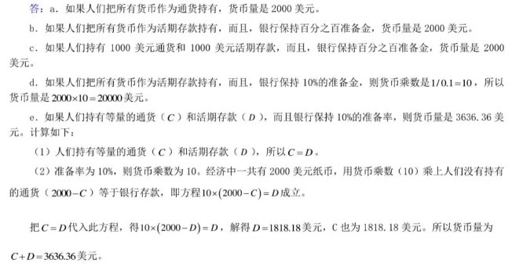

# Lec11 

1. 消费是GDP最大的组成部分 
2. 如果生产增加x%, 但是价格下降x%, 那么真实GDP+x%, 名义GDP不变
3. 公司从存货中出售了一个商品: 消费增加, 但是投资减少, 总的来说不影响这一年的GDP
4. 铺路, 购入公务用车, 等等项目都是政府投资(但是支付转移撒币不算)
5. 外国扩大了在我国的工厂, 增加了GDP中的投资
6. 购买外国进口的商品, 虽然消费增加, 但是净出口下降, 总的来说不影响GDP
7. 不论求x+1年的真实/名义GDP变动百分比, 还是它的平减指数, 分母永远都是x年的对应数据
8. 消费物价指数可以与GDP平减指数近似地衡量相同的经济现象
9. 计算CPI的篮子里面最大的组成部分是住房, 然后是交通, 其次是食物与饮料 
10. GDP平减指数反应国内生产的所有物品与服务的价格, 而CPI消费物价指数反应消费者购买的所有物品与服务的价格. 因此假如说一个公司卖给国家的武器的价格上涨, 那么GDP平减指数上升, 而CPI不变, 因为政府不能算作消费者 
11. 计算CPI的时候, 以哪一年为基年, 就用哪一年的消费比例作为篮子 
12. "更多选择"=>提高消费者的福利, 例如饮料出了新口味等
13. CPI的权重不仅和消费数量有关, 甚至和***单位体积***有关, 例如只看消费数量, 但是忽略一瓶饮料体积增大的情景, 会让我们高估通货膨胀, 因为在那一年的相同数量下, 体积增多代表"消费数量(体积)"增多, CPI权重应当增大 
14. 用CPI算法(算出来的就是通货膨胀率)和GDP平减指数算法算出来的物价总水平变动是不一样的, 因为CPI计算使用固定的一篮子的物品和服务, 但是GDP平减指数计算允许物品和服务的变化

# Lec12 货币制度 通货膨胀

1. 计算题里面的活期存款

2. 信用卡不是货币, 信用卡可以获得的信贷金额也不是货币
3. 社会的通货膨胀和失业之间短期内存在权衡取舍
4. 货币创造过程结束的时候, 从交换媒介增多的意义上来说, 经济更具有流动性, 但是经济并没有变得更富有
5. 尽管实际的联邦基金利率是由银行间贷款市场上的供求决定的, 但是美联储可以用公开市场操控来影响市场
6. 居民选择更多通货, 或者银行选择持有更多超额准备金, 那么货币供给也会减少

7. 用已在流通中的钱存入银行以增加货币供给量, 那么计算供给增量的时候要减去原来已经流通的钱的金额; 但是如果是美联储直接通过买债券"灌进"市场的钱, 那么这些钱计算造成的货币增加量不必减去这些钱的金额
8. 只要总准备金率不改变, 那么货币乘数和货币供给就不会改变(注意, 这里不是法定准备金率! 是实际的准备金占存款的比率)
9. 计算为达到x货币增量而美联储需要购买的债券的数量: x*R(法定准备金率)
10. 通货膨胀本身并没有降低人们的实际购买力
11. 当政府通过引发货币筹集收入的时候, 可以说是在征收一种通货膨胀税, 像是一种向每一个持有货币的人征收的税
12. 名义变量是以货币单位计量的变量(物价, 名义GDP), 而实际变量是以实物单位计量的变量; 物价水平是可以影响货币真实价值的
13. 通货膨胀成本中, 在债务人和债权人之间的任意的再分配不会带来痛苦
14. 通货膨胀率控制为0, 那么货币增长率应该等于产出增长率(真实GDP增长率)
15. 税率作用在名义利率上; 税前真实利率=名义利率-通货膨胀率; 税后名义利率=(1-税率)*名义利率; 税后真实利率=税后名义利率-通货膨胀率
16. 当预期通货膨胀率低于实际通货膨胀率:

政府收益: 因为可以获得更多的税收并减少政府负债的真实价值 

有固定利率抵押贷款的房主收益: 因为只需支付基于预期通货膨胀率的一个固定名义利率, 还款实际利率低于预期

损害签订劳动合同第二年的工会工人: 因为合同规定的名义工资可能是基于预期的通货膨胀率

损害资金投入政府债券的群体: 因为高通货膨胀率意味着比预期更低的实际利率

17. "如果价格以一种使物价总水平不变的方式变动, 那么没有一个人的状况会变得更好或更坏"错误, 因为总是会有人变好游人变坏
18. "通货膨胀损害了债务人的利益而帮助了债权人, 因为债务人必须支付更高的利率"错误, 因为: 假如说预期到了通货膨胀率, 那么实际利率是不变的; 另一方面, 超过预期的通货膨胀率会使债务人变好, 而债权人变得更坏

# Lec13 总需求与总供应 

1. 理解总需求: AD = Y = C+I+G+NX; 即便AD下降的背景下, 也有可能是上升的部分是G; 且通常C下降程度小于I下降程度 
2. 短期中, 真实变量与名义变量高度相关, 货币供给变动可以短暂地使真实GDP背离长期趋势 
3. 政府的目的使减少经济波动; 衡量经济好坏的标准是: Yn是大还是小
4. 经导中的利率代指所有利率的统称, 没有明确的话, 默认代指整体利率; 为什么能这么干, 因为各个利率之间相关性大 
5. 物价上升, 换而言之货币供给下降会导致利率上升, 而利率又可以影响投资I下降, 从而降低服务与物品的需求量
6. 产量减少而物价上升的时期称为滞涨; 高物价引起高工资, 高工资又引起更高物价, 这一现象称为工资-物价螺旋式上升
7. 总供给向左移动会引起滞胀——产量减少和通货膨胀的结合; 那些能影响总需求的决策者可以潜在地缓解对产量的不利影响, 但是只能以加剧通货膨胀问题为代价 
8. 如何判断经济波动中失业率的变动? 原来的平衡点处代表自然的失业率, 变动之后关注产量: 如果短期内的均衡产量下降, 那么失业率会上升, 反之下降. 
9.  在短期总供给线上的每一个点, 代表的名义工资都是相同的; 但是如果曲线左移, 均衡点上移动, 那么名义工资就会上涨
10. 股市崩盘影响的是: 短期需求曲线左移 
11. 为什么短期总供给曲线不是垂直的原因之一还有: 企业不会因为物价水平上涨而认为相对价格上涨而增加供给 
12. "国外工作机会增加使许多人离开"会同时影响短期供给和需求曲线
13. 投资高涨可以增加经济中的资本存量, 从而增高生产率,  从而增加物品与劳务供给量, 从而长期供给曲线右移

